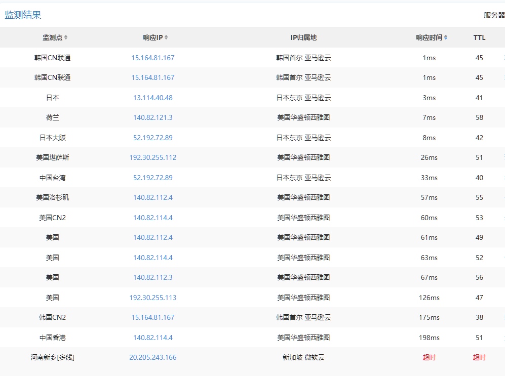

# 测底解决修改 Hosts 访问 Github.com 的问题

## 1. 前言

网上有很多网友提供的 `Hosts` IP 配置，通过在 `Hosts` 文件里添加这些 `Hosts` IP 配置，可以访问 `Github.com`。但是，当这些 IP 失效以后，怎么解决？这里教你怎么查找最新可访问的 IP 地址的方法。

## 2. CDN

什么是 `CDN`，「Content Delivery Network」，内容分发网络。也就是说，在解析一个域名的时候，CDN 会根据你所在的物理位置和你的网络接入商，在全球范围内找一个离你最近的服务器，并返回该服务器的 IP 给你。也就是说，一个域名对应的不是单一的 `IP` 地址，而是不同地区对应不同的 `IP`。例如：`ping github.com`，在香港显示的是 IP A，而在国内显示的是 IP B，在韩国显示的是 IP C。

所以，假如我们在国内默认情况下访问不了 `github.com`，则可以试试别的地区的 `github.com` 的 `IP`，如果可以访问，那就 `OK` 了。那么，怎么找这些 `IP` 呢？

## 3. 查找 CDN IP

幸好，网上有些工具可以帮助我们找到这些 `IP`，例如测速用的 `ping` 检测工具，在这里：[http://ping.chinaz.com/](http://ping.chinaz.com/)。


我们可以看到，探测了 `168` 节点，但是只有 `12` 个是能 `ping` 通的，国内无一例外，都是 `ping` 不通的，结果如下：


我们在下面一点的 “`监测结果`”，点击一下 “`响应时间`” 的标题，对 "`响应时间`" 排序一下，得到如下结果：



列表里显示的是从哪里 `ping` 哪里，以及响应的 `IP`，响应时间。这些响应的 `IP`，就是我们要找的别的地区的 `CDN IP`，响应时间我们可以忽略，毕竟不是我们直接访问的时间，但可以作为参考。

例如：中国香港那一行，表示的是：从香港 `ping github.com`，返回的 IP 地址是："`140.82.114.4`"，响应时间是 `198 ms`，这台服务器是在 `美国华盛顿西雅图` 。

## 4. 如何选择 IP

我们分析一下 “IP归属地”，大多数都是 `美国华盛顿西雅图`，还有 `日本东京 亚马逊云`，`韩国首尔 亚马逊云`，一共就这三大类。国内访问美国动不速度很一般，速度最好的是美国西部，例如洛杉矶，但是这里没有。

我们每一类都选一个出来 `ping` 一下，试一下能否 `ping` 通，以及速度如何。这里还是优先选择 `中国香港`，毕竟离国内最近，有可能是最稳定的。

在 `Windows` 下的 `ping` 命令：

```shell
ping 140.82.114.4 -t
```


能 `ping` 通，速度还可以，其他 `IP` 以此类推，逐一测试。

测完发现，大多数还是 `ping` 不通的，只有少数几个可以（根据你所在的区域和网络决定），我这里最快的是台湾的那个：`52.192.72.89`，时间是 `70` - `80` ms 左右，但是基于稳定考虑，还是选择了中国香港那个 IP（140.82.114.4）。

## 5. 其他查找 IP 的方法

还有其他更简便的查找域名 IP 的方法，例如：

* [https://www.ipaddress.com/](https://www.ipaddress.com/)
* [https://site.ip138.com/](https://site.ip138.com/) （备用）

其中，[ipaddress.com] 有可能有时需要科学上网，[site.ip138.com] 不能查询 `github.com`，仅做备用。

下面是 [ipaddress.com] 的查询结果：


`140.82.113.3` 即为查询到的 `github.com` 的 IP，试一下能否 ping 通。试了一下，可以，速度大约 `240` ms 左右。但是，这里查询到的 IP 也有可能是 ping 不通的，但大多数时候能 ping 通。所以仅做备用，更全面的方法还是用上面的 `ping 检测工具` 。

## 6. 需要哪些 github 域名

我们解决了查找 `github` 服务器 IP 的问题，那么我们需要哪些 `github` 的域名呢？

这里有一些已知的常用域名和 IP：

```text
# GitHub Start
# Last update: 2022/04/14 (shines77)

# Github
140.82.114.3 github.com
140.82.114.3 www.github.com
52.192.72.89 github.com
52.192.72.89 www.github.com

# Github SSL
151.101.44.249 github.global.ssl.fastly.net
185.31.16.184 github.global.ssl.fastly.net
199.232.69.194 github.global.ssl.fastly.net

# domain: githubstatus.com
185.199.108.153 githubstatus.com
185.199.109.153 githubstatus.com
185.199.110.153 githubstatus.com
185.199.111.153 githubstatus.com

# Github assets
185.199.110.153 assets-cdn.github.com
185.199.108.153 assets-cdn.github.com
185.199.109.153 assets-cdn.github.com
185.199.111.153 assets-cdn.github.com

# Github gist
140.82.114.4 gist.github.com
140.82.113.4 gist.github.com
140.82.112.3 gist.github.com
140.82.113.3 gist.github.com
140.82.114.3 gist.github.com
192.30.255.112 gist.github.com
52.192.72.89 gist.github.com

# Github api
140.82.113.6 api.github.com
140.82.112.6 api.github.com
140.82.114.6 api.github.com
140.82.113.5 api.github.com
140.82.114.5 api.github.com
52.69.239.207 api.github.com

# Github raw
185.199.108.133 raw.github.com
185.199.109.133 raw.github.com
185.199.110.133 raw.github.com
185.199.111.133 raw.github.com
199.27.76.130 raw.github.com
185.199.108.133 raw.githubusercontent.com
185.199.109.133 raw.githubusercontent.com
185.199.110.133 raw.githubusercontent.com
185.199.111.133 raw.githubusercontent.com
199.232.28.133 raw.githubusercontent.com

# Github website
185.199.108.153 pages.github.com
185.199.109.153 pages.github.com
185.199.110.153 pages.github.com
185.199.111.153 pages.github.com
204.232.175.78 documentcloud.github.com
107.21.116.220 help.github.com
207.97.227.252 nodeload.github.com
140.82.114.10 codeload.github.com
107.22.3.110 status.github.com
204.232.175.78 training.github.com

# Github user content
199.232.96.133 cloud.githubusercontent.com
185.199.108.133 cloud.githubusercontent.com
199.232.96.133 camo.githubusercontent.com
151.101.108.133 user-images.githubusercontent.com
185.199.108.133 gist.githubusercontent.com
185.199.108.133 marketplace-screenshots.githubusercontent.com
185.199.108.133 repository-images.githubusercontent.com
185.199.108.133 user-images.githubusercontent.com
185.199.108.133 desktop.githubusercontent.com

# Github avatars
185.31.18.133 avatars0.githubusercontent.com
185.31.19.133 avatars1.githubusercontent.com
199.232.96.133 avatars0.githubusercontent.com
199.232.96.133 avatars1.githubusercontent.com
199.232.96.133 avatars2.githubusercontent.com
199.232.96.133 avatars3.githubusercontent.com
199.232.96.133 avatars4.githubusercontent.com
199.232.96.133 avatars5.githubusercontent.com
199.232.96.133 avatars6.githubusercontent.com
199.232.96.133 avatars7.githubusercontent.com
199.232.96.133 avatars8.githubusercontent.com

# GitHub End
```

其实上面的 Hosts 文件，除了 `github.com` 主域名和 `Github SSL` 的 IP 是通的，其他大多数 IP 都是 ping 不通的，没办法，这里只是列出来最近搜到的比较常用的 IP，有部分 IP 某些地区是可以访问的，但是大部分都访问不了，尤其是大家比较关心的 `Github assets`，`Github gist`，`Github api`，`Github raw`，`Github Github user content`，基本都 ping 不通。

但是 `github.com` 主域名和 `Github SSL` 能 ping 通，拉取 git 的仓库是没有问题了，但是其他功能就没办法使用了，只能自己想办法科学上网，但是总是比没有更好。

## 7. 怎么修改 Hosts 文件

这里就不敖述了，如果不会的话，可以自己百度或者 `Google`。

## 8. 参考文章

* [修改 Hosts 解决 Github 访问失败马克](https://zhuanlan.zhihu.com/p/107334179) from [`zhuanlan.zhihu.com`]

* [彻底解决各种浏览器访问不了GitHub问题](https://www.cnblogs.com/wanpi/p/14668174.html) from [`cnblogs.com`]

* [解决Github打不开问题](https://zhuanlan.zhihu.com/p/158938544) from [`zhuanlan.zhihu.com`]

* [Hosts文件解决github.com访问问题](https://www.jianshu.com/p/59553e6cb4c6) from [`jianshu.com`]
