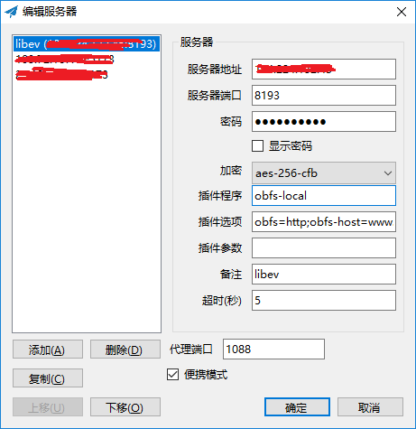

# CentOS 7 搭建 ShadowSocks 服务器

## 1. 准备工作

### 1.1. 安装 pip

`pip` 是 `python` 的包管理工具。本文中将使用 `python` 版本的 `ShadowSocks`，因此我们需要通过 `pip` 命令来安装。

在 `CentOS 7` 下安装 `pip`：

```shell
yum -y install epel-release
yum -y install python-pip
```

或者：

```shell
curl "https://bootstrap.pypa.io/get-pip.py" -o "get-pip.py"
python get-pip.py
```

### 1.2. 更新 pip

```shell
pip install --upgrade pip
```

## 2. 安装配置 ShadowSocks

### 2.1. 安装 ShadowSocks

```shell
pip install shadowsocks
```

执行完毕，且没有报错的话，接下来就是配置了。

### 2.2. 配置 ShadowSocks

新建一个配置文件，例如：`/etc/shadowsocks.json`，命令如下：

```shell
vim /etc/shadowsocks.json
```

文件内容如下：

```json
{
    "server": "114.114.114.114",
    "server_port": 8388,
    "local_address": "127.0.0.1",
    "local_port": 1080,
    "password": "your_password",
    "timeout": 300,
    "method": "aes-256-cfb",
    "fast_open": false
}
```

该配置文件的格式如下：

```json
{
    "server": "你的服务器IP",
    "server_port": 你的服务器端口,
    "local_address": "127.0.0.1",
    "local_port": 1080,
    "password": "你的ShadowSocks密码",
    "timeout": 300,
    "method": "加密格式",
    "fast_open": false
}
```

注：`server`, `server_port`, `password` 请修改为你自己的配置。

### 2.3. 运行 ShadowSocks

配置文件编辑完成后，接下来就可以部署运行了：

```shell
ssserver -c /etc/shadowsocks.json -d start
```

当然，我们可不希望每次重启服务器都手动启动 `ShadowSocks`，因此我们要设置自动启动 `ShadowSocks`，我们有两种方式，可任选一种，推荐选第一种，设置成自启 `Service`。

#### 2.3.1. 配置自启 Service

新建启动脚本文件 `/etc/systemd/system/shadowsocks.service`，内容如下：

```shell
vim /etc/systemd/system/shadowsocks.service
```

写入如下内容：

```bash
[Unit]
Description=Shadowsocks

[Service]
TimeoutStartSec=0
ExecStart=/usr/bin/ssserver -c /etc/shadowsocks.json

[Install]
WantedBy=multi-user.target
```

启动 `ShadowSocks` 服务：

```shell
systemctl enable shadowsocks.service
systemctl start shadowsocks.service
systemctl status shadowsocks.service
```

如果服务成功启动的话，提示如下：

```bash
● shadowsocks.service - Shadowsocks
   Loaded: loaded (/etc/systemd/system/shadowsocks.service; enabled; vendor preset: disabled)
   Active: active (running) since Fri 2019-02-15 05:37:42 EST; 6s ago
 Main PID: 3540 (ssserver)
   CGroup: /system.slice/shadowsocks.service
           └─3540 /usr/bin/python /usr/bin/ssserver -c /etc/shadowsocks.json

Feb 15 05:37:42 centos7 systemd[1]: Started Shadowsocks.
Feb 15 05:37:42 centos7 ssserver[3540]: INFO: loading config from /etc/shadowsocks.json
Feb 15 05:37:42 centos7 ssserver[3540]: 2019-02-15 05:37:42 INFO     loading libcrypto from libcrypto.so.10
Feb 15 05:37:42 centos7 ssserver[3540]: 2019-02-15 05:37:42 INFO     starting server at 155.94.146.134:8193
```

#### 2.3.2. 写入自启配置文件

我们也可以把启动 `ShadowSocks` 的命令写到系统启动文件中：`/etc/profile`，这样以后就能开机自动运行了。

```shell
vim /etc/profile
```

在文件末尾添加如下内容：

```bash
if [ $(id -u) -eq 0 ]; then
    /usr/bin/ssserver -c /etc/shadowsocks.json -d start
fi
```

重启系统，验证配置 `/etc/profile` 是否生效。

好了，打开客户端，开始呼吸墙外的新鲜空气吧！

## 3. 更新：使用 obfs 混淆

（ `2019年2月14日` 更新）

由于现在 `ShadowSocks` 协议有可能会被主动识别并屏蔽，所以可以采用 `simple-obfs` 或 `GoQuite` 做混淆。具体缘由可看 `ShadowSocks-Windows` 官方 `github` 上的 `issue` 讨论：[有种被针对的感觉](https://github.com/shadowsocks/shadowsocks-windows/issues/2193) 。

可以使用第三方的服务测试你的服务器 `IP` 是否被墙了：

```
https://ipcheck.need.sh/
```

`simple-obfs` 官网：[https://github.com/shadowsocks/simple-obfs](https://github.com/shadowsocks/simple-obfs)

`GoQuite` 官网: [https://github.com/cbeuw/GoQuiet](https://github.com/cbeuw/GoQuiet)

本文仅介绍如何使用和配置 `simple-obfs` 来做混淆。

### 3.1. 服务器端

服务器端 (`Ubuntu 14.04 64-bit`)：

关于 `Linux` 上如何编译和安装 `simple-obfs`，可查阅 `simple-obfs` 的官方 `github`，这里不再敖述。

编辑 `rc.local` 文件：

```shell
vim /etc/rc.local
```
如下：

```bash
if [ $(id -u) -eq 0 ]; then
    ulimit -SHn 65535
    /usr/local/bin/obfs-server -s your_server_ip -p 8193 --obfs http -r 127.0.0.1:8388
    /usr/bin/ssserver -s 127.0.0.1 -p 8388 -c /etc/shadowsocks.json -d start
fi
```

注：这里的 `ssserver` 由于使用的是本地 `IP` 启动的，会报 `Warning`，在 `/etc/rc.local` 里启动会失败，不能自动启动。所以，待服务器启动以后，需要手动执行一遍启动命令，才能正常启动 `ssserver`，暂时找不到更好的解决办法。命令如下：

```shell
/usr/bin/ssserver -s 127.0.0.1 -p 8388 -c /etc/shadowsocks.json -d start`
```

执行完成后，可使用 `top` 命令查看是否已经启动了 `ssserver` 程序。

### 3.2. 客户端

客户端 (`Windows 10`)：

在 `Windows` 客户端上，我们使用 `ShadowSocks-Windows` 的插件方式运行 `simple-obfs`，`simple-obfs` 的 `Windows` 的可执行文件可以在这里下载，[https://github.com/shadowsocks/simple-obfs/releases](https://github.com/shadowsocks/simple-obfs/releases)，并且把 `obfs-local.exe` 和 `libwinpthread-1.dll` 文件放到 `Shadowsocks.exe` 所在的目录，如下图所示：


鼠标右击 `ShadowSocks-Windows` 的右下角图标，“`服务器`” -> “`编辑服务器...`”，新添或修改你的服务器配置，在 “`插件程序`” 一栏写上 `obfs-local`，在 “`插件选项`” 写上 `obfs=http;obfs-host=www.bing.com` , 配置中的 `http` 要和服务器的设置对应 ( `http` 或 `tls`)，如下图所示：



关于 `Windows` 上客户端的设置，更多内容，可参考如下文章：[https://www.jianshu.com/p/135e538164f5](https://www.jianshu.com/p/135e538164f5) 。

## 4. 参考文章

1. [`CentOS 7.4 搭建 shadowsocks，以及配置 BBR 加速`](http://blog.51cto.com/zero01/2064660)

    [http://blog.51cto.com/zero01/2064660](http://blog.51cto.com/zero01/2064660)

2. [`issue：有种被针对的感觉`](https://github.com/shadowsocks/shadowsocks-windows/issues/2193)

    [https://github.com/shadowsocks/shadowsocks-windows/issues/2193](https://github.com/shadowsocks/shadowsocks-windows/issues/2193)

3. [`ss 客户端使用 obfs 混淆`](https://www.jianshu.com/p/135e538164f5)

    [https://www.jianshu.com/p/135e538164f5](https://www.jianshu.com/p/135e538164f5)

4. [`simple-obfs 官网`](https://github.com/shadowsocks/simple-obfs)

    [https://github.com/shadowsocks/simple-obfs](https://github.com/shadowsocks/simple-obfs)
