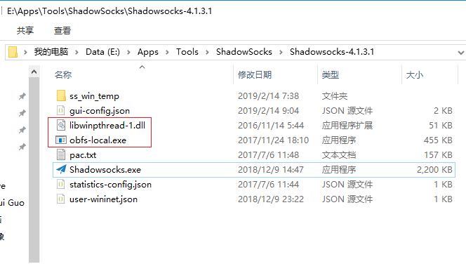

# Ubuntu 14.04 搭建 ShadowSocks 服务器

## 1. 准备工作

### 1.1. 安装 pip

`pip` 是 `python` 的包管理工具，类似于 `Ubuntu` 的 `apt-get`。本文中将使用 `python` 版本的 `ShadowSocks`，因此我们需要通过 `pip` 命令来安装。

在 `Ubuntu 14.04` 下安装 `pip`：

```shell
apt-get update
apt-get install python-pip
```

### 1.2. 更新 pip

```shell
pip install --upgrade pip
```

## 2. 安装配置 ShadowSocks

### 2.1. 安装 ShadowSocks

```shell
pip install shadowsocks
```

执行完毕，且没有报错的话，接下来就是配置了。

#### 2.1.1. 报错

如果显示如下的错误信息：

```shell
Traceback (most recent call last):
  File "/usr/bin/pip", line 9, in <module>
    from pip import main
```

是因为将 `pip` 更新为 `10.0.0` 以后的版本，库里面的函数有所变动造成的。

#### 2.1.2. 解决方法

在 `Ubuntu 16.04` 中，下列方法可行：

```shell
vim /usr/bin/pip
```

把原来的：

```python
from pip import main
```

修改为：

```python
from pip._internal import main
```

如果以上方法还是不能解决，还有另一种方法，可参考 [pip升级后Import Error:cannot import name main解决方案](https://blog.csdn.net/zong596568821xp/article/details/80410416)。

### 2.2. 配置 ShadowSocks

新建一个配置文件，例如：`/etc/shadowsocks.json`，命令如下：

```shell
vim /etc/shadowsocks.json
```

文件内容如下：

```json
{
    "server": "114.114.114.114",
    "server_port": 8388,
    "local_address": "127.0.0.1",
    "local_port": 1080,
    "password": "your_password",
    "timeout": 300,
    "method": "aes-256-cfb",
    "fast_open": false
}
```

该配置文件的格式如下：

```json
{
    "server": "你的服务器IP",
    "server_port": 你的服务器端口,
    "local_address": "127.0.0.1",
    "local_port": 1080,
    "password": "你的ShadowSocks密码",
    "timeout": 300,
    "method": "加密格式",
    "fast_open": false
}
```

注：`server`, `server_port`, `password` 请修改为你自己的配置。

### 2.3. 运行 ShadowSocks

配置文件编辑完成后，接下来就可以部署运行了：

```shell
ssserver -c /etc/shadowsocks.json -d start
```

当然，我们可不希望每次重启服务器都手动启动 `ShadowSocks`，因此可以这条命令写到系统启动文件中：`/etc/rc.local` (在 `exit 0` 之前)，这样以后就能开机自动运行了。

```shell
vim /etc/rc.local
```

在 `exit 0` 之前添加如下内容：

```bash
if [ $(id -u) -eq 0 ]; then
    /usr/local/bin/ssserver -c /etc/shadowsocks.json -d start
fi

exit 0
```

重启系统，验证配置 `/etc/rc.local` 是否生效。好了，打开客户端，开始呼吸墙外的新鲜空气吧！

开机自启

以下使用 `Systemd` 来实现 `shadowsocks` 开机自启。

如果没有安装 `Systemd`，需要先安装 `Systemd`（可以使用 `systemctl --help` 命令来检查是否安装了 `Systemd`）。

安装的命令是：

```shell
apt-get install systemd
```

新建 `shadowsocks` 配置文件：

```shell
vim /etc/systemd/system/shadowsocks.service
```

```bash
[Unit]
Description=Shadowsocks Server Service
After=network.target

[Service]
Type=simple
User=root
ExecStart=/usr/local/bin/ssserver -c /etc/shadowsocks.json

[Install]
WantedBy=multi-user.target
```

让 `shadowsocks` 配置生效：

```shell
systemctl enable /etc/systemd/system/shadowsocks.service
```

执行的结果如下：

```shell
ln -s '/etc/systemd/system/shadowsocks.service'
      '/etc/systemd/system/multi-user.target.wants/shadowsocks.service'
```

启动 `shadowsocks` 服务：

```shell
systemctl start shadowsocks
```

查询 `shadowsocks` 服务当前的状态：

```shell
systemctl status shadowsocks
```

## 3. 更新：使用 obfs 混淆

（ `2019年2月14日` 更新）

由于现在 `ShadowSocks` 协议有可能会被主动识别并屏蔽，所以可以采用 `simple-obfs` 或 `GoQuite` 做混淆。具体缘由可看 `ShadowSocks-Windows` 官方 `github` 上的 `issue` 讨论：[有种被针对的感觉](https://github.com/shadowsocks/shadowsocks-windows/issues/2193) 。

可以使用第三方的服务测试你的服务器 `IP` 是否被墙了：

```
https://ipcheck.need.sh/
```

`simple-obfs` 官网：[https://github.com/shadowsocks/simple-obfs](https://github.com/shadowsocks/simple-obfs)

`GoQuite` 官网: [https://github.com/cbeuw/GoQuiet](https://github.com/cbeuw/GoQuiet)

本文仅介绍如何使用和配置 `simple-obfs` 来做混淆。

### 3.1. 服务器端

服务器端 (`Ubuntu 14.04 64-bit`)：

关于 `Linux` 上如何编译和安装 `simple-obfs`，可查阅 `simple-obfs` 的官方 `github`，这里不再敖述。

编辑 `rc.local` 文件：

```shell
vim /etc/rc.local
```
如下：

```bash
if [ $(id -u) -eq 0 ]; then
    ulimit -SHn 65535
    /usr/local/bin/ssserver -s 127.0.0.1 -p 8388 -c /etc/shadowsocks.json -d start
    /usr/local/bin/obfs-server -s your_server_ip -p 8139 --obfs http -r 127.0.0.1:8388
fi
```

注：这里的 `ssserver` 由于使用的是本地 `IP` 启动的，会报 `Warning`，在 `/etc/rc.local` 里启动会失败，不能自动启动。所以，待服务器启动以后，需要手动执行一遍启动命令，才能正常启动 `ssserver`，暂时找不到更好的解决办法。命令如下：

```shell
/usr/local/bin/ssserver -s 127.0.0.1 -p 8388 -c /etc/shadowsocks.json -d start
```

执行完成后，可使用 `top` 命令查看是否已经启动了 `ssserver` 程序。

`shadowsocks` 开机自启

先修改配置文件 `/etc/shadowsocks.json` 。

```shell
vim /etc/shadowsocks.json
```

内容修改为：

```json
{
    "server": "127.0.0.1",
    "server_port": 8388,
    "local_address": "127.0.0.1",
    "local_port": 1080,
    "password": "your_password",
    "timeout": 300,
    "method": "aes-256-cfb",
    "fast_open": false
}
```

新建 `shadowsocks` 配置文件：

```shell
vim /etc/systemd/system/shadowsocks.service
```

```bash
[Unit]
Description=Shadowsocks Server Service
After=network.target

[Service]
Type=simple
User=root
ExecStart=/usr/local/bin/ssserver -c /etc/shadowsocks.json -s 127.0.0.1 -p 8388

[Install]
WantedBy=multi-user.target
```

让 `shadowsocks` 配置生效：

```shell
systemctl enable /etc/systemd/system/shadowsocks.service
```

执行的结果如下：

```shell
ln -s '/etc/systemd/system/shadowsocks.service'
      '/etc/systemd/system/multi-user.target.wants/shadowsocks.service'
```

启动 `shadowsocks` 服务：

```shell
systemctl start shadowsocks
```

查询 `shadowsocks` 服务当前的状态：

```shell
systemctl status shadowsocks
```

`simple-obfs` 开机自启

新建 `obfs` 配置文件：

```shell
vim /etc/systemd/system/obfs.service
```

```bash
[Unit]
Description=Simple Obfs Server Service
After=network.target

[Service]
Type=simple
User=root
ExecStart=/usr/local/bin/obfs-server -s your_server_ip -p 8139 --obfs http -r 127.0.0.1:8388

[Install]
WantedBy=multi-user.target
```

让 `obfs` 配置生效：

```shell
systemctl enable /etc/systemd/system/obfs.service
```

执行的结果如下：

```shell
ln -s '/etc/systemd/system/obfs.service'
      '/etc/systemd/system/multi-user.target.wants/obfs.service'
```

启动 `obfs` 服务：

```shell
systemctl start obfs
```

查询 `obfs` 服务当前的状态：

```shell
systemctl status obfs
```

### 3.2. 客户端

客户端 (`Windows 10`)：

在 `Windows` 客户端上，我们使用 `ShadowSocks-Windows` 的插件方式运行 `simple-obfs`，`simple-obfs` 的 `Windows` 的可执行文件可以在这里下载，[https://github.com/shadowsocks/simple-obfs/releases](https://github.com/shadowsocks/simple-obfs/releases)，并且把 `obfs-local.exe` 和 `libwinpthread-1.dll` 文件放到 `Shadowsocks.exe` 所在的目录，如下图所示：



鼠标右击 `ShadowSocks-Windows` 的右下角图标，“`服务器`” -> “`编辑服务器...`”，新添或修改你的服务器配置，在 “`插件程序`” 一栏写上 `obfs-local`，在 “`插件选项`” 写上 `obfs=http;obfs-host=www.bing.com` , 配置中的 `http` 要和服务器的设置对应 ( `http` 或 `tls`)，如下图所示：


关于 `Windows` 上客户端的设置，更多内容，可参考如下文章：[https://www.jianshu.com/p/135e538164f5](https://www.jianshu.com/p/135e538164f5) 。

## 4. 参考文章

1. [`issue：有种被针对的感觉`](https://github.com/shadowsocks/shadowsocks-windows/issues/2193)

    [https://github.com/shadowsocks/shadowsocks-windows/issues/2193](https://github.com/shadowsocks/shadowsocks-windows/issues/2193)

2. [`ss 客户端使用 obfs 混淆`](https://www.jianshu.com/p/135e538164f5) （该文章已被禁止访问）

    [https://www.jianshu.com/p/135e538164f5](https://www.jianshu.com/p/135e538164f5)

3. [`simple-obfs 官网`](https://github.com/shadowsocks/simple-obfs)

    [https://github.com/shadowsocks/simple-obfs](https://github.com/shadowsocks/simple-obfs)

4. [`VPS 搭梯子指南——shadowsocks + BBR + obfs`](https://www.solarck.com/shadowsocks-libev.html)

    [https://www.solarck.com/shadowsocks-libev.html](https://www.solarck.com/shadowsocks-libev.html)
