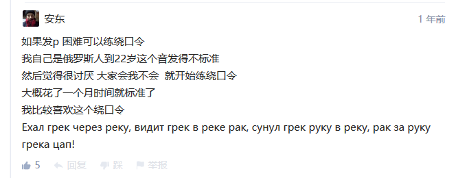
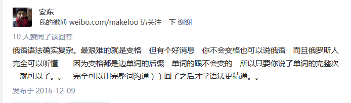
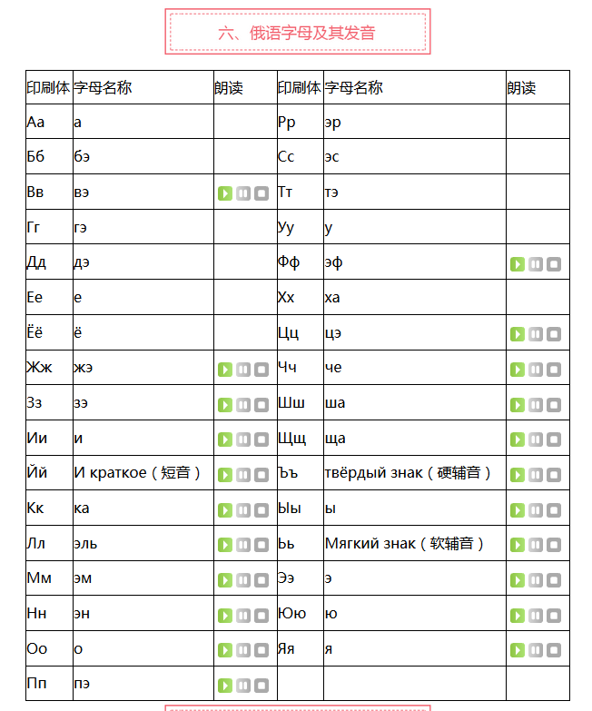

# 俄语入门 #

## 1. 俄语简介 ##

`俄语` 属于拼音文字，类似于中文的汉语拼音，会写就会读，会读也能写。`俄罗斯人` 的祖先为 `东斯拉夫人` 罗斯部族，国土面积 `1709.82` 万平方公里（大概是中国国土面积的两倍），横跨 `11` 个时区（咱中国只横跨 `5` 个时区），人口仅有 `一亿四千四百万` 左右。`俄罗斯` 的宗教主要是 “`东正教`” (基督教的东部分支) ，最早是从 `希腊` 传入。公元 `988` 年开始，`东正教` 从 `拜占庭` 帝国传入 `基辅罗斯`，由此拉开了 `拜占庭` 和 `斯拉夫文化` 的融合，并最终形成了占据未来 `700` 年时间的 `俄罗斯` 文化。

`俄语` 本来只有发音，而没有文字。`9` 世纪 `希腊` 传教士 `西里尔兄弟` 创制了一套字母（很多字母来自于 `希腊字母`，所以现在的 `俄语字母` 跟 `希腊字母` 有很大的渊源），记录 `斯拉夫语`，翻译和编撰宗教文献，现代 `俄语字母` 正是由此发展而来的，故又称为 `西里尔字母` 。

## 2. 俄语字母表 ##

其中红色的字母为元音（长音），其他字母是短音。

## 3. 入门教程 ##

1. [学俄语怎么入门？](https://www.zhihu.com/question/19981414) / from `知乎`

    很经典的一个俄语入门知乎贴，有很多有用的资讯和入门知识，语法技巧等。其中 [`KaFILE`](https://www.zhihu.com/people/kafile) 的回答最为经典，而俄罗斯人 [`安东`](https://www.zhihu.com/people/an-dong-007) 回复了她，说他 `22` 岁才学会 `p` （舌颤音）的发音，截图如下：

    

2. [俄语入门 第一颗 学俄语字母发音 读法 等等](http://www.iqiyi.com/w_19rs2e4l0x.html) / from `爱奇艺`

    这个视频就是第一篇引文（知乎贴）里的 [`安东`](https://www.zhihu.com/people/an-dong-007) 做的，从他说 `22` 岁才学会发 `p` 舌颤音就能看出来，见上面的截图。最上门的字母表就是这个视频里截取的，很好的俄语字母入门教学视频。

    他能熟练的用中文玩 `知乎`，这也许也能激发你学习 `俄语` 的斗志，因为既然他都能学会中文，上 `知乎`，我们为什么不能学会俄语，并用俄语玩他们的 `知乎` ？PS：那个知乎贴里还有一个 `哈萨克斯坦` 人用中文回过帖，不过他不在中国，在哈萨克斯坦。

    

3. `《俄语俄国圈》 俄語入門 (by 南台科技大学)`

    还不错的字母发音入门教程，比较可惜的是老师的台湾国语太重了…… 
    而且她有些发音也不是很标准的，可以参考上面俄罗斯人 `安东` 发音教程。

    下面是该系列所有的视频（可能分布在不同的网站上面）：

    1) [《俄语俄国圈》 俄語入門 1 俄文字母 Part 1](http://www.iqiyi.com/w_19rrxqehm9.html) / from `爱奇艺`
    2) [《俄语俄国圈》 俄語入門 1 俄文字母 Part 2](https://v.qq.com/x/page/y0148741u52.html) / from `腾讯视频`
    3) [《俄语俄国圈》 俄語入門 1 俄文字母 Part 3](http://my.tv.sohu.com/us/237244835/76556814.shtml) / from `搜狐`
    4) [《俄语俄国圈》 俄語入門 2 發音 Part 1](http://my.tv.sohu.com/us/237244835/76557013.shtml) / from `搜狐`
    5) [《俄语俄国圈》 俄語入門 2 發音 Part 2](http://video.tudou.com/v/XMjMzNzIwMzA5Ng==.html) / from `土豆`
    6) [《俄语俄国圈》 俄語入門 2 發音 Part 3](http://my.tv.sohu.com/us/237244835/76557019.shtml) / from `搜狐`
    7) [《俄语俄国圈》 俄語入門 3 俄文名字 Part 1](http://my.tv.sohu.com/us/237244835/76557538.shtml) / from `搜狐`
    8) `《俄语俄国圈》 俄語入門 3 俄文名字 Part 2` （未找到）
    9) [《俄语俄国圈》 俄語入門 4 第一课 Part 1](http://new-play.tudou.com/v/584300952.html?) / from `土豆` [备用链接](http://video.tudou.com/v/XMjMzNzIwMzgwOA==.html)
    10) [《俄语俄国圈》 俄語入門 4 第一课 Part 2](http://my.tv.sohu.com/us/237244835/76557786.shtml) / from `搜狐`
    11) [《俄语俄国圈》 俄語入門 4 第一课 Part 3](http://video.tudou.com/v/XMjMzNzIwNzk4OA==.html) / from `土豆`
    12) [《俄语俄国圈》 俄語入門 5 第二课 Part 1](http://new-play.tudou.com/v/584302086.html?) / from `土豆` [备用链接](http://video.tudou.com/v/XMjMzNzIwODM0NA==.html)
    13) `《俄语俄国圈》 俄語入門 5 第二课 Part 2` （未找到）
    14) `《俄语俄国圈》 俄語入門 5 第二课 Part 3` （未找到）
    15) [《俄语俄国圈》 俄語入門 5 第二课 Part 4](http://new-play.tudou.com/v/584302407.html?) / from `土豆` [备用链接](http://video.tudou.com/v/XMjMzNzIwOTYyOA==.html)
    16) `《俄语俄国圈》 俄語入門 5 第二课 Part 5` （未找到）
    17) [《俄语俄国圈》 俄語入門 5 第二课 Part 6](http://v.youku.com/v_show/id_XOTA3MDYwMDgw.html) / from `优酷`
    18) [《俄语俄国圈》 俄語入門 5 第二课 Part 7](http://v.youku.com/v_show/id_XOTA3MTQwOTky.html?spm=a2h0k.8191407.0.0&from=s1.8-1-1.2) / from `优酷`

4. [俄语元音发音](http://www.iqiyi.com/w_19rudj8ood.html#vfrm=16-1-1-1) / from `爱奇艺`

    还不错的俄语元音发音教程，发音准确，就是简单了点，加上辅音就好了。

5. `娜塔莎俄语视频教程`

    娜塔莎教得还不错，就是太墨迹了，老师的黑板很不错，很溜。

    娜塔莎俄语视频教程，官方网站：[http://www.ntsey.com](http://www.ntsey.com)

    1. [娜塔莎俄语视频教程《走遍俄罗斯1》第一课 俄语零基础入门教学](http://v.youku.com/v_show/id_XMTMzODQ1MDc2OA==.html?spm=a2h0j.8191423.module_basic_relation.5~5!2~5~5!17~5!2~1~3~A)
    2. [娜塔莎俄语视频教程《走遍俄罗斯1》第二课 俄语零基础入门教学](http://v.youku.com/v_show/id_XMTMzOTMwNDkwOA==.html?spm=a2h0j.8191423.module_basic_relation.5~5!2~5~5!3~5!2~1~3~A)

6. [俄语初级课程，学的是那么轻松](https://v.qq.com/x/page/v0342bhfx4z.html) / from `腾讯视频`

    北京大学研究生 `吴石磊` 的俄语课程，强行说俄语动听。不过他的发音的确比较好听，如果有妹子想学俄语，看这个热情的小哥哥的视频，也许能激发你对俄语的兴趣哦。这小节是俄语的一些简介和文化背景的介绍。

7. [【备胎大魔王】美女教你學俄文：數字1-10](https://v.qq.com/x/page/r05119uixdl.html) / from `腾讯视频`

    真的是美女老师。这是教你俄文数字 `1` 到 `10` 的发音，发音是用英文来标注的，很容易学，很棒的方式，推荐！（题外话：美女的中文发音咋听还不错，不过还是有口音的，可惜。）

8. [俄语入门：俄语字母及发音](https://ru.hujiang.com/new/p590586/)

    这是一个文字教程，有俄语书写体和印刷体的对照表等。

    

9. [实用俄语之：最常用的俄语打招呼和问候语](http://www.iqiyi.com/w_19rta7pxah.html) / from `爱奇艺`

    这是进阶的教程，日常打招呼和问候语，适合已经有一定俄语基础的初学者。

## 4. 意外收获 ##    

1. [让日本人来告诉你为什么日语中有汉字！](https://v.qq.com/x/page/i0352tk1oc3.html) / from `腾讯视频`

    这位日本人的英语很棒，完全没有日本味，而且他很生动的解释了为什么日语中要有汉字，为什么离不开汉字，牛掰！他举了一个例子，Because，you love her，你离不开它。。。

    PS：题外话，因为现在南韩，北韩，越南等国已经成功的在日常交流中去掉了汉字。

    ### < `patreon` > ###

    此人在 [`patreon`](https://www.patreon.com) 上的链接是：[https://www.patreon.com/yutaeljapones]()，名叫 `Yuta` 。`意外之意外` 收获是这个 [`patreon`](https://www.patreon.com) 网站，一个创作者的众筹网站，这个 `Yuta` 目前只有 `3` 位赞助者。

    典型案例：

    一个叫 [`Vue.js`](https://github.com/vuejs) 的 `JavaScript` 开源项目在 `patreon` 筹钱：
    
    [Evan is creating Vue.js](https://www.patreon.com/evanyou) -- （目前平均每个月筹到了 `$12,521` 美元）

    项目 `github`：[https://github.com/vuejs](https://github.com/vuejs) / 官方网站（中文）：[https://cn.vuejs.org/](https://cn.vuejs.org/)

    PS：一个关于 `patreon` 的知乎讨论贴：[Patreon在国内有没有成功的机会？](https://www.zhihu.com/question/28411429)

    关于众筹网站 `patreon` 的介绍：[众筹网站 Patreon，要让艺术家回到达芬奇时代的生存模式](http://www.pingwest.com/demo/patreon-offers-you-a-good-way-to-make-money/)

    ### < `sns.net` > ###

    `意外之意外之意外` 收获是一个叫 [`sns.net`](https://sns.net) 的中文网站，这是一个类似于 `patreon` 的创作者众筹中文网站。
    
    典型案例是：[https://sns.net/wlop](https://sns.net/wlop) ，一个 `插画` / `壁纸` 画手。
