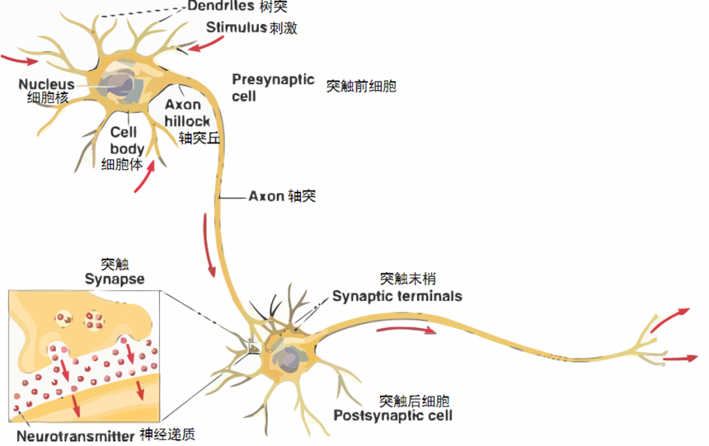
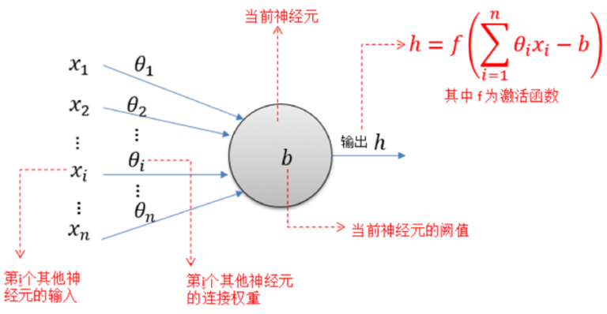
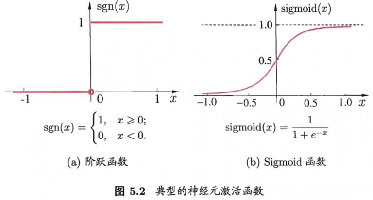
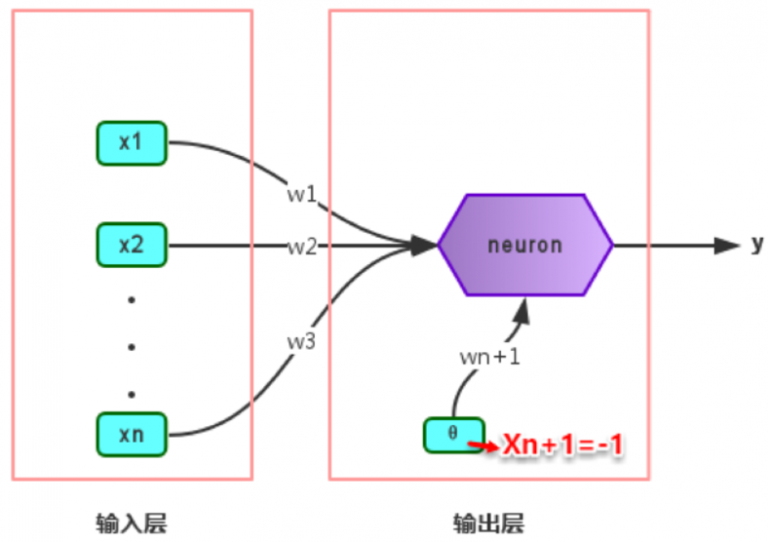
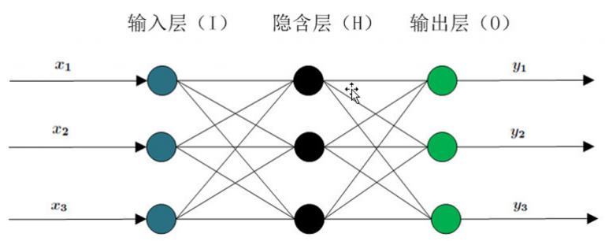

# BP神经网络学习笔记 [转载]

注：本文是转载，原作者的文章是：[标点符：BP神经网络学习笔记](https://www.biaodianfu.com/back-propagation.html) 。

## 1. 神经网络简介

神经网络的结构模仿生物神经网络，生物神经网络中的每个神经元与其他神经元相连，当它“兴奋”时，向下一级相连的神经元发送化学物质，改变这些神经元的电位；如果某神经元的电位超过一个阈值，则被激活，否则不被激活。

神经网络中最基本的单元是神经元模型（neuron）。在生物神经网络的原始机制中，每个神经元通常都有多个树突（dendrite），一个轴突（axon）和一个细胞体（cell body），树突短而多分支，轴突长而只有一个；在功能上，树突用于传入其它神经元传递的神经冲动，而轴突用于将神经冲动传出到其它神经元，当树突或细胞体传入的神经冲动使得神经元兴奋时，该神经元就会通过轴突向其它神经元传递兴奋。神经元的生物学结构如下图所示：

一直沿用至今的“M-P神经元模型”正是对这一结构进行了抽象，也称“阈值逻辑单元”，其中树突对应于输入部分，每个神经元收到n个其他神经元传递过来的输入信号，这些信号通过带权重的连接传递给细胞体，这些权重又称为连接权（connection weight）。细胞体分为两部分，前一部分计算总输入值（即输入信号的加权和，或者说累积电平），后一部分先计算总输入值与该神经元阈值的差值，然后通过激活函数（activation function）的处理，产生输出从轴突传送给其它神经元。M-P神经元模型如下图所示：



一直沿用至今的“M-P神经元模型”正是对这一结构进行了抽象，也称“阈值逻辑单元”，其中树突对应于输入部分，每个神经元收到n个其他神经元传递过来的输入信号，这些信号通过带权重的连接传递给细胞体，这些权重又称为连接权（connection weight）。细胞体分为两部分，前一部分计算总输入值（即输入信号的加权和，或者说累积电平），后一部分先计算总输入值与该神经元阈值的差值，然后通过激活函数（activation function）的处理，产生输出从轴突传送给其它神经元。M-P神经元模型如下图所示：



与线性分类十分相似，神经元模型最理想的激活函数也是阶跃函数，即将神经元输入值与阈值的差值映射为输出值1或0，若差值大于零输出1，对应兴奋；若差值小于零则输出0，对应抑制。但阶跃函数不连续，不光滑（定义域内不完全可导），故在M-P神经元模型中，采用Sigmoid函数来近似， Sigmoid函数将较大范围内变化的输入值挤压到 (0,1) 输出值范围内，所以也称为挤压函数（squashing function）。



将多个神经元按一定的层次结构连接起来，就得到了神经网络。它是一种包含多个参数的模型，比方说10个神经元两两连接，则有100个参数需要学习（每个神经元有9个连接权以及1个阈值），若将每个神经元都看作一个函数，则整个神经网络就是由这些函数相互嵌套而成。

多层前馈神经网络有三部分组成，分别是输入层(input layer)，隐藏层(hide layer)，输出层(output layer)。隐藏层可以有，也可以没有，输入层和输出层必须要有。没有隐藏层的神经网络是线性的，只能处理线性可分的问题（线性可分问题从二维的角度就是分界线是一条直线，多维就是存在线性超平面将其分类）。一个没有隐藏层且输出层只有一个单元的神经网络就相当于线性的Logistic模型。


**感知机与多层网络**

感知机（Perceptron）是由两层神经元组成的一个简单模型，但只有输出层是M-P神经元，即只有输出层神经元进行激活函数处理，也称为功能神经元（functionalneuron）；输入层只是接受外界信号（样本属性）并传递给输出层（输入层的神经元个数等于样本的属性数目），而没有激活函数。这样一来，感知机与之前线性回归的思想基本是一样的，都是通过对属性加权与另一个常数求和，再使用sigmoid函数将这个输出值压缩到0-1之间，从而解决分类问题。不同的是感知机的输出层应该可以有多个神经元，从而可以实现多分类问题，同时两个模型所用的参数估计方法十分不同。

给定训练集，则感知机的n+1个参数（n个权重+1个阈值）都可以通过学习得到。阈值 $\Theta$ 可以看作一个输入值固定为-1的哑结点的权重 $w_{n+1}$，即假设有一个固定输入 $x_{n+1}=-1$ 的输入层神经元，其对应的权重为 $w_{n+1}$，这样就把权重和阈值统一为权重的学习了。简单感知机的结构如下图所示：



感知机权重的学习规则如下：对于训练样本(x, y)，当该样本进入感知机学习后，会产生一个输出值，若该输出值与样本的真实标记不一致，则感知机会对权重进行调整，若激活函数为阶跃函数，则调整的方法与Logistic回归类似（基于梯度下降法）。

感知机是通过逐个样本输入来更新权重，首先设定好初始权重（一般为随机），逐个地输入样本数据，若输出值与真实标记相同则继续输入下一个样本，若不一致则更新权重，然后再重新逐个检验，直到每个样本数据的输出值都与真实标记相同。容易看出：感知机模型总是能将训练数据的每一个样本都预测正确，和决策树模型总是能将所有训练数据都分开一样，感知机模型很容易产生过拟合问题。

## 2. BP神经网络算法

由上面可以得知：神经网络的学习主要蕴含在权重和阈值中，多层网络使用上面简单感知机的权重调整规则显然不够用了，BP神经网络算法即误差逆传播算法正是为学习多层前馈神经网络而设计，BP神经网络算法是迄今为止最成功的的神经网络学习算法。BP神经网络中的BP为Back Propagation的简写，BP（Back Propagation）神经网络分为两个过程：

* 工作信号正向传递子过程
* 误差信号反向传递子过程

在BP神经网络中，单个样本有个输入，有个输出，在输入层和输出层之间通常还有若干个隐含层。实际上，1989年Robert Hecht-Nielsen证明了对于任何闭区间内的一个连续函数都可以用一个隐含层的BP网络来逼近，这就是万能逼近定理。所以一个三层的BP网络就可以完成任意的维到维的映射。即这三层分别是输入层（I），隐含层（H），输出层（O）。一般说到BP网络算法时，默认指用BP算法训练的多层前馈神经网络。



**正向传递子过程**


设节点 i 和节点 j 之间的权值为 $w_{ij}$，节点j的阀值为 $b_j$，每个节点的输出值为 $x_j$，而每个节点的输出值是根据上层所有节点的输出值、当前节点与上一层所有节点的权值和当前节点的阀值还有激活函数来实现的。具体计算方法如下：

$$\begin{aligned}S_j = \sum_{i=0}^{m-1}w_{ij}x_i+b_j\end{aligned}$$

$$\begin{aligned}x_j = f(S_j)\end{aligned}$$

其中 f 为激活函数，一般选取 S 型（Sigmoid函数）函数或者线性函数。正向传递的过程比较简单，按照上述公式计算即可。在BP神经网络中，输入层节点没有阀值。

**反向传递子过程**

在BP神经网络中，误差信号反向传递子过程比较复杂。假设输出层的所有结果为 $d_j$，误差函数如下：

$$
\begin{aligned}
E(w,b)=\frac{1}{2}\sum_{j=0}^{n-1}(d_j-y_j)^2
\end{aligned}
$$

而BP神经网络的主要目的是反复修正权值和阀值，使得误差函数值达到最小。Widrow-Hoff学习规则是通过沿着相对误差平方和的最速下降方向，连续调整网络的权值和阀值，根据梯度下降法，权值矢量的修正正比于当前位置上 $E(w,b)$ 的梯度，对于第个j输出节点有：

$$\Delta w(i,j)=-\eta \frac{\partial E(w,b)}{\partial w(i,j)}$$

假设选择激活函数为：

$$f(x) = \frac{A}{1+e^{-\frac{\infty }{B}}}$$

对激活函数求导，得到：

$$f'(x) = \frac{Ae^{-\frac{\infty }{B}}}{B(1+e^{-\frac{\infty }{B}})^2}=\frac{1}{AB}\cdot \frac{A}{1+e^{-\frac{\infty }{B}}}\cdot (A-\frac{A}{1+e^{-\frac{\infty }{B}}}) = \frac{f(x)[A-f(x)]}{AB}$$

那么接下来针对 $w_{ij}$ 有：

$$
\begin{aligned}
\frac{\partial E(w, b)}{\partial w_{i j}} &=\frac{1}{\partial w_{i j}} \cdot \frac{1}{2} \sum_{j=0}^{n-1}\left(d_{j}-y_{j}\right)^{2} \\ &=(d_{j}-y_{j}) \cdot \frac{\partial d_{j}}{\partial w_{i j}} \\ &=(d_{j}-y_{j}) \cdot f^{\prime}(S_{j}) \cdot \frac{\partial S_{j}}{\partial w_{i j}} \\ &=(d_{j}-y_{j}) \cdot \frac{f(S_{j})[A-f(S_{j})]}{A B} \cdot \frac{\partial S_{j}}{\partial w_{i j}} \\ &=(d_{j}-y_{j}) \cdot \frac{f(S_{j})[A-f(S_{j})]}{A B} \cdot x_{i} \\ &=\delta_{i j} \cdot x_{i}
\end{aligned}
$$

其中有：$$\delta_{i j} = (d_{j}-y_{j}) \cdot \frac{f(S_{j})[A-f(S_{j})]}{A B}$$

同样对于 $$\frac{\partial E(w,b)}{\partial b_j} = \delta _{ij}$$

这就是著名的 $\delta$ 学习规则，通过改变神经元之间的连接权值来减少系统实际输出和期望输出的误差，这个规则又叫做 Widrow-Hoff 学习规则或者纠错学习规则。

上面是对隐含层和输出层之间的权值和输出层的阀值计算调整量，而针对输入层和隐含层和隐含层的阀值调整量的计算更为复杂。假设 $w_{ki}$ 是输入层第 k 个节点和隐含层第 i 个节点之间的权值，那么有：

$$
\begin{aligned}
\frac{\partial E(w, b)}{\partial w_{k i}} &=\frac{1}{\partial w_{k i}} \cdot \frac{1}{2} \sum_{j=0}^{n-1}(d_{j}-y_{j})^{2} \\
&=\sum_{j=0}^{n-1}(d_{j}-y_{j}) \cdot f^{\prime}(S_{j}) \cdot \frac{\partial S_{j}}{\partial w_{k i}} \\
&=\sum_{j=0}^{n-1}(d_{j}-y_{j}) \cdot f^{\prime}(S_{j}) \cdot \frac{\partial S_{j}}{\partial x_{i}} \cdot \frac{\partial x_{i}}{\partial S_{i}} \cdot \frac{\partial S_{i}}{\partial w_{k i}} \\
&=\sum_{j=0}^{n-1} \delta_{i j} \cdot w_{i j} \cdot \frac{f(S_{i})[A-f(S_{i})]}{A B_{i}} \cdot \frac{\partial S_{i}}{\partial w_{k i}} \\
&=x_{k} \cdot \sum_{j=0}^{n-1} \delta_{i j} \cdot w_{i j} \cdot \frac{f(S_{i})[A-f(S_{i})]}{A B} \\
&=\delta_{k i} \cdot x_{k}
\end{aligned}
$$

其中有：$$\begin{aligned}\delta_{k i} = \sum_{j=0}^{n-1} \delta_{i j} \cdot w_{i j} \cdot \frac{f(S_{i})[A-f(S_{i})]}{A B}\end{aligned}$$

有了上述公式，根据梯度下降法，那么对于隐含层和输出层之间的权值和阀值调整如下：

$$ w_{ij} = w_{ij} – \eta _1\cdot \frac{\partial E(w,b)}{\partial w_{ij}} = w_{ij}-\eta _1\cdot \delta _{ij}\cdot x_i $$

$$ b_j = b_j-\eta _2\cdot \frac{\partial E(w,b)}{\partial b_j} = b_j – \eta _2\cdot \delta _{ij} $$

而对于输入层和隐含层之间的权值和阀值调整同样有：

$$ w_{ki} = w_{ki} – \eta _1\cdot \frac{\partial E(w,b)}{\partial w_{ki}} = w_{ki}-\eta _1\cdot \delta _{ki}\cdot x_k $$

$$ b_i = b_j-\eta _2\cdot \frac{\partial E(w,b)}{\partial b_i} = b_i – \eta _2\cdot \delta _{ki} $$

容易看出，BP 学习算法中，各层权值调整公式形式上都是一样的，均由 3 个因素决定，即：

* 学习率 $\eta$
* 本层输出的误差信号 $\delta$
* 本层输入信号 Y 或 X

**隐含层的选取**

在 BP 神经网络中，输入层和输出层的节点个数都是确定的，而隐含层节点个数不确定，那么应该设置为多少才合适呢？实际上，隐含层节点个数的多少对神经网络的性能是有影响的，有一个经验公式可以确定隐含层节点数目，如下：

$$h = \sqrt{m+n}+a$$

其中h为隐含层节点数目，m为输入层节点数目，n为输出层节点数目，a为 1~10 之间的调节常数。

**BP神经网络的注意点**

BP 神经网络一般用于分类或者逼近问题。如果用于分类，则激活函数一般选用 Sigmoid 函数或者硬极限函数，如果用于函数逼近，则输出层节点用线性函数。

BP 神经网络在训练数据时可以采用增量学习或者批量学习。增量学习要求输入模式要有足够的随机性，对输入模式的噪声比较敏感，即对于剧烈变化的输入模式，训练效果比较差，适合在线处理。批量学习不存在输入模式次序问题，稳定性好，但是只适合离线处理。

标准 BP 神经网络的缺陷：

* 容易形成局部极小值而得不到全局最优值。BP神经网络中极小值比较多，所以很容易陷入局部极小值，这就要求对初始权值和阀值有要求，要使得初始权值和阀值随机性足够好，可以多次随机来实现。
* 训练次数多使得学习效率低，收敛速度慢。
* 隐含层的选取缺乏理论的指导。
* 训练时学习新样本有遗忘旧样本的趋势。

BP 算法的改进：

* 增加动量项。引入动量项是为了加速算法收敛，即如下公式 $w_{ij} = w_{ij} – \eta _1\cdot \delta _{ij}\cdot x_i+\alpha \Delta w_{ij}$。动量因子一般 $\alpha$ 选取 1~0.8。
* 自适应调节学习率，如随着迭代次的代数t动态变化的学习率：$\frac{\alpha}{\sqrt{t}}$
* 引入陡度因子

通常 BP 神经网络在训练之前会对数据归一化处理，即将数据映射到更小的区间内，比如 [0,1] 或 [-1,1] 。

## 3. BP神经网络的Python实现

Python

```python
# coding:UTF-8
import numpy as np
from math import sqrt
 
 
def load_data(file_name):
    '''导入数据
    input:  file_name(string):文件的存储位置
    output: feature_data(mat):特征
            label_data(mat):标签
            n_class(int):类别的个数
    '''
    # 1、获取特征
    f = open(file_name)  # 打开文件
    feature_data = []
    label_tmp = []
    for line in f.readlines():
        feature_tmp = []
        lines = line.strip().split("\t")
        for i in range(len(lines) - 1):
            feature_tmp.append(float(lines[i]))
        label_tmp.append(int(lines[-1]))
        feature_data.append(feature_tmp)
    f.close()  # 关闭文件
 
    # 2、获取标签
    m = len(label_tmp)
    n_class = len(set(label_tmp))  # 得到类别的个数
 
    label_data = np.mat(np.zeros((m, n_class)))
    for i in range(m):
        label_data[i, label_tmp[i]] = 1
 
    return np.mat(feature_data), label_data, n_class
 
 
def sig(x):
    '''Sigmoid函数
    input:  x(mat/float):自变量，可以是矩阵或者是任意实数
    output: Sigmoid值(mat/float):Sigmoid函数的值
    '''
    return 1.0 / (1 + np.exp(-x))
 
 
def partial_sig(x):
    '''Sigmoid导函数的值
    input:  x(mat/float):自变量，可以是矩阵或者是任意实数
    output: out(mat/float):Sigmoid导函数的值
    '''
    m, n = np.shape(x)
    out = np.mat(np.zeros((m, n)))
    for i in range(m):
        for j in range(n):
            out[i, j] = sig(x[i, j]) * (1 - sig(x[i, j]))
    return out
 
 
def hidden_in(feature, w0, b0):
    '''计算隐含层的输入
    input:  feature(mat):特征
            w0(mat):输入层到隐含层之间的权重
            b0(mat):输入层到隐含层之间的偏置
    output: hidden_in(mat):隐含层的输入
    '''
    m = np.shape(feature)[0]
    hidden_in = feature * w0
    for i in range(m):
        hidden_in[i,] += b0
    return hidden_in
 
 
def hidden_out(hidden_in):
    '''隐含层的输出
    input:  hidden_in(mat):隐含层的输入
    output: hidden_output(mat):隐含层的输出
    '''
    hidden_output = sig(hidden_in)
    return hidden_output
 
 
def predict_in(hidden_out, w1, b1):
    '''计算输出层的输入
    input:  hidden_out(mat):隐含层的输出
            w1(mat):隐含层到输出层之间的权重
            b1(mat):隐含层到输出层之间的偏置
    output: predict_in(mat):输出层的输入
    '''
    m = np.shape(hidden_out)[0]
    predict_in = hidden_out * w1
    for i in range(m):
        predict_in[i,] += b1
    return predict_in
 
 
def predict_out(predict_in):
    '''输出层的输出
    input:  predict_in(mat):输出层的输入
    output: result(mat):输出层的输出
    '''
    result = sig(predict_in)
    return result
 
 
def bp_train(feature, label, n_hidden, maxCycle, alpha, n_output):
    '''计算隐含层的输入
    input:  feature(mat):特征
            label(mat):标签
            n_hidden(int):隐含层的节点个数
            maxCycle(int):最大的迭代次数
            alpha(float):学习率
            n_output(int):输出层的节点个数
    output: w0(mat):输入层到隐含层之间的权重
            b0(mat):输入层到隐含层之间的偏置
            w1(mat):隐含层到输出层之间的权重
            b1(mat):隐含层到输出层之间的偏置
    '''
    m, n = np.shape(feature)
    # 1、初始化
    w0 = np.mat(np.random.rand(n, n_hidden))
    w0 = w0 * (8.0 * sqrt(6) / sqrt(n + n_hidden)) - \
         np.mat(np.ones((n, n_hidden))) * \
         (4.0 * sqrt(6) / sqrt(n + n_hidden))
    b0 = np.mat(np.random.rand(1, n_hidden))
    b0 = b0 * (8.0 * sqrt(6) / sqrt(n + n_hidden)) - \
         np.mat(np.ones((1, n_hidden))) * \
         (4.0 * sqrt(6) / sqrt(n + n_hidden))
    w1 = np.mat(np.random.rand(n_hidden, n_output))
    w1 = w1 * (8.0 * sqrt(6) / sqrt(n_hidden + n_output)) - \
         np.mat(np.ones((n_hidden, n_output))) * \
         (4.0 * sqrt(6) / sqrt(n_hidden + n_output))
    b1 = np.mat(np.random.rand(1, n_output))
    b1 = b1 * (8.0 * sqrt(6) / sqrt(n_hidden + n_output)) - \
         np.mat(np.ones((1, n_output))) * \
         (4.0 * sqrt(6) / sqrt(n_hidden + n_output))
 
    # 2、训练
    i = 0
    while i <= maxCycle:
        # 2.1、信号正向传播
        # 2.1.1、计算隐含层的输入
        hidden_input = hidden_in(feature, w0, b0)  # mXn_hidden
        # 2.1.2、计算隐含层的输出
        hidden_output = hidden_out(hidden_input)
        # 2.1.3、计算输出层的输入
        output_in = predict_in(hidden_output, w1, b1)  # mXn_output
        # 2.1.4、计算输出层的输出
        output_out = predict_out(output_in)
 
        # 2.2、误差的反向传播
        # 2.2.1、隐含层到输出层之间的残差
        delta_output = -np.multiply((label - output_out), partial_sig(output_in))
        # 2.2.2、输入层到隐含层之间的残差
        delta_hidden = np.multiply((delta_output * w1.T), partial_sig(hidden_input))
 
        # 2.3、 修正权重和偏置
        w1 = w1 - alpha * (hidden_output.T * delta_output)
        b1 = b1 - alpha * np.sum(delta_output, axis=0) * (1.0 / m)
        w0 = w0 - alpha * (feature.T * delta_hidden)
        b0 = b0 - alpha * np.sum(delta_hidden, axis=0) * (1.0 / m)
        if i % 100 == 0:
            print("\t-------- iter: ", i, " ,cost: ",
                  (1.0 / 2) * get_cost(get_predict(feature, w0, w1, b0, b1) - label))
        i += 1
    return w0, w1, b0, b1
 
 
def get_cost(cost):
    '''计算当前损失函数的值
    input:  cost(mat):预测值与标签之间的差
    output: cost_sum / m (double):损失函数的值
    '''
    m, n = np.shape(cost)
 
    cost_sum = 0.0
    for i in range(m):
        for j in range(n):
            cost_sum += cost[i, j] * cost[i, j]
    return cost_sum / m
 
 
def get_predict(feature, w0, w1, b0, b1):
    '''计算最终的预测
    input:  feature(mat):特征
            w0(mat):输入层到隐含层之间的权重
            b0(mat):输入层到隐含层之间的偏置
            w1(mat):隐含层到输出层之间的权重
            b1(mat):隐含层到输出层之间的偏置
    output: 预测值
    '''
    return predict_out(predict_in(hidden_out(hidden_in(feature, w0, b0)), w1, b1))
 
 
def save_model(w0, w1, b0, b1):
    '''保存最终的模型
    input:  w0(mat):输入层到隐含层之间的权重
            b0(mat):输入层到隐含层之间的偏置
            w1(mat):隐含层到输出层之间的权重
            b1(mat):隐含层到输出层之间的偏置
    output:
    '''
 
    def write_file(file_name, source):
        f = open(file_name, "w")
        m, n = np.shape(source)
        for i in range(m):
            tmp = []
            for j in range(n):
                tmp.append(str(source[i, j]))
            f.write("\t".join(tmp) + "\n")
        f.close()
 
    write_file("weight_w0", w0)
    write_file("weight_w1", w1)
    write_file("weight_b0", b0)
    write_file("weight_b1", b1)
 
 
def err_rate(label, pre):
    '''计算训练样本上的错误率
    input:  label(mat):训练样本的标签
            pre(mat):训练样本的预测值
    output: rate[0,0](float):错误率
    '''
    m = np.shape(label)[0]
    err = 0.0
    for i in range(m):
        if label[i, 0] != pre[i, 0]:
            err += 1
    rate = err / m
    return rate
 
 
if __name__ == "__main__":
    # 1、导入数据
    print("--------- 1.load data ------------")
    feature, label, n_class = load_data("data.txt")
    # 2、训练网络模型
    print("--------- 2.training ------------")
    w0, w1, b0, b1 = bp_train(feature, label, 20, 1000, 0.1, n_class)
    # 3、保存最终的模型
    print("--------- 3.save model ------------")
    save_model(w0, w1, b0, b1)
    # 4、得到最终的预测结果
    print("--------- 4.get prediction ------------")
    result = get_predict(feature, w0, w1, b0, b1)
    print("训练准确性为：", (1 - err_rate(np.argmax(label, axis=1), np.argmax(result, axis=1))))
```

## 4. 参考文章

* [https://blog.csdn.net/qq_26091271/article/details/74852633](https://blog.csdn.net/qq_26091271/article/details/74852633)
* [https://blog.csdn.net/weifenglin1997/article/details/77609598](https://blog.csdn.net/weifenglin1997/article/details/77609598)
* [https://github.com/zhaozhiyong19890102/Python-Machine-Learning-Algorithm/tree/master/Chapter_6%20BP](https://github.com/zhaozhiyong19890102/Python-Machine-Learning-Algorithm/tree/master/Chapter_6%20BP)

注：本文是转载，原作者的文章是：[标点符：BP神经网络学习笔记](https://www.biaodianfu.com/back-propagation.html) 。