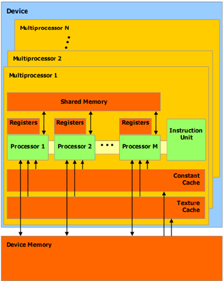

# nVidia CUDA 架构（一）-- 架构原理

## 1. CUDA 架构

CUDA (Compute Unified Device Architecture) 是一种由 NVIDIA 推出的通用并行计算架构，该架构使 GPU 能够对复杂的计算问题做性能速度优化。

NVIDIA 于 2006 年 11 月在 G80 系列中引入的 Tesla 统一图形和计算架构扩展了 GPU，使其超越了图形领域。通过扩展处理器和存储器分区的数量，其强大的多线程处理器阵列已经成为高效的统一计算平台，同时适用于图形和通用并行计算应用程序。从 G80 系列开始 NVIDIA 加入了对 CUDA 的支持。

具有 Tesla 架构的 GPU 是具有芯片共享存储器的一组 SIMT（单指令多线程）多处理器。它以一个可伸缩的多线程流处理器（Streaming Multiprocessors，SMs）阵列为中心实现了 MIMD（多指令多数据）的异步并行机制，其中每个多处理器包含多个标量处理器（Scalar Processor，SP），为了管理运行各种不同程序的数百个线程，SIMT 架构的多处理器会将各线程映射到一个标量处理器核心，各标量线程使用自己的指令地址和寄存器状态独立执行。


## 2. nVidia 显卡硬件架构


nVidia 的显卡用 SM、SP 和 Warp 组成。

### 2.1 SM（Streaming Multiprocessor）

SM（多线程流处理器，Streaming Multiprocessor），一个 SM 用多个 SP 和其他资源组成，也叫 GPU 大核，其他资源如：warp scheduler，register，shared memory 等。register 和 shared memory 是 SM 的稀缺资源，CUDA 将这些资源分配给所有驻留在 SM 中的 threads。因此，这些有限的资源就使每个 SM 中 active warps 有非常严格的限制，也就限制了并行能力。如下图所示，是一个 SM 的基本组成，其中每个绿色小块代表一个 SP 。

GPU 的 SM 总数量由具体的架构决定，例如：Ada Lovelace 架构的 RTX 4090 的 SMs/CUs 数量是 128 ，CUDA Cores/流处理器：16384 个，也就是说每个 SM 中有 16384/128 = 128 个 SP 。

### 2.2 SP（Scalar Processor）

SP（标量处理器，Scalar Processor），GPU 最基本的处理单元，也称为 CUDA core ，最后具体的指令和任务都是在 SP 上处理的。GPU 进行并行计算，也就是很多个 SP 同时做处理。

每个 SM 包含的 SP 数量依据 GPU 架构而不同，Fermi 架构 GF100 是 32个，GF10X 是 48 个，Kepler 架构是 192 个，Maxwell 是 128 个。当一个 kernel 启动后，thread 会被分配到很多 SM 中执行。大量的 thread 可能会被分配到不同的 SM ，但是同一个 block 中的 thread 必然在同一个 SM 中并行执行。


### 2.3 Warp

一个 SP 可以执行一个 thread，但是实际上并不是所有的 thread 能够在同一时刻执行。Nvidia 把 32 个 thread 组成一个 warp，warp 是调度和运行的基本单元。warp 中所有 threads 并行的执行相同的指令。warp 由 SM 的硬件 warp scheduler 负责调度，一个 SM 同一个时刻可以执行多个 warp，这取决于 warp scheduler 的最大调度数量。目前每个 warp 包含 32 个 threads（这个值会根据不同的硬件拥有不同的上限，见下表）。

**硬件利用率**

一个 SM 一次最多能容纳的线程数量主要与底层硬件的计算能力有关，下表显示了在不同的计算能力的设备上，每个线程块上开启不同数量的线程时设备的利用率。


**关于 warp 的调度**

一个 SM 单元以 `max-thread-num` 个并行线程为一组来创建、管理、调度和执行线程，这样的线程组称为 **warp 块(束)**，即以线程 warp 块(束) 为调度单位，同一时间只允许最多 `max-thread-num` 个线程执行指定、内存读取的操作，其他线程会被挂起，调度逻辑如下图所示的状态变化。


### 2.4 更多细节


对于每个 SM（Streaming Multiprocessor），都有以下四种类型的存储器区域：

- 每个 SP (标量处理器，Scalar Processor) 上都有一组本地的 32 位寄存器（Registers）；

- 并行数据缓存或共享存储器 (Shared Memory)，由该 SM 下的所有 SP (标量处理器核心) 共享；

- 只读固定缓存 (Constant Cache)，由该 SM 下的所有 SP (标量处理器核心) 共享，可加速从固定存储器空间进行的读取操作（这是一个只读区域）；

- 只读纹理缓存 (Texture Cache)，由该 SM 下的所有 SP (标量处理器核心) 共享，加速从纹理存储器空间进行的读取操作（这是一个只读区域），每个 SM 都会通过实现不同寻址模型和数据过滤的纹理单元访问纹理缓存。



## 3. CUDA 软件架构

CUDA 在软件方面组成有：一个 CUDA 库、一个应用程序编程接口 (API) 及其运行库 (Runtime)、两个较高级别的通用数学库，即 CUFFT 和 CUBLAS 。

CUDA 程序构架分为两部分：Host 和 Device。一般而言，Host 指的是 CPU，Device 指的是 GPU。在 CUDA 程序构架中，主程序还是由 CPU 来执行，而当遇到数据并行处理的部分，CUDA 就会将程序编译成 GPU 能执行的程序，并传送到 GPU，而这个程序在 CUDA 里称做核函数（kernel function）。

nVidia 的 CUDA 软件架构主要用 Kernel、Grid、Block 和 Thread 组成。


### 3.1 Kernel

我们如何调用 GPU 上的线程实现我们的算法，则是通过 Kernel 实现的。在 GPU 上调用的函数成为 CUDA 核函数（kernel function），核函数会被 GPU 上的多个线程执行。我们可以通过如下方式来定义一个 kernel：

```cpp
kernel_function<<<grid, block>>>(param1, param2, param3....);
```

### 3.2 Grid

Grid 是由一个单独的 Kernel 启动的，一个 Grid 由许多 Block 组成，可以是一维、二维或三维，Grid 中所有线程共享 global memory。

### 3.3 Block

Thread Block (线程块)，一个 Block 由许多 thread 组成，同样可以有一维、二维或者三维。Block 内部的多个 thread 可以同步（synchronize），可访问共享内存（share memory）。

### 3.4 Thread

一个 Thread 对应一个 SP (Scalar Processor)，是 GPU 最基本的处理单元，也称为 CUDA core 。


### 3.5 kernel function

一个更完整的 kernel 函数的格式为：

```cpp
kernel_function<<<Dg, Db, Ns, S>>>(param list);
```

- **Dg**：表示一个 grid 有多少个 block，可以是一维、二维或三维。三维的表示法为：Dim3 Dg(Dg.x, Dg.y, 1)，表示 grid 中每行有 Dg.x 个 block，每列有 Dg.y 个 block，第三维恒为 1 (目前一个核函数只有一个grid)。整个 grid 中共有 Dg.x * Dg.y 个 block，其中 Dg.x 和 Dg.y 最大值为 65535。

- **Db**：表示一个 block 有多少个 thread，可以是一维、二维或三维。三维的表示法为：Dim3 Db(Db.x, Db.y, Db.z)，表示整个 block 中每行有 Db.x 个 thread，每列有 Db.y 个 thread，高度为 Db.z 。Db.x 和 Db.y 最大值为 512，Db.z 最大值为 62。一个 block 中共有 Db.x * Db.y * Db.z 个 thread。计算能力为 1.0, 1.1 的硬件该乘积的最大值为 768，计算能力为 1.2, 1.3 的硬件支持的最大值为 1024 。

- **Ns**：可选参数，用于设置每个 block 除了静态分配的 shared Memory 以外，最多能动态分配的 shared memory 大小，单位为 byte，不需要动态分配时该值为 0 或省略不写。

- **S**：可选参数，类型为 cudaStream_t，默认值为零，表示该 kernel 函数处在哪个流之中。

例如：

```cpp
// 一维的定义
static const int arr_len = 16;
addKernel<<<arr_len + 512 - 1, 512>>>(a, b, c, len);

// 等价于
dim3 grid(arr_len + 512 - 1, 1, 1), block(512, 1, 1);

addKernel<<<dim3 grid, dim3 block>>>(a, b, c, len);

// 也等价于
addKernel<<<(dim3 grid(arr_len + 512 - 1), 1, 1), dim3 block(512, 1, 1)>>>(a, b, c, len);
```

### 3.6 grid 与 block 的理解

1. 只修改 block，且 block 是一维的：

```cpp
dim3 grid(1, 1, 1), block(16, 1, 1);

__global__ void addKernel(float *pA, float *pB, float *pC, int size)
{
    // 计算当前数组中的索引, block 是一维的
    int index = threadIdx.x;
    if (index >= size)
        return;
    pC[index] = pA[index] + pB[index];
}
```

2. 只修改 block，且 block 是二维的：

```cpp
dim3 grid(1, 1, 1), block(8, 2, 1);

__global__ void addKernel(float *pA, float *pB, float *pC, int size)
{
    // 计算当前数组中的索引, block 是二维的
    int index = threadIdx.y * blockDim.x + threadIdx.x;
    if (index >= size)
        return;
    pC[index] = pA[index] + pB[index];
}
```

3. grid、block 各改一个：

```cpp
dim3 grid(4, 1, 1), block(4, 1, 1)

__global__ void addKernel(float *pA, float *pB, float *pC, int size)
{
    // 计算当前数组中的索引, grid 是一维的
    int index = blockIdx.x * gridDim.x + threadIdx.x;
    if (index >= size)
        return;
    pC[index] = pA[index] + pB[index];
}
```

4. grid、block 各改两个：

```cpp
// 相当于 dim3 grid(gridDim.x, gridDim.y, 1)
// 相当于 dim3 block(blockDim.x, blockDim.y, 1)
dim3 grid(2, 2, 1), block(2, 2, 1)

__global__ void addKernel(float *pA, float *pB, float *pC, int size)
{
    // 计算当前数组中的索引, 在第几个块中 * 块的大小 + 块中的x, y维度（几行几列）
    // Bugfix: 有个疑问, 下面的 threadIdx.y * blockDim.y 应该是 threadIdx.y * blockDim.x 才对 ?
    // int index = (blockIdx.y * gridDim.x + blockIdx.x) * (blockDim.x * blockDim.y) + threadIdx.y * blockDim.y + threadIdx.x;
    int index = (blockIdx.y * gridDim.x + blockIdx.x) * (blockDim.x * blockDim.y) + threadIdx.y * blockDim.x + threadIdx.x;
    if (index >= size)
        return;
    pC[index] = pA[index] + pB[index];
}
```

### 3.7 完整示例

实现两个向量相加 arr_c[] = arr_a[] + arr_b[] 。

```cpp
#include <cuda.h>
#include <cuda_runtime_api.h>

#include <cmath>
#include <iostream>

#define CUDA_CHECK(call)                                           \
    {                                                              \
        const cudaError_t error = call;                            \
        if (error != cudaSuccess) {                                \
            fprintf(stderr, "Error: %s:%d, ", __FILE__, __LINE__); \
            fprintf(stderr, "code: %d, reason: %s\n", error,       \
                    cudaGetErrorString(error));                    \
            exit(1);                                               \
        }                                                          \
    }

__global__ void addKernel(float *pA, float *pB, float *pC, int size)
{
    // 计算当前数组中的索引
    int index = blockIdx.x * blockDim.x + threadIdx.x;
    if (index >= size)
        return;

    pC[index] = pA[index] + pB[index];
}

int main()
{
    float a[16] = {0, 1, 2, 3, 4, 5, 6, 7, 8, 9, 10, 11, 12, 13, 14, 15};
    float b[16] = {0, 1, 2, 3, 4, 5, 6, 7, 8, 9, 10, 11, 12, 13, 14, 15};

    int arr_len = 16;

    float *dev_a, *dev_b, *dev_c;
    CUDA_CHECK(cudaMalloc(&dev_a, sizeof(float) * arr_len));
    CUDA_CHECK(cudaMalloc(&dev_b, sizeof(float) * arr_len));
    CUDA_CHECK(cudaMalloc(&dev_c, sizeof(float) * arr_len));

    CUDA_CHECK(cudaMemcpy(dev_a, a, sizeof(float) * arr_len, cudaMemcpyHostToDevice));
    CUDA_CHECK(cudaMemcpy(dev_b, b, sizeof(float) * arr_len, cudaMemcpyHostToDevice));

    int *count;
    CUDA_CHECK(cudaMalloc(&count, sizeof(int)));
    CUDA_CHECK(cudaMemset(count, 0, sizeof(int)));

    addKernel<<<arr_len + 512 - 1, 512>>>(dev_a, dev_b, dev_c, arr_len);
    float *output = (float *)malloc(arr_len * sizeof(float));

    CUDA_CHECK(cudaMemcpy(output, dev_c, sizeof(float) * arr_len, cudaMemcpyDeviceToHost));

    std::cout << " output add" << std::endl;
    for (int i = 0; i < arr_len; i++) {
        std::cout << " " << output[i];
    }
    std::cout << std::endl;

    return 0;
}
```

## x. 参考文章

- [异构计算--CUDA架构](https://blog.csdn.net/qq_44924694/article/details/126202388)

- [CUDA并行架构](https://blog.csdn.net/qq_41636999/article/details/142392850)

- [一文学会CUDA编程：深入了解CUDA编程与架构（一）](https://blog.csdn.net/laukal/article/details/140833238)

- [一文搞懂CUDA](https://blog.csdn.net/qq_40647372/article/details/135213452)

- [CUDA与OpenCL架构](https://www.cnblogs.com/huliangwen/articles/5003504.html)
