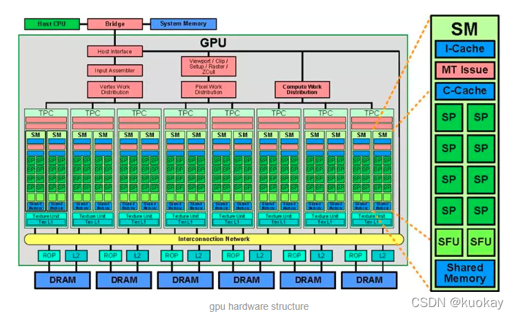
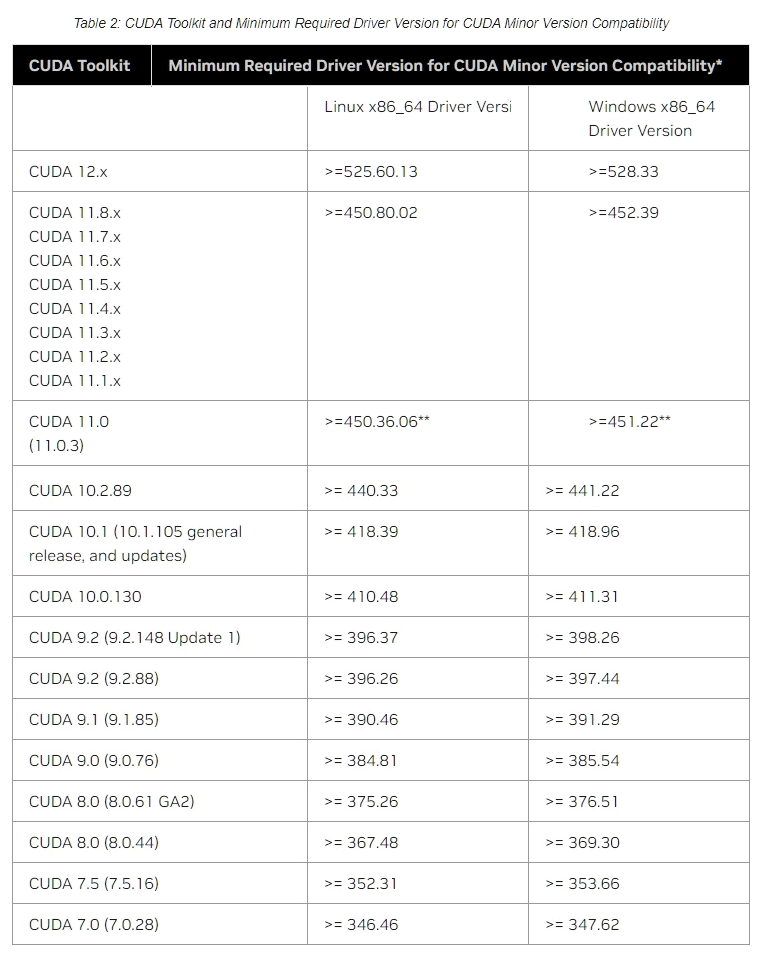
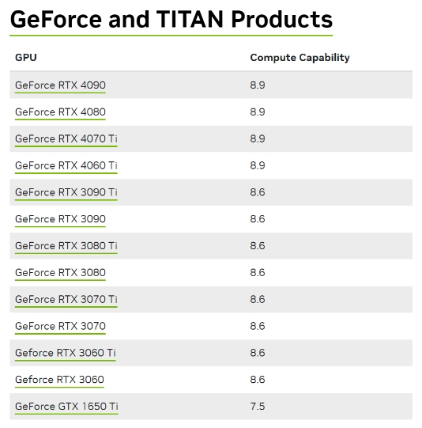
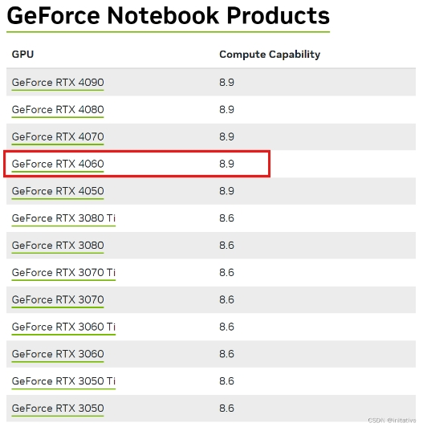

# nVidia CUDA架构（二）-- 安装与使用

## 1. 概述

CUDA (Compute Unified Device Architecture) 是一种由 NVIDIA 推出的通用并行计算架构，该架构使 GPU 能够对复杂的计算问题做性能速度优化。

NVIDIA 于 2006 年 11 月在 G80 系列中引入的 Tesla 统一图形和计算架构扩展了 GPU，使其超越了图形领域。通过扩展处理器和存储器分区的数量，其强大的多线程处理器阵列已经成为高效的统一计算平台，同时适用于图形和通用并行计算应用程序。从 G80 系列开始 NVIDIA 加入了对 CUDA 的支持。

具有 Tesla 架构的 GPU 是具有芯片共享存储器的一组 SIMT（单指令多线程）多处理器。它以一个可伸缩的多线程流处理器（Streaming Multiprocessors，SMs）阵列为中心实现了 MIMD（多指令多数据）的异步并行机制，其中每个多处理器包含多个标量处理器（Scalar Processor，SP），为了管理运行各种不同程序的数百个线程，SIMT 架构的多处理器会将各线程映射到一个标量处理器核心，各标量线程使用自己的指令地址和寄存器状态独立执行。

!

## 2. 版本选择

由于我们需在 python 环境下使用 CUDA，所以 `CUDA Toolkit` 、`cuDNN` 和 `python` 的版本之间是有对应关系的。

如果还要考虑 `TensorFlow` 的 GPU 版本和 python 版本的对应关系，请参阅：[tensorflow官网文档](https://tensorflow.google.cn/install/source_windows?hl=zh-cn#gpu)

### 2.1 CUDA Toolkit

CUDA Toolkit 下载地址（推荐，除了最新版以外的历史版本）：

[https://developer.nvidia.com/cuda-toolkit-archive](https://developer.nvidia.com/cuda-toolkit-archive)

CUDA Toolkit 最新版下载地址（只有最新版）：

[https://developer.nvidia.com/cuda-downloads](https://developer.nvidia.com/cuda-downloads)

**CUDA Toolkit 的版本是跟显卡型号有关？还是驱动有关？**

一般是驱动版本决定了能用的 CUDA 版本的上限，比如新版的显卡驱动可以支持老的 CUDA runtime 。但是，老的显卡可能无法更新到更新版本的显卡驱动，比如 Fermi 架构的显卡最高只能装到 391.x.x 驱动，因此最多也就只能用到 CUDA 9.1 。

CUDA Toolkit 对应的最低驱动版本对照表：



请参阅：[CUDA Toolkit 和 CUDA 版本兼容性所需的最低驱动程序版本](https://docs.nvidia.com/cuda/cuda-toolkit-release-notes/index.html)

查看当前 CUDA 的版本：

在 Windows 或 Linux 下都可以使用 `nvidia-smi` 命令来查询 CUDA 的版本信息。

另外，Windows 下还可以使用 `nvcc --version` 命令查询 CUDA 版本，使用 `set cuda` 命令查询 CUDA 的环境变量。

**显卡的计算能力**

查看显卡对应的计算能力，例如：本机 RTX 4060 Laptop 的计算能力为 8.9 。





更详细的 `计算能力` 可以查阅：[Your GPU Compute Capability](https://developer.nvidia.com/cuda-gpus) 。

### 2.2 cuDNN

cuDNN 是用于深度神经网络的 GPU 加速库。它强调性能、易用性和低内存开销。NVIDIA cuDNN 以集成到更高级别的机器学习框架中，如谷歌的 Tensorflow、加州大学伯克利分校的流行 caffe 软件。简单的插入式设计可以让开发人员专注于设计和实现神经网络模型，而不是简单调整性能，同时还可以在 GPU 上实现高性能现代并行计算。

**CUDA 和 cudnn 关系？**

CUDA 可以看作是一个工作台，上面配有很多工具，如锤子、螺丝刀等。cuDNN 是基于 CUDA 的深度学习 GPU 加速库，有了它才能在 GPU 上完成深度学习的计算。它就相当于工作的工具，比如就是个扳手。但是 CUDA 这个工作台买来的时候，并没有送扳手。想要在 CUDA 上运行深度神经网络，就要安装 cuDNN，就像你想要拧个螺帽就要把扳手买回来。这样才能使 GPU 进行深度神经网络的工作，工作速度相较 CPU 快很多。

cuDNN 下载地址（推荐，除了最新版以外的历史版本）：

[https://developer.nvidia.com/rdp/cudnn-archive](https://developer.nvidia.com/rdp/cudnn-archive)

cuDNN 最新版下载地址（只有最新版）：

[https://developer.nvidia.com/cudnn-downloads](https://developer.nvidia.com/cudnn-downloads)

### 2.3 TensorRT

TensorRT 历史版本下载：

[https://developer.nvidia.com/tensorrt/download](https://developer.nvidia.com/tensorrt/download)

### 2.4 python 版本

由于跟 python 的版本也是相关的，所以一开始 `Conda` 的环境也要安装好所需要的 python 版本。

具体安装方法见下。

## 3. 在 Linux 下安装

例如，你选择的是：cudnn 为 7.6.5，CUDA 为 10.1.243，Tensorflow 为 2.2.0，python 版本为 3.10.2 。

创建一个新的 conda 虚拟环境，并且安装相应的 python 版本：

```bash
conda create --name cuda python=3.10.2
conda activate cuda
```

安装 CUDA、cuDNN 和 TensorFlow：

```bash
conda install cudatoolkit=10.1.243 cudnn=7.6.5
conda install tensorflow-gpu==2.2.0
```

## 4. 在 Windows 下安装

## 5. 编程指南

[CUDA C++ Programming Guide](https://docs.nvidia.com/cuda/cuda-c-programming-guide/index.html)

## x. 参加文章

- [一文搞懂CUDA](https://blog.csdn.net/qq_40647372/article/details/135213452)

- [关于cuda、cudnn环境配置](https://blog.csdn.net/weixin_47166887/article/details/124457997)
