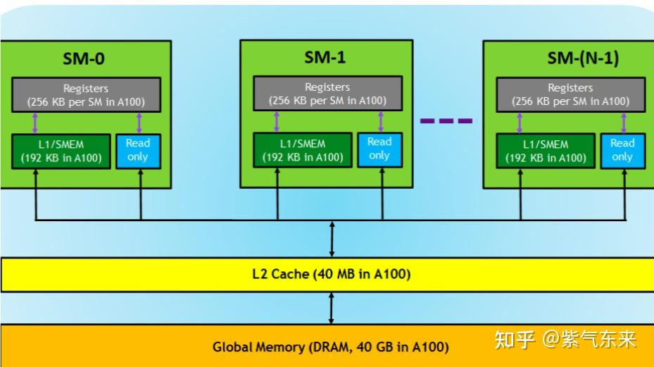
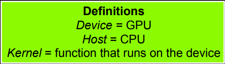

# nVidia CUDA（三）-- 编程基础

## 1. CUDA 结构

CUDA 内存模型（硬件）



## 2. CUDA 编程模型

常见的 CUDA 术语：



1. 第一个要掌握的编程要点：我们怎么写一个能在 GPU 跑的程序或函数呢？

通过关键字就可以表示某个程序在 CPU 上跑还是在 GPU 跑！如下表所示，比如我们用 `__global__` 定义一个 kernel 函数，就是 CPU 上调用，GPU 上执行，注意 `__global__` 函数的返回值必须设置为 void 。


2. 第二个编程要点：CPU 和 GPU间的数据传输怎么写？

    - cudaMalloc(): 在设备端分配 global memory
    - cudaFree(): 释放设备端分配的内存

CPU 的数据和 GPU 端数据做数据传输的函数接口是一样的，他们通过传递的函数实参（枚举类型）来表示传输方向：

```cpp
cudaMemcpy(void *dst, void *src, size_t nbytes, enum cudaMemcpyKind direction);
```

其中 `enum cudaMemcpyKind` 的定义为：

- cudaMemcpyHostToDevice（CPU 到 GPU）
- cudaMemcpyDeviceToHost（GPU 到 CPU）
- cudaMemcpyDeviceToDevice（GPU 到 GPU）

3. 第三个编程要点是：怎么用代码表示线程组织模型？

可以用 dim3 类来表示网格和线程块的组织方式，网格 grid 可以表示为一维和二维格式，线程块 block 可以表示为一维、二维和三维的格式。

```cpp
// 5000个线程块，维度是 100 * 50
dim3 DimGrid(100, 50);

// 每个线层块内包含 256 个线程，线程块内的维度是 4 * 8 * 8
dim3 DimBlock(4, 8, 8);
```

4. 第四个编程要点是：我们怎么计算线程号呢？

如果：

```cpp
dim3 dimGrid(N);
dim3 dimBlock(1);

// 那么
threadId = blockIdx.x;
```

如果：

```cpp
dim3 dimGrid(M, N);
dim3 dimBlock(1);


// 那么
threadId = blockIdx.y * blcokDim.x + blockIdx.x;
```

如果：

```cpp
dim3 dimGrid(M);
dim3 dimBlock(N);

// 那么
threadId = blcokIdx.x * blockDim.x + threadIdx.x;
```

如果：

```cpp
dim3 dimGrid(M, N);
dim3 dimBlock(P, Q);

// 那么
threadId.x = blockIdx.x * blockDim.x + threadIdx.x;
threadId.y = blockIdx.y * blockDim.y + threadIdx.y;
```

范例：

```cpp
#include <cuda.h>
#include <cuda_runtime_api.h>

#define N 256

// kernel definition
__global__ void MatAdd(float A[N][N], float B[N][N], float C[N][N])
{
    int i = blockIdx.x * blockDim.x + threadIdx.x;
    int j = blockIdx.y * blockDim.y + threadIdx.y;
    if (i < N && j < N)
        C[i][j] = A[i][j] + B[i][j];
}

int main()
{
    ...
    // kernel invocation
    dim3 threadsPerBlock(16, 16);
    dim3 numBlocks(N / threadsPerBlock.x, N / threadsPerBlock.y);
    MatAdd<<<numBlocks, threadsPerBlock>>>(A, B, C);
    ...
}
```

注：由于 warp 的大小为 32，所以 block 所含的 thread 的大小一般要设置为 32 的倍数。

## 3. 实践：PyTorch 自定义 CUDA 算子

我们基本了解了 CUDA 的计算方法，那么本节将使用 CUDA 定义一个简单的算子，并通过 PyTorch 进行调用。

### 3.1 算子构建

`add2.h` ：

```cpp
void launch_add2(float* c,
                 const float* a,
                 const float* b,
                 int n);
```

`add2.cpp` ：

```cpp
#include <cuda.h>
#include <cuda_runtime_api.h>

__global__ void MatAdd(float* c,
                       const float* a,
                       const float* b,
                       int n)
{
    int i = blockIdx.x * blockDim.x + threadIdx.x;
    int j = blockIdx.y * blockDim.y + threadIdx.y;
    int idx = j * n + i;
    if (i < n && j < n)
        c[idx] = a[idx] + b[idx];
}

void launch_add2(float* c,
                 const float* a,
                 const float* b,
                 int n) {
    dim3 block(16, 16);
    dim3 grid(n / block.x, n / block.y);

    MatAdd<<<grid, block>>>(c, a, b, n);
}
```

构建完算子后还需要搭建 Torch 和 CUDA 算子沟通的桥梁。

### 3.2 Torch C++ 封装

CUDA 的 kernel 函数 PyTorch 并不能直接调用，还需要提供一个接口，这个功能在 `add2_ops.cpp` 中实现。

`add2_ops.cpp` ：

```cpp
#include <torch/extension.h>
#include "add2.h"

void torch_launch_add2(torch::Tensor &c,
                       const torch::Tensor &a,
                       const torch::Tensor &b,
                       int64_t n) {
    launch_add2((float *)c.data_ptr(),
                (const float *)a.data_ptr(),
                (const float *)b.data_ptr(),
                n);
}

PYBIND11_MODULE(TORCH_EXTENSION_NAME, m) {
    m.def("torch_launch_add2",
          &torch_launch_add2,
          "add2 kernel warpper");
}

TORCH_LIBRARY(add2, m) {
    m.def("torch_launch_add2", torch_launch_add2);
}
```

`torch_launch_add2` 函数传入的是 C++ 版本的 torch tensor，然后转换成 C++ 指针数组，调用 CUDA 函数 launch_add2() 来执行核函数。这里用 pybind11 来对 torch_launch_add2() 函数进行封装，然后用 cmake 编译就可以产生 python 可以调用的 .so 库。

Torch 使用 CUDA 算子 主要分为三个步骤：

- 先编写 CUDA 算子和对应的调用函数。
- 然后编写 torch cpp 函数建立 PyTorch 和 CUDA 之间的联系，用 pybind11 封装。
- 最后用 PyTorch 的 cpp 扩展库进行编译和调用。

### 3.3 编译及调用方法

**JIT 编译调用**

just-in-time (JIT, 即时编译)，即 python 代码运行的时候再去编译 cpp 和 cuda 文件。

首先需要加载需要即时编译的文件，然后调用接口函数：

```python
from torch.utils.cpp_extension import load

cuda_module = load(name="add2",
                   extra_include_paths=["include"],
                   sources=["kernel/add2_ops.cpp", "kernel/add2_kernel.cu"],
                   verbose=True)

cuda_module.torch_launch_add2(cuda_c, a, b, n)
```

通过以下命令执行：

```bash
python run_time.py --compiler jit
```

得到如下结果：

```text
Using /root/.cache/torch_extensions/py310_cu117 as PyTorch extensions root...
Detected CUDA files, patching ldflags
Emitting ninja build file /root/.cache/torch_extensions/py310_cu117/add2/build.ninja...
Building extension module add2...
Allowing ninja to set a default number of workers... (overridable by setting the environment variable MAX_JOBS=N)
ninja: no work to do.
Loading extension module add2...
Running cuda...
Cuda time:  2443.504us
Running torch...
Torch time:  2450.132us
Kernel test passed.
```

**SETUP 编译调用**

第二种编译的方式是通过 Setuptools，也就是编写 setup.py 。具体为，首先调用 Torch 的 CUDAExtension 模块，将算子注册为 add2，同时 include_dirs 加上头文件目录，ext_modules 加上算子及封装函数。

具体代码如下：

```python
from setuptools import setup
from torch.utils.cpp_extension import BuildExtension, CUDAExtension

setup(
    name="add2",
    include_dirs=["include"],
    ext_modules=[
        CUDAExtension(
            "add2",
            ["kernel/add2_ops.cpp", "kernel/add2_kernel.cu"],
        )
    ],
    cmdclass={
        "build_ext": BuildExtension
    }
)
```

接下来编译执行：

```bash
python setup.py install
```

编译过程的核心是进行了以下操作：

```bash
[1/2] nvcc -c add2_kernel.cu -o add2_kernel.o
[2/2] c++ -c add2.cpp -o add2.o
x86_64-linux-gnu-g++ -shared add2.o add2_kernel.o -o add2.cpython-37m-x86_64-linux-gnu.so
```

这样就能生成动态链接库，同时将 add2 添加为 python 的模块了，可以直接 import add2 来调用。

最后调用运行即可：

`run_time.py` ：

```python
import torch
import add2

add2.torch_launch_add2(c, a, b, n)
```

通过以下命令执行：

```bash
python run_time.py --compiler setup
```

结果如下所示：

```text
Running cuda...
Cuda time:  2445.340us
Running torch...
Torch time:  2449.226us
Kernel test passed.
```

**CMAKE 编译调用**

最后就是 cmake 编译的方式了，要编写一个 CMakeLists.txt 文件，需要关注的几个点在于：依赖库的匹配、编译过程及软连接的建立。

CMakeLists.txt 文件如下：

```cmake
cmake_minimum_required(VERSION 3.1 FATAL_ERROR)
# modify to your own nvcc path, or delete it if ok
set(CMAKE_CUDA_COMPILER "/usr/local/cuda/bin/nvcc")
project(add2 LANGUAGES CXX CUDA)

find_package(Python REQUIRED)
find_package(CUDA REQUIRED)

execute_process(
    COMMAND
        ${Python_EXECUTABLE} -c
            "import torch.utils; print(torch.utils.cmake_prefix_path)"
    OUTPUT_STRIP_TRAILING_WHITESPACE
    OUTPUT_VARIABLE DCMAKE_PREFIX_PATH)

set(CMAKE_PREFIX_PATH "${DCMAKE_PREFIX_PATH}")

find_package(Torch REQUIRED)
find_library(TORCH_PYTHON_LIBRARY torch_python PATHS "${TORCH_INSTALL_PREFIX}/lib")

# modify to your own python path, or delete it if ok
include_directories(/usr/include/python3.7)
include_directories(../include)

set(SRCS ../kernel/add2_ops.cpp ../kernel/add2_kernel.cu)
add_library(add2 SHARED ${SRCS})

target_link_libraries(add2 "${TORCH_LIBRARIES}" "${TORCH_PYTHON_LIBRARY}")
```

使用如下命令进行编译：

```bash
mkdir build
cd build
cmake ..
make
```

make 过程的日志如下，可以看到编译过程及动态链接的建立：

```text
[ 33%] Building CXX object CMakeFiles/add2.dir/kernel/add2_ops.cpp.o
[ 66%] Building CUDA object CMakeFiles/add2.dir/kernel/add2_kernel.cu.o
[100%] Linking CXX shared library libadd2.so
[100%] Built target add2
```

需要注意的是，cpp 端用的是 TORCH_LIBRARY 进行封装：

```cpp
TORCH_LIBRARY(add2, m) {
    m.def("torch_launch_add2", torch_launch_add2);
}
```

最后会在 build 目录下生成一个 libadd2.so ，通过如下方式在 python 端调用：

```python
import torch

torch.ops.load_library("build/libadd2.so")
torch.ops.add2.torch_launch_add2(c, a, b, n)
```

通过以下命令执行：

```python
python run_time.py --compiler cmake
```

运行结果如下：

```text
Running cuda...
Cuda time:  2454.185us
Running torch...
Torch time:  2445.102us
Kernel test passed.
```

## 4. 参考文章

- [CUDA（一）：CUDA 编程基础](https://zhuanlan.zhihu.com/p/645330027)

- [一文搞懂 CUDA](https://blog.csdn.net/qq_40647372/article/details/135213452)
