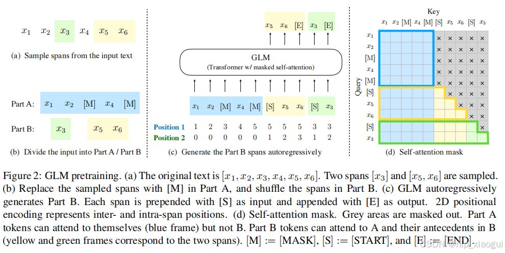

# ChatGLM 模型原理及特点

## 1. 简介

`ChatGLM` 是清华大学数据挖掘实验室（THUDM）研发的一个开源的、支持中英双语对话的语言模型，基于 `General Language Model` (GLM)架构。采用了和 `ChatGPT` 相似的技术，针对中文问答和对话进行了优化。

因此在了解对应算法之前需要对 `GLM` 架构进行相应的了解。

`GLM` 是一个基于自回归的空白填充目标的通用预训练框架。将 NLU 任务转化为包含任务描述的完形填空问题，可以通过自回归生成的方式来进行回答。所谓自回归空白填充是指在输入文本中随机挖去一些连续的文本片段，然后在模型训练的时候按照任意顺序来重构这些片段。

`ChatGLM` 和 `ChatGPT` 一样，是 `decoder-only` 类型的 `transformer`。

## 2. 自回归空白填充

`GLM` 通过优化一个自回归空白填充目标来进行模型的训练，给定一个输入文本 $x=[x_1, ..., x_n]$，从中采样多个文本片段 $\{s_1,...,s_m\}$，其中每个片段 $S_i$ 对应于 $x$ 中的一系列连续的词 $[si, 1, ..., si, li]$ 。每个片段都用一个单独的 [MASK] 符号替换，形成一个损坏的文本 $x_{corrupt}$ 。

模型以自回归的方式从损坏的文本中预测缺失的词，这意味着在预测一个片段中的缺失词时，模型可以访问损坏的文本和之前预测的片段。为了充分捕捉不同片段之间的相互依赖关系，我们随机打乱片段的顺序，类似于排列语言模型。

按照从左到右的顺序生成每个空白中的词。

在实现自回归空白填充目标时，采用的是如下的方法：

输入 $x$ 被分为两部分：Part A 是损坏的文本 $x_{corrupt}$ ，Part B 是被遮盖的片段。Part A 中的词可以相互看到，但不能看到 Part B 中的任何词。Part B 可以看到 Part A 和 Part B 中的前置词，但不能看到 Part B 中的后续词。为了实现自回归生成，每个输入的片段的开头都用特殊的符号 [START] 填充，每个输出的片段的末尾都用特殊的符号 [END] 进行填充。这样，模型就自动地在一个统一的模型中学习了一个双向编码器（用于 Part A）和一个单向的解码器（用于 Part B）。

`GLM` 的执行过程如下图所示：

- 原始文本 $x=[x_1, x_2, x_3, x_4, x_5, x_6]$ 随机进行连续 mask，这里假设 mask 掉 $[x_3]$ 和 $[x_5,x_6]$，跨度的长度服从泊松分布（$\lambda = 3$）。

- 将 $[x_3]$ 和 $[x_5, x_6]$ 替换为 [M] 标志，并打乱 Part B 的顺序。为了捕捉跨度之间的内在联系，随机交换跨度的顺序。

- GLM 自回归地生成 Part B。每个片段在输入前面加上 [S]，在输出后面加上 [E]。二维位置编码表示不同片段之间和片段内部的位置关系。

- 自注意力编码，灰色区域被掩盖。Part A 的词语可以自我看到（蓝色框），但不能看到 Part B。Part B 的词语可以看到 Part A 和 Part B 中前面的词语（黄色和绿色框对应两个片段）。

- 其中 [M] := [MASK]，[S] := [START]，[E] := [END]

### 2.1 位置编码

`Position1` 和 `Position2` 是输入的二维编码，第一个维度表示片段在原始文本中的相对位置，第二个维度表示片段内部的相对位置。具体而言，每个令牌都用两个位置 id 进行编码。第一个位置 id 表示在损坏的文本中的位置 $x_{corrupt}$ ，对于被替换的片段，它是相应 [MASK] 令牌的位置。第二个位置 id 表示片段内部的位置。对于 Part A 中的令牌，它们的第二个位置 id 为 0；对于 Part B 中的令牌，它们的第二个位置 id 在 1 到片段长度之间。这两个位置 id 通过可学习的嵌入表投影为两个向量（类似于位置编码），然后与输入令牌嵌入相加。

## x. ChatGLM2

**与 ChatGLM 相比的变化**

1. **词表的大小**：从 ChatGLM 的 150528 缩小为 65024（一个直观的体验是 ChatGLM2 及以后的版本加载速度比 ChatGLM 快不少）

2. **位置编码**：位置编码从每个 GLMBlock 一份提升为全局一份。并且使用了 `RoPE` 替换 `二维位置编码`。这也是 GLM 中提出的亮点设计之一。但是目前大部分主流的 LLMs 都在使用 `RoPE`，所以大势所趋。当前版本仍然采用了最初的 `RoPE` 设计，事实上现在的 `RoPE` 经过了xPOS → 线性内插 →  NTK-Aware Scaled RoPE → … 若干次进化。

3. **Multi-Query Attention**：这是一种共享机制的 Attention，是 Multi-Head Attention(MHA) 一种变体，相比 Multi-Head Attention，其 Query 部分没有区别，Key 和 Value 可以只用一个 Head。计算时，对 Key 和 Value 进行 expand 或者 repeat 操作，使它们填充到与 Query 一样的维度，后续计算就与 Multi-Head Attention 没区别。

4. **Attention Mask**: V1 的 attention mask 分了 2 部分，Part A 和 Part B，Part A 部分是双向 Attention（代码中的prefix_attention_mask），Part B 部分是 Causal Attention (原代码文件中的 get_masks 函数)。在 V2 版本，全部换成了 Causal Attention，不再区分是 Part A 还是 Part B，完全变成了 `decoder-only` 的架构。

5. **多目标任务**：Chat 版本主要还是用的 gMask 生成式任务，但是在 V1 版本的代码还能看到 mask、gMask 等字样，V2 已经摒弃了这些特殊 token，原因与 Attention Mask 一致，均因为变成了`decoder-only` 的架构，不再需要区分 Part A 和 Part B。

6. **Self Attention 之后的前馈网络不同**：ChatGLM 用 GELU（Gaussian Error Linear Unit）做激活；ChatGLM2、3 用 Swish-1 做激活。而且 ChatGLM2、3 应该是修正了之前的一个 bug，因为 GLU（Gated Linear Unit）本质上一半的入参是用来做门控制的，不需要输出到下层，所以 ChatGLM2、3 看起来前后维度不一致 (27392 -> 13696) 反而是正确的。

**主要创新**

1. **更强大的性能**：基于 ChatGLM 初代模型的开发经验，全面升级了 ChatGLM2-6B 的基座模型。使用了 GLM 的的混合目标函数，经过了 1.4 T中英标识符的预训练和人类偏好对其训练。评测结果表示，ChatGLM2-6B 在 MMLU（+23%）、CEval（+33%）、GSM8K（+571%）、BBH（+60%）等数据集上的性能取得了大幅度的提升，在同尺寸开原模型中具有较强的竞争力。

2. **更长的上下文**：基于 FlashAttention 技术，将基座模型的上下文长度由 ChatGLM-6B 的 2K 扩展到了 32K，并在对话阶段使用 8K 的上下文长度训练。对于更长的上下文，发布了 ChatGLM2-6B-32K模型。测评结果中表明，在等量级的开原模型中，[ChatGLM2-6B-32K](https://huggingface.co/THUDM/chatglm2-6b-32k) 有着较为明显的竞争优势。

3. **更有效的推理**：基于 Multi-Quert Attention 技术，ChatGLM2-6B 有更高效的推理速度和耕地的显存占用：在官方的模型实现下，推理速度相比初代提升了 42%，INT4 量化下，6G 显存支持的对话长度由1K提升到了 8K。

4. **更开放的协议**：ChatGLM2-6B 权重对学术研究完全开放，在填写问卷进行登记后亦运行免费商业使用。

## x. ChatGLM3

ChatGLM3 在模型架构上与 ChatGLM2 完全一致，但在其他方面还是进行了对应的改进：

1. **更大的基础模型**：ChatGLM3-6B 的基础模型 ChatGLM3-6B-Base 采用了更多样的训练数据、更充分的训练步数和更合理的训练那策略。在语义、数学、推理、代码、只是等不同角度的数据集上测评显示，ChatGLM3-6B-Base 具有在 10B 以下的基础模型中最强的性能。

2. **更完整的功能支持**：ChatGLM3-6B 采用了个全新设计的 Prompt 格式，除正常的多轮对话外。同时原生支持工具调用（Function Call）、代码执行（Code Interpreter）和 Agent 任务等复杂场景。

3. **更全面的开源序列**：除了对话模型 ChatGLM3-6B 外，还开源了基础模型 ChatGLM3-6B-Base、长文本对话模型 ChatGLM3-6B-32K。以上所有权重对学术研究完全开放，在填写问卷进行登记后亦允许免费商业使用。

## x. ChatGLM4

`GLM-4-9B`是 `GLM-4` 系列中最新一代的开源版本预训练模型，在语义、数学、推理、代码和知识等多方面的数据测评中，`GLM-4-9B` 及其人类偏好对齐的版本 `GLM-4-9B-Chat` 均表现出超越 `Llama-3-8B` 的卓越性能。除了能进行多轮对话，`GLM-4-9B-Chat` 还具备网页浏览、代码执行、自定义工具调用（Function Call）和长文本推理（支持最大长度 128K 上下文）等高级功能。同时还增加了多语言支持，支持包括日语、汉语、德语在内的 26 种语言。同时还推出了支持 1M 上下文长度（约200万中文字符）的 `GLM-4-9B-Chat-1M` 模型和基于 `GLM-4-9B` 的多模态模型 `GLM-4V-9B`。`GLM-4V-9B` 具有 1120*1120 高分辨率下的中英双语多轮对话能力，在中英文综合能力、感知推理、文字识别、图表理解等多方面多模态评测中，`GLM-4V-9B` 表现出超越 `GPT-4-turbo-2024-04-09`、`Gemini 1.0 Pro`、`Qwen-VL-Max` 和 `Claude3 Opus` 的卓越性能。

## x. 特点

与其他千亿规模的语言模型相比，ChatGLM 有以下几个特点：

- 开源：`ChatGLM-6B` 模型完全开源，用户可以自由下载和使用，并且可以在单张 2080Ti 上进行推理使用。

- 中文优化：`ChatGLM` 针对中文进行了优化，在中文问答和对话方面表现优异，并且支持中英双语切换。

- 快速推理： 首个实现 INT4 量化的千亿模型，`GLM-130B` 支持用一台 4 卡 3090 或 8 卡 2080Ti 服务器进行快速且基本无损推理。`ChatGLM-6B` 甚至可以部署在消费级显卡上。

综上所述，`ChatGLM` 是一个具有创新性和实用性的对话语言模型，为中英双语场景提供了一个高效和智能的解决方案。它不仅展示了人工智能语言模型在问答和对话领域的最新进展，也为下游开发者和应用者提供了一个便捷和灵活的平台。`ChatGLM` 的开源和内测将促进人工智能在各个领域的应用和创新。

## x. 参考文章

- [ChatGLM系列模型](https://blog.csdn.net/GuiBin1/article/details/140825385)

- [万字长文带你了解ChatGLM系列](https://zhuanlan.zhihu.com/p/696394009)

- [深入解析 ChatGLM 模型：核心原理、优势与未来应用前景](https://blog.csdn.net/weixin_43114209/article/details/142691956)

- [ChatGLM：一个开源的中英双语大语言模型](https://baijiahao.baidu.com/s?id=1766613772816043788)
