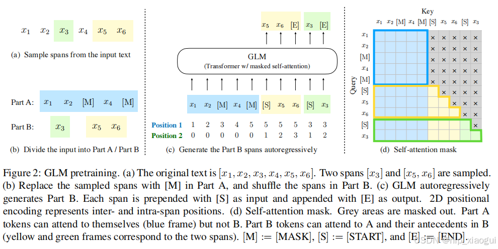

# ChatGLM 模型原理及特点

## 1. 简介

`ChatGLM` 是清华大学研发的一个开源的、支持中英双语对话的语言模型，基于 `General Language Model` (GLM)架构。采用了和 `ChatGPT` 相似的技术，针对中文问答和对话进行了优化。

因此在了解对应算法之前需要对 `GLM` 架构进行相应的了解。

`GLM` 是一个基于自回归的空白填充目标的通用预训练框架。将 NLU 任务转化为包含任务描述的完形填空问题，可以通过自回归生成的方式来进行回答。所谓自回归空白填充是指在输入文本中随机挖去一些连续的文本片段，然后在模型训练的时候按照任意顺序来重构这些片段。

`ChatGLM` 和 `ChatGPT` 一样，是 `decoder-only` 类型的 `transformer`。

## 2. 自回归空白填充

`GLM` 通过优化一个自回归空白填充目标来进行模型的训练，给定一个输入文本 $x=[x_1, ..., x_n]$，从中采样多个文本片段 $\{s_1,...,s_m\}$，其中每个片段 $S_i$ 对应于 $x$ 中的一系列连续的词 $[si, 1, ..., si, li]$ 。每个片段都用一个单独的 [MASK] 符号替换，形成一个损坏的文本 $x_{corrupt}$ 。

模型以自回归的方式从损坏的文本中预测缺失的词，这意味着在预测一个片段中的缺失词时，模型可以访问损坏的文本和之前预测的片段。为了充分捕捉不同片段之间的相互依赖关系，我们随机打乱片段的顺序，类似于排列语言模型。

按照从左到右的顺序生成每个空白中的词。

在实现自回归空白填充目标时，采用的是如下的方法：

输入 $x$ 被分为两部分：Part A 是损坏的文本 $x_{corrupt}$ ，Part B 是被遮盖的片段。Part A 中的词可以相互看到，但不能看到 Part B 中的任何词。Part B 可以看到 Part A 和 Part B 中的前置词，但不能看到 Part B 中的后续词。为了实现自回归生成，每个输入的片段的开头都用特殊的符号 [START] 填充，每个输出的片段的末尾都用特殊的符号 [END] 进行填充。这样，模型就自动地在一个统一的模型中学习了一个双向编码器（用于 Part A）和一个单向的解码器（用于 Part B）。

`GLM` 的执行过程如下图所示：

- 原始文本 $x=[x_1, x_2, x_3, x_4, x_5, x_6]$ 随机进行连续 mask，这里假设 mask 掉 $[x_3]$ 和 $[x_5,x_6]$，跨度的长度服从泊松分布（$\lambda = 3$）。

- 将 $[x_3]$ 和 $[x_5, x_6]$ 替换为 [M] 标志，并打乱 Part B 的顺序。为了捕捉跨度之间的内在联系，随机交换跨度的顺序。

- GLM 自回归地生成 Part B。每个片段在输入前面加上 [S]，在输出后面加上 [E]。二维位置编码表示不同片段之间和片段内部的位置关系。

- 自注意力编码，灰色区域被掩盖。Part A 的词语可以自我看到（蓝色框），但不能看到 Part B。Part B 的词语可以看到 Part A 和 Part B 中前面的词语（黄色和绿色框对应两个片段）。

- 其中 [M] := [MASK]，[S] := [START]，[E] := [END]

### 2.1 位置编码

`Position1` 和 `Position2` 是输入的二维编码，第一个维度表示片段在原始文本中的相对位置，第二个维度表示片段内部的相对位置。具体而言，每个令牌都用两个位置 id 进行编码。第一个位置 id 表示在损坏的文本中的位置 $x_{corrupt}$ ，对于被替换的片段，它是相应 [MASK] 令牌的位置。第二个位置 id 表示片段内部的位置。对于 Part A 中的令牌，它们的第二个位置 id 为 0；对于 Part B 中的令牌，它们的第二个位置 id 在 1 到片段长度之间。这两个位置 id 通过可学习的嵌入表投影为两个向量（类似于位置编码），然后与输入令牌嵌入相加。

## x. 参考文章

- [ChatGLM系列模型](https://blog.csdn.net/GuiBin1/article/details/140825385)

- [深入解析 ChatGLM 模型：核心原理、优势与未来应用前景](https://blog.csdn.net/weixin_43114209/article/details/142691956)
