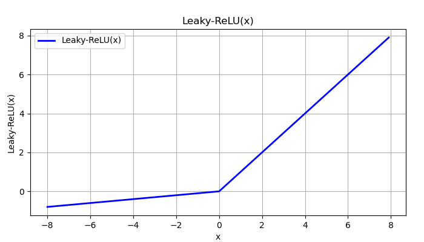

# 前馈神经网络 之 激活函数

## 1. 激活函数

前馈神经网络 (FFN, 或称 MLP)中，常用的激活函数有：

- Sigmoid
- Tanh
- ReLU
- Leaky-ReLU
- GELU
- Swish

### 1.1 Sigmoid

Sigmoid 函数，又称 logistic 函数，是最早使用的激活函数之一。由于其固有存在的一些缺点，如今很少将其作为激活函数，但依然常用于二分类问题中的概率划分。

公式：

$$Sigmoid(x) = \frac{1}{1 + e^{-x}}$$

Sigmoid 的函数图像：


我们可以看到，取值范围是：(0, 1) 。

```python
import torch
from matplotlib import pyplot as plt
# %matplotlib inline

x = torch.arange(-6.0, 6.0, 0.1, requires_grad=True)
sigmoid = torch.nn.Sigmoid()
y = sigmoid(x)

plt.figure(figsize=(16, 2.0))
plt.title('sigmoid(x)')
plt.xlabel('x')
plt.ylabel('sigmoid(x)')
plt.ylim(-0.3, 1.3)
plt.xticks([-6,-5,-4,-3,-2,-1,0,1,2,3,4,5,6])
plt.yticks([0,0.25,0.5,0.75,1.0])
plt.grid()
plt.plot(x.detach(), y.detach(), color='blue', label='sigmoid(x)', linewidth=1)
plt.show()
```

### 1.2 Tanh

如果想把取值范围更改为 (-1, 1)，可以使用算式 2 * Sigmoid - 1 获得，我们可以称这个新函数为 newfun，但一般我们如果需要 (-1, 1) 的取值范围，可以使用 tanh 函数，因为它的梯度消失的问题相比 newfun 更好。


注：图中绿色曲线是相应函数的梯度。

公式：

$$Tanh(x) = \frac{e^x - e^{-x}}{e^x + e^{-x}} = 1 - \frac{2}{1 + e^{2x}} = \frac{1 - e^{-2x}}{1 + e^{-2x}}$$

函数图像：


```python
import torch
import numpy as np
import copy
import matplotlib.pyplot as plt
# %matplotlib inline

def tanh_simple(x):
    xx = copy.deepcopy(x)
    xx = xx.detach().numpy()
    exp_neg_2x = np.exp(-2 * xx)
    result = (1 - exp_neg_2x) / (1 + exp_neg_2x)
    return torch.tensor(result)

def tanh_fast(x):
    exp_2x = np.exp(2 * x)
    return (1 - 2 / (1 + exp_2x))

def tanh_fast2(x):
    exp_neg_2x = np.exp(-2 * x)
    return (2 / (1 + exp_neg_2x) - 1)

x1 = torch.arange(-4.0, 4.0, 0.1, requires_grad=True)
x2 = np.linspace(-4, 4, 800)
tanh = torch.nn.Tanh()
y1 = tanh(x1)
y2 = tanh_fast(x2)

# 解决中文乱码问题
# plt.rcParams['font.family'] = 'SimHei'
plt.figure(figsize=(14, 4.2))
plt.title('tanh(x)')
plt.xlabel('x')
plt.ylabel('tanh(x)')
plt.ylim(-1.3, 1.3)
plt.xticks([-6,-5,-4,-3,-2,-1,0,1,2,3,4,5,6])
plt.yticks([-1.0,-0.5,0,0.5,1.0])
plt.grid()
plt.plot(x1.detach(), y1.detach(), color='blue', label='tanh(x)', linewidth=2)
# plt.plot(x2, y2, color='blue', label='tanh(x)', linewidth=2)
plt.legend(['tanh(x)'], loc='upper left')
plt.show()
```

### 1.3 ReLU

公式：

$$ReLU(x) = Max(0, x)$$

函数图像：


### 1.4 Leaky-ReLU

公式：

$$Leaky.ReLU(x) = \begin{aligned}\begin{cases} & \alpha \cdot x, \\ & x, \end{cases}\end{aligned} \quad \begin{aligned} & (x <= 0) \\ & (x > 0) \end{aligned}$$

函数图像：



## x. 参考文章

- [机器学习-sigmoid函数和relu函数-个人解读](https://blog.csdn.net/weixin_43327597/article/details/131645906)

- [深度学习之激活函数——Sigmoid](https://blog.csdn.net/m0_61787307/article/details/138857353)

- [Tanh函数的 优缺点有哪些 tanh函数和tan](https://blog.51cto.com/u_16213657/10357711)

- []()

- []()