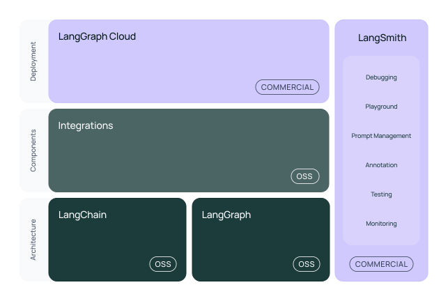
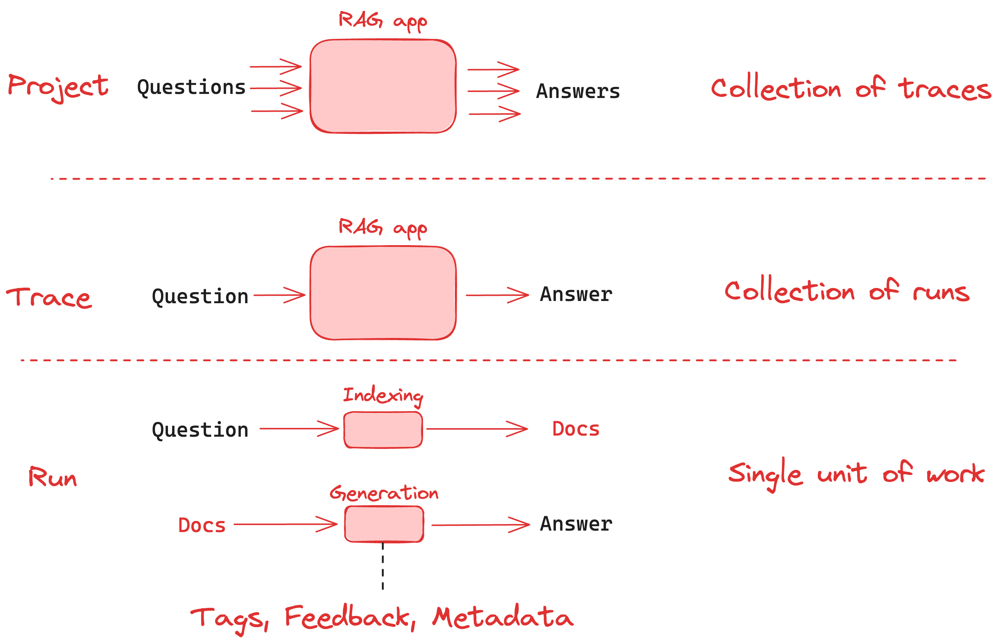

# OpenAI LangChain

## 1. 简介

LangChain 是一个用于开发由大型语言模型（LLMs）驱动的应用程序的框架。

LangChain 简化了 LLM 应用程序生命周期的每个阶段：

- **开发**：使用 LangChain 的开源构建块、组件和第三方集成来构建您的应用程序。使用 LangGraph 构建具有一流的流式传输和人工参与支持的有状态代理。
- **生产化**：使用 LangSmith 检查、监控和评估您的 Chain，以便您可以放心地持续优化和部署。
- **部署**：使用 LangGraph Cloud 将您的 LangGraph 应用程序转换为生产就绪的 API 和助手。



具体来说，该框架由以下开源库组成：

- `**langchain-core**`：基础抽象和 LangChain 表达式语言。
- `**langchain-community**`：第三方集成。
  - 合作伙伴包（例如 `**langchain-openai**`、`**langchain-anthropic**` 等）：一些集成已被进一步拆分为仅依赖于 `**langchain-core**`的轻量级包。
- `**langchain**`：构成应用程序认知架构的 Chain、Agent 和检索策略。
- **LangGraph**：通过将步骤建模为图中的边和节点，使用 LLM 构建健壮且有状态的多参与者应用程序。与 LangChain 平滑集成，但也可以不使用它。
- **LangServe**：将 LangChain 链部署为 REST API。
- **LangSmith**：一个开发者平台，让您可以调试、测试、评估和监控 LLM 应用程序。

注意

本文档侧重于 Python LangChain 库。前往这里查看 [JavaScript LangChain](https://js.langchain.com/) 库的文档。

### 教程

如果您想要构建特定的东西或者更喜欢动手学习，请查看我们的教程部分。

这些是最佳的入门教程：

- [构建一个简单的 LLM 应用程序](https://python.langchain.com/docs/tutorials/llm_chain/)
- [构建一个聊天机器人 (ChatBot)](https://python.langchain.com/docs/tutorials/chatbot/)
- [构建一个 AI 代理 (AI Agent)](https://python.langchain.com/docs/tutorials/agents/)
- [LangGraph 的简介](https://langchain-ai.github.io/langgraph/tutorials/introduction/)

在这里查看 LangChain 完整教程列表，并查看其他 [LangGraph 教程](https://langchain-ai.github.io/langgraph/tutorials/)。要了解更多关于 LangGraph 的信息，请查看我们第一个 LangChain 的学院课程：《LangGraph 的简介》，可以在[这里](https://academy.langchain.com/courses/intro-to-langgraph)找到。

### 操作指南

在这里，您会找到“我该如何……？”这类问题的简短答案。这些操作指南不会深入覆盖主题——您会在教程和 API 参考中找到材料。然而，这些指南将帮助您快速完成常见任务。

在这里查看 [LangGraph 特定的操作指南](https://langchain-ai.github.io/langgraph/how-tos/)。

### 概念指南

您需要了解的 LangChain 所有关键部分的介绍！在这里，您将找到所有 LangChain 概念的高级解释。

要深入了解 LangGraph 概念，请查看此页面。

### API 参考

前往参考部分获取 LangChain Python 包中所有类和方法的完整文档。

### 生态系统

#### 🦜🛠️ LangSmith

追踪和评估您的语言模型应用程序和智能代理，帮助您从原型过渡到生产。

[LangSmith 文档](https://docs.smith.langchain.com/)

#### 🦜🕸️ LangGraph

使用 LLMs 构建有状态的多参与者应用程序。与 LangChain 平滑集成，但也可以不使用它。

[LangGraph 文档](https://langchain-ai.github.io/langgraph/)

### Log your first trace

python 版本：

```python
import openai
from langsmith.wrappers import wrap_openai
from langsmith import traceable

# Auto-trace LLM calls in-context
client = wrap_openai(openai.Client())

@traceable # Auto-trace this function
def pipeline(user_input: str):
    result = client.chat.completions.create(
        messages=[{"role": "user", "content": user_input}],
        model="gpt-3.5-turbo"
    )
    return result.choices[0].message.content

pipeline("Hello, world!")
# Out:  Hello there! How can I assist you today?
```

### Run your first evaluation

python 版本：

```python
from langsmith import Client, evaluate
client = Client()

# Define dataset: these are your test cases
dataset_name = "Sample Dataset"
dataset = client.create_dataset(dataset_name, description="A sample dataset in LangSmith.")
client.create_examples(
  inputs=[
      {"postfix": "to LangSmith"},
      {"postfix": "to Evaluations in LangSmith"},
  ],
  outputs=[
      {"output": "Welcome to LangSmith"},
      {"output": "Welcome to Evaluations in LangSmith"},
  ],
  dataset_id=dataset.id,
)

# Define your evaluator
def exact_match(run, example):
  return {"score": run.outputs["output"] == example.outputs["output"]}

experiment_results = evaluate(
  lambda input: "Welcome " + input['postfix'], # Your AI system goes here
  data=dataset_name, # The data to predict and grade over
  evaluators=[exact_match], # The evaluators to score the results
  experiment_prefix="sample-experiment", # The name of the experiment
  metadata={
    "version": "1.0.0",
    "revision_id": "beta"
  },
)
```

## 2. LangSmith

### 概念

这篇概念指南涵盖了在将追踪记录到 LangSmith 时您需要了解的主题。跟踪本质上是应用程序从输入到输出的一系列步骤。每个单独的步骤都由一个 Run 表示。一个项目仅仅是一组追踪记录。下图在简单 RAG 应用程序的上下文中展示了这些概念，该应用程序从索引中检索文档并生成答案。



### Runs

一个 Run 是一个时间段，代表您的 LLM 应用程序中单个工作单位或操作。这可以是从对 LLM 或 Chain 的单个调用，到提示格式化调用，再到可运行的 lambda 调用。如果你熟悉 [OpenTelemetry](https://opentelemetry.io/)，你可以把 Run 看作一个 Span 。

要了解有关 Run 如何在应用程序中存储的更多信息，请参阅本 [参考指南](https://docs.smith.langchain.com/reference/data_formats/run_data_format) 。

### Traces

一个 Trace 是一系列相关的 Run，它们与单个操作有关。例如，如果您有一个用户请求触发了链，而这个链又调用了 LLM，然后调用了输出解析器，等等，所有这些运行都将属于同一个 Trace 。如果您熟悉 [OpenTelemetry](https://opentelemetry.io/)，您可以认为 LangSmith 的 Trace 是一系列 span 的集合，Runs 通过唯一的 Trace ID 绑定到 Trace 上。

### Projects

Project 是 Trace 的集合。您可以将 Project 视为与单个应用程序或服务相关的所有 Trace 的容器。您可以有多个 Project，每个 Project 都可以有多条 Trace 。

### 范例

python 版本：

```python
from langsmith import evaluate, Client
from langsmith.schemas import Example, Run

# 1. Create and/or select your dataset
client = Client()
dataset = client.clone_public_dataset("https://smith.langchain.com/public/a63525f9-bdf2-4512-83e3-077dc9417f96/d")

# 2. Define an evaluator
# For more info on defining evaluators, see: https://docs.smith.langchain.com/evaluation/how_to_guides/evaluation/evaluate_llm_application#use-custom-evaluators
def is_concise_enough(root_run: Run, example: Example) -> dict:
  score = len(root_run.outputs["output"]) < 3 * len(example.outputs["answer"])
  return {"key": "is_concise", "score": int(score)}

# 3. Run an evaluation
evaluate(
  lambda x: x + "is a good question. I don't know the answer.",
  data=dataset.name,
  evaluators=[is_concise_enough],
  experiment_prefix="my first experiment "
)
```

## 3. 参考文章

- [LangChain Introduction](https://python.langchain.com/docs/introduction/)

- [Get started with LangSmith](https://docs.smith.langchain.com/)

- [LangChain: LangSmith Concepts](https://docs.smith.langchain.com/observability/concepts)

- [LangChain: LangGraph](https://langchain-ai.github.io/langgraph/)
