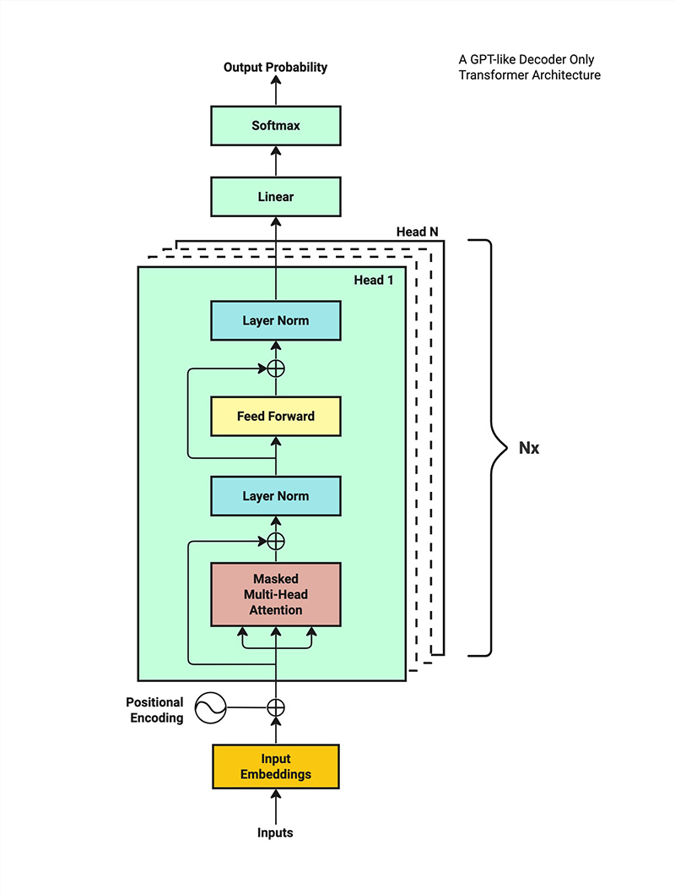
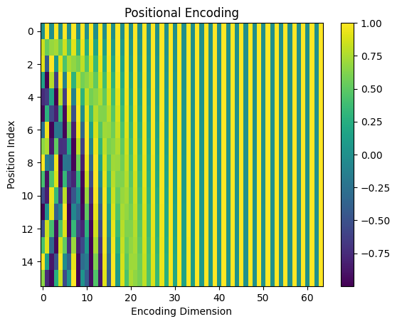
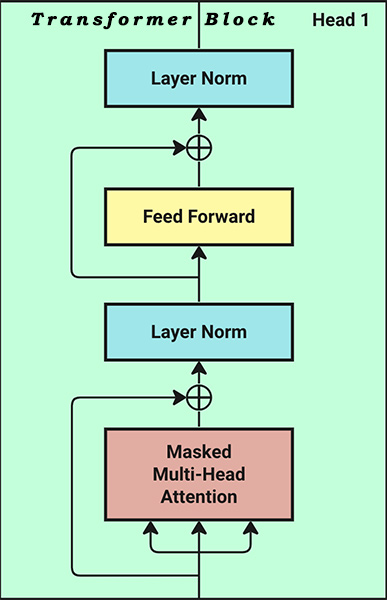
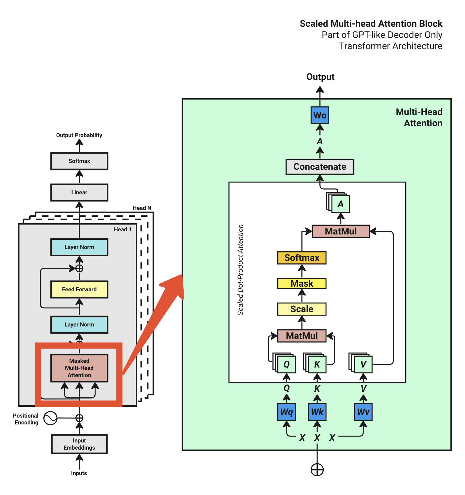
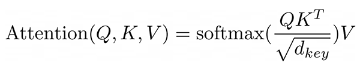

# Transformer 架构基本原理

## 1. 概述

`Transformer` 模型 2017 年出自于 Google Brain 研究小组 Ashish Vaswani 等人发布的论文《Attention is all you need》中，是一种在自然语言处理（NLP）及其他序列到序列（Seq2Seq）任务中广泛使用的深度学习模型框架。

以下是小组各成员的贡献，名单顺序随机。Jakob 建议以 self-attention 取代 RNN，并开始努力评估这一想法。Ashish 与 Illia 一起设计并实现了第一个 Transformer 模型，并在这项工作中的各个方面起着至关重要的作用。Noam 提出了 scaled dot-product attention, multi-head attention 和参数无关的位置表示，并成为涉及几乎每个细节的另一个人。Niki 在我们原始的代码库和 tensor2tensor 中设计、实现、调优和评估了无数模型变体。Llion 还尝试了新的模型变体，负责我们的初始代码库以及高效的推理和可视化。Lukasz 和 Aidan 花了无数漫长的时间来设计和实现 tensor2tensor 的各个部分，以取代我们之前的代码库，从而大大改善了结果并极大地加速了我们的研究。

`Transformer` 架构最初旨在用于训练语言翻译模型，然而，2018 年 OpenAI 团队发现，`Transformer` 架构是字符预测的关键解决方案。一旦对整个互联网数据进行了训练，该模型就有可能理解任何文本的上下文，并连贯地完成任何句子，就像人类一样。

## 2. 模型结构

`Transformer` 模型由两部分组成：编码器 (Encoder) 和解码器 (Decoder)。一般来说，仅编码器 (encoder-only) 架构擅长从文本中提取信息，用于分类和回归等任务，而仅解码器 (decoder-only) 模型专门用于生成文本。例如，专注于文本生成的 ChatGPT 属于仅解码器 (decoder-only) 模型的范畴。

让我们在训练模型时浏览一下架构的关键思想。

下图是类似 ChatGPT 的纯解码器 (decoder-only) 转换器架构的训练过程：



- 首先，我们需要一系列输入的字符作为训练数据，这些输入被转换为 vector embedding 格式。
- 接下来，将位置编码添加到 vector embedding 中，以捕捉序列中每个字符的位置。
- 随后，该模型通过一系列计算操作处理这些输入嵌入，最终为给定的输入文本生成可能的下一个字符的概率分布。
- 模型将预测结果与训练数据集中的实际后续字符进行对比，相应地调整概率或“权重”。
- 最后，模型通过迭代优化这一过程，不断更新其参数，以提高未来预测的准确性。

## 3. Step 1: Tokenization

Tokenization (令牌化) 是 Transformer 模型的第一步：

**它将输入的句子转换成数字表示的格式**。

Tokenization 是将文本分割成更小的单元，称为 tokens（令牌），这些可以是单词、次单词、短语或字符。因为将短语分解成更小的部分有助于模型识别文本的底层结构，并更有效地处理它。

例如：

```text
Chapter 1: Building Rapport and Capturing
```

上面的句子可能会被切割为如下的 token ：

```text
Chapter, , 1, :, , Building, , Rap, port, , and, , Capturing
```

这些 token 会被转换为相应的数字：

```text
[26072, 220, 16, 25, 17283, 23097, 403, 220, 323, 220, 17013, 220, 1711]
```

> 如您所见，数字 220 表示空格。有很多方法可以将字符标记为整数，对于示例的数据集，我们将使用 tiktoken 库。

为了演示，我将使用一个包含 460k 个字符的小型教科书数据集 sales-textbook.txt（来自 [Hugging Face](https://huggingface.co/datasets/goendalf666/sales-textbook_for_convincing_and_selling) ）进行训练。

我们的训练数据中包含 3771 个不同字符的词汇量 (Vocab size)，用于标记我们的数据集的最大数字是 100069 (max_token_value)，它映射到一个单词 Clar 。

一旦有了标记化映射，我们就可以为数据集中的每个字符找到相应的整数索引。将使用这些分配的整数索引作为前进的 token，而不是在与模型交互时使用整个单词。

## 4. Step 2: Word Embeddings

首先，让我们构建一个包含词汇表中所有字符的查找表。本质上，这个表由一个充满随机初始化数字的矩阵组成。

我们最大令牌数 (max_token_value) 为 100069 ，考虑到维度为 64（原始论文使用 512 个维度，表示为 d_model），得到的查找表变成了一个 100069 × 64 的矩阵，这被称为 Token Embedding Look-up Table (令牌嵌入查找表)。

陈述如下：

```text
Token Embedding Look-Up Table:
               0         1         2         3         4  ...        59        60        61        62        63
0       0.625765  0.025510  0.954514  0.064349 -0.502401  ...  -0.403228 -0.274928  1.473840  0.068826  1.332708
1      -0.497006  0.465756 -0.257259 -1.067259  0.835319  ...  -1.464924 -0.557690 -0.693927 -0.325247  1.243933
2       1.347121  1.690980 -0.124446 -1.682366  1.134614  ...   1.219090  0.097527 -0.978587 -0.432050 -1.493750
3       1.078523 -0.614952 -0.458853  0.567482  0.095883  ...   1.080655 -2.215207  0.203201 -1.115814 -1.258691
4       0.814849 -0.064297  1.423653  0.261726 -0.133177  ...   1.313207 -0.334949  0.149743  1.306531 -0.046524
...          ...       ...       ...       ...       ...  ...        ...       ...       ...       ...       ...
100064 -0.898191 -1.906910 -0.906910  1.838532  2.121814  ...   1.228242  0.368963  1.058280  0.406413 -0.326223
100065  1.354992 -1.203096 -2.184551 -1.745679 -0.005853  ...  -0.487176 -0.421959  0.490739 -1.056457  2.636806
100066 -0.436116  0.450023 -1.381522  0.625508  0.415576  ...  -0.797004  0.144952 -0.279772  1.522029 -0.629672
100067  0.147102  0.578953 -0.668165 -0.011443  0.236621  ...  -1.744829  0.637790 -1.064455  1.290440 -1.110520
100068  0.415268 -0.345575  0.441546 -0.579085  1.110969  ...  -0.404213 -0.012741  1.333426  0.372255  0.722526

[100,069 rows x 64 columns]
```

其中每一行表示一个字符（由其标记号索引），每一列表示一个维度。

目前，您可以将“维度”视为角色的特征或方面。在我们的例子中，我们指定了64个维度，这意味着我们将能够以64种不同的方式理解一个字符的文本含义，例如将其归类为名词、动词、形容词等。

假设，现在我们有一个 context_length 为 16 的训练输入示例，即：

```text
" . By mastering the art of identifying underlying motivations and desires, we equip ourselves with "
```

现在，我们通过使用每个 tokenized character (or word) 的整数索引查找嵌入表 (embedding table) 来检索其嵌入向量 (input embeddings)。因此，我们得到了它们各自的 input embeddings ：

```text
[ 627, 1383, 88861, 279, 1989, 315, 25607, 16940, 65931, 323, 32097, 11, 584, 26458, 13520, 449]
```

在 transformer 架构中，多个输入序列同时并行处理，通常称为批处理。让我们将 batch_size 设置为 4 。因此，我们将同时处理四个随机选择的句子作为我们的输入。

```text
Input Sequence Batch:
       0     1      2      3     4      5      6      7      8      9     10     11     12     13     14     15

0    627  1383  88861    279  1989    315  25607  16940  65931    323  32097     11    584  26458  13520    449
1  15749   311   9615   3619   872   6444      6   3966     11  10742     11    323  32097     13   3296  22815
2  13189   315   1701   5557   304   6763    374  88861   7528  10758   7526     13   4314   7526   2997   2613
3    323  6376   2867  26470  1603  16661    264  49148    627     18     13  81745  48023  75311   7246  66044

[4 rows x 16 columns]
```

每一行代表一个句子，每列是该句子第 0 到第 15 位的字符。

结果，我们现在有一个表示 4 个批次 16 个字符输入的矩阵。这个 tokens 矩阵的形状是 **(batch_size，context_length) = [4, 16]** 。

简而言之，我们之前将 input embedding 查找表定义为大小为 100069 × 64 的矩阵。下一步是将我们的输入序列矩阵映射到这个 embedding matrix (嵌入矩阵) 上，以获得我们的 input embedding 。

input embedding 矩阵的形状是 **(batch_size, context_length, d_model) = [4, 16, 64]** 。

## 5. Step 3: Positional Encoding

位置编码是 transformer 架构中最具挑战性的概念，这里我们仅介绍原始的位置编码。

总结一下位置编码解决了什么问题：

- 希望每个 token 都包含一些关于它在句子中位置的信息。
- 希望该模型将彼此靠近的单词视为“接近”，将距离较远的单词视为“遥远”。
- 希望 Positional Encoding 能够表示模型可以学习的模式。

Positional Encoding 描述了实体在序列中的位置，以便为每个位置分配一个唯一的表示。

Positional Encoding 是添加到每个 token 的 input embedding 中的另一个数字向量。位置编码是正弦波和余弦波，其频率根据标记字符的位置而变化。

在原始论文中，介绍的计算位置编码的方法是：

```text
PE(pos, 2i)   = sin(pos / 10000^(2i/d_model))
PE(pos, 2i+1) = cos(pos / 10000^(2i/d_model))
```

其中 pos 是位置，i 是从 0 到 dmodel / 2 。dmodel 是我们在训练模型时定义的模型维度（在我们的例子中是 64，在原始论文中他们使用 512）。

事实上，这个 Positional Encoding 矩阵是一个常量。

让我们来看看 Positional Encoding 矩阵：

```text
Position Embedding Look-Up Table:
          0         1         2         3         4   ...        59        60        61        62        63
0   0.000000  1.000000  0.000000  1.000000  0.000000  ...  1.000000  0.000000  1.000000  0.000000  1.000000
1   0.841471  0.540302  0.681561  0.731761  0.533168  ...  1.000000  0.000178  1.000000  0.000133  1.000000
2   0.909297 -0.416147  0.997480  0.070948  0.902131  ...  1.000000  0.000356  1.000000  0.000267  1.000000
3   0.141120 -0.989992  0.778273 -0.627927  0.993253  ...  1.000000  0.000533  1.000000  0.000400  1.000000
4  -0.756802 -0.653644  0.141539 -0.989933  0.778472  ...  1.000000  0.000711  1.000000  0.000533  1.000000
5  -0.958924  0.283662 -0.571127 -0.820862  0.323935  ...  0.999999  0.000889  1.000000  0.000667  1.000000
6  -0.279415  0.960170 -0.977396 -0.211416 -0.230368  ...  0.999999  0.001067  0.999999  0.000800  1.000000
7   0.656987  0.753902 -0.859313  0.511449 -0.713721  ...  0.999999  0.001245  0.999999  0.000933  1.000000
8   0.989358 -0.145500 -0.280228  0.959933 -0.977262  ...  0.999998  0.001423  0.999999  0.001067  0.999999
9   0.412118 -0.911130  0.449194  0.893434 -0.939824  ...  0.999998  0.001600  0.999999  0.001200  0.999999
10 -0.544021 -0.839072  0.937633  0.347628 -0.612937  ...  0.999997  0.001778  0.999998  0.001334  0.999999
11 -0.999990  0.004426  0.923052 -0.384674 -0.097276  ...  0.999997  0.001956  0.999998  0.001467  0.999999
12 -0.536573  0.843854  0.413275 -0.910606  0.448343  ...  0.999996  0.002134  0.999998  0.001600  0.999999
13  0.420167  0.907447 -0.318216 -0.948018  0.855881  ...  0.999995  0.002312  0.999997  0.001734  0.999998
14  0.990607  0.136737 -0.878990 -0.476839  0.999823  ...  0.999995  0.002490  0.999997  0.001867  0.999998
15  0.650288 -0.759688 -0.968206  0.250154  0.835838  ...  0.999994  0.002667  0.999996  0.002000  0.999998

[16 rows x 64 columns]
```

我们将 position embedding 的数字可视化，可以得到下图：



> 每条垂直线是我们从 0 到 64 的维度；每一行代表一个字符。这些值在 -1 和 1 之间，因为它们来自正弦和余弦函数。较暗的颜色表示值更接近 -1，较亮的颜色更接近 1 ，绿色表示介于两者之间的值。

我们将 position embedding 跟 inupt embedding 简单的相加，就获得了 Final Input Embedding 矩阵。该矩阵的形状是：**(batch_size, context_length, d_model) = [4, 16, 64]** 。

注：现在大多数开源的 LLMs 基本上采用的是 `RoPE` (旋转位置编码，Rotary Positional Encoding) 。

## 6. Step 4: Transformer Block



Transformer Block 是一个如下三层组成的 stack：

一个 **masked multi-head attention** 、两个 **normalization layers** (归一化层) 和一个 **feed-forward network** (前馈网络)。

**masked multi-head attention** 是一组 **self-attentions**，每一个都被称为一个 head 。那么，让我们先看看自关注机制。

## 6.1 Multi-Head Attention



为了进行注意力计算，Q, K, V的计算公式：



## 6.2 Prepare Q,K,V

## 6.3 Calculate Q,K Attention

## 6.4 Scale

## 6.5 Mask

## 6.5 Softmax

## 6.6 Calculate V Attention

## x. 参考文章

- [LLM: From Zero to Hero: Transformer Architecture](https://waylandzhang.github.io/en/transformer-architecture.html)

- [《Attention is all you need》论文及译文](https://xueqiu.com/3993902801/284722170)
