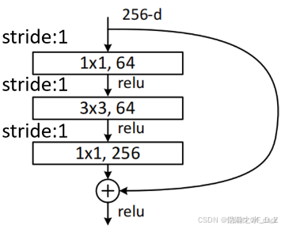

# ResNet 网络详解

## 1. 什么是 ResNet ？

ResNet 网络是在 2015 年由微软实验室中的 何凯明 等几位大神提出，论文地址是[《Deep Residual Learning for Image Recognition》](https://arxiv.org/pdf/1512.03385.pdf)；是在 CVPR 2016 发表的一种影响深远的网络模型，由 何凯明 大神团队提出来，在 ImageNet 的分类比赛上将网络深度直接提高到了152层，前一年夺冠的 VGG 只有19层。斩获当年 ImageNet 竞赛中分类任务第一名，目标检测第一名。获得 COCO 数据集中目标检测第一名，图像分割第一名，可以说 ResNet 的出现对深度神经网络来说具有重大的历史意义。

## 2. ResNet 解决什么问题？

ResNet 利用跨层连接 (shortcut connection)，将输入信号直接添加到残差块的输出上，解决了深度网络中模型退化的问题 (degradation problem)。即更深的网络会伴随梯度消失/爆炸问题，从而阻碍网络的收敛。这种设计使得网络在反向传播时能够更容易地传递梯度，从而解决了深层网络训练中的梯度消失问题。

## 3. 解决办法

- 为了解决梯度消失或梯度爆炸问题，ResNet 论文提出通过数据的预处理以及在网络中使用 BN（Batch Normalization）层来解决。

- 为了解决深层网络中的退化问题，可以人为地让神经网络某些层跳过下一层神经元的连接，隔层相连，弱化每层之间的强联系。这种神经网络被称为残差网络 (ResNets)。ResNet 论文提出了 residual 结构（残差结构）来减轻退化问题，下图是使用 residual 结构的卷积网络，可以看到随着网络的不断加深，效果并没有变差，而是变的更好了。

（虚线是 train error，实线是 test error）


## 4. ResNet 网络结构

### 4.1 基本结构

在 ResNet 中，令 H(x) = F(x) + x ，如下图：


残差模块：一条线路不变（恒等映射 x）；另一条线路负责拟合相对于原始网络的残差 F(x)，去纠正原始网络的偏差，而不是让整体网络去拟合全部的底层映射，这样网络只需要纠正偏差。

### 4.2 两种 Block

ResNet block 有两种，一种左侧两层的 BasicBlock 结构，一种是右侧三层的 BottleNeck 结构，如下图：


`BottleNeck` 结构的优点是：既保持了模型精度又减少了网络参数和计算量，节省了计算时间。

注意：一般，浅层网络用 BasicBlock 结构；深层网络，采用三层的 BottleNeck 残差结构。

### 4.3 实线残差结构

 &nbsp; 

### 4.4 虚线残差结构

 &nbsp; 

区别：

- 实线残差结构的输入、输出特征矩阵维度是一样的，故可以直接进行相加。

- 虚线残差结构（conv3_x、conv4_x、conv5_x 第一层）将图像的高、宽和深度都改变了。

### 4.5 网络框架结构比较


ResNet 主要有五种主要形式：Res18，Res34，Res50，Res101，Res152；

PyTorch 官方 ResNet 源码：[https://github.com/pytorch/vision/blob/master/torchvision/models/resnet.py](https://github.com/pytorch/vision/blob/master/torchvision/models/resnet.py)

## 5. ResNet-layer 模型完整代码


注：本文的 `data_set` 目录跟上图不一样，以下代码中，`./data_set` 目录被移至 `~/.datasets/flower-photos` 目录（'~' 表示当前用户目录）中。

model.py

```python
#
# From: https://blog.csdn.net/weixin_44001371/article/details/134192776
#
import torch
import torch.nn as nn

__all__ = ['ResNet', 'resnet18', 'resnet34', 'resnet50', 'resnet101',
           'resnet152', 'resnext50_32x4d', 'resnext101_32x8d',
           'wide_resnet50_2', 'wide_resnet101_2']

model_urls = {
    'resnet18': 'https://download.pytorch.org/models/resnet18-f37072fd.pth',
    'resnet34': 'https://download.pytorch.org/models/resnet34-b627a593.pth',
    'resnet50': 'https://download.pytorch.org/models/resnet50-0676ba61.pth',
    'resnet101': 'https://download.pytorch.org/models/resnet101-63fe2227.pth',
    'resnet152': 'https://download.pytorch.org/models/resnet152-394f9c45.pth',
    'resnext50_32x4d': 'https://download.pytorch.org/models/resnext50_32x4d-7cdf4587.pth',
    'resnext101_32x8d': 'https://download.pytorch.org/models/resnext101_32x8d-8ba56ff5.pth',
    'wide_resnet50_2': 'https://download.pytorch.org/models/wide_resnet50_2-95faca4d.pth',
    'wide_resnet101_2': 'https://download.pytorch.org/models/wide_resnet101_2-32ee1156.pth',
}

class BasicBlock(nn.Module):
    """搭建BasicBlock模块"""
    expansion = 1

    def __init__(self, in_channel, out_channel, stride=1, downsample=None):
        super(BasicBlock, self).__init__()

        # 使用BN层是不需要使用bias的，bias最后会抵消掉
        self.conv1 = nn.Conv2d(in_channel, out_channel, kernel_size=3, padding=1, stride=stride, bias=False)
        self.bn1 = nn.BatchNorm2d(out_channel)    # BN层, BN层放在conv层和relu层中间使用
        self.conv2 = nn.Conv2d(out_channel, out_channel, kernel_size=3, padding=1, bias=False)
        self.bn2 = nn.BatchNorm2d(out_channel)

        self.downsample = downsample
        self.relu = nn.ReLU(inplace=True)

    # 前向传播
    def forward(self, X):
        identity = X
        Y = self.relu(self.bn1(self.conv1(X)))
        Y = self.bn2(self.conv2(Y))

        if self.downsample is not None:    # 保证原始输入X的size与主分支卷积后的输出size叠加时维度相同
            identity = self.downsample(X)

        return self.relu(Y + identity)

class BottleNeck(nn.Module):
    """搭建BottleNeck模块"""
    # BottleNeck模块最终输出out_channel是Residual模块输入in_channel的size的4倍(Residual模块输入为64)，shortcut分支in_channel
    # 为Residual的输入64，因此需要在shortcut分支上将Residual模块的in_channel扩张4倍，使之与原始输入图片X的size一致
    expansion = 4

    def __init__(self, in_channel, out_channel, stride=1, downsample=None):
        super(BottleNeck, self).__init__()
        # 默认原始输入为224，经过7x7层和3x3层之后BottleNeck的输入降至64
        self.conv1 = nn.Conv2d(in_channel, out_channel, kernel_size=1, bias=False)
        self.bn1 = nn.BatchNorm2d(out_channel)    # BN层, BN层放在conv层和relu层中间使用
        self.conv2 = nn.Conv2d(out_channel, out_channel, kernel_size=3, stride=stride, padding=1, bias=False)
        self.bn2 = nn.BatchNorm2d(out_channel)
        self.conv3 = nn.Conv2d(out_channel, out_channel * self.expansion, kernel_size=1, bias=False)
        self.bn3 = nn.BatchNorm2d(out_channel * self.expansion)  # Residual中第三层out_channel扩张到in_channel的4倍

        self.downsample = downsample
        self.relu = nn.ReLU(inplace=True)

    # 前向传播
    def forward(self, X):
        identity = X

        Y = self.relu(self.bn1(self.conv1(X)))
        Y = self.relu(self.bn2(self.conv2(Y)))
        Y = self.bn3(self.conv3(Y))

        if self.downsample is not None:    # 保证原始输入X的size与主分支卷积后的输出size叠加时维度相同
            identity = self.downsample(X)

        return self.relu(Y + identity)

class ResNet(nn.Module):
    """搭建ResNet-layer通用框架"""
    # num_classes是训练集的分类个数，include_top是在ResNet的基础上搭建更加复杂的网络时用到，此处用不到
    def __init__(self, residual, num_residuals, num_classes=1000, include_top=True):
        super(ResNet, self).__init__()

        self.out_channel = 64    # 输出通道数(即卷积核个数)，会生成与设定的输出通道数相同的卷积核个数
        self.include_top = include_top

        self.conv1 = nn.Conv2d(3, self.out_channel, kernel_size=7, stride=2, padding=3,
                               bias=False)    # 3表示输入特征图像的RGB通道数为3，即图片数据的输入通道为3
        self.bn1 = nn.BatchNorm2d(self.out_channel)
        self.relu = nn.ReLU(inplace=True)
        self.maxpool = nn.MaxPool2d(kernel_size=3, stride=2, padding=1)
        self.conv2 = self.residual_block(residual, 64, num_residuals[0])
        self.conv3 = self.residual_block(residual, 128, num_residuals[1], stride=2)
        self.conv4 = self.residual_block(residual, 256, num_residuals[2], stride=2)
        self.conv5 = self.residual_block(residual, 512, num_residuals[3], stride=2)
        if self.include_top:
            self.avgpool = nn.AdaptiveAvgPool2d((1, 1))    # output_size = (1, 1)
            self.fc = nn.Linear(512 * residual.expansion, num_classes)

        # 对conv层进行初始化操作
        for m in self.modules():
            if isinstance(m, nn.Conv2d):
                nn.init.kaiming_normal_(m.weight, mode='fan_out', nonlinearity='relu')
            elif isinstance(m, (nn.BatchNorm2d, nn.GroupNorm)):
                nn.init.constant_(m.weight, 1)
                nn.init.constant_(m.bias, 0)

    def residual_block(self, residual, channel, num_residuals, stride=1):
        downsample = None

        # 用在每个conv_x组块的第一层的shortcut分支上，此时上个conv_x输出out_channel与本conv_x所要求的输入in_channel通道数不同，
        # 所以用downsample调整进行升维，使输出out_channel调整到本conv_x后续处理所要求的维度。
        # 同时stride=2进行下采样减小尺寸size，(注：conv2时没有进行下采样，conv3-5进行下采样，size=56、28、14、7)。
        if stride != 1 or self.out_channel != channel * residual.expansion:
            downsample = nn.Sequential(
                nn.Conv2d(self.out_channel, channel * residual.expansion, kernel_size=1, stride=stride, bias=False),
                nn.BatchNorm2d(channel * residual.expansion))

        block = []    # block列表保存某个conv_x组块里for循环生成的所有层
        # 添加每一个conv_x组块里的第一层，第一层决定此组块是否需要下采样(后续层不需要)
        block.append(residual(self.out_channel, channel, downsample=downsample, stride=stride))
        self.out_channel = channel * residual.expansion    # 输出通道out_channel扩张

        for _ in range(1, num_residuals):
            block.append(residual(self.out_channel, channel))

        # 非关键字参数的特征是一个星号*加上参数名，比如*number，定义后，number可以接收任意数量的参数，并将它们储存在一个tuple中
        return nn.Sequential(*block)

    # 前向传播
    def forward(self, X):
        Y = self.relu(self.bn1(self.conv1(X)))
        Y = self.maxpool(Y)
        Y = self.conv5(self.conv4(self.conv3(self.conv2(Y))))

        if self.include_top:
            Y = self.avgpool(Y)
            Y = torch.flatten(Y, 1)
            Y = self.fc(Y)
        return Y

# 构建 ResNet-18 模型
def resnet34(num_classes=1000, include_top=True, **kwargs):
    return ResNet(BasicBlock, [2, 2, 2, 2], num_classes=num_classes, include_top=include_top, **kwargs)

# 构建 ResNet-34 模型
def resnet34(num_classes=1000, include_top=True, **kwargs):
    return ResNet(BasicBlock, [3, 4, 6, 3], num_classes=num_classes, include_top=include_top, **kwargs)

# 构建 ResNet-50 模型
def resnet50(num_classes=1000, include_top=True, **kwargs):
    return ResNet(BottleNeck, [3, 4, 6, 3], num_classes=num_classes, include_top=include_top, **kwargs)

# 构建 ResNet-101 模型
def resnet101(num_classes=1000, include_top=True, **kwargs):
    return ResNet(BottleNeck, [3, 4, 23, 3], num_classes=num_classes, include_top=include_top, **kwargs)

# 构建 ResNet-152 模型
def resnet152(num_classes=1000, include_top=True, **kwargs):
    return ResNet(BottleNeck, [3, 8, 36, 3], num_classes=num_classes, include_top=include_top, **kwargs)

# 构建 ResNeXt-50 32x4d 模型
def resnext50_32x4d(num_classes=1000, include_top=True, **kwargs):
    kwargs['groups'] = 32
    kwargs['width_per_group'] = 4
    return ResNet(BottleNeck, [3, 4, 6, 3], num_classes=num_classes, include_top=include_top, **kwargs)

# 构建 ResNeXt-101 32x8d 模型
def resnext101_32x8d(num_classes=1000, include_top=True, **kwargs):
    kwargs['groups'] = 32
    kwargs['width_per_group'] = 8
    return ResNet(BottleNeck, [3, 4, 23, 3], num_classes=num_classes, include_top=include_top, **kwargs)

# 构建 Wide ResNet-50-2 模型
def wide_resnet50_2(num_classes=1000, include_top=True, **kwargs):
    kwargs['width_per_group'] = 64 * 2
    return ResNet(BottleNeck, [3, 4, 6, 3], num_classes=num_classes, include_top=include_top, **kwargs)

# 构建 Wide ResNet-100-2 模型
def wide_resnet101_2(num_classes=1000, include_top=True, **kwargs):
    kwargs['width_per_group'] = 64 * 2
    return ResNet(BottleNeck, [3, 4, 23, 3], num_classes=num_classes, include_top=include_top, **kwargs)

# 模型网络结构可视化
net = resnet34()

"""
# 1. 使用torchsummary中的summary查看模型的输入输出形状、顺序结构，网络参数量，网络模型大小等信息
from torchsummary import summary
device = torch.device("cuda" if torch.cuda.is_available() else "cpu")
model = net.to(device)
summary(model, (3, 224, 224))    # 3是RGB通道数，即表示输入224 * 224的3通道的数据
"""

"""
# 2. 使用torchviz中的make_dot生成模型的网络结构，pdf图包括计算路径、网络各层的权重、偏移量
from torchviz import make_dot
X = torch.rand(size=(1, 3, 224, 224))    # 3是RGB通道数，即表示输入224 * 224的3通道的数据
Y = net(X)
vise = make_dot(Y, params=dict(net.named_parameters()))
vise.view()
"""

"""
# Pytorch官方ResNet模型
from torchvision.models import resnet34
"""
```

split_dataset.py

```python
"""
#
# 文件： split_dataset.py
#
# 功能： 数据集划分脚本。将原始数据集 flower_photos 划分为 train 和 test 两个数据集，并更改图片 size = 224x224。
#
#        数据集下载地址：http://download.tensorflow.org/example_images/flower_photos.tgz
#
"""

import os
import glob
import random
from PIL import Image

def filepath_filter(filepath):
    # Windows operation is 'nt' or 'windows'
    # print('os.name = ', os.name)
    # print('os.sep = ', os.sep)
    path_separator = os.sep
    # Whether is windows?
    if path_separator == '\\':
        new_filepath = filepath.replace('/', path_separator)
        return new_filepath
    else:
        return filepath

def split_dataset(root, split_rate, image_new_size):
    root = filepath_filter(root)
    root = os.path.expanduser(root)
    print('root = ', root)
    file_path = '{}/flower_photos'.format(root)    # 获取原始数据集路径
    file_path = filepath_filter(file_path)
    print('file_path = ', file_path)
    assert os.path.exists(file_path), "file {} does not exist.".format(file_path)

    # 找到文件中所有文件夹的目录，即类文件夹名
    dirs = glob.glob(os.path.join(file_path, '*'))
    dirs = [d for d in dirs if os.path.isdir(d)]

    print("Totally {} classes: {}".format(len(dirs), dirs))    # 打印花类文件夹名称

    for path in dirs:
        # 对每个类别进行单独处理
        path = path.split(os.sep)[-1]  # -1表示以分隔符/保留后面的一段字符

        # 在根目录中创建两个文件夹，train/test
        os.makedirs(filepath_filter("{}/train/{}".format(root, path)), exist_ok=True)
        os.makedirs(filepath_filter("{}/test/{}".format(root, path)), exist_ok=True)

        # 读取原始数据集中path类中对应类型的图片，并添加到files中
        files = glob.glob(os.path.join(file_path, path, '*jpg'))
        files += glob.glob(os.path.join(file_path, path, '*jpeg'))
        files += glob.glob(os.path.join(file_path, path, '*png'))

        random.shuffle(files)    # 打乱图片顺序
        split_boundary = int(len(files) * split_rate)  # 训练集和测试集的划分边界

        for i, file in enumerate(files):
            img = Image.open(file).convert('RGB')

            # 更改原始图片尺寸
            old_size = img.size  # (wight, height)
            ratio = float(image_new_size) / max(old_size)  # 通过最长的size计算原始图片缩放比率
            # 把原始图片最长的size缩放到resize_pic，短的边等比率缩放，等比例缩放不会改变图片的原始长宽比
            new_size = tuple([int(x * ratio) for x in old_size])

            # im = img.resize(new_size, Image.ANTIALIAS)  # 更改原始图片的尺寸，并设置图片高质量，保存成新图片im
            # 新版本 pillow（10.0.0之后）Image.ANTIALIAS 被移除了，取而代之的是 Image.LANCZOS or Image.Resampling.LANCZOS
            # See: https://zhuanlan.zhihu.com/p/669460623
            im = img.resize(new_size, Image.LANCZOS)
            new_im = Image.new("RGB", (image_new_size, image_new_size))  # 创建一个resize_pic尺寸的黑色背景
            # 把新图片im贴到黑色背景上，并通过'地板除//'设置居中放置
            new_im.paste(im, ((image_new_size - new_size[0]) // 2, (image_new_size - new_size[1]) // 2))

            # 先划分0.1_rate的测试集，剩下的再划分为0.9_ate的训练集，同时直接更改图片后缀为.jpg
            assert new_im.mode == "RGB"
            print('file = ', file)
            # print('dir_name = ', filepath_filter(os.path.join("{}/test/{}".format(root, path))))
            # print('file_name = ', file.split(os.sep)[-1].split('.')[0] + '.jpg')
            if i < split_boundary:
                new_im.save(os.path.join(filepath_filter("{}/test/{}".format(root, path)),
                                         file.split(os.sep)[-1].split('.')[0] + '.jpg'))
            else:
                new_im.save(os.path.join(filepath_filter("{}/train/{}".format(root, path)),
                                         file.split(os.sep)[-1].split('.')[0] + '.jpg'))

    # 统计划分好的训练集和测试集中.jpg图片的数量
    train_files = glob.glob(filepath_filter(os.path.join(root, 'train', '*', '*.jpg')))
    test_files = glob.glob(filepath_filter(os.path.join(root, 'test', '*', '*.jpg')))

    print("Totally {} files for train".format(len(train_files)))
    print("Totally {} files for test".format(len(test_files)))

if __name__ == '__main__':
    split_rate = 0.1        # 训练集和验证集划分比率
    resize_image = 224      # 图片缩放后统一大小

    split_dataset('~/.datasets/flower_photos', split_rate, resize_image)

```

train.py

```python
"""
# 训练脚本
#
"""

import os
import sys
import json
import time

import torch
import torch.nn as nn
import torch.optim as optim
import torch.utils.data as Data
from torchvision import transforms, datasets
from tqdm import tqdm

from model import resnet34

def filepath_filter(filepath):
    # Windows operation is 'nt' or 'windows'
    path_separator = os.sep
    # Whether is windows?
    if path_separator == '\\':
        new_filepath = filepath.replace('/', path_separator)
        return new_filepath
    else:
        return filepath

def train_model():
    device = torch.device("cuda:0" if torch.cuda.is_available() else "cpu")
    print("Using {} device.".format(device))

    # 数据预处理。transforms提供一系列数据预处理方法
    data_transform = {
        "train": transforms.Compose([transforms.RandomResizedCrop(224),    # 随机裁剪
                                     transforms.RandomHorizontalFlip(),    # 水平方向随机反转
                                     transforms.ToTensor(),
                                     transforms.Normalize([0.485, 0.456, 0.406], [0.229, 0.224, 0.225])]),    # 标准化
        "val": transforms.Compose([transforms.Resize(256),      # 图像缩放
                                   transforms.CenterCrop(224),  # 中心裁剪
                                   transforms.ToTensor(),
                                   transforms.Normalize([0.485, 0.456, 0.406], [0.229, 0.224, 0.225])])}

    # 获取数据集根目录(即当前代码文件夹路径)
    # data_root = os.path.abspath(os.path.join(os.getcwd(), "~/.datasets/flower_photos/"))
    date_root = '~/.datasets/flower_photos/'
    data_root = filepath_filter(date_root)
    data_root = os.path.expanduser(date_root)
    # 获取 flower 图片数据集路径
    image_path = filepath_filter(os.path.join(data_root, "flower_photos"))
    assert os.path.exists(image_path), "{} path does not exist.".format(image_path)

    # ImageFolder是一个通用的数据加载器，它要求我们以 root/class/xxx.png 格式来组织数据集的训练、验证或者测试图片。
    train_dataset = datasets.ImageFolder(root=filepath_filter(os.path.join(data_root, "train")), transform=data_transform["train"])
    train_num = len(train_dataset)
    val_dataset = datasets.ImageFolder(root=filepath_filter(os.path.join(data_root, "test")), transform=data_transform["val"])
    val_num = len(val_dataset)

    # {'daisy':0, 'dandelion':1, 'roses':2, 'sunflower':3, 'tulips':4}
    flower_list = train_dataset.class_to_idx
    class_dict = dict((val, key) for key, val in flower_list.items())    # 将字典中键值对翻转。此处翻转为 {'0':daisy,...}

    # 将class_dict编码成json格式文件
    json_str = json.dumps(class_dict, indent=4)
    with open('class_indices.json', 'w') as json_file:
        json_file.write(json_str)

    batch_size = 4    # 设置批大小。batch_size太大会报错OSError: [WinError 1455] 页面文件太小，无法完成操作。
    num_workers = min([os.cpu_count(), batch_size if batch_size > 1 else 0, 8])  # number of workers
    print("Using batch_size={} dataloader workers every process.".format(num_workers))

    # 加载训练集和测试集
    train_loader = Data.DataLoader(train_dataset, batch_size=batch_size,
                                   num_workers=num_workers, shuffle=True)
    val_loader = Data.DataLoader(val_dataset, batch_size=batch_size,
                                 num_workers=num_workers, shuffle=True)
    print("Using {} train_images for training, {} test_images for validation.".format(train_num, val_num))
    print()

    # 加载预训练权重
    # download url: https://download.pytorch.org/models/resnet34-b627a593.pth
    net = resnet34()
    model_weight_path = os.path.expanduser(filepath_filter("~/.resnet_models/resnet34-pre-b627a593.pth"))    # 预训练权重
    print('model_weight_path = ', model_weight_path)
    assert os.path.exists(model_weight_path), "file {} does not exist.".format(model_weight_path)
    # torch.load_state_dict()函数就是用于将预训练的参数权重加载到新的模型之中
    net.load_state_dict(torch.load(model_weight_path, map_location='cpu'), strict=False)

    # 改变in_channel符合fc层的要求，调整output为数据集类别5
    in_channel = net.fc.in_features
    net.fc = nn.Linear(in_channel, 5)
    net.to(device)

    # 损失函数
    loss_function = nn.CrossEntropyLoss()

    # 优化器
    params = [p for p in net.parameters() if p.requires_grad]
    optimizer = optim.Adam(params, lr=0.0001)

    epochs = 10                     # 训练迭代次数
    best_acc = 0.0
    save_path = filepath_filter('./ResNet34.pth')    # 当前模型训练好后的权重参数文件保存路径
    batch_num = len(train_loader)   # 一个batch中数据的数量
    total_time = 0                  # 统计训练过程总时间

    for epoch in range(epochs):
        # 开始迭代训练和测试
        start_time = time.perf_counter()  # 计算训练一个epoch的时间

        # train
        net.train()
        train_loss = 0.0
        # tqdm是Python进度条库，可以在Python长循环中添加一个进度条提示信息。
        train_bar = tqdm(train_loader, file=sys.stdout)

        for step, data in enumerate(train_bar):
            train_images, train_labels = data
            train_images = train_images.to(device)
            train_labels = train_labels.to(device)

            optimizer.zero_grad()           # 梯度置零。清空之前的梯度信息
            outputs = net(train_images)     # 前向传播
            loss = loss_function(outputs, train_labels)    # 计算损失
            loss.backward()     # 反向传播
            optimizer.step()    # 参数更新
            train_loss += loss.item()       # 将计算的loss累加到train_loss中

            # desc：str类型，作为进度条说明，在进度条右边
            train_bar.desc = "train epoch[{}/{}] loss:{:.3f}.".format(epoch+1, epochs, loss)

        # validate
        net.eval()
        val_acc = 0.0
        val_bar = tqdm(val_loader, file=sys.stdout)

        with torch.no_grad():
            for val_data in val_bar:
                val_images, val_labels = val_data
                val_images = val_images.to(device)
                val_labels = val_labels.to(device)

                val_y = net(val_images)    # 前向传播
                predict_y = torch.max(val_y, dim=1)[1]    # 在维度为1上找到预测Y的最大值，第0个维度是batch
                # 计算测试集精度。predict_y与val_labels进行比较(true=1, False=0)的一个batch求和，所有batch的累加精度值
                val_acc += torch.eq(predict_y, val_labels).sum().item()

                val_bar.desc = "valid epoch[{}/{}].".format(epoch+1, epochs)

        # 打印 epoch 数据结果
        val_accurate = val_acc / val_num
        print("[epoch {:.0f}] train_loss: {:.3f}  val_accuracy: {:.3f}"
              .format(epoch+1, train_loss/batch_num, val_accurate))

        epoch_time = time.perf_counter() - start_time    # 计算训练一个epoch的时间
        print("epoch_time: {}".format(epoch_time))
        total_time += epoch_time    # 统计训练过程总时间
        print()

        # 调整测试集最优精度
        if val_accurate > best_acc:
            best_acc = val_accurate
            # model.state_dict()保存学习到的参数
            torch.save(net.state_dict(), save_path)    # 保存当前最高的准确度

    # 将训练过程总时间转换为h:m:s格式打印
    m, s = divmod(total_time, 60)
    h, m = divmod(m, 60)
    print("Total_time: {:.0f}:{:.0f}:{:.0f}".format(h, m, s))

    print('Finished Training!')

if __name__ == '__main__':
    train_model()

```

## 6. 使用方法

### 6.1 数据集下载

下载地址为：[http://download.tensorflow.org/example_images/flower_photos.tgz](http://download.tensorflow.org/example_images/flower_photos.tgz)

下载完成后，解压并放置在 `~\.datasets\flower_photos` 目录下，注意：这是当前用户目录，为了避免多个项目使用同一个数据集，故把数据集放到当前用户目录下，不同项目可以共享。

解压后，你应该看到 `~\.datasets\flower_photos\flower_photos` 的目录，因为 `~\.datasets\flower_photos` 目录下面还要放 `train`, `test` 目录。

注意：`~\.datasets` 目录不存在的话，请自行创建。

### 6.2 预训练权重文件

ResNet 各种类型的预训练的文件下载列表为：

```python
model_urls = {
    'resnet18': 'https://download.pytorch.org/models/resnet18-f37072fd.pth',
    'resnet34': 'https://download.pytorch.org/models/resnet34-b627a593.pth',
    'resnet50': 'https://download.pytorch.org/models/resnet50-0676ba61.pth',
    'resnet101': 'https://download.pytorch.org/models/resnet101-63fe2227.pth',
    'resnet152': 'https://download.pytorch.org/models/resnet152-394f9c45.pth',
    'resnext50_32x4d': 'https://download.pytorch.org/models/resnext50_32x4d-7cdf4587.pth',
    'resnext101_32x8d': 'https://download.pytorch.org/models/resnext101_32x8d-8ba56ff5.pth',
    'wide_resnet50_2': 'https://download.pytorch.org/models/wide_resnet50_2-95faca4d.pth',
    'wide_resnet101_2': 'https://download.pytorch.org/models/wide_resnet101_2-32ee1156.pth',
}
```

这里选择的是 `resnet34`，下载地址是：[https://download.pytorch.org/models/resnet34-b627a593.pth](https://download.pytorch.org/models/resnet34-b627a593.pth)。

下载完成后，解压并放置在 `~\.resnet_models\` 目录下，并把文件更名为 `resnet34-pre-b627a593.pth` ，具体可以看 `train.py` 里的文件名。

注意：`~\.resnet_models` 目录不存在的话，请自行创建。

### 6.3 分割 dataset 和 重新调整图形大小

进入 ResNet-layer 项目的根目录，执行下列命令：

```bash
python ./split_dataset.py
```

执行完，会在 `~\.datasets\flower_photos` 目录下面看到 `train` 和 `test` 目录。

### 6.4 训练模型

进入 ResNet-layer 项目的根目录，执行下列命令：

```bash
python ./train.py
```

结果如下：

```bash
Using cpu device.
Using batch_size=4 dataloader workers every process.
Using 3306 train_images for training, 364 test_images for validation.

model_weight_path =  C:\Users\xxxxxxxx\.resnet_models\resnet34-pre-b627a593.pth

train epoch[1/5] loss:1.792.: 100%|████████████████████████████| 827/827 [21:44<00:00,  1.58s/it]
valid epoch[1/5].: 100%|███████████████████████████████████████| 91/91 [01:05<00:00,  1.39it/s]
[epoch 1] train_loss: 1.427  val_accuracy: 0.560
epoch_time: 1369.7485845999909

train epoch[2/5] loss:1.318.: 100%|████████████████████████████| 827/827 [21:02<00:00,  1.53s/it]
valid epoch[2/5].: 100%|███████████████████████████████████████| 91/91 [01:05<00:00,  1.38it/s]
[epoch 2] train_loss: 1.254  val_accuracy: 0.604
epoch_time: 1327.7789544000407

train epoch[3/5] loss:0.542.: 100%|████████████████████████████| 827/827 [25:06<00:00,  1.82s/it]
valid epoch[3/5].: 100%|███████████████████████████████████████| 91/91 [01:07<00:00,  1.34it/s]
[epoch 3] train_loss: 1.145  val_accuracy: 0.651
epoch_time: 1573.9696433999925

train epoch[4/5] loss:1.821.: 100%|████████████████████████████| 827/827 [21:54<00:00,  1.59s/it]
valid epoch[4/5].: 100%|███████████████████████████████████████| 91/91 [01:08<00:00,  1.34it/s]
[epoch 4] train_loss: 1.059  val_accuracy: 0.640
epoch_time: 1382.749822599988

train epoch[5/5] loss:0.503.: 100%|████████████████████████████| 827/827 [21:52<00:00,  1.59s/it]
valid epoch[5/5].: 100%|███████████████████████████████████████| 91/91 [01:07<00:00,  1.36it/s]
[epoch 5] train_loss: 0.987  val_accuracy: 0.665
epoch_time: 1379.9763674999704

Total_time: 1:57:14
Finished Training!
```

## 7. 参考文章

- [【深度学习】ResNet网络讲解](https://blog.csdn.net/weixin_44001371/article/details/134192776)

- [跟着问题学7——ResNet网络详解及代码实战](https://zhuanlan.zhihu.com/p/716390397)

- [深入浅出之Resnet网络](https://blog.csdn.net/a8039974/article/details/142202414)
