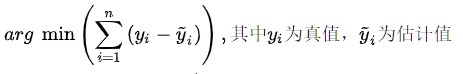
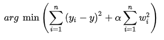
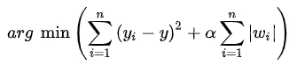

# [机器学习] 线性回归OLS、RR 和 Lasso

## 1. OLS (Ordinary Least Squares, 最小二乘法)

`OLS`（Ordinary Least Squares，最小二乘法）是线性回归中最常用的估计方法之一，用于估计线性回归模型中的参数。

原理:



`OLS` 是线性回归中最常用的估计方法之一，通过最小化观测值与回归模型的预测值之间的残差平方和，来确定最佳的参数估计。OLS方法假设残差（观测值与预测值之间的差异）服从正态分布，并且具有恒定的方差。

## 2. 岭回归 (Ridge Regression)

岭回归（Ridge Regression）是线性回归的一种扩展方法，用于解决线性回归中的 `多重共线性` 问题。

多重共线性指的是在回归分析中自变量之间存在高度相关性的情况，这会导致OLS估计的不稳定性和方差增加。岭回归通过添加一个正则化项（Ridge Penalty）来调整OLS估计的偏差-方差平衡，从而改善参数估计的稳定性。

原理:



具体来说，岭回归通过在最小化残差平方和的同时，加入一个惩罚项，该惩罚项是参数向量的 $L_2$ 范数（平方和的平方根）乘以一个调节参数 $\alpha$ 。这个惩罚项限制了参数的增长，使得参数估计在存在共线性时更稳定。

## 3. Lasso 回归

Lasso回归（Least Absolute Shrinkage and Selection Operator Regression）是一种线性回归的统计方法，用于估计具有稀疏解的线性模型。它通过添加一个正则化项来调整OLS（最小二乘法）估计的偏差-方差平衡，以实现变量选择和参数收缩。

原理:



`Lasso回归` 与 `岭回归` 类似，都是对 `OLS` 的改进方法。不同之处在于，`Lasso回归` 使用的是 $L_1$ 正则化项，而不是 `岭回归` 中的 $L_2$ 正则化项。$L_1$ 正则化项是参数向量的 $L_1$ 范数（绝对值之和），它具有一个重要的特性，即可以使得某些参数估计变为零，从而实现变量的选择和稀疏性。

## 4. OLS 代码

`波士顿房价数据集` python 源码:

```python
#
# From: https://www.jianshu.com/p/31e802802735
#

from sklearn import linear_model
import pandas as pd
import numpy as np
# `load_boston` has been removed from scikit-learn since version 1.2.
# from sklearn.datasets import load_boston
from sklearn.model_selection import train_test_split
import matplotlib.pyplot as plt

from sklearn.datasets import fetch_openml

# `load_boston` has been removed from scikit-learn since version 1.2.
'''
boston = load_boston()
datas = boston.data
target = boston.target
name_data = boston.feature_names
'''

#
# See: https://blog.csdn.net/2301_76161684/article/details/139895701
#
boston = fetch_openml(name="boston", version=1, as_frame=False)
datas = boston['data']
target = boston['target']
name_data = boston['feature_names']

'''
data_url = "http://lib.stat.cmu.edu/datasets/boston"
raw_df = pd.read_csv(data_url, sep=r'\\s{2,}', skiprows=7, nrows=14, header=None, engine='python')
name_data = np.hstack([raw_df.values[::2, :], raw_df.values[1::2, :2]])
print(name_data)

raw_df = pd.read_csv(data_url, sep=r'\\s+', skiprows=22, header=None, engine='python')
data = np.hstack([raw_df.values[::2, :], raw_df.values[1::2, :2]])
target = raw_df.values[1::2, 2]
'''

fig = plt.figure()
fig.set_size_inches(14, 9)
for i in range(13):
    ax = fig.add_subplot(4, 4, i+1)
    x = datas[:, i]
    y = target
    plt.title(name_data[i])
    ax.scatter(x, y)
plt.tight_layout()  # 自动调整子图间距
plt.show()

j_ = []
for i in range(13):
    if name_data[i] == 'RM':
        continue
    if name_data[i] =='LSTAT':
        continue
    j_.append(i)
x_data = np.delete(datas, j_, axis=1)

X_train, X_test, y_train, y_test = train_test_split(x_data, target, random_state=0, test_size=0.20)

lr = linear_model.LinearRegression()
lr.fit(X_train, y_train)
lr_y_predict = lr.predict(X_test)
score = lr.score(X_test, y_test)

print(score)
print("w0: ", lr.intercept_)
print("w1, w2: ", lr.coef_)
```

## 5. 本文链接

- [【机器学习】线性回归:OLS、RR和Lasso](https://www.jianshu.com/p/31e802802735)
