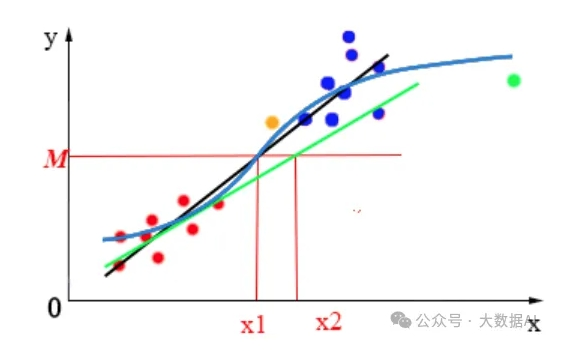
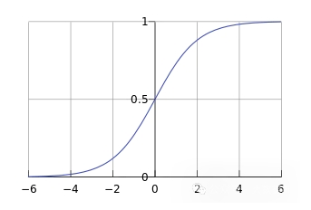

# 逻辑回归(Logistic Regression)

## 1. 简介

`逻辑回归` (Logistic Regression) 是使用 Logistic 函数（Sigmoid 函数）作为连接函数，伯努利分布（二分类问题）或多项式分布（多分类问题）作为概率分布的广义线性模型。

自变量既可以是连续的，也可以是分类的。

## 2. 原理

`逻辑回归` 是广义的线性模型，就是在 `线性回归` 基础上加上了一个非线性映射。逻辑回归既然是分类算法，为什么不叫逻辑分类，而叫逻辑回归呢？这是因为 `逻辑回归` 用回归的思路去解决分类的问题。

与 `线性回归` 不同的地方，`线性回归` 使用的是直线来拟合，而 `逻辑回归` 采用 `sigmoid函数` 与 `线性函数` 进行组合的方式来拟合。

$$g(z) = \frac{1}{1 + e^{-x}}$$

其中，$z$ 就是线性回归中的预测值，即：

$$z = f(x) = \theta_0 + \theta_1 x_1 + \theta_2 x_2 + ... + \theta_n x_n $$

所以有：

$$y = h(x) = \frac{1}{1 + e^{-(\theta_0 + \theta_1 x_1 + \theta_2 x_2 + ... + \theta_n x_n)}}$$

用矩阵方式表示：

$$y = h(x) = g(z) = g(\theta^Tx) = \frac{1}{1 + e^{-\theta^Tx}}$$

其中，$\theta = \begin{bmatrix} \theta_0 \\ \theta_1 \\ ... \\ \theta_n \end{bmatrix}$，$x = \begin{bmatrix} x_0 \\ x_1 \\ ... \\ x_n \end{bmatrix}$ ，$x_0 = 1$ 。

**线性回归的拟合图，最直观的方法就是将直线“掰弯”**：(浅蓝色曲线)



我们在线性回归的函数上再套一层 sigmoid 函数，这样就转换成了求概率 [0, 1] 的问题。

**sigmoid 函数图像**：(y 值的取值刚好在 (0, 1) 的范围内)



## 3. 损失函数

损失函数采用 `对数损失函数` (logarithmic loss function) 或 `对数似然损失函数` (loglikelihood loss function)：

$$L(Y, P(Y | X)) = -\ln{P(Y | X)}$$

由于 $h(x) \in (0, 1)$ ，这一点的性质刚好与概率 $p \in [0, 1]$ 的性质吻合（当做概率使用的理由不止这点），故而我们可以将 $h(x)$ 值当做数据被标记为 1 类的概率，即：

$$p(y = 1 | x; \theta) = h(x)$$
$$p(y = 0 | x; \theta) = 1 - h(x)$$

当给 y 定为 1 时，即属于1类时，$h(x)$ 越趋近于1，被预测为1类的概率就越大，损失（误差）就越小；反之，当给定 y 为 0 时，即属于0类时，$h(x)$ 越趋近于 1，被预测为0类的概率就越小，损失（误差）就越大，于是，我们可以定义损失函数：

$$cost(h(x), y) = \begin{cases} -\ln{h(x)}, y = 1\\ -\ln{(1 - h(x))}, y = 0 \end{cases}$$

对所有数据集中 x 损失累加然后求平均，有：

$$J(\theta) = -\frac{1}{n} \sum_{i=1}^{n} cost(h(x), y)$$

由于 y 的取值为0或1，结合上面两个公式可以得到：

$$J(\theta) = -\frac{1}{n} \sum_{i=1}^{n} (y_i\ln{(h(x_i))} + (1-y_i) \cdot  \ln{(1 - h(x_i))})$$

这就是 `逻辑回归` 的损失函数，也称为 `交叉熵损失函数`。

## 4. 求解

### 4.1 随机梯度下降

梯度下降是通过 $J(\theta)$ 对 $\theta$ 的 `一阶导数` 来找下降方向，并且以迭代的方式来更新参数，更新方式为:

$$g_i = \frac{d J(\theta)}{d \theta_i} = (p(x_i) - y_i) \cdot x_i$$

$$\theta_{i}^{k + 1} = \theta_{i}^{k} - \eta \cdot g_i $$

其中 k 为迭代次数，$\eta$ 为学习率。每次更新参数后，可以通过比较 $|J(W^{k+1}) - J(W^{k})|$ 小于阈值或者到达最大迭代次数来停止迭代。

### 4.2 牛顿法

(略...)

## 5. 代码

python 实现：

```python
from sklearn.datasets import load_iris
from sklearn.model_selection import train_test_split
from sklearn.preprocessing import StandardScaler
from sklearn.linear_model import LogisticRegression
from sklearn.metrics import classification_report, confusion_matrix

# 加载数据集
iris = load_iris()
X = iris.data
y = iris.target

# 为了演示二分类，我们只选择两个类
X = X[y != 2]
y = y[y != 2]

# 划分训练集和测试集
X_train, X_test, y_train, y_test = train_test_split(X, y, test_size=0.3, random_state=42)

# 特征缩放
scaler = StandardScaler()
X_train = scaler.fit_transform(X_train)
X_test = scaler.transform(X_test)

# 创建逻辑回归分类器实例
log_reg = LogisticRegression()

# 训练模型
log_reg.fit(X_train, y_train)

# 预测
y_pred = log_reg.predict(X_test)

# 评估模型
print(confusion_matrix(y_test, y_pred))
print(classification_report(y_test, y_pred))
```

## 6. 优缺点

**优点**：

1. 预测结果是介于 0 和 1 之间的概率；

2. 可以适用于连续性和类别性自变量；

3. 容易使用和解释。

**缺点**：

1. 对模型中自变量多重共线性较为敏感，例如两个高度相关自变量同时放入模型，可能导致较弱的一个自变量回归符号不符合预期，符号被扭转。需要利用因子分析或者变量聚类分析等手段来选择代表性的自变量，以减少候选变量之间的相关性；

2. 预测结果呈“S”型，因此从 log(odds) 向概率转化的过程是非线性的，在两端随着 log(odds) 值的变化，概率变化很小，边际值太小，slope 太小，而中间概率的变化很大，很敏感。导致很多区间的变量变化对目标概率的影响没有区分度，无法确定阀值。

## 7. 参考文章

- [广义线性模型（4）逻辑回归（Logistic regression）](https://mp.weixin.qq.com/s?__biz=MzUyODk0Njc1NQ==&mid=2247486663&idx=1&sn=41b1a5aef4696cbd844b7ae30cf68121&chksm=fbf54048cacd8fb3198ece7d5640f5952c7f5fb104f78dde9b0c629ec65e700e5209c2f41f6a&scene=27)

- [【机器学习】逻辑回归（非常详细）](https://zhuanlan.zhihu.com/p/74874291)

- [机器学习--十大算法](https://blog.csdn.net/Like_July_moon/article/details/136750962)
