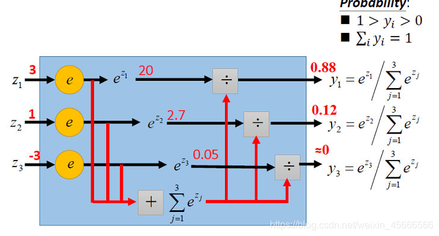

# 逻辑回归Softmax多分类模型

## 1. 概述

`Softmax 回归` (Softmax regression)，也称为多项 (Multinomial) 或多类 (Multi-Class) 的 Logistic 回归，是 Logistic 回归在多分类问题上的推广。

## 2. 模型

`Softmax 回归` 跟 `线性回归` 一样将输入特征与权重做线性叠加，与线性回归的一个主要不同在于，`Softmax 回归` 的输出值个数等于标签里的类别数。比如一共有 4 种特征和 3 种输出动物类别（狗、猫、鸡），则权重包含 12 个标量（带下标的 w）、偏差包含3个标量（带下标的 b）。

最后，再对这些输出值进行 Softmax 函数运算。

## 3. Softmax 函数



Softmax 回归的决策函数可以表示为：

$$\hat{y} = argmax(\hat{y}^{(i)})$$

## 4. 损失函数

给定 N 个训练样本 $\{(x^{(n)}, y^{(n)})\}_{(n-1)}^N$，样本一共有 C 个类别，用 C 维的 one-hot 向量 $y \in \{0, 1\}^C$ 来表示类别标签。


采用 `交叉熵损失函数`，`Softmax 回归` 模型的损失函数为：

$$L(W, b) = -\frac{1}{N} \sum_{n=1}^N \sum_{c=1}^C y_c^{(n)} \cdot \log{\hat{y_c}}^{(n)} = -\frac{1}{N} \sum_{n=1}^N (y^{(n)})^T \cdot \log{\hat{y}^{(n)}}$$

其中，$\hat{y}^{(n)} = Softmax(x^{(n)} W^T + b)$ 为样本 $x^{(n)}$ 在每个类别的后验概率。

## 5. 梯度

损失函数 $L(W)$ 关于 W 的梯度为：

$$\frac{d L(W)}{d W} = -\frac{1}{N} \sum_{n=1}^{N} x(n)(y^{(n)} - \hat{y}^{(n)})^T$$

采用梯度下降法，Softmax 回归的训练过程为：

1. 初始化 W_0 = 0；
2. 迭代更新：

$$ W_{t+1} = W_{t} + \eta \cdot (\frac{1}{N} \sum_{n=1}^{N} x(n)(y^{(n)} - \hat{y}^{(n)})^T)$$

## 6. 代码

采用 `Fashion-MNIST` 数据集，进行图像多分类问题。

```python
import torch
import torchvision
import numpy as np
import sys
# 加上d2lzh_pytorch的路径
sys.path.append('E:\d2lzh_pytorch')
import d2lzh_pytorch as d2l

# 小批量进行读取
batch_size = 256
train_iter, test_iter = d2l.load_data_fashion_mnist(batch_size)

num_inputs = 784
num_outputs = 10
# 随机初始化参数
W = torch.tensor(np.random.normal(0, 0.01, (num_inputs, num_outputs)), dtype=torch.float)
b = torch.zeros(num_outputs, dtype=torch.float)

W.requires_grad_(requires_grad=True)
b.requires_grad_(requires_grad=True)

# -----------------------------获取并读取FashionMNIST数据集函数，返回小批量train，test-----------------------------------
def load_data_fashion_mnist(batch_size):
    mnist_train = torchvision.datasets.FashionMNIST(root='路径',
                                                    train=True, download=True, transform=transforms.ToTensor())
    mnist_test = torchvision.datasets.FashionMNIST(root='路径',
                                                   train=False, download=True, transform=transforms.ToTensor())
    '''
    上面的 mnist_train,mnist_test 都是 torch.utils.data.Dataset 的子类，所以可以使用len()获取数据集的大小
    训练集和测试集中的每个类别的图像数分别是6000，1000，两个数据集分别有10个类别
    '''
    # mnist是torch.utils.data.dataset的子类，因此可以将其传入torch.utils.data.DataLoader来创建一个DataLoader实例来读取数据
    # 在实践中，数据读取一般是训练的性能瓶颈，特别是模型较简单或者计算硬件性能比较高的时候
    # DataLoader一个很有用的功能就是允许多进程来加速读取  使用num_works来设置4个进程读取数据
    if sys.platform.startswith('win'):
        num_workers = 0
    else:
        num_workers = 4
    train_iter = torch.utils.data.DataLoader(mnist_train, batch_size=batch_size, shuffle=True,
                                             num_workers=num_workers)
    test_iter = torch.utils.data.DataLoader(mnist_test, batch_size=batch_size, shuffle=False,
                                            num_workers=num_workers)
    return train_iter, test_iter

def softmax(X):
    X_exp = X.exp()
    # 行元素求和
    partition = X_exp.sum(dim=1, keepdim=True)
    # 这里应用了广播机制
    return X_exp / partition

def net(X):
    return softmax(torch.mm(X.view((-1, num_inputs)), W) + b)

def cross_entropy(y_hat, y):
    return - torch.log(y_hat.gather(1, y.view(-1, 1)))

def accuracy(y_hat, y):
    return (y_hat.argmax(dim=1) == y).float().mean().item()

# 本函数已保存在d2lzh_pytorch包中方便以后使用。
# 该函数将被逐步改进：它的完整实现将在“图像增广”一节中描述
def evaluate_accuracy(data_iter, net):
    acc_sum, n = 0.0, 0
    for X, y in data_iter:
        acc_sum += (net(X).argmax(dim=1) == y).float().sum().item()
        n += y.shape[0]
    return acc_sum / n

num_epochs, lr = 5, 0.1

# 本函数已保存在d2lzh_pytorch包中方便以后使用
def train_ch3(net, train_iter, test_iter, loss, num_epochs, batch_size,
              params=None, lr=None, optimizer=None):
    for epoch in range(num_epochs):
        train_l_sum, train_acc_sum, n = 0.0, 0.0, 0
        for X, y in train_iter:
            y_hat = net(X)
            l = loss(y_hat, y).sum()

            # 梯度清零
            if optimizer is not None:
                optimizer.zero_grad()
            elif params is not None and params[0].grad is not None:
                for param in params:
                    param.grad.data.zero_()

            l.backward()
            if optimizer is None:
                d2l.sgd(params, lr, batch_size)
            else:
                # "softmax回归的简洁实现" 一节将用到
                optimizer.step()


            train_l_sum += l.item()
            train_acc_sum += (y_hat.argmax(dim=1) == y).sum().item()
            n += y.shape[0]
        test_acc = evaluate_accuracy(test_iter, net)
        print('epoch %d, loss %.4f, train acc %.3f, test acc %.3f'
              % (epoch + 1, train_l_sum / n, train_acc_sum / n, test_acc))

train_ch3(net, train_iter, test_iter, cross_entropy, num_epochs, batch_size, [W, b], lr)

for X, y in test_iter:
    break

true_labels = d2l.get_fashion_mnist_labels(y.asnumpy())
pred_labels = d2l.get_fashion_mnist_labels(net(X).argmax(axis=1).asnumpy())
titles = [true + '\n' + pred for true, pred in zip(true_labels, pred_labels)]

d2l.show_fashion_mnist(X[0:9], titles[0:9])
```

## 7. 参考文章

- [深度学习模型系列一——多分类模型——Softmax 回归](https://blog.csdn.net/weixin_45666566/article/details/107595200)
