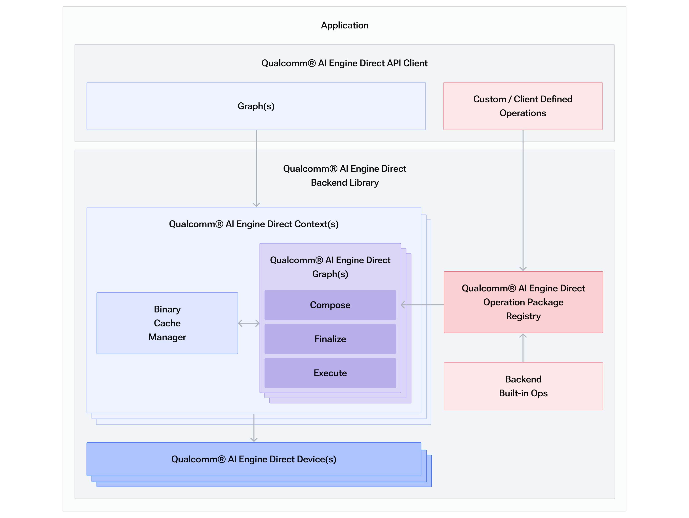
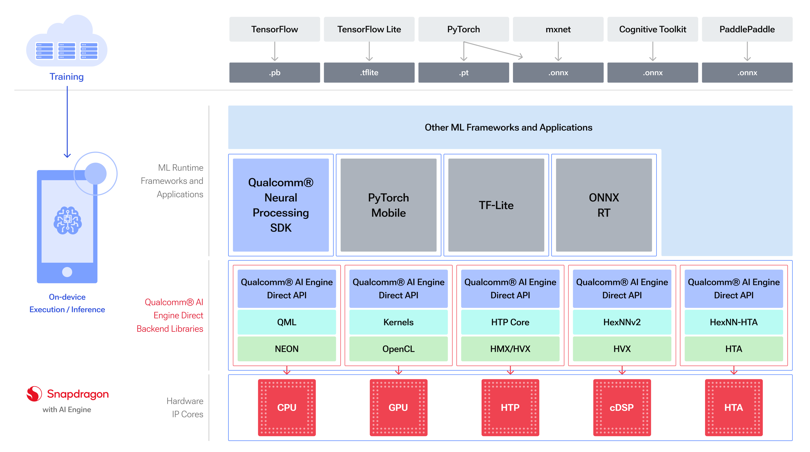
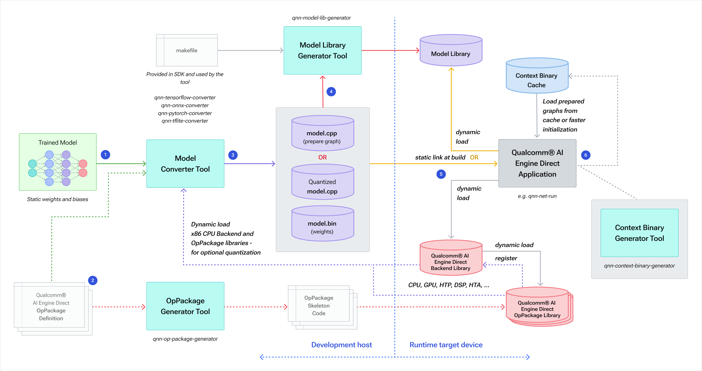
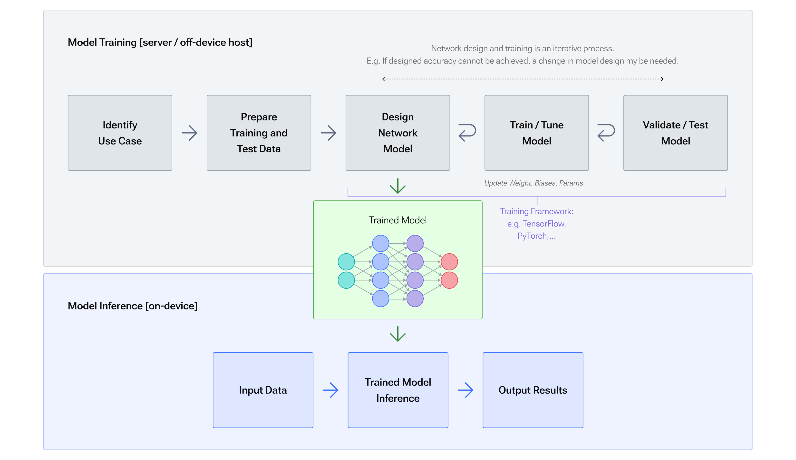

# 高通 AI Engine SDK（QNN）使用教程

## 1. 概述

### 1.1 什么是 QNN

QNN 是高通发布的神经网络推理引擎，是 SNPE 的升级版，其主要功能是：

- 完成从 Pytorch/TensorFlow/Keras/Onnx 等神经网络框架到高通计算平台的模型转换；
- 完成模型的低比特量化（int8），使其能够运行在高通神经网络芯片上；
- 提供测试工具（qnn-net-run），可以运行网络并保存输出；
- 提供测试工具（qnn-profile-viewer），可以进行 FLOPS、参数量、每一层运行时间等分析；

### 1.2 QNN 与 SNPE 的变化

- SNPE 模型使用容器（DL container）格式保存，QNN 模型使用 cpp，json 和 bin 文件保存；
- SNPE 模型在运行前无需编译，可以直接在不同平台下运行，QNN 的模型需要先编译到对应平台，才可以运行；
- SNPE 模型转化（snpe-xxx-to-dlc）和模型量化（snpe-dlc-quantize）在 QNN 中被合并到一个步骤（qnn-xxx-converter）

### 1.3 软件架构

Qualcomm® AI Engine Direct API 和相关软件堆栈提供应用程序所需的所有构造 在所需的硬件加速器核心上构建、优化和执行网络模型。

Qualcomm AI Engine 直接组件 - 高级视图



### 1.4 软件堆栈

Qualcomm®AI Engine Direct 架构旨在提供统一的 API 以及模块化和可扩展性 每个加速器库构成了全栈人工智能解决方案的可重用基础，QTI 自有框架和第三方框架。

采用 Qualcomm AI Engine Direct 的 AI 软件堆栈



Qualcomm® AI Engine Direct SDK 包含的工具可帮助客户将经过训练的深度学习网络集成到他们的 应用程序。基本集成工作流程如下图所示：

Qualcomm AI Engine直接集成工作流程



### 1.5 集成工作流程

Qualcomm® AI Engine Direct SDK 提供工具和可扩展的每个加速器库，支持统一的 API 在 QTI 芯片组上灵活集成和高效执行 ML/DL 神经网络。 Qualcomm® AI Engine Direct API 旨在支持经过训练的神经网络的推理，因此客户负责 在他们选择的训练框架中训练 ML/DL 网络。训练过程一般是 在服务器主机上、设备外完成。一旦网络经过培训，客户就可以使用 Qualcomm® AI Engine Direct 做好准备 在设备上部署并运行。

训练与推理工作流程



1. 客户通过提供经过训练的网络模型文件作为输入来调用 Qualcomm® AI Engine Direct 转换器工具。 网络必须在 Qualcomm® AI Engine Direct 转换器工具支持的框架中进行训练。 有关 Qualcomm® AI Engine Direct 转换器的更多详细信息，请参阅工具部分。

2. 当源模型包含 Qualcomm® 本身不支持的操作 AI Engine Direct 后端时， 客户端需要向转换器提供 OpPackage 定义文件，表达自定义/客户端 定义的操作。或者，他们可以使用 OpPackage 生成器工具来生成 框架代码来实现并将其自定义操作编译到 OpPackage 库中。 请参阅 qnn-op-package-generator 了解使用详情。

3. Qualcomm® AI Engine Direct 模型转换器是一款帮助客户编写 Qualcomm® 序列的工具AI引擎直接 API 调用以构建 Qualcomm® AI Engine Direct 训练网络的图形表示形式，该网络作为工具的输入提供。 转换器输出以下文件：

  - .cpp 源文件（例如 model.cpp），包含构建所需的 Qualcomm® AI Engine Direct API 调用网络图

  - .bin 二进制文件（例如 model.bin），包含作为 float32 数据的网络权重和偏差

    客户端可以选择指示转换器输出量化模型而不是默认模型，如图所示量化模型 .cpp。在这种情况下 model.bin 文件将 包含量化数据，并且 model.cpp 将引用量化张量数据类型和 包括量化编码。某些 Qualcomm® AI Engine Direct 后端库可能需要量化模型， 例如HTP 或 DSP（请参阅 general/api:后端补充 了解有关受支持的信息 数据类型）。有关转换器量化功能和选项的详细信息，请参见量化支持。

4. 客户可以选择使用 Qualcomm® AI Engine Direct 模型库生成工具来生成模型库。 请参阅 qnn-model-lib-generator 了解使用详情。

5. 客户通过动态加载模型库将 Qualcomm® AI Engine Direct 模型集成到其应用程序中 或编译并静态链接 model.cpp 和 model.bin。 为了准备和执行模型（即运行推理），客户端还需要加载所需的 Qualcomm® AI Engine Direct 后端加速器和 OpPackage 库。 Qualcomm® AI Engine Direct OpPackage 库已注册并 由后端加载。

6. 客户端可以选择保存上下文二进制缓存以及准备好的和最终确定的图表。看 上下文缓存供参考。 这样的图可以从缓存中重复加载，而不需要模型 .cpp/库  任何进一步。从缓存加载模型图比通过准备加载模型图要快得多 模型 .cpp/库中提供的一系列图形组合 API 调用。缓存的图表不能 进一步修改；它们旨在部署准备好的图表，从而实现更快的 客户端应用程序的初始化。

7. 客户可以选择使用 Qualcomm 神经处理 SDK 生成的深度学习容器 (DLC) 与提供的 libQnnModelDlc.so 库结合使用，从应用程序中的 DLC 路径生成 QNN 图形句柄。这提供了单一格式 用于跨产品使用并支持无法编译到共享模型库的大型模型。使用详情 可以在利用 DLC 中找到。

## 2. Linux 端

QNN 的 Linux 端提供这些功能：

```bash
qnn-accuracy-debugger
qnn-netron
qnn-platform-validator
qnn-tensorflow-converter
qnn-accuracy-evaluator
qnn-net-run
qnn-profile-viewer
qnn-tflite-converter
qnn-context-binary-generator
qnn-onnx-converter
qnn-pytorch-converter
qnn-throughput-net-run
qnn-model-lib-generator
qnn-op-package-generator
qnn-quantization-checker
```

模型转化、模型量化、模型分析等操作需要在 Linux 下完成。

### 2.1 环境配置

#### 2.1.1 拷贝文件

以 qnn-2.13.2.230822 为例，将 QNN 的 SDK 解压到服务器端，然后配置环境变量（仅在当前终端生效，新开终端需要再次配置）：

```bash
export QNN_SDK_ROOT=/path/to/your/qnn-2.13.2.230822
```

执行初始化操作：

```bash
source ${QNN_SDK_ROOT}/bin/envsetup.sh
```

输出：

```text
[INFO] AISW SDK environment set
[INFO] QNN_SDK_ROOT: /xxx/xxx/qnn-2.13.2.230822
```

#### 2.1.2 配置 Python 环境

新建 Conda 环境（推荐）：

```bash
conda create -n qnn python==3.12
conda activate qnn
```

自动安装依赖：

```bash
${QNN_SDK_ROOT}/bin/check-python-dependency
```

如果遇到 Permission denied，需要把 `${QNN_SDK_ROOT}/bin` 路径下的文件赋予可执行权限：

```
chomd 777 ${QNN_SDK_ROOT}/bin/*
```

#### 2.1.3 安装 Linux 依赖

执行：

```bash
bash ${QNN_SDK_ROOT}/bin/check-linux-dependency.sh
```

#### 2.1.4 测试

执行：

```bash
qnn-net-run --version
```

输出：

```bash
qnn-net-run pid:1947023
QNN SDK v2.13.2.230822171732_60416
```

配置成功。

### 2.2 模型转化

onnx 是通用的神经网络输出格式，以 onnx 模型格式的转换为例：

```bash
qnn-onnx-converter -i model.onnx -o model.cpp
```

会生成 `model.cpp`、`model.bin`、`model_net.json` 三个文件。

### 2.3 模型量化

在 QNN 中，模型量化和模型转化被合并到一个操作，如果需要进行模型量化，只需要用 `--input_list` 参数指定一批量化数据。

需要注意的是，要进行模型量化，只需要指定 `--input_list` 即可，此时就算不指定其他量化参数，也会进行量化操作（见官方文档）。

> The only required option to enable quantization along with conversion is the –input_list option, which provides the quantizer with the required input data for the given model.

```bash
qnn-onnx-converter -i model.onnx -o qnn/model_q.cpp --input_list /path/to/your/input.txt
```

其中 `input.txt` 的文件格式与 SNPE 相同。

### 2.4 量化参数

量化参数主要通过运行 qnn-onnx-converter 时指定这些参数来指定：

- quantization_overrides：指定量化的参数。
- param_quantizer：指定参数量化的方法。default: tf (即 minmax 量化)，还有 enhanced/adjusted/symmetric 可选。
- act_quantizer：指定激活函数量化的方法（同上）。
- algorithms：详见官方文档：

> “cle” - Cross layer equalization includes a number of methods for equalizing weights and biases across layers in order to rectify imbalances that cause quantization errors. “bc” - Bias correction adjusts biases to offset activation quantization errors. Typically used in conjunction with “cle” to improve quantization accuracy.

其他量化参数详见官方文档，不在此赘述。

### 2.5 模型编译

如果需要运行 QNN 的模型，需要先对模型转化中生成的 model.cpp、model.bin 进行编译，编译时使用 -t 指定编译平台（默认编译 aarch64-android 和 x86_64-linux-clang 平台）：

```bash
# for linux
qnn-model-lib-generator -c model.cpp -b model.bin -o bin -t x86_64-linux-clang
```

需要注意的是，如果需要编译安卓运行的库（aarch64-android），需要先配置 NDK 环境。

### 2.6 NDK 配置

将 NDK 文件上传到 Linux 服务器，并且解压（NDK 使用 android-ndk-r25c-linux 版本），然后执行：

```bash
export ANDROID_NDK_ROOT=/path/to/your/ndk/android-ndk-r25c
PATH=$PATH:$ANDROID_NDK_ROOT
```

NDK 配置完成后，执行：

```bash
# for android
qnn-model-lib-generator -c model.cpp -b model.bin -o bin -t "aarch64-android"
```

### 2.7 模型推理

使用 `qnn-net-run` 工具来进行模型推理，推理时需要用 `--backend` 参数指定推理后端的库，有如下参数可选：

- CPU - libQnnCpu.so
- HTP (Hexagon v68) - libQnnHtp.so
- Saver - libQnnSaver.so

以使用 HTP（模拟）为例，运行：

```bash
qnn-net-run --model bin/x86_64-linux-clang/libmodel.so --input_list /path/to/your/input.txt --backend "${QNN_SDK_ROOT}/lib/x86_64-linux-clang/libQnnHtp.so"
```

模型输出会默认保存到 `output` 文件夹。

## 3. Android 端

QNN 安卓端提供如下工具：

```bash
qnn-context-binary-generator
qnn-net-run
qnn-platform-validator
qnn-profile-viewer
qnn-throughput-net-run
```

基本只能进行模型推理和计算平台的验证。

### 3.1 环境配置

#### 3.1.1 拷贝文件

将文件 push 到安卓设备上：

```bash
adb shell mkdir -p /data/local/tmp/qnn2/arm64/lib
adb shell mkdir -p /data/local/tmp/qnn2/arm64/bin

adb push D:\Program\qnn-2.13.2.230822\lib\aarch64-android\. /data/local/tmp/qnn2/arm64/lib
adb push D:\Program\qnn-2.13.2.230822\bin\aarch64-android\. /data/local/tmp/qnn2/arm64/bin
```

#### 3.1.2 设置环境变量

每次重启终端都需要设置：

```bash
export LD_LIBRARY_PATH=$LD_LIBRARY_PATH:/data/local/tmp/qnn2/arm64/lib
export PATH=$PATH:/data/local/tmp/qnn2/arm64/bin
```

#### 3.1.3 测试

版本：

```bash
qnn-net-run --version
```

输出：

```bash
qnn-net-run pid:12495
QNN SDK v2.13.2.230822171732_60416
```

如果报错：

> /system/bin/sh: qnn-net-run: can’t execute: Permission denied

需要先赋予可执行权限：

```bash
chmod 777 /data/local/tmp/qnn2/arm64/bin/qnn-net-run
```

### 3.2 CPU/GPU 推理

首先将模型和数据 Push 到设备上，然后执行：

```bash
# cpu
qnn-net-run --model models/qnn/libmodel.so --input_list /path/to/your/input.txt --backend /data/local/tmp/qnn2/arm64/lib/libQnnCpu.so --output_dir outputs/qnn

# gpu
qnn-net-run --model models/qnn/libmodel.so --input_list /path/to/your/input.txt --backend /data/local/tmp/qnn2/arm64/lib/libQnnGpu.so --output_dir outputs/qnn
```

其中 `--backend` 参数可以指定的值如下：

- CPU - libQnnCpu.so
- GPU - libQnnGpu.so
- HTA - libQnnHta.so
- DSP (Hexagon v65) - libQnnDspV65Stub.so
- DSP (Hexagon v66) - libQnnDspV66Stub.so
- DSP - libQnnDsp.so
- HTP (Hexagon v68) - libQnnHtp.so
- [Deprecated] HTP Alternate Prepare (Hexagon v68) - libQnnHtpAltPrepStub.so
- Saver - libQnnSaver.so

如果需要使用 HTP 或者 DSP 推理，需要 Push 额外的 lib 文件。

### 3.3 DSP 推理

高通对不同芯片，支持 DSP 的库版本不同：SM7325 使用 hexagon-v68，SM8475 使用 hexagon-v69。

```bash
# v68
adb push D:\Program\qnn-2.13.2.230822\lib\hexagon-v68\unsigned\. /data/local/tmp/qnn2/dsp/lib
# v69
adb push D:\Program\qnn-2.13.2.230822\lib\hexagon-v69\unsigned\. /data/local/tmp/qnn2/dsp/lib
```

设置环境变量：

```bash
export ADSP_LIBRARY_PATH="/data/local/tmp/qnn2/dsp/lib;/system/vendor/lib/rfsa/adsp"
```

执行模型推理：

```bash
qnn-net-run --model models/qnn/libmodel.so --input_list /path/to/your/input.txt --backend /data/local/tmp/qnn2/arm64/lib/libQnnHtp.so --output_dir outputs/qnn
```

对于推理后端的支持，查看 `examples/QNN/NetRun/android/android-qnn-net-run.sh` 文件可以发现，v68、v69 和 v73 使用的是 `libQnnHtp.so`，v66 用的是 `libQnnDspV66Stub.so`，v65 使用的是 `libQnnDspV65Stub.so` ，使用时需要 Push 相应的库。

## 4. 结果分析

在运行 `qnn-net-run` 时指定 `--profiling_level` 参数：

```bash
qnn-net-run --model models/qnn/libmodel.so --input_list /path/to/your/input.txt --backend /data/local/tmp/qnn2/arm64/lib/libQnnHtp.so --output_dir outputs/qnn ----profiling_level basic
```

> 1. basic: captures execution and init time.
> 2. detailed: in addition to basic, captures per Op timing for execution, if a backend supports it.
> 3. client: captures only the performance metrics measured by qnn-net-run.

会在 output 文件夹下生成 profile 文件，在 Linux 下，可以使用 `qnn-profile-viewer` 对 profile 文件进行分析：

```bash
qnn-profile-viewer --input_log qnn-profiling-data_0.log
```

生成分析的结果：

```bash
Qnn Init/Prepare/Finalize/De-Init/Execute/Lib-Load Statistics:

--- Init Stats:

---
    NetRun:  331158 us

Compose Graphs Stats:

---
    NetRun:  74748 us

Finalize Stats:

--- Graph 0 (model):
    NetRun:  256372 us
    Backend (RPC (finalize) time): 4922 us
    Backend (QNN accelerator (finalize) time): 4504 us
    Backend (Accelerator (finalize) time): 4421 us
    Backend (QNN (finalize) time): 256364 us

De-Init Stats:

---
    NetRun:  15810 us
    Backend (RPC (deinit) time): 1224 us
    Backend (QNN Accelerator (deinit) time): 966 us
    Backend (Accelerator (deinit) time): 934 us
    Backend (QNN (deinit) time): 15801 us

Execute Stats (Average):

--- Total Inference Time:

--- Graph 0 (model):
    NetRun:  2952 us
    Backend (Number of HVX threads used): 4 count
    Backend (RPC (execute) time): 2920 us
    Backend (QNN accelerator (execute) time): 2600 us
    Backend (Accelerator (execute) time): 2492 us
    Backend (QNN (execute) time): 2949 us

Execute Stats (Overall):

---
    NetRun IPS:  214.8888 inf/sec
```

对算法来说，关心的是推理时间，此处的推理时间是平均后的，为 **2.952 ms**。

对 CPU 推理的 profile 进行分析，平均推理时间为 **148.259 ms**，量化后的模型加速效果显著。

## 5. 参考文章

- [高通 AI Engine SDK（QNN）使用教程（环境配置、模型转换、量化、推理、分析）](https://blog.csdn.net/weixin_51031772/article/details/141331531)

- [Qualcomm® AI Engine Direct 使用手册（1）](https://blog.csdn.net/weixin_38498942/article/details/135091982)

- [Qualcomm® AI Engine Direct 使用手册（2）](https://blog.csdn.net/weixin_38498942/article/details/135132781)
