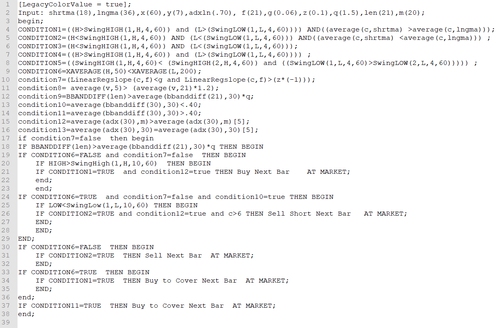

# The Big Blue-2 Trading System

## 1. Introduction to Intraday Trading

日内交易（Intraday Trading）的基本概念和背景的介绍。

1. **日内交易的定义**：

   - 日内交易是指在同一交易日内买入和卖出金融工具的交易策略，交易者不会持仓过夜。这种交易方式允许交易者利用市场的短期波动来获取利润。

2. **日内交易的历史**：

   - 该小节可能会提及日内交易的历史背景，包括它是如何随着电子交易平台和互联网的普及而发展起来的。日内交易在20世纪90年代末期因科技股市场的兴起而变得流行。

3. **交易所的作用**：

   - 介绍了交易所（如纽约证券交易所和纳斯达克）的运作方式，以及它们如何为日内交易者提供交易机会。同时，可能还会讨论专业日内交易者和散户日内交易者之间的差异。

4. **交易方式**：

   - 描述了不同类型的日内交易方式，比如使用技术分析、算法交易、动量交易等策略。同时，可能还会提及一些常见的日内交易模式，如开盘突破、新闻事件驱动的波动等。

5. **风险和挑战**：

   - 讨论了日内交易的风险，包括市场波动性、交易成本（如佣金和滑点）以及情绪控制等。日内交易要求交易者能够快速做出决策，并且对市场动态有敏锐的洞察力。

6. **技术和工具**：

   - 介绍了日内交易者通常使用的技术工具和平台，如实时报价系统、图表分析软件和自动化交易算法。这些工具可以帮助交易者更有效地执行交易策略。

7. **监管和市场结构的变化**：

   - 可能会讨论监管变化对日内交易的影响，例如交易规则的更新、市场结构的变化以及新的交易技术的出现。

本小节为读者提供了日内交易的全面概览，包括它的定义、历史、交易所的作用、交易方式、风险和挑战，以及交易者使用的技术工具。通过这些信息，读者可以更好地理解日内交易的复杂性和它在现代金融市场中的地位。

## 2. Introduction to Futures Day Trading

期货日内交易的基础知识和特点。

1. **期货日内交易的定义**：

   - 期货日内交易是指交易者在同一交易日内买卖期货合约，而不持有合约过夜的行为。这种交易方式允许交易者利用市场的短期价格波动来获取利润。

2. **期货合约的基础知识**：

   - 介绍了期货合约的基本概念，包括它们是如何作为衍生品交易的，以及它们的价格和波动性是如何由其背后的标的资产决定的。同时，可能还会解释期货合约的到期日和滚动操作。

3. **期货市场的特点**：

   - 讨论了期货市场与股票市场的不同之处，如高杠杆、双向交易（做多和做空）、以及全天候交易的可能性。同时，可能还会提及期货市场的流动性和波动性，这些特点对日内交易者来说至关重要。

4. **期货日内交易的策略**：

   - 描述了一些常见的期货日内交易策略，如趋势跟踪、反转交易、价差交易等。同时，可能还会讨论如何使用技术分析和基本面分析来制定日内交易决策。

5. **风险管理**：

   - 强调了在期货日内交易中风险管理的重要性，包括如何设置止损单、如何管理仓位大小以及如何评估市场风险。

6. **交易成本**：

   - 讨论了期货日内交易的成本，包括佣金、滑点和资金成本。这些成本对日内交易者的盈利能力有重大影响。

7. **交易所和交易时间**：

   - 介绍了主要的期货交易所，如芝加哥商品交易所（CME）和洲际交易所（ICE），以及它们的交易时间。了解这些信息对日内交易者来说非常重要，因为不同的交易时段可能有不同的市场行为。

8. **监管和合规**：

   - 可能会提及期货日内交易的监管环境，包括交易所规则、监管机构的要求以及交易者需要遵守的合规标准。

本小节为读者提供了期货日内交易的全面介绍，帮助读者理解这种交易方式的基本概念、策略、风险和市场特点。通过这些信息，读者可以更好地评估期货日内交易是否适合自己的交易风格和风险承受能力。

## 3. Intraday Price Patterns

本节探讨了金融市场价格模式的一般特性，以及如何识别和利用这些模式进行日内交易。

* 市场的分形特性：金融市场通常具有分形特性，这意味着在不同的时间尺度上，如果时间轴（水平轴）不显示，很难区分日线图和日内图。然而，日内图表包含了更多不在长期图表中的信息。

* 一周中不同日子的市场行为：通过分析S&P期货交易日内的价格行为，发现一周中不同的日子有不同的价格运动模式。例如，周一和周三通常有最大的上涨幅度，而周五则有最大的下跌幅度。周二和周四则介于两者之间。此外，大部分周五的价格运动发生在早盘和尾盘，而中午时段则相对平淡。

* 日内价格模式的分析：通过分析大约17年的日内数据，研究了开盘后的价格运动，并将其标准化为前一天价格范围的百分比。通过这种分析，可以识别出一周中不同日子的价格运动模式。

* 添加波动性过滤：在分析中加入简单的波动性过滤规则后，可以观察到新的模式。例如，周一出现了明显的低点，而周三则成为一周中主要的上涨趋势日。周二和周五在早盘也出现了低点，而周四则没有明显的趋势。

* 识别关键的基本模式：为了编写交易系统代码，需要识别几个关键的基本模式。Big Blue-2交易系统使用了四种主要的模式，包括枢轴点逆势模式、簇逆势模式、突破模式和极端枢轴点逆势模式。这些模式在系统中必须协同工作，不能产生冲突的信号。

本小节强调了在日内交易中，识别和利用价格模式的重要性，并通过分析和过滤来提高交易策略的有效性。通过理解市场在不同时间尺度上的行为，交易者可以开发出更精确的交易系统，从而在快速变化的市场中捕捉利润机会。

## 4. The 4 Basic Big Blue-2 Intraday Patterns

构成Big Blue-2交易系统的四种基本日内交易模式。

* 枢轴点逆势模式（The Pivot Counter-Trend Pattern）：

  * 这个模式基于价格首先朝一个方向移动，然后反转并朝相反方向趋势。
  * 交易者会观察价格是否突破支持位或阻力位，然后在另一边设置止损单，这可能在当天某个时候被执行，或者在收盘时被取消（Market-on-Close, MOC）。

* 簇逆势模式（The Cluster Counter-Trend Pattern）：

  * 这个模式的形状类似于一个勾号或倒勾号。在买入情景中，市场在早上走低，然后反转并在收盘时上涨。在卖出情景中，市场在早上的上涨在后期消退，然后在收盘时走低。
  * 这个模式将基于价格簇的分析，并使用限价单进入。

* 突破模式（The Breakout Pattern）：

  * 在这种情景中，市场在一个方向上强烈移动，并在当天的最低点或最高点附近收盘。这是典型的趋势日，市场要么大幅上涨，要么大幅下跌。
  * 这个模式将使用止损单进入。

* 极端枢轴点逆势模式（The Extreme Pivot Counter-Trend Pattern）：

  * 大幅的单向移动有时会跟随在相反方向上的大幅移动，因此这个模式寻找通过第二级枢轴水平的大幅移动，然后在这一枢轴水平的另一边设置止损单，这个止损单将被执行或在收盘时被取消。

这四种模式必须在完整的系统中协同工作，不能产生冲突的信号。进入模式时使用限价单和止损单可能会很复杂，因为可能同时存在高于市场价格的止损单和低于市场价格的限价单。当然，这些模式在当天被执行的所有入场都将在亏损时止损退出，或者在收盘时（MOC）退出。Big Blue-2不会持有隔夜头寸。

本小节强调了每种模式在日内交易中的重要性，以及如何通过结合使用这些模式来提高交易系统的多样性和稳健性。通过在系统中嵌入多个模式，可以在某个模式（或系统）经历回撤时，希望其他模式（或系统）处于盈利模式，从而分散风险并提高整体表现。

## 5. Intraday Trading Filters

Big Blue-2交易系统使用了以下类型的过滤规则：

* 时间过滤规则（Time of Day Filters）：日内波动性通常在早晨和晚上较高，中午较低。一些模式在早晨表现良好，但在下午则不然。因此，尽管时间过滤规则可能排除了一天中的一部分时间，但它们仍然允许主要模式在不过度过滤数据的情况下显现出来。

* 一周中的某天过滤规则（Day of Week Filters）：经过大量测试，发现某些模式在星期五表现不佳，这令人惊讶，因为大多数星期五都有下跌倾向。此外，无论是长模式还是短模式的价格簇模式在星期五的表现都不好。

* 一个月中的某天过滤规则（Day of Week in Month Filters）：像三重巫师日（Triple Witching Day）和各种报告日发布的日子需要被研究，以用作过滤规则。一些模式对一个月中的某些日子比其他模式更敏感。

* 月份过滤规则（Month Filters）：十一月对于许多日内交易系统来说是一个困难的月份，这可能是由于假期、年底的税收销售、年底的投资组合轮换等原因。这个过滤规则根据需要被纳入。它会减少十一月的交易数量。其他模式也将根据需要应用月份过滤规则。例如，在夏季的七月份，一些模式的表现不佳，可能是由于特定类型的日内波动性不足或过多，或者可能因为许多交易者在休假。

* 波动性过滤规则（Volatility Filters）：在第六章中，一个简单的日内过滤规则被应用于日内价格运动的分析中，我们观察到日内拓扑结构的显著变化。通过寻找促进随后应用的交易模式的当前市场条件，我们可以为现有模式创造增强。

* 超买/超卖过滤规则（Over Bought/Over Sold Filters）：将长模式应用于已经卖出的市场，或将短模式应用于已经上涨的市场，这种经典应用是有效的。因此，超买/超卖过滤规则将被应用于我们的模式，如适用。这将再次减少交易频率，但增加平均交易量，并减少我们假设测试中的回撤。

本小节讨论了在日内交易系统中使用的各种过滤规则，这些规则通过逻辑开关来开启或关闭交易。强调了过滤规则在任何交易系统开发中的重要性，但同时也提醒我们，过滤规则必须谨慎使用，因为过度使用过滤规则就像过度拟合交易系统的参数或逻辑一样容易，而纯粹的数据拟合是不可取的。

## 6. Intraday Patterns

### 6.1 The Pivot Counter-Trend Pattern

枢轴点逆势模式（Pivot Counter-Trend Pattern），这是Big Blue-2交易系统中使用的主要日内交易模式。

**枢轴点计算（Pivot Point Calculations）**：

- 枢轴点计算是基于前一天的最高价、最低价和收盘价的平均值来确定一系列递增和递减的价格水平。

**计算公式如下**：

- 枢轴点（Pivot）=（最高价 + 最低价 + 收盘价）/ 3
- 支撑位（Support）= 2 * 枢轴点 – 前一天的最高价
- 阻力位（Resistance）= 2 * 枢轴点 – 前一天的最低价
- 最低支撑位（Lowest Low）= 枢轴点 – 阻力位 + 支撑位
- 最高阻力位（Highest High）= 枢轴点 – 支撑位 + 阻力位
- 第二支撑位（LL2）= 枢轴点 – 最高阻力位 + 最低支撑位
- 第二阻力位（HH2）= 枢轴点 – 最低支撑位 + 最高阻力位

**模式描述**：

- 枢轴点逆势模式发生在价格下跌至枢轴点以下某个阈值后开始回升时。交易者会在支撑位上方设置一个止损单，该单可能在当天的特定时间被执行，或者在交易日结束时被取消。
- 相反的，当价格上升至阻力位以上某个阈值后开始下跌时，会发生短枢轴点逆势模式。交易者会在阻力位下方设置一个卖出止损单，该单同样可能在当天被执行或在交易日结束时被取消。

**图表示例**：

- 文档中提供了一个图表示例，展示了在2003年4月22日的一个典型交易日中，根据枢轴点逆势模式进行的交易。该模式在早上进入多头，并在交易日结束时以市价平仓（MOC）。

**历史测试结果**：

- 文档还提供了从1985年9月30日至2004年3月10日的枢轴点逆势模式的假设测试结果。这个测试假设使用了1个大型S&P合约，并且每个点的价值固定在250美元。
- 在这次测试中，共有989次交易，没有考虑滑点或佣金，固定止损设置为5个点。这个模式在交易日的大部分时间内都有效，但避开了某些中午时段，避开了11月的所有交易，并且不会在星期五做空。

**性能总结**：

- 测试结果显示，总净利润为391,450美元，毛利润为694,750美元，毛损失为303,300美元。交易的成功率为58.54%，平均每次盈利交易为1,199.91美元，平均每次亏损交易为739.76美元。盈利与亏损的平均比率为1.62，平均每次交易的净利润为395.80美元。

本小节强调了枢轴点逆势模式在日内交易中的重要性，并提供了详细的计算方法、交易逻辑和历史测试结果，以展示这种模式的有效性。

### 6.2 The Cluster Counter-Trend Pattern

簇逆势模式（Cluster Counter-Trend Pattern），这是Big Blue-2交易系统中使用的另一种主要的日内交易模式。

**模式描述**：

- 在日内交易中，价格往往会从中间低点的价位簇（cluster）中反弹，或者在中间高点形成价位簇后下跌。如果市场开始变得疲软，通常会有一个快速的上涨随后伴随着大规模的卖出，将价格推低，因为交易者会在强势时卖出或在弱势时买入。

- 为了利用这种模式，首先需要识别出要使用的基本价格簇。这些价格簇定义如下：
  - LL = 过去N个时间单位内的最低点
  - HH = 过去N个时间单位内的最高点

**交易设置**：

- 通过将限价买入单设置在低于LL点的某个特定价位，并将限价卖出单设置在高于HH点的某个特定价位来设置这种交易。
- 如果市场价格急剧上涨并离开了这个价格簇，那么将触发限价卖出单。
- 为了避免与突破模式混淆，这种模式将在特定的日内模式和尾盘模式期间应用，并结合关键的过滤组件。

**图表示例**：

- 文档中提供了一个图表示例，展示了在某一天根据簇逆势模式进行的交易。

**历史测试结果**：

- 文档还提供了从1985年到2004年的簇逆势模式的假设测试结果。这个测试假设使用了1个大型S&P合约，并且每个点的价值固定在250美元。
- 在这次测试中，共有716次交易，没有考虑滑点或佣金，固定止损设置为5个点。这是Big Blue-2交易系统中包括的第二种模式。

**性能总结**：

- 测试结果显示，总净利润为217,262.50美元，毛利润为427,787.50美元，毛损失为210,525.00美元。交易的成功率为56.70%，平均每次盈利交易为1,053.66美元，平均每次亏损交易为679.11美元。盈利与亏损的平均比率为1.55，平均每次交易的净利润为303.44美元。

本节强调了簇逆势模式在日内交易中的重要性，并提供了详细的模式识别方法、交易逻辑和历史测试结果，以展示这种模式的有效性。通过在市场中识别出这些价格簇，并在这些价格水平附近设置限价单，交易者可以在市场反转时捕捉到利润机会。

### 6.3 The Breakout Pattern

突破模式（Breakout Pattern）。

**模式描述**：

- 突破模式针对的是市场在某个方向上强势启动且几乎没有回撤的情况。在这种交易日，交易者希望参与市场运动，但需要添加一些过滤逻辑，以确保不会过于频繁地交易，并且避免在市场只是“假突破”的日子里进行交易。

**交易设置**：

- 交易者从第二级枢轴点开始，设定止损单在最高最高点（Highest High Pivot Point）之上一定数额，以及在最低最低点（Lowest Low Pivot Point）之下一定数额。如果市场价格在当天结束前没有被触发，则订单会被取消。

**过滤逻辑**：

- 为了提高这种模式的表现，添加了以下过滤条件：时间过滤、月份过滤、波动性过滤。
- 时间过滤（Time of Day）：避免在一天中波动性较低的时段进行交易。
- 月份过滤（Day of Month）：避免在一个月中某些特定的日子进行交易，比如三重巫师日（Triple Witching Day）。
- 波动性过滤（Volatility filters）：只在市场波动性达到一定水平时才进行交易。

**图表示例**：

- 文档中提供了一个图表示例，展示了在某一天根据突破模式进行的交易。

**历史测试结果**：

- 文档还提供了从1985年到2004年的突破模式的假设测试结果。这个测试假设使用了1个大型S&P合约，并且每个点的价值固定在250美元。
- 在这次测试中，共有867次交易，没有考虑滑点或佣金，固定止损设置为5个点。这是Big Blue-2交易系统中包括的第三种模式。

**性能总结**：

- 测试结果显示，总净利润为258,737.50美元，毛利润为584,362.50美元，毛损失为325,625.00美元。交易的成功率为53.17%，平均每次盈利交易为1,267.60美元，平均每次亏损交易为802.03美元。盈利与亏损的平均比率为1.58，平均每次交易的净利润为298.43美元。

本小节强调了突破模式在日内交易中的重要性，并提供了详细的交易设置、过滤逻辑和历史测试结果，以展示这种模式的有效性。通过在市场强势突破时进入交易，并使用过滤逻辑来避免频繁交易和假突破，交易者可以在市场出现明显趋势时捕捉利润机会。

### 6.4 The Extreme Counter-Trend Pattern

极端逆势模式（Extreme Counter-Trend Pattern）。

**模式描述**：

- 极端逆势模式是一种针对市场极端波动的交易策略。这种模式专注于市场价格极端波动后往往会有显著的反向调整。这种模式通常被称为“假突破”模式，因为许多交易者会误以为市场将继续朝相同方向移动，而实际上市场却出现了反转。

**交易设置**：

- 交易者会观察那些价格突破了第二级枢轴点水平的日子，并在这些突破点的另一侧设置止损单，以捕捉价格的反向调整。
- 这种模式可能在一天之内在不同的时间多次触发交易，但通常只在早盘有效。如果市场开盘后几小时内没有触发交易，那么这种模式通常就不会被执行。
- 此外，这种模式还会避免在某些特定的月份（如七月和四月）以及在星期五和星期一进行空头交易。

**图表示例**：

- 文档中提供了一个图表示例，展示了在某一天根据极端逆势模式进行的交易。

**历史测试结果**：

- 文档还提供了从1985年到2004年的极端逆势模式的假设测试结果。这个测试假设使用了1个大型S&P合约，并且每个点的价值固定在250美元。
- 在这次测试中，共有252次交易，没有考虑滑点或佣金，固定止损设置为5个点。这是Big Blue-2交易系统中包括的第四种模式。

**性能总结**：

- 测试结果显示，总净利润为90,650美元，毛利润为186,562.50美元，毛损失为95,912.50美元。交易的成功率为51.59%，平均每次盈利交易为1,435.10美元，平均每次亏损交易为786.17美元。盈利与亏损的平均比率为1.83，平均每次交易的净利润为359.72美元。

本小节强调了极端逆势模式在日内交易中的重要性，并提供了详细的交易设置、交易逻辑和历史测试结果，以展示这种模式的有效性。通过识别市场的极端波动并设置相应的止损单，交易者可以在市场出现显著反向调整时捕捉利润机会。

## 7. Post Development Analysis

Big Blue-2交易系统开发完成后的分析，涵盖了对系统性能的全面评估和一些关键问题的讨论。

1. **交易参数比率（Trade to Parameter Ratio）**：

   - 这个比率是通过将测试中的交易次数除以产生测试结果的数量来计算的。理想情况下，这个比率越高越好，最好在100:1或更高。

   - 对于Big Blue-2交易系统中的前三个模式，交易参数比率在100:1到200:1之间，而对于极端逆势模式，这个比率可能低至50:1。尽管如此，由于这个模式即使没有过滤条件也能表现良好，特别是在避免在星期四交易的情况下，因此认为基础模式可以在较低的交易参数比率下运行。

2. **长期回测（Long Back-test）**：

   - 测试数据从1985年10月1日开始，到2004年3月10日结束，总共涵盖了4,654天的交易数据。这是一个非常长的回测周期，有助于验证交易模式的稳健性。

3. **大量交易（Numerous Trades）**：

   - 在最小过滤条件下的完整回测中，总共有2,562次交易，平均每周三次交易左右。考虑到80年代的日均波动范围仅为2-3点（按今天的价格水平计算，每点价值500美元），因此平均每笔交易216美元的表现是相当优秀的。

4. **系统性能总结（Performance Summary）**：

   - Big Blue-2交易系统在没有启用某些特定日子过滤条件的情况下，展示了其基于1个标准普尔（S&P）期货合约的假设性能。这个最小过滤测试增加了对Big Blue-2交易系统基础模式的信心。

5. **市场变化的警告（Warning About Market Changes）**：

   - 需要注意的是，市场状况可能会发生变化，导致Big Blue-2交易系统或其他任何交易系统变得无效并亏损。因此，交易者在交易任何交易系统时，都应该评估自己对风险的承受能力。

本小节的内容强调了在开发完成后对交易系统进行全面分析的重要性，同时也提醒交易者市场状况的变化可能会影响系统的性能。通过长期回测和大量的交易数据，可以更好地理解交易系统的潜在表现，并为未来的市场变化做好准备。

## 8. 初始版源码

## 9. 参考文章

- [还来唠一唠曾在全球量化策略热榜上排名第4的TheBigBlue策略(年化57.6%)](https://zhuanlan.zhihu.com/p/397388732)
