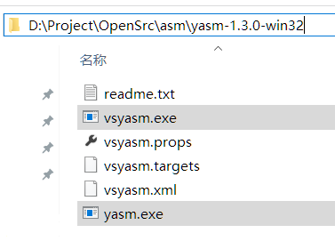
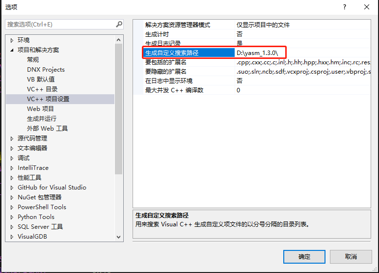
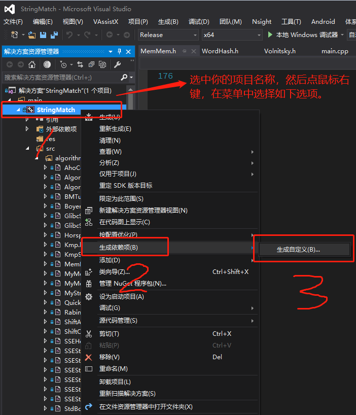
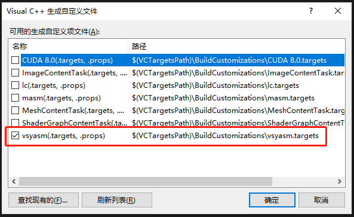
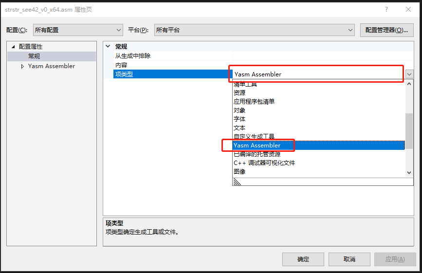
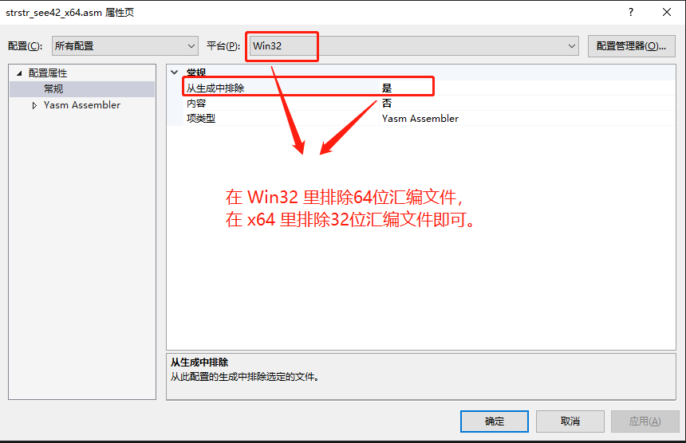

# 在 VS 2010/2012/2013/2015 中集成 yasm 1.3.0

## 1、yasm 简介

`yasm` 支持 `nasm` 语法，同时支持 Windows、Linux、Mac OS 多个操作系统，对指令集（MMX、SSE、AVX等）的支持也还不错，所以是 x86/amd64 上比较适合用于跨平台、交叉编译的汇编编译器。

`yasm` 的官网是：[http://yasm.tortall.net/](http://yasm.tortall.net/)

支持环境：

Visual Studio 2010/2012/2013/2015

Windows 7/10，32/64位系统

下载：[http://yasm.tortall.net/Download.html](http://yasm.tortall.net/Download.html)

vsyasm (yasm 1.3.0)

* [Win32 VS2010.zip](http://www.tortall.net/projects/yasm/releases/vsyasm-1.3.0-win32.zip) (for use with VS2010+ on 32-bit Windows)
* [Win64 VS2010.zip](http://www.tortall.net/projects/yasm/releases/vsyasm-1.3.0-win64.zip) (for use with VS2010+ on 64-bit Windows)

关于 VC 2005/2008 上集成 yasm 的方法，由于这两个版本已经用得比较少，就不介绍了，请参阅 yasm 的官网。

## 2、VS 2012/2013/2015 修正版

### 2.1 关于 VC 2010/2012/2013/2015

官方提供的方法只适用于 VS 2010，对于 VS 2012/2013/2015 等新版本，存在一些小问题，vsyasm 传进去的 $(Platform) 可能是 “Win32”，而 vsyasm 默认只支持小写的 “win32”，所以会报错，本文采用一个老外自己修正和编译的 vsyasm 修正版本。

（这个错误官网已修正，但是在放出来的 1.3.0 Release 版还是未修正的版本，需要自己下载源码重新编译）

vsyasm 修正版作者的文章在这里（内含下载地址）：

YASM integration with Visual Studio 2010, 2012 and 2013

[http://www.megastormsystems.com/news/yasm-integration-with-visual-studio-2010-2012-and-2013](http://www.megastormsystems.com/news/yasm-integration-with-visual-studio-2010-2012-and-2013)

下载地址 (vsyasm 1.3.0 2015-06-09)：

* [vsyasm 1.3.0 2015-June-09 32bits for Visual Studio 2010, 2012 and 2013](http://www.megastormsystems.com/repository/Tools/yasm-1.3.0_2015-06-09_32bits.zip)
* [vsyasm 1.3.0 2015-June-09 64bits for Visual Studio 2010, 2012 and 2013](http://www.megastormsystems.com/repository/Tools/yasm-1.3.0_2015-06-09_64bits.zip)

下面是 yasm-1.3.0_2015-06-09_64bits 解压后的截图：



注：官方的 vsyasm 1.3.0 压缩包里是没有 yasm.exe 的，上面的修正版里才有。

### 2.2 修正 vsyasm.props 文件

打开 vsyasm.props 文件，找到：

```bash
<ObjectFile>$(IntDir)</ObjectFile>
```

修改为：

```bash
<ObjectFile>$(IntDir)%(Filename).obj</ObjectFile>
```

## 3、配置 yasm

由于官方的版本只支持到 VS 2010，所以我们才用上一小节下载的版本：

* [yasm-1.3.0_2015-06-09_32bits](http://www.megastormsystems.com/repository/Tools/yasm-1.3.0_2015-06-09_32bits.zip) （32位系统）

* [yasm-1.3.0_2015-06-09_64bits](http://www.megastormsystems.com/repository/Tools/yasm-1.3.0_2015-06-09_64bits.zip) （64位系统）

### 3.1 安装 vsyasm.exe

如何让 Visual Studio 能找到 vsyasm.exe 文件? 有两种方法，个人推荐使用第二种方法。

（注：本文以 Visual Studio 2015 为例，其他版本请参考 2015 的方法，能顺便提到的我会提一下。）

#### 3.1.1 第一种方法

在操作系统的环境变量里添加一个新的值叫 `YASMPATH`，并设置为 `vsyasm.exe` 所在的路径（路径必须以 "\" 结尾）。

例如，你的 vsyasm.exe 文件路径是 “D:\yasm_1.3.0\vsyasm.exe”，则 YASMPATH 的值应该设置为：

```bash
D:\yasm_1.3.0\
```

这种方法的好处是不用每个 Visual Studio 的 bin 目录下都拷贝一次。

#### 3.1.2 第二种方法（推荐）

把 vsyasm.exe 放到 VC++ 编译器的 \bin 目录，不同的操作系统，不同版本的 Visual Studio 的 \bin 路径是不一样的。

在 64 位系统的 VS 2015 中，路径是：

```bash
C:\Program Files (x86)\Microsoft Visual Studio 14.0\VC\bin
```

在 32 位系统的 VS 2015 中，路径是：

```bash
C:\Program Files\Microsoft Visual Studio 14.0\VC\bin
```

然后把 vsyasm.exe 和 yasm.exe 拷贝到上面的 \bin 目录下。

其他版本的 Visual Studio 也是类似的，如下所示。

在 64 位系统中，路径是：

```bash
## VS 2010
C:\Program Files (x86)\Microsoft Visual Studio 10.0\VC\bin

## VS 2012
C:\Program Files (x86)\Microsoft Visual Studio 11.0\VC\bin

## VS 2013
C:\Program Files (x86)\Microsoft Visual Studio 12.0\VC\bin
```

在 32 位系统中，路径是：

```bash
## VS 2010
C:\Program Files\Microsoft Visual Studio 10.0\VC\bin

## VS 2012
C:\Program Files\Microsoft Visual Studio 11.0\VC\bin

## VS 2013
C:\Program Files\Microsoft Visual Studio 12.0\VC\bin
```

### 3.2 安装 vsyasm 支持文件

同样也有两种方法，跟上一小节类似，不过，依然还是推荐使用第二种方法。

#### 3.2.1 第一种方法

如果你前面选择了第一种方法，那么你依然可以采用这种方法。

把 yasm.props，yasm.targets，yasm.xml 这3个文件拷贝到某个目录下面，例如前面用过的目录：

```bash
D:\yasm_1.3.0\
```

然后打开如下 Visual Studio 设置（以 Visual Studio 2015 为例）。

打开VS菜单：

'工具(T)' -> '选项(O) ...' -> '项目和解决方案' -> 'VC++ 项目设置' -> '生成自定义搜索路径'：

英文版VS菜单：

'Tools(T)' -> 'Options(O) ...' -> 'Projects and Solutions' -> 'VC++ Project Settings' -> 'Build Customisations Search Path'：

如下图所示：



其他 Visual Studio 版本的设置也类似。

#### 3.2.2 第二种方法（推荐）

把 yasm.props，yasm.targets，yasm.xml 3个文件拷贝到 MSBUILD 自定义目录（MSBUILD customisation directory）下面。

在 64 位系统上，路径如下：

```bash
C:\Program Files (x86)\MSBuild\Microsoft.Cpp\v4.0\BuildCustomizations
```

在 32 位系统上，路径如下：

```bash
C:\Program Files\MSBuild\Microsoft.Cpp\v4.0\BuildCustomizations
```

#### 3.2.3 第三种方法

其实第三种方法跟第一种方法非常类似，这里就不讲了（其实你可以忽略），具体可以看 vsyasm 压缩包里的 readme.txt 文件。

### 3.3 配置自定义生成

首先，打开你的 Visual Studio 2015 项目，然后选中你的项目，例如我的项目是：StringMatch，接着点鼠标右键，在弹出的菜单里找到 “生成依赖项...” -> “自定义生成...”，如下图所示：

（注：这个菜单项，在 VS 2010 里，右键菜单里就能看到，叫做 “生成自定义(B)...”，英文版叫做 “Build Customisations ...”。）



接着会弹出如下的窗口，勾选 “vsyasm” 即可，如图：



### 3.4 编译 yasm 文件

要编译 asm 文件，首先，你得在你的项目中添加一个后缀为 asm 的文件，右键单击 asm 文件，弹出菜单选择 “属性”，然后选择：配置属性 -> 常规 -> 项类型，英文版如下：[Properties] -> [General] -> [Item Type] ，在 “项类型” 的下拉列表里找到 [Yasm Assembler]，如下图所示：



由于 yasm 并不能在汇编代码里区分是 Win32 还是 x64 模式，所以同一个项目里如果同时具有 Win32 和 x64 两种模式的汇编代码，

是不能同时都编译的，会报错的。解决方法是，我们可以使用自定义生成工具里提供的排除功能，

在 Win32 模式下排除所有 64 位汇编文件的生成，在 x64 模式下排除所有 32 位汇编文件的生成，如下图：



### 3.5 自定义“自定义生成工具”

除了上面的方式，我们还可以完全使用 “自定义生成工具” 来定义 vsyasm 的编译选项，这种方式可以编译 asm 文件，但是链接的时候会报错，不推荐，仅供参考。方法如下：

VS自定义生成工具配置方法：

1、首先选中 .asm 后缀的汇编文件，点击鼠标右键：属性 -> 常规 -> 项类型 -> 自定义生成工具；
2、在 “自定义生成工具” 的设置中，“命令行” 填入如下内容（自行区分 32 或 64 位模式）：

```bash
# 32位
vsyasm -i %(RootDir)%(Directory)\ -f win32 -o $(IntDir)%(Filename).obj %(FullPath)
# 64位
vsyasm -i %(RootDir)%(Directory)\ -f win64 -o $(IntDir)%(Filename).obj %(FullPath)
```

在 “输出设置” 里，填入如下内容：

```bash
$(IntDir)%(Filename).obj;%(Outputs)
```

## 4、编译选项

如果想用 yasm 手动编译汇编文件，可以参考如下命令：

把 test.asm 编译成包含 debug 信息的 Win32 目标文件 test.obj：

```bash
yasm -f win32 -g cv8 test.asm
```

把 test2.asm 编译成包含 debug 信息的 Win64 目标文件 test2.obj：

```bash
yasm -f win64 -g cv8 test2.asm
```

（注：Windows下支持的 debug 信息是 CodeView 8.0 格式，也就是 MSVC 8.0，VC 2005）

使用 Visual Studio C++ 的路径环境变量编译：

```bash
yasm -i %(RootDir)%(Directory)\ -f win32 -o $(IntDir)%(Filename).obj %(FullPath)
yasm -i %(RootDir)%(Directory)\ -f win64 -o $(IntDir)%(Filename).obj %(FullPath)
```

把 test3.asm 编译成包含 DWARF2 debug 信息的 AMD64 ELF 目标文件 test3.o：

```bash
yasm -f elf64 -g dwarf2 test3.asm
```

跟上面的一样的效果：

```bash
yasm -f elf -m amd64 -g dwarf2 test3.asm
```

把 test4.s (GAS 语法文件) 编译成包含 DWARF2 debug 信息的 32位的 x86 ELF 目标文件 test4.o：

```bash
yasm -p gas -f elf32 -g dwarf2 -o test4.o test4.s
```

编译 MacX OS 下的 asm：

```bash
yasm -f maco32 test.asm
yasm -f maco64 test.asm
```

## 5、其他

### 5.1 yasm 使用手册

yasm 的其他具体用法，可以参考：

官方用户手册 HTML 版：[Yasm用户手册 (HTML 版)](http://www.tortall.net/projects/yasm/manual/html/manual.html) 

或者 PDF 版用户手册  ：[Yasm用户手册（PDF版）](http://www.tortall.net/projects/yasm/manual/manual.pdf)

### 5.2 yasm 语法

本文只讨论如何在 Visual Studio 中配置和安装 yasm，关于 yasm 如何编写 asm 代码请参考官方手册或者别的文章。

## 6、参考文章

【1】：[http://yasm.tortall.net/](http://yasm.tortall.net/) （yasm 官网）

【2】：[https://github.com/yasm/yasm/](https://github.com/yasm/yasm/) （yasm 官方 GitHub 仍有少量更新）

【3】：[https://github.com/yasm/yasm/wiki](https://github.com/yasm/yasm/wiki) （yasm 官方 GitHub 的 wiki）

【4】：[http://www.megastormsystems.com/news/yasm-integration-with-visual-studio-2010-2012-and-2013](http://www.megastormsystems.com/news/yasm-integration-with-visual-studio-2010-2012-and-2013)

【5】：[VS2013集成yasm 1.3.0 含Windows10/VS2015特别说明](https://blog.csdn.net/shile/article/details/51198482)

【6】：[Visual Studio自定义生成工具配置方法和相关vs系统变量含义](https://www.cnblogs.com/SoaringLee/p/10532260.html)

.
