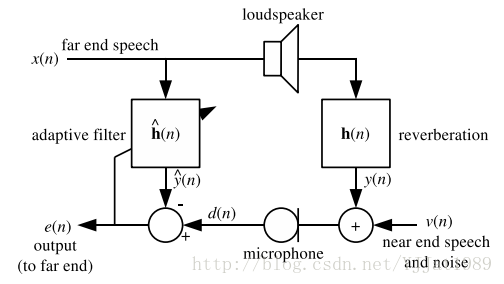

# Speex介绍

本文将对 *Speex* 相关的概念进行介绍

*Speex* 编解码器是一款开源且免费的语音编解码器，遵循*BSD*协议，为分封网络（*packet network*）和网络电话（*VoIP*）而设计，支持文件的压缩，

> 为网络电话而不是移动电话而设计，意味着*Speex*对数据丢失具有鲁棒性，但是对数据包损坏不鲁棒，在*VoIP*中的数据包要么完整到达，要么不能到达。

*Speex*选用CELP（码激励线性预测编码）编码技术，在高比特率和低比特率都稳定可靠，复杂性适度并且占用内存较少。

## 1. 相关概念

### 1.1 采样率

采样率是每秒钟采集到的信号样本数，单位是*Hertz*（*Hz*），*Speex*为三种不同的采样率而设计：*8kHz*（窄带），*16kHz*（宽带）和*32kHz*（超宽带）。

### 1.2 比特率

在对语音信号编码时，比特率定义为单位时间内的比特数，单位是比特每秒（*bps*）或通常的千比特每秒（*kbps*）
 > 注意千比特每秒（*kbps*）和千字节每秒（*kBps*）的区别。

### 1.3 质量（可变）

*Speex*是有损的编解码器，意味着压缩率以输入语音信号的保真度为代价，质量越高，压缩后的比特率越大，音质也越好
*Speex*可以控制质量和比特率之间的折中，大多数时间由一个范围在*0*到*10*之间的质量参数控制
> 在不变比特率（*CBR*）中，质量参数是一个整数； 在可变比特率（*VBR*）中，质量参数是一个浮点数。

### 1.4 复杂度（可变）

*Speex*允许编码器拥有可变的复杂度，通过一个范围在*1*到*10*之间的整数控制搜索的执行来实现，复杂度越高，压缩率越高，CPU使用率越高，音质越好，类似于*gzip*和*bzip2*压缩工具的-1到*-9*选项
正常使用情况下，复杂度为*1*的噪声等级比复杂度为*10*的噪声等级高*1*到*2*个*dB*，但复杂度为*10*的*CPU*要求比复杂度为1的高*5*倍。

> 实际应用中，最好的折中是复杂度*2*到*4*，但在编码非语音声音如*DTMF*声调时更高的复杂度经常被用到。

### 1.5 可变比特率（*VBR*）

可变比特率（*VBR*）允许编解码器自适应的根据待编码音频的“难度”动态地改变比特率，如元音和高能瞬态变化的声音需要高比特率以获得好的质量； 但是摩擦音（如*s，f*）用低比特率就能充分编码

+ 优点：*VBR*在相同的质量下能获得更低的比特率，或在不变比特率下获得更好的质量
+ 缺点：在指定质量情况下，无法保证最终的平均比特率；在一些如网络电话（*VoIP*）这样的实时应用中，依赖于最大比特率，这在通信信道中必须足够低。

### 1.6 平均比特率（*ABR*）

平均比特率解决了*VBR*中的一个问题，它动态地调整*VBR*质量以获得指定的比特率，因为质量和比特率是实时调整的，*ABR*的全局质量比正好达到目标平均比特率的*VBR*编码质量稍微差些。

### 1.7 声音活动检测（*VAD*）

*VAD*检测待编码的音频是语音还是无声/背景噪声，*VBR*编码中默认激活
> *Speex*检测出非语言段并仅使用足够复现背景噪声的比特率进行编码，这叫“柔化噪音生成”（*CNG*）。

### 1.8 断续传输（DTX）

断续传输是*VAD/VBR*的附加操作，当背景噪声平稳时会完全停止传输。

### 1.9 知觉增强

知觉增强是解码器的一部分，当被启用时，能减少编解码过程中产生的噪声或失真的知觉
 > 在大多数情况下，知觉增强会带来声音客观上的偏离（如仅考虑*SNR*），但最后仍听起来更好（主管增强）。

### 1.10等待时间和算法延时

每一个语音编解码器在传输中都会引入延时，对于*Speex*，延时等于帧长加上处理每一帧需要前几帧的数量。

> 在窄带操作中延时为*30ms*，在宽带操作中延时为*34ms*，这不包括编解码帧时的*CPU*时间

## 2. 相关组件

### 2.1 编解码器

*Speex* 编解码器有以下特性：

1. 免费软件/开源，免专利费和版税
2. 利用嵌入比特流集成了窄带和宽带
3. 大范围可用比特率（从*2.15kbps*到*44kbps*）
4. 动态比特率转换（*AMR*）和可变比特率操作（*VBR*）
5. 声音活动检测（*VAD*，与*VBR*集成）和断续传输（*DTX*）
6. 可变复杂度
7. 嵌入宽带结构（可伸缩采样率）
8. *32kHz* 超宽带采样率
9. 强度立体声编码选项
10. 定点实现

### 2.2 预处理器

预处理器在对音频编码前对音频进行预处理，有三个主要功能：

#### 2.2.1 噪声抑制

先降噪再进行编解码是有好处的，因为*Speex*编解码器通常会对噪声输入同样进行编解码，这将会扩大噪声，而降噪能大大减少这一影响。

#### 2.2.2 自动增益控制（*AGC*）

自动增益控制（*AGC*）是为了处理录音音量在不同设置里有很大差别这一问题，*AGC*将会调整信号音量到参考音量大小。

#### 2.2.3 声音活动检测（*VAD*）

预处理器提供的声音活动检测（*VAD*）比编解码器中直接提供的*VAD*更先进。

### 2.3 自适应抖动缓冲器

当通过*UDP*（*User Datagram Protocal*，用户数据报协议）或*RTP*（*Real Time Protocal*，实时传输协议）传输声音（或其他任何内容）时，数据包可能丢失，不同延时到达，甚至乱序，抖动缓冲器的作用是对数据包进行重排序并保存在足够长的buffer（但有一定限度）里，然后将数据包发送去解码。

### 2.4 声学回声消除器

在任何免提式通信系统中（下图），远端的语音在本地扬声器播放时，经过在房间里传播后又会被麦克风录音，如果将麦克风录音直接又发送到远端，则远端的用户将会听到他自己的回声。

声学回声消除器就是为了在将录音发送到远端前消除声学回声，提高了远端接收的语音质量。

### 2.5 重采样器

重采样指转换音频的采样率，在任意采样率间进行转换（采样率必须是有理数），能控制质量和复杂度的折中，可用于能混合不同采样率流，支持声卡不支持的采样率，能转码等。

## 3. 参考文章

+ [http://blog.csdn.net/YJJat1989/article/category/1879965](http://blog.csdn.net/YJJat1989/article/category/1879965)

+ [Speex介绍](https://answerywj.com/2017/12/29/speex/)
