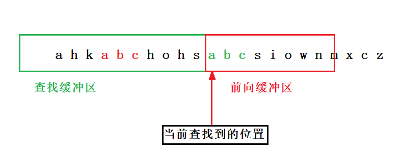
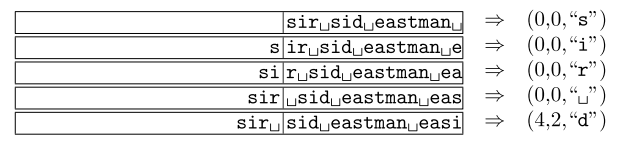

# 无损压缩算法

## 1. 数据压缩的分类

### 1.1 无损压缩

完全还原被压缩的数据，适用于普通文件和可执行文件等不能容忍数据丢失的场合，压缩率比较小。

### 1.2 有损压缩

不能完全还原被压缩的数据，适用于多媒体文件等可容忍一定数据丢失的场合，压缩率比较大。

## 2. 压缩算法的性能指标

1. **压缩比**：压缩前的数据大小和压缩后的数据大小之比。

2. **数据质量**：无损压缩不存在数据质量问题，而有损压缩数据失真情况很难量化，只能对测试的数据进行估计。

3. **软硬件系统**：有些硬件系统有数据压缩模块，与软件系统相比速度快更快。但软件系统灵活度更高。

4. **压缩/解压速度**：不同场合对速度性能有不同的要求。

## 3. 压缩编码

- Run-Length Encoding，行程长度编码

- Burrows–Wheeler Transform，罗伯斯-惠勒变换，也称块排序压缩

- Entropy Encoding，熵编码法

  - Shannon-Fano Encoding，香农-范诺编码
  - Huffman Encoding，哈夫曼编码
  - Arithmetic Encoding，算术编码

- Dictionary Encoding，字典编码

  - LZ77
    - LZSS
    - Deflate
    - LZMA
  - LZ78
    - LZW

### 3.1 行程长度编码 (Run-Length encoding)

计算出相同值重复出现的次数，对相同的数据只编码一次。在 JPEG，MPEG，H.261 和 H.263 等压缩方法中，RLE 用来对图像数据变换和量化后的系数进行编码。

**优缺点**

这种编码方式有个很明显的缺陷，当待编码的数据中重复块很少时，会使得压缩后的数据比原始数据还要大，所以在实际应用中都会做相应的改进。

### 3.2 BWT 变换 (Burrows–Wheeler Transform)

Burrows-Wheeler Transform (BWT) 算法是一种文本转换算法，由 Michael Burrows 和 David Wheeler 在 1994 年提出。它的主要目的是通过 BWT 变换对文本进行重排，使得相同字符聚集在一起，从而提高压缩效果。BWT 本身并不压缩数据，但它为后续的压缩算法（如游程编码或熵编码）创造了有利条件，可以作为统计压缩（如 VLC）和字典压缩（如 LZ78）的有益补充。BWT 算法分为 `正向数据变换` 运算和 `逆向数据恢复` 运算两种。

BWT 变换的核心思想是通过循环移位和排序，将文本转换为一种更容易压缩的形式。BWT 是可逆的，即可以从转换后的文本恢复为原始文本。

#### 3.2.1 BWT 算法工作原理

##### 1. BWT 正向变换

- Step 1：输入长度为 n 的字符串 T，并在字符串末端插入不属于字符空间取值的符号 \$；
- Step 2：对字符串进行循环移位操作，产生 n+1 条循环移位字符串；
- Step 3：对字符串进行按字典顺序（Lexicographical Order，基于字符顺序的排序方式）升序排序；
- Step 4：提取最后一列字符串，该字符串就是 BWT(T)；

下图展示字符串 T = abaaba 生成 BWT(T) 的例子：

从图中可知，字符串 T = abaaba\$ 的 BWT 正向变换结果 BWT(T) = abba\$aa；而图中变换矩阵中最左边的第一列（蓝色框的部分），我们可以通过变换后的 BWT(T) 结果（即红色部分）按字典排序得到，也就是说只需要保存红色部分的结果，即可得到变换矩阵中最左边的第一列，即 "\$aaaabb"，结合红色部分的结果，就可以恢复原来的字符串 T 。

##### 2. BWT 逆变换

BWT 的逆变换是用来恢复原来的字符串 T 的。

我们把正向变换图中蓝色框选的部分叫 F (First)，红色字符部分为 L (Last)，把 BWT 变换矩阵中 F 和 L 的相同字符按顺序给它编个序号，如下图所示：

逆变换的具体过程，我们从 F 那一列的第一个字符 \$ 开始：

- \$ -> a0：因为 BWT 的逆变换是后缀序列，可以推理得到 T 最末尾的前一个字符是 a0；
- a0 -> b0：从 L 的 a0 找到 F 中的 a0 得到，字符 a0 的前面一个字符是 b0；
- b0 -> a2：以此类推，因为 a0 -> b0 已经使用过，那相同的变换 a1 -> b1 会被跳过，但 a1 -> b1 仍未被使用，之后还会被用到；
- a2 -> a1：a2 的前一个字符是 a1；
- a1 -> b1：因为 a1 -> b1 虽然之前被跳过了，但未被使用过，所以 a1 的前一个字符是 b1；
- b1 -> a3：b1 的前一个字符是 a3；
- a3 -> \$：变换到 \$ 表示已经到末尾了，头尾循环了，也就是终止了。

串起来，得到的字符串是："a0 b0 a2 a1 b1 a3"，我们把顺序颠倒过来，即 "a3 b1 a1 a2 b0 a0"，也就是 "abaaba"，这就是我们原始的字符串 T = "abaaba" 。

##### 3. FM-Index

关于 BWT 变换的拓展应用 FM-index，可以参考：[BWM算法浅析-FM(二)](https://zhuanlan.zhihu.com/p/158901556)，这里不过多介绍。

## 4. 熵编码法

### 4.1 香农-范诺编码 (Shannon–Fano ebcoding)

由 Shannon(1948年) 和 Fano(1949年) 共同提出，因此称为 香农-范诺(Shannon- Fano) 编码，是一种“从上到下”的熵编码方法，因跟 Huffman(哈夫曼) 编码类似，这里就不再赘述。

### 4.2 霍夫曼编码 (Huffman encoding)

由 David A. Huffman 于 1952 年提出，是一种“从下到上”的编码方法，被广泛用在JPEG、MPEG、H.26X 等各种信息编码标准中。Huffman 编码是一种可变长编码（  VLC：variable length coding），基于字符出现的频率来构建一个最优的二叉树，从而实现有效的数据压缩，是理论上的最优的前缀编码。

编码流程如下图所示：

**优缺点**

- 优点：简单，解压所读快。
- 缺点：压缩速度慢，需要遍历两次，最大只能有 256 个元素，压缩率可能不高。
- 适合：文本压缩，以 Byte 为单位。

## 5. 词典编码

词典编码的实质就是用一些短的索引来替换重复出现的数据段。LZ 系列算法是最具代表性的词典编码算法。

下面是 LZ 系列算法的历史：

### 5.1 LZ77

LZ77 算法是由 Lempel 和 Ziv 在 1977 年的论文中提出来的，该算法将输入流中之前的字符作为字典。编码器维护一个滑动窗口，输入字符流从右往左滑动。滑动窗口由两部分组成，如下图所示，左边的是已编码区域（当前字典，查找缓冲区，Search Buffer），右边是待编码区域（前向缓冲区，Look Ahead Buffer）。

对于 LZ77 算法，滑动窗口（查找缓冲区）的典型大小是 4096 字节，而前向缓冲区的典型长度是 3 。

匹配的数据使用三元组来表示（偏移量，匹配长度，待编码区的下一个字符），偏移量表示匹配字符串的在滑动窗口的起始位置，长度表示匹配长度，下一个字符是匹配后的第一个字符。如果没有匹配的数据使用（0, 0, 未匹配的字符）表示。

示例：

**优缺点**

- 优点：解压速度快。
- 缺点：压缩速度慢。
- 适用场景：对于一定范围内有重复字符串的数据压缩率更好，例如文本格式，适合于一次压缩，多次解压的文件。

### 5.2 LZ78

### 5.3 LZSS

### 5.4 LZW

### 5.5 LZ 系列算法比较

## 6. 总结

压缩算法种类繁多，需要针对不同的场合选择不同的算法，没有最好，只有最适合的算法。写到这里也很累了现在，在这一篇只做算法的介绍，之后的一段时间里会逐步用代码去实现以上所述的算法，并研究在实际项目中的灵活运用。

## 7. 参考文章

- [无损压缩算法专题——无损压缩算法介绍](https://blog.csdn.net/qq_34254642/article/details/103651815)

- [LZ系类压缩算法介绍](https://www.cnblogs.com/lab601/p/14206346.html)

- [LZ77文件压缩](https://blog.csdn.net/weixin_45897952/article/details/125855563)

- [无损耗数据压缩算法历史](https://zhuanlan.zhihu.com/p/185059460)

- [罗伯斯-惠勒（BWT）算法](https://zhuanlan.zhihu.com/p/564183482)
