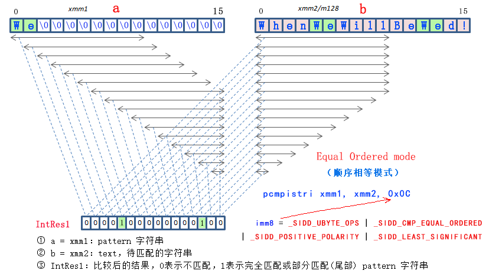

# 如何使用 SSE 4.2 的 PCMPxSTRx 指令

tags: "Intel", "SIMD", "SSE 4.2", "PCMPxSTRx", "PCMPISTRI", "PCMPISTRM", "字符串匹配", "String Match"

## 1. SIMD 简介

现代的 `CPU` 大多都提供了 [`单指令流多数据流`](https://zh.wikipedia.org/wiki/%E5%8D%95%E6%8C%87%E4%BB%A4%E6%B5%81%E5%A4%9A%E6%95%B0%E6%8D%AE%E6%B5%81)（`SIMD`，`Single Instruction Multiple Data`）指令集，最常见的是用于大量的浮点数计算。但其实也可以用在文字处理方面，`Intel` 在 `SSE 4.2` 指令集中就加入了字符串处理的指令，这就是 `PCMPxSTRx` 系列指令。

这里简单的介绍一下 `x86` 架构下的 `SIMD`，在 `SSE 4.2` 指令集之前，`Intel` 和 `AMD` 共同维护和开发了 `MMX`，`SSE`，`SSE 2`，`SSE 3`，`SSE 4`，`SSE 4.1`，`SSE 4.a`，`3D Now` 等指令集。在 `SSE 4.2` 指令集之后，最新的还有 `SSE 5`，`AVX`，`AVX 2`，`FMA`，`AVX 512` 等等。


（配图为 `2008` 年发售的 `Intel Core i7` 芯片，它采用的 `Nehalem` 架构是第一个支持 `SSE 4.2` 的微架构。）

## 2. SSE 4.2 指令集

`SSE 4.2` 指令集都包含了哪些指令？

这里也简单介绍一下，通过 `Intel` 官方网站的指令指南：[Intel Intrinsics Guide: SSE 4.2](https://software.intel.com/sites/landingpage/IntrinsicsGuide/#expand=914&techs=SSE4_2)，可以看到。

`SSE 4.2` 指令集主要包含了三类指令：

* 用于字符或文字处理的 `PCMPxSTRx` 系列指令
* 用于校验或者哈希的 `CRC32` 系列指令
* 用于 `64位` 批量数据比较的 `_mm_cmpgt_epi64()` 指令（这个是在填以前的坑，只有一条指令）

除去第 `3` 类那条填旧坑的指令，`SSE 4.2` 其实只有 `PCMPxSTRx` 和 `CRC32` 两个大类，其中绝大部分都是 `PCMPxSTRx` 指令。所以，`PCMPxSTRx` 指令是 `SSE 4.2` 指令集的 “主角” 。

下图中，以 `_mm_cmpestr` 和 `_mm_cmpistr` 开头的函数都是 `PCMPxSTRx` 指令。

（注：为了编程方便，`Intel` 把指令包装成函数，这些函数“一一对应”着某一条具体的 `CPU` 指令。）


## 3. PCMPxSTRx 指令

### 3.1 原理

`PCMPxSTRx` 系列指令有着很强的 `并行比较` 能力，也许是 `x86` 指令集中最复杂的指令之一。

那么，`PCMPxSTRx` 指令到底能干什么？工作原理呢？

它可以一次性对一组字符(串)（16个Byte或8个Word）与另一组字符(串)（16个Byte或8个Word）同时作比较，也就是说这一条指令一次可以最多做 "`16 × 16 = 256`" 次的 `单字符` 比较。虽然它没有采取任何优化算法，但是由于硬件指令的暴力并行，还是能对字符串匹配、搜索和比较的性能产生巨大的提升。

我们以最常用、最有价值的 `Equal Ordered`（顺序相等）模式为例，大致的工作原理如下：



上图所示指令的 `C/C++` 伪代码如下：

```c
char * operand1 = "We";
char * operand2 = "WhenWeWillBeWed!"

// imm8 = 0x0C
uint8_t imm8 = _SIDD_UBYTE_OPS |
     _SIDD_CMP_EQUAL_ORDERED |
     _SIDD_POSITIVE_POLARITY |
     _SIDD_LEAST_SIGNIFICANT;

// pcmpistri  xmm1, xmm2, 0x0C
int index = _mm_cmpistri(operand1, operand2, imm8);
```

详细分析：

* `Equal Ordered` = 0x0C，imm[3:2] = 11b，判断 `operand1` 是否是 `operand2` 的子串。

```c
operand2 = "WhenWeWillBeWed!"
operand1 = "We"
IntRes1  =  0000100000001000 (b)
index    =  4 (从左边最低位开始数，第一个 "1" 的索引值是 4 ，索引从 0 开始计数)
```

我们可以看到 `"WhenWeWillBeWed!"` 中包含了 `"We"` 子串两次，分别是在索引 `4` 和 `12` 的位置（`IntRes1` 从左往右数，在这里 `IntRes1` 是一个 16 个 `bit` 的整形），由于我们指定了 `_SIDD_LEAST_SIGNIFICANT` 参数，即 `LSB` (`Least Significant Bit`，最低有效位)，所以从左边最低位开始数，第一个为 `"1"` 的 `bit` 的索引值是 `4` ，索引从 `0` 开始计数。

### 3.2 指令详解

`PCMPxSTRx` 指令其实是一个指令系列的统称，其中 `x` 代表通配符，它包含了下面的四条具体指令：

* pcmp[**e**](https://baidu.com)str[**i**](https://baidu.com)

* pcmp[**e**](https://baidu.com)str[**m**](https://baidu.com)

* pcmp[**i**](https://baidu.com)str[**i**](https://baidu.com)

* pcmp[**i**](https://baidu.com)str[**m**](https://baidu.com)

为了方便理解，先来了解一下 `PCMPxSTRx` 指令的一般格式，例如：

```asm
pcmpistri  arg1, arg2, imm8
```

注：其中 `arg1`，`arg2` 可以是任意的 `SSE 128位` 寄存器 `xmm0` ~ `xmm15`（一共 16 个），`imm8` 是一个 `8bit` 的立即数（常量），用于配置 `pcmpistri` 指令，定义指令具体的执行功能，稍后会详细介绍。常用的值是：imm8 = 0x0C（十六进制）。

那么，这四条指令有什么区别？请看下表，有更清晰的划分：

|                                                                                    |      返回索引<br/>(返回匹配字符串的<br/>索引值到 %ecx)      |   返回Mask<br/>(返回字符比较结果的<br/>bitmask 到 %xmm0)    |
| :--------------------------------------------------------------------------------: | :---------------------------------------------------------: | :---------------------------------------------------------: |
| 显式的指定字符串的长度，<br/>arg1 的长度保存在 %edx，<br/>arg2 的长度保存在 %eax。 | pcmp[**e**](https://baidu.com)str[**i**](https://baidu.com) | pcmp[**e**](https://baidu.com)str[**m**](https://baidu.com) |
|                   隐式的字符串长度，<br/>以字符串终止符'\0'结束                    | pcmp[**i**](https://baidu.com)str[**i**](https://baidu.com) | pcmp[**i**](https://baidu.com)str[**m**](https://baidu.com) |

从上表可以看出，在 `PCMPxSTRx` 指令中，

前面的通配符：

* 如果是 `e` 的话，表示显示的指定输入的字符串的长度，`arg1` 的长度保存在 `%edx` 寄存器，`arg2` 的长度保存在 `%eax` 寄存器。

* 如果是 `i`，则表示隐式的字符串长度，输入的字符串以终止符 “`\0`” 结束。

后面的通配符：

* 如果是 `i`，则表示返回的结果是索引值，即 `IntRes1` 中（二进制）从最高位开始数 (MSB) 或最低位开始数 (LSB) 第一个为 `1` 的索引位置，结果存到 `%ecx` 寄存器。

* 如果是 `m`，则表示返回的结果是一个 `BitMask` (Bit位或Byte位掩码)，且这个值保存到 `%xmm0` 寄存器中。

注：在 `PCMPxSTRx` 指令的 `AVX` 版 `VPCMPxSTRx` 指令中，前面提到的 `%eax`，`%edx` 寄存器相对应的要换成 `%rax`，`%rdx` 寄存器，而 `%ecx` 寄存器做为返回的索引值，即使在 `AVX` 版下也足够了，所以不变。

所以，这四条指令的含义，列表如下：

* pcmp[**e**](https://baidu.com)str[**i**](https://baidu.com)：

    * **P**acked **Com**pare **E**xplicit Length **Str**ings, Return **I**ndex
    *  批量比较显式指定长度的字符串，返回索引值

* pcmp[**e**](https://baidu.com)str[**m**](https://baidu.com)：

    * **P**acked **Com**pare **E**xplicit Length **Str**ings, Return **M**ask
    * 批量比较显式指定长度的字符串，返回掩码

* pcmp[**i**](https://baidu.com)str[**i**](https://baidu.com)：

    * **P**acked **Com**pare **I**mplicit Length **Str**ings, Return **I**ndex
    * 批量比较隐式长度的字符串，返回索引值

* pcmp[**i**](https://baidu.com)str[**m**](https://baidu.com)：

    * **P**acked **Com**pare **I**mplicit Length **Str**ings, Return **M**ask
    * 批量比较隐式长度的字符串，返回掩码

### 3.3 imm8 参数设置

可以说，`PCMPxSTRx` 指令最精髓的部分就是 `imm8` 的参数设置了，因为它决定了指令的具体行为。

那么 `imm8` 是什么呢？就是我们的例子看到的，`PCMPxSTRx` 指令的汇编格式的最后一个参数：

```asm
pcmpistri  arg1, arg2, imm8
```

顾名思义，`imm8` 是一个 8 bit 的常量，即 `const uint8_t`，它可以用下面的 5 个部分组合成一个 `imm8` 参数，分别是：

* Byte or Word (字节或者字)

    每个字符是字节（1个字节）还是字（2个字节）？
  
* Signed or Unsigned (有符合/无符号)

    数据进行比较时作为无符号整数，或者作为有符号整数来比较？

* Aggregation operation (比较操作)
  
    你想如何比较每个字符？

* Polarity (极性)

    我们如何处理每个字符比较的中间结果？

* Output selection (输出选择)

    如何在得到中间结果后转换为最终输出结果？

例如，前面的例子里，定义的 `imm8` 值等于：

```c
// 为了照顾手机用户, 省略了const声明, 下同
uint8_t imm8 = _SIDD_UBYTE_OPS |
     _SIDD_CMP_EQUAL_ORDERED |
     _SIDD_POSITIVE_POLARITY |
     _SIDD_LEAST_SIGNIFICANT;
```

下面，我们来详细介绍一下每个参数的意义。

#### 3.3.1 Byte or Word (字节或者字)

每个字符是字节（1个字节）还是字（2个字节）？

在 `C/C++` 中的定义：

```c
/*
 * These defines are used to determine
 * the kind of units to be compared.
 */
#define _SIDD_UBYTE_OPS  0x00
#define _SIDD_UWORD_OPS  0x01
```

* `_SIDD_UBYTE_OPS` = 0x00

`_SIDD_UBYTE_OPS` 表示，`arg1`，`arg2` 中的字符串是 `UBYTE` 类型，也就是 `uint8_t` 或者 `unsigned char` 类型，相当于：

```c
// 这些都是伪代码, 不要太在意语法细节
unsigned char arg1[16] = "We";
unsigned char arg2[16] = "WhenWeWillBeWed!";
```

我们大多数时候处理的字符都是 `UBYTE` 或 `SBYTE` 类型，相当于 `std::basic_string<char>`。

* `_SIDD_UWORD_OPS` = 0x01

`_SIDD_UWORD_OPS` 则表示，`arg1`，`arg2` 中的字符串是 `UWORD` 类型，也就是 `uint16_t` 或者 `unsigned short` 类型，相当于：

```c
unsigned short arg1[8] = L"We";
unsigned short arg2[8] = L"WhenWeWi";
```

`UWORD` 或 `SWORD` 类型，最典型的应用就是 `Windows` 编程里的 `Unicode` 编码，也可以称为 “`UTF-16LE`” 编码，一个 `Unicode` 字符的范围是 `0 ~ 65535`，即两个字节表示一个 `WORD`。也就是说，`PCMPxSTRx` 系列指令是支持宽字符的，但一次只能同时比较 8 个 `UWORD` 字符，比 `UBYTE` 少一半。

#### 3.3.2 Signed or Unsigned (有符合/无符号)

数据进行比较时作为无符号整数，或者作为有符号整数来比较？

在 `C/C++` 中的定义：

```c
/*
 * These defines are used to determine
 * the kind of units to be compared.
 */
#define _SIDD_SBYTE_OPS  0x02
#define _SIDD_SWORD_OPS  0x03
```

* _SIDD_SBYTE_OPS = 0x02, 相当于：

```c
char arg1[16] = "We";
char arg2[16] = "WhenWeWillBeWed!";
```

* _SIDD_SWORD_OPS = 0x03, 相当于：

```c
short arg1[8] = L"We";
short arg2[8] = L"WhenWeWi";
```

上一小节 `3.3.1` 里定义的都是无符号的字符，可这里定义的却都是有符号的字符。

为什么要定义有符号的字符呢？

其实，对于字符处理，一般来说，有符号或无符号都无所谓的，没什么区别。

这里定义为有符号字符，只对下面将要介绍的 `Aggregation operation (比较操作)` 中的 `Ranges` 模式有影响。这种情况下，定义成有符号或无符号字符，是会影响 `Ranges` 的范围下限和上限的比较结果的。

**参数互斥**

有一点需要注意的是，`UBYTE`，`SBYTE`，`UWORD`，`SWORD` 的设置是互斥的，不能同时指定 `UBYTE` 和 `UWORD`，如果这样做了，程序可能会报异常（我猜的）。这个原理对于下面的其他参数也是类似的，同一类的参数都是互斥的，只能选择其中一个参数。

#### 3.3.3 Aggregation operation (比较操作)

你想如何比较每个字符？

如果我说，文章写到这里才刚刚开始，你信吗？也许你不信，但的确是事实。

这个部分才是 `PCMPxSTRx` 指令最核心、最关键、最重要的内容。

#### 3.3.4 Polarity (极性)

我们如何处理每个字符比较的中间结果？

#### 3.3.5 Output selection (输出选择)

如何在得到中间结果后转换为最终输出结果？

## 5. 在 C/C++ 中使用

编程调用 `SSE 4.2` 等指令，一般有两种方式。第一种是直接使用汇编，或者编译器的内联汇编。第二种方式，就是 `Intel` 为我们准备的 `Intel C++ 编译器内联函数` (Intel C++ Compiler Intrinsics Function)，直接调用相应的函数就可以了，非常方便，不需要任何汇编知识，同时还支持跨平台，只要是支持 `SSE 4.2` 的 `CPU` ，都可以运行。

`SSE 4.2` 的 `Intel C++ Compiler Intrinsics Function` 头文件是：

```c
#include <nmmintrin.h>  // For SSE 4.2
```

编译器最低要求：Visual C++ 9.0 (VS 2008)，GCC 4.3.1（建议4.7），Intel C++ Compiler 10.x。

### 5.1 pcmpistri 指令

汇编指令格式：

```asm
; arg1 = xmm128, arg2 = xmm128/mm128
pcmpistri  arg1, arg2, imm8
```

`pcmpistri` 指令等效的 `Intel C/C++ Compiler Intrinsic` 函数声明是：

```c
int _mm_cmpistri (__m128i a, __m128i b, const int mode);
```

等效的用于读取 `EFlag` 结果的 `Intel C/C++ Compiler Intrinsics` 函数声明是：

```c
int _mm_cmpistra (__m128i a, __m128i b, const int mode);
int _mm_cmpistrc (__m128i a, __m128i b, const int mode);
int _mm_cmpistro (__m128i a, __m128i b, const int mode);
int _mm_cmpistrs (__m128i a, __m128i b, const int mode);
int _mm_cmpistrz (__m128i a, __m128i b, const int mode);
```

## 6. StringMatch

[https://github.com/shines77/StringMatch/](https://github.cim/shines77/StringMatch/)

```shell
  Algorithm Name           CheckSum       Preprocessing   Search Time    Full Search Time
---------------------------------------------------------------------------------------------
  strstr()                 234204586          -----         54.225 ms       -----
  strstr_sse42()           234204586          -----         60.507 ms       -----
  strstr_sse42_v2()        234204586          -----         67.754 ms       -----
  strstr_glibc()           234204586          -----        623.744 ms       -----
  strstr_glibc_old()       234204586          -----        325.252 ms       -----
  my_strstr()              234204586          -----        473.050 ms       -----

  memmem()                 234204586          -----        390.299 ms       -----

  std::search()            234204586          -----        230.211 ms       -----

  Kmp                      234204586         97.362 ms     517.164 ms     614.526 ms
  Kmp (Standard)           234204586        125.345 ms    1767.437 ms    1892.782 ms

  BoyerMoore               234204586        339.573 ms     433.063 ms     772.637 ms
  BM Tuned                 234204586         56.944 ms     389.176 ms     446.120 ms
  Sunday                   234204586         52.003 ms     295.160 ms     347.163 ms
  Horspool                 234204586         49.826 ms     333.458 ms     383.283 ms
  QuickSearch              234204586         53.343 ms     310.861 ms     364.205 ms

  ShiftAnd                 234204586         79.371 ms     836.070 ms     915.441 ms
  ShiftOr                  234204586         63.126 ms     450.558 ms     513.684 ms
  Rabin-Karp 2             234204586         41.011 ms     547.331 ms     588.342 ms
  Rabin-Karp 31            234204586         30.051 ms     924.236 ms     954.287 ms
---------------------------------------------------------------------------------------------
```

Ubuntu 16.04 Server 64bit (Linux): Intel Dual Xeon E5-2690 v3 @ 2.60GHz

## 7. 附录

### 7.1 标志位寄存器

`标志位寄存器` 描述了最近的 `算数` 或 `逻辑操作` 的属性。

* `CF`：进位标志，最高位产生了进位，可用于检查无符号数溢出。

* `OF`：溢出标志，二进制补码溢出 -- 正溢出或负溢出。

* `ZF`：零标志，结果为 0。

* `SF`：符号标志，符号位为 `0` 则为 0，符号位为 `1` 则为 1。

### 7.2 访问条件码指令

| 指令    | 同义名 | 效果                | 设置条件             |
| :------ | :----- | :------------------ | :------------------- |
| sete D  | setz   | D = ZF              | 相等/零              |
| setne D | setnz  | D = ~ZF             | 不等/非零            |
| sets D  |        | D = SF              | 负数                 |
| setns D |        | D = ~SF             | 非负数               |
| setg D  | setnle | D = ~(SF ^OF) & ZF  | 大于(有符号>)        |
| setge D | setnl  | D = ~(SF ^OF)       | 小于等于(有符号>=)   |
| setl D  | setnge | D = SF ^ OF         | 小于(有符号<)        |
| setle D | setng  | D = (SF ^ OF) \| ZF | 小于等于(有符号<=)   |
| seta D  | setnbe | D = ~CF & ~ZF       | 超过(无符号>)        |
| setae D | setnb  | D = ~CF             | 超过或等于(无符号>=) |
| setb D  | setnae | D = CF              | 低于(无符号<)        |
| setbe D | setna  | D = CF \| ZF        | 低于或等于(无符号<=) |

### 7.3 跳转指令

| 指令         | 同义名   | 跳转条件         | 描述                 |
| :----------- | :------- | :--------------- | :------------------- |
| jmp          |          | 1                | 直接跳转             |
| jmp *Operand |          | 1                | 间接跳转             |
| jz           | je       | ZF               | 等于/零              |
| jnz          | jne      | ~ZF              | 不等于/非零          |
| js           |          | SF               | 符号位为 "1"，负数   |
| jns          |          | ~SF              | 符号位为 "0"，非负数 |
| jg           | jnle     | ~(SF ^ OF) & ~ZF | 大于(有符号>)        |
| jge          | jnl      | ~(SF ^ OF)       | 大于等于(有符号>=)   |
| jl           | jnge     | SF ^ OF          | 小于(有符号<)        |
| jle          | jng      | (SF ^ OF) \| ZF  | 小于等于(有符号<=)   |
| ja           | jnbe     | ~CF & ~ZF        | 超过(无符号>)        |
| jae          | jnb      | ~CF              | 超过或等于(无符号>=) |
| jb           | jnae     | CF               | 低于(无符号<)        |
| jbe          | jna      | CF \| ZF         | 低于或等于(无符号<=) |
| jc           | jb, jnae | CF               | 低于(无符号<)        |
| jnc          | ja, jnbe | ~CF              | 超过或等于(无符号>=) |
| jo           |          | OF               | 溢出                 |
| jno          |          | ~OF              | 不溢出               |
| jp           | jpe      |                  | 奇偶性为偶数时       |
| jnp          | jnpe     |                  | 奇偶性为奇数时       |

## 8. 参考文章

* 【1】 [RapidJSON 代码剖析（二）：使用 SSE 4.2 优化字符串扫描](https://zhuanlan.zhihu.com/p/20037058)
* 【2】 [Implementing strcmp, strlen, and strstr using SSE 4.2 instructions](https://www.strchr.com/strcmp_and_strlen_using_sse_4.2)
* 【3】 [sse 4.2带来的优化](https://www.zzsec.org/2013/08/using-sse_4.2/)
* 【4】 [Intel: Intrinsics Guide](https://software.intel.com/sites/landingpage/IntrinsicsGuide/)
* 【5】 [如何使用 PCMPxSTRx 指令（日文）](http://www.nminoru.jp/~nminoru/programming/pcmpxstrx.html)
* 【6】 [x86: PCMPISTRI](https://www.felixcloutier.com/x86/pcmpistri)
* 【7】 [HJLebbink: /asm-dude/wiki/PCMPISTRI](https://github.com/HJLebbink/asm-dude/wiki/PCMPISTRI)
* 【8】 [Agner Fog 的优化手册：Optimization manuals](https://www.agner.org/optimize/)
* 【9】 [x86 汇编指令详解](https://blog.csdn.net/zhu2695/article/details/16812415)
