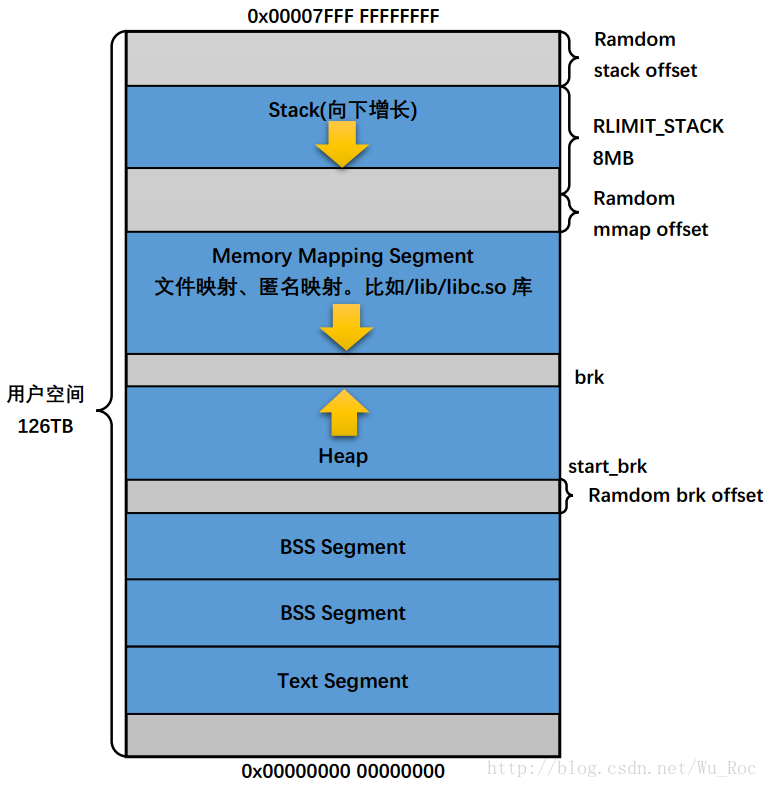

# x86-64 Virtual Address

## 1. Linux 虚拟地址布局

**x64 layout**

在 x86_64 下面，其实虚拟地址只使用了 48 位。所以 C 程序里，打印的地址都是只有 12 位 16 进制。48 位地址长度也就是对应了 256TB 的地址空间。

而在 Linux 下有效的地址区间是从 0x00000000 00000000 ~ 0x00007FFF FFFFFFFF 还有 0xFFFF8000 00000000 ~ 0xFFFFFFFF FFFFFFFF 两个地址区间。而每个地址区间都有 128TB 的地址空间可以使用，所以总共是 256TB 的可用空间。地址空间的划分就如下所示：

```text
    ffffffff`ffffffff     _____________
                          |            |
                          |   内核空间  |
    ffff8000`00000000     |____________|
                          |            |
                          |   未使用    |
                          |   的空间    |
                          |            |
    00007fff`ffffffff     |____________|
                          |            |
                          |   用户空间  |
    00000000`00000000     |____________|
```

具体的 x64 的内存布局如下图所示：



x86 架构支持 4KB,  2MB 和 4MB 三种大小的物理页面。

在 x86-64 上的分页看起来像这样：

* 页面表--页面结构的最低级别。每个都有 512 个 8 字节条目 (PTE)，它们描述一个 4 KiB 页面，因此 PT 描述了存储器的 512 * 4 KiB = 2 MiB (它也可以作为 2 MiB 页面使用，但让我们暂时保留它)。

* 页面目录--与 PT 类似的表，包含 512 个指向 PT 的 8 字节条目 (PDE)；因此，PD 描述了存储器的 512 * 2 MiB = 1 GiB(它也可以作为 1 GiB 页，类似于 PT)。

* 页目录页表--与 PD 类似，但包含指向 PD 的 512 个 8 字节条目 (PDPTE)；因此，PDPTE 描述了存储器的 512 * 1 Gib = 512 GiB。

* PML4 是最高级的分页结构，它是包含 512 个 8 字节条目 (PML4E) 的表，这些条目指向 PDPT 。因此，PML4 描述了存储器的 512 * 512 GiB = 256 TiB。

## 2. 译文

`为什么 x86-64 系统只有 48 位虚拟地址空间？`

阅读这篇文章 [wikipedia article](http://en.wikipedia.org/wiki/64-bit) 的限制部分：

> 一台 PC 不能容纳 4 PB 的内存（由于当前内存芯片的大小，如果没有其他原因的话），但 AMD 设想在可预见的未来，大型服务器、共享内存集群和其他物理地址空间的使用可能会达到这一目标，52 位物理地址提供了足够的扩展空间，同时不会产生实现 64 位物理地址的成本。

也就是说，此时无法实现完整的 64 位寻址，因为我们无法构建一个可以完全利用这样的地址空间的系统-因此我们选择了对于当今(以及未来)系统非常实用的东西。

-----

64 位虚拟地址中只有低位 48 位被使用，这不是真的，至少在 `Intel 64` 中是这样。高位 16 位也被使用了，只不过是基于 `VA` 最高的有效位做了 `sign-extended` 。

在《`Intel ® 64 和 IA-32 架构软件开发人员`》手册中的 `第 3.3.7.1 章节` -- `规范地址` 里提到:

 > 规范地址必须将 Bits 63 到 48 设置为 0 或 1（取决于 Bit 47 是 0 还是 1）。

所以第 47 位到第 63 位形成了一个超级位，要么全部为 1，要么全部是 0 。如果一个虚拟地址不是规范格式，那么则会导致 #GP 异常。进一步，当所访问的地址为栈地址时，暗示的栈访问会产生 #SS 栈异常而不是 #GP 异常(暗示的栈访问指：PUSH, POP 以及任何将 RSP 或 RBP 作为基础寄存器进行访问的指令)。

下半部分 为 `0 .. 0x7FFFFFFFFFFFFFF`，上半部分 为 `0xFFFF800000000000 .. 0xFFFFFFFFFFFFFFFF` ，这些是有效的用户和内核规范地址。

在 `AArch64` 架构上，则是不同的。根据 `ARMv8` 指令集的概述，它是一个 `49` 位的 VA。

> AArch64 内存转换系统支持 49 位虚拟地址（每个转换表 48 位）。虚拟地址从 49 位符号扩展 (sign-extended)，并存储在 64 位指针中。可选地，在系统寄存器的控制下，64 位指针的最高 8 位可能包含一个 "tag"，当用作 加载/存储 地址或间接分支的目标时，该标记将被忽略。

------

这个问题询问的是 48 位虚拟地址空间的大小(要求虚拟地址是规范的)。您确实需要比物理位更多的虚拟位，因此上半部分内核可以将所有物理内存映射到单个地址空间(其自身或用户空间)中。就像您说的那样，HW 只需要实现 DRAM 控制器+ MMIO 可以使用的尽可能多的PA位，并且可以使用 x86-64 页表格式中的任意数字，最高为 52 位限制。 (为什么在 64 位中，虚拟地址比物理地址 (52位长) 短 4 位 (长48位) ？)

4 级页表格式还强加了 48 位 VA 限制，直到 HW + SW 支持 57 位 VA 的 PML5 页表为止。无论如何，这是一个有用的答案，但似乎贴在错误的问题下。我不确定是否有更好的地方，所以我想我们可以把它留在这里，希望可以进行编辑以添加标题以说明 PA 与 VA 。

## 3. 原文

`Why do x86-64 systems have only a 48 bit virtual address space?`

Read the limitations section of the [wikipedia article](http://en.wikipedia.org/wiki/64-bit):

> A PC cannot contain 4 petabytes of memory (due to the size of current memory chips if nothing else) but AMD envisioned large servers, shared memory clusters, and other uses of physical address space that might approach this in the foreseeable future, and the 52 bit physical address provides ample room for expansion while not incurring the cost of implementing 64-bit physical addresses

That is, there's no point implementing full 64 bit addressing at this point, because we can't build a system that could utilize such an address space in full - so we pick something that's practical for today's (and tomorrow's) systems.

-----

It's not true that only the low-order 48 bits of a 64 bit VA are used, at least with Intel 64. The upper 16 bits are used, sort of, kind of.

`Section 3.3.7.1` Canonical Addressing in the Intel® 64 and IA-32 Architectures Software Developer’s Manual says:

 > a canonical address must have bits 63 through 48 set to zeros or ones (depending on whether bit 47 is a zero or one)

So bits 47 thru 63 form a super-bit, either all 1 or all 0. If an address isn't in canonical form, the implementation should fault.

On AArch64, this is different. According to the ARMv8 Instruction Set Overview, it's a 49-bit VA.

> The AArch64 memory translation system supports a 49-bit virtual address (48 bits per translation table). Virtual addresses are sign- extended from 49 bits, and stored within a 64-bit pointer. Optionally, under control of a system register, the most significant 8 bits of a 64-bit pointer may hold a “tag” which will be ignored when used as a load/store address or the target of an indirect branch

## 4. CPUID

CPUID.80000008H:EAX[7:0] 如果支持，您可以使用。

算法如下：

* 检查最大扩展 é 的价值 cpuid 有 CPUID.80000000h.EAX 。

* 如果 E > = 80000008h，则使用 CPUID.80000008H:EAX[7:0] 物理地址位数。

  CPUID.80000008H:EAX[15:8] 线性地址位数。

* 如果不是 CPUID.1:EDX.PAE（位6），则 CPU 具有 36 个物理地址位和 32 个线性地址位。

* 否则，CPU 具有 32 个物理和逻辑地址位。

英特尔的符号 CPUID.X:R B 表示：

* X - eax 之前要输入的值 cpuid。
* R - 感兴趣的输出寄存器。
* B - 格式为 [upper：lower] 的位域，或格式为 .bitname 的命名位。

AMD 将虚拟：物理地址的最大限制设置为 63:52 。尽管物理地址空间的大小可以不同，但​​是当前的实现通常是 48:40 。

可以使用 NASM 编译的示例代码：

```asm
BITS 64

GLOBAL max_phy_addr
GLOBAL max_lin_addr

SECTION .text

max_phy_addr:
   push rbx

   mov eax, 80000000h
   cpuid

   cmp eax, 80000008h
   jae .fromCpuid

   mov eax, 1
   cpuid

   mov eax, 32
   shr edx, 4
   and edx, 4

   add eax, edx

   pop rbx
   ret

.fromCpuid:
   mov eax, 80000008h
   cpuid

   movzx eax, al

   pop rbx
   ret

max_lin_addr:
   push rbx

   mov eax, 80000000h
   cpuid

   cmp eax, 80000008h
   jae .fromCpuid

   mov eax, 1
   cpuid

   mov eax, 32

   pop rbx
   ret

.fromCpuid:
   mov eax, 80000008h
   cpuid

   movzx eax, ah

   pop rbx
   ret
```

C 程序调用：

```c
#include <stdio.h>

long max_phy_addr();
long max_lin_addr();

int main()
{
    printf("Phy: %llu\nLin: %llu\n", max_phy_addr(), max_lin_addr());
    return 0;
}
```

## 5. 参考文章

1. `StackOverflow：Why do x86-64 systems have only a 48 bit virtual address space?`

    [Why do x86-64 systems have only a 48 bit virtual address space?](https://stackoverflow.com/questions/6716946/why-do-x86-64-systems-have-only-a-48-bit-virtual-address-space)

2. `（机翻）为什么 x86-64 系统只有 48 位虚拟地址空间？`

    [https://www.codenong.com/6716946/](https://www.codenong.com/6716946/)

3. `（机翻）x86-64：规范地址和实际可用范围`

    [https://qa.1r1g.com/sf/ask/2759126191/](https://qa.1r1g.com/sf/ask/2759126191/)

4. `Linux X86_64位虚拟地址空间布局与试验`

    [https://blog.csdn.net/Wu_Roc/article/details/77203480](https://blog.csdn.net/Wu_Roc/article/details/77203480)

5. `AMD64卷2-系统编程`

    [http://blog.chinaunix.net/uid-7295895-id-3011309.html](http://blog.chinaunix.net/uid-7295895-id-3011309.html)

6. `（机翻）Linux 如何在 x86-64 中支持超过 512GB 的虚拟地址范围？`

    [https://www.codenong.com/11246559/](https://www.codenong.com/11246559/)
