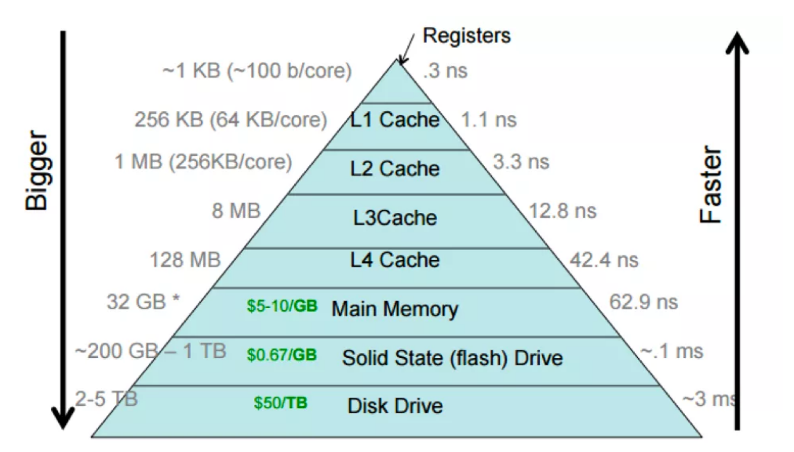
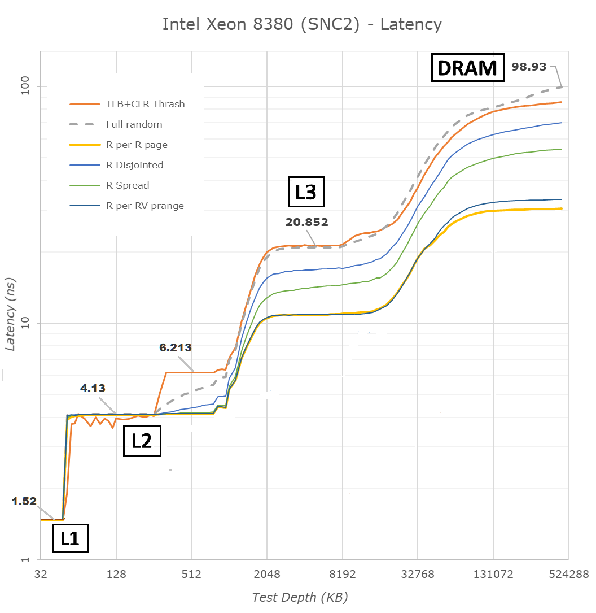
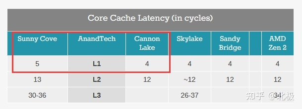

# 怎样写一个高性能的哈希表？

## 前言

很多时候，由于业务需要，在高并发环境下，为了减轻数据库的压力，提高系统的响应速度和并发吞吐量，我们会使用分布式缓存系统，或者数据库中间件。例如：`redis`、`memcached` 或 `MangoDB` 等等。应用的场景包括但不局限于 `Web` 网站和服务、互联网 `App` 服务端、电商网站秒杀活动、游戏服务端等，有时候为了更好的性能，可能也会内置哈希表或者缓存类。

分布式缓存作为公共服务器或集群，高峰时段的访问量、负载可能会很高，例如：阿里云、腾讯云的 `Redis` 云服务。那么，在服务器负载比较高的时候，提供 `KV` 服务的哈希表还能保持良好的性能吗？或者它是最优的方案吗？

## 结论

`Redis` 在负载比较高的时候，可能不是性能最好的方案。为什么呢？

我们先来看一下 `Redis` 哈希表的 Entry 节点的结构定义：

```cpp
// Redis 的哈希表节点
typedef struct dictEntry {
    // 键
    void * key;

    // 值
    union {
        void * val;
        uint64_t u64;
        int64_t s64;
    } v;

    // 链表下一个节点
    struct dictEntry * next;
} dictEntry;
```

`代码片段 01`

我们把哈希表除了 `Key`, `Value` 的值以外的额外信息称为 `MetaData`，可以看到，整个 `struct dictEntry` 真正属于 `metadata` 的是 `dictEntry * next`，一共 8 个字节（64位环境下）。`void * key` 和 `void * val` 这样的定义有其优点，但是也有缺点。优点是，像 `Key` 如果是字符串，一旦分配，就是固定的长度，不太可能会扩展，结尾也可以用 `\0` 表示，所以 `capacity` 和 `size` 可以不要，`C++ 标准库` 里的 Key，Value，定义为 `std::pair<const Key, Value>`，虽然不是 `Fixed` 的语义，但是也并不需要扩容。缺点呢，就是没有 `SSO` 优化，对于较短的字符串，直接分配在 `dictEntry` 结构体内，缓存局部性更好一点。

因为在 `C++` 里，字符串通常用 `std::string` 表示，`C++` 标准库的 `std::string` 实现一般都采用了 `SSO` 优化，`Small String Optimizatio`，下面是 `g++` (libstdc++) 的实现：

```cpp
template <typename value_type>
class basic_string {
    enum { __min_cap = 15 / sizeof(value_type) };

    pointer   __data_;                     //  8 bytes
    size_type __size_;                     //  8 bytes

    union {
        value_type __data_[__min_cap + 1]; // 16 bytes
        size_type  __cap_;                 //  8 bytes
    } __u_;                                // 16 bytes
};                                         // 32 bytes
```


当然，当负载较低时，链表式哈希表的表现还是不错的，`Redis` 是链表式哈希表。

（注：虽然 `Redis` 不仅仅只有哈希表还有别的功能，但哈希表也是其核心的功能。）

哈希表就像一个字典（`Dictionary`），

就是不同的 `Key` 经哈希函数映射到同一个桶，称作哈希碰撞。

哈希表按解决冲突的方式，可分为两大类：

* `拉链法`（Separate chaining），又称 `Chain Hash Table` 。

  每个桶 (`Bucket`) 存储一个链表的指针（首指针），把相同哈希值的不同元素放在链表中

  优点

  * 实现最简单、最直观
  * 空间浪费较少（这是不一定的）

* `开放寻址法`（Open addressing），又称 `Dense Hash Table` 。


## 2. CPU 缓存

对于 `Redis` 集群或者云服务，一台服务器跑的不止一个 `Redis` 实例，每个实例的数据容量，单位时间内访问量都是不一样的。虽然每个 `Redis` 实例都是单线程的，但多个实例之间 `CPU` 缓存是共用的。

纵使，我们只运行一个 `Redis` 实例，此时虽然不存在跟其他实例抢占缓存的情况，但在高负载下（同样差不多的 QPS 下），单实例和多实例几乎是一样的，`Redis` 的性能依然取决于各级缓存的速度和大小。如果每次哈希表操作污染的 `CPU` 缓存行 (CacheLine) 越多，各级缓存的使用总量就越多，各级缓存的 `Miss` 率也就会越大，从慢速的 `内存` 加载数据的概率也会增加。

以读操作（Find Hit）为例，假设 Key，Value 都是字符串类型，且长度都是 32 字节以内。每个哈希表的实现方式各不一样，`Redis` 采用的是拉链法，每个 `entry` 需要的额外信息 `metadata` 就是 24 个字节大小（即 `struct dictEntry`，3 个 指针类型，在 64 位模式下就是 24 个字节），假设在 `bucket` 链表里平均搜索两次就能找到所要找的 `Key`。


一次读操作会经历：

从 key 求出哈希值，再求出 bucket_index, 从 bucket 数组中读取链表首地址，此时会污染一条缓存行。再跳转该首地址指向的 dictEntry，也会污染一条缓存行。由于 dictEntry 和 key, value 在地址上大概率不是连续的，比较 key 和 dictEntry->key 是否相等时，读取 dictEntry->key 的值也会污染一条缓存行。我们假设链表的平均搜索长度为 2，所以继续再跳转到下一个 dictEntry，又会污染两条缓存行。由于 key，value 在内存上大概率是在一起的、连续的，所以 value 字符串的值大概率是跟 key 字符串在同一条缓存行内。

整个过程加起来，`1 + 2 + 2`，一共会污染 `5` 条缓存行。由于 bucket 数组数据，dictEntry 结构体，在其他读操作时，有可能已经在缓存中了，所以可以看作一次污染约 `4.5` 条缓存行。


### 1.1 L1 Cache

以 Intel 2019 年第二季度发行的至强 CPU：[Intel Xeon Platinum 8280L - 28核 56线程](https://en.wikichip.org/wiki/intel/xeon_platinum/8280l) 为例，每个核心的 L1 Data 缓存是 8 路组相连 - 32 KB 大小，L2 缓存是 16 路组相连 - 1024 KB 大小，缓存行是 64 字节。也就是说 L1 最多只有 32 x 1024 / 64 = 512 条缓存行，每读取 512 / 4.5 = 113.77 个不同的 `Key`，就会占满整个 `L1` 。这还是假设 8 个 way 都不会互相冲突的情况，如果考虑 8 路组相连可能产生的冲突，实际的 `Key` 个数会更少。

假设我们已经用哈希表读取了 `500` 个不同的 `Key`（Key1, Key2, ... Key499, Key500），让它们加载到缓存中，最终，最多也只有 `113` 个 `Key` 的值是位于 `L1` 缓存中的，也就是（Key500, Key499，... Key389, Key388）这 113 个 Key。我们再次随机读取这 500 个不同的 `Key`，最优的情况是，前 113 个读取的 Key 都在（Key500, Key499, ..., Key2, Key1）中，也就是说一定会在 L1 中命中，此时 L1 缓存的命中率是 113 / 500 = 22.6 %。最坏的情况是前 `113` 个读取的 Key 都不在 `L1` 缓存中，此时的 L1 缓存的命中率是 0 / 500 = 0 %。

我们假设这 500 个不同的 Key 都可以装进 `L2` 缓存中，那么缓存这 500 个 Key 后，再次随机读取这 500 个 Key，L1 命中率 = `0 ~ 22.6 %` 之间，L2 命中率 = `100 %` 。

### 1.2 L2 Cache

每个核心的 `L2` 缓存大小是 `1024` KB，也就是说最多有 `16384` 条缓存行。

参照上面的，我们假设已经缓存了 `10000` 个不同的 Key，`L2` 最多只能存 16384 / 4.5 = `3640.88` 个 Key，那么 `L2` 最大命中率为 ceil(16384 / 4.5) / 10000 = `36.4 %` 。

### 1.3 结论

所以，`L1` 的最大命中率是由每次读操作平均污染的缓存行数决定的，我们设该值为 `N`，L1 中最大缓存行数为 `L1CacheLines`，读操作在 L1 里最多能缓存 C = ceil(L1CacheLines / N) 个 `Key`。假设我们已经缓存的 `Key` 个数是 `KeyCount`，且一定大于 C，那么 `L1` 最大命中率等于：

```cpp
// ceil(x) 为向下取整
L1 Max Hit % = ceil(L1CacheLines / N) / KeyCount;
```

可以看到，当 `N` 的值越小，L1 最大命中率就越大，如果我们采用更好的哈希表实现方式，让每次读操作平均污染的缓存行条数减小到 2 左右，那么上面的例子中，`L1` 最大命中率就等于 (512 / 2) / 500 = `51.2 %`，从 `22.6 %` 提升到 `51.2 %`；`L2` 最大命中率就等于 (16384 / 2) / 10000 = `81.92 %` ，从 `36.4 %` 提升到 `81.92 %`，性能比对的百分百 = 4.5 / 2 = `225 %` 。

**所以，结论是，在高负载下（前提），哈希表每次读操作的平均污染缓存行数越少，性能就越高。**

这个结论对于 L1，L2，L3 缓存乃至内存，都是通用的。

以上讨论的仅仅是 `Find Hit` 的情况，读操作还有可能 `Find Miss`，则 “污染” 的缓存行会更多。同理，插入有 `Key` 已存在和 `Key` 不存在两种情况，如果是 `Insert New Key`，“污染” 的缓存行将会更多，因为插入的 `Key` 不存在已经等价于 `Find Miss`，还要处理元素的插入。链表哈希表的删除操作跟 `Find` 很接近，只多了删除 / 析构元素，修改链表的操作。

实际情况是复杂的，以上也只是从理论上的分析了 Find Hit 的情况，未考虑组相连 way 冲突（也无法估算），但平均污染缓存行数越少，整体性能可能会更高，这一点基本是不会变的。

### 1.4 缓存的延迟

并且我们知道，关于缓存、内存和硬盘的性能关系，如下：

寄存器 >= L1 缓存 > L2 缓存 > L3 缓存 > Memory内存 >= SSD固态硬盘 > 机械硬盘

对于容量，则是相反的，越快的容量越小。

`CPU` 的 `Cache` 往往是多级的金字塔模型，L1 最靠近 CPU，访问延迟最小，但 `L1 Cache` 的容量也最小。



图源：[https://cs.brown.edu/courses/csci1310/2020/assign/labs/lab4.html](https://cs.brown.edu/courses/csci1310/2020/assign/labs/lab4.html)

一般来说，前一级 Cache 是后一级 Cache 速度的 `2.5` ~ `3.5` 倍，下图是 `Intel Xeon Platinum 8380 (SNC2) - DDR4-2933` 的缓存和内存延迟实测数据，可以看到 `DRAM (内存)` 的延迟是 `L3 缓存` 的差不多 5 倍。



### 1.5 L3 Cache

从上图可以看到，`L3 Cache` 还是相当重要的，由于 `L3 Cache` 和内存的延迟相差比较大，如果内存的频率比 DDR4-2933 MHz 还低，或者是 DDR3，内存的延迟会更高。所以 `L3` 作为最后一道防线，容量大小将直接影响在高负载下程序的性能。虽然 L1 容量越大，整体性能会提高，但是 L1 做大的可能性不大，跟 `PageSize`、`L1 TLB` 以及 `set associativity` 都是相关的；同理，增大 L2 容量，也会对整体性能有提高；所以增大 `L2` 和 `L3` 缓存的大小是比较实际的方式，`AMD` 的 CPU 一直以来，`L2` 都比 Intel 的稍大一点，现在一些 `AMD` 新的服务器 CPU 的 L3 容量也是比 Intel 的大很多。

增大 `L1` 的容量目前已发售的产品中有两种方式：

1. 从 `Intel Sunny Cove`（Core 第 10 代）开始，`L1 Cache` 从 32K（指令）+ 32K（数据）的组合变成了 32K（指令）+ 48K（数据）的组合。这样做的后果是，`L1 Cache` 的访问性能下降，从 4 个 cycle 变成 5 个 cycle 。

2. `Apple M1` CPU，通过把 PageSize 从 4KB 增加到 16KB，实现了 128 KB L1-数据 + 192 KB L1-指令。同时还保证了 L1-数据 的 3 cycle 的延迟，因为只改变了 PageSize，其他没变，还是 8 way 组相连，8 x 16 KB = 128 KB ，L1 变大，对性能的提升是很大的。



`L3 缓存` 和 L1，L2 是不一样的，每个 Core 上都有独立的 L1，L2，而 `L3` 是所有 Core 共享的，整个 CPU 只有一个。有点遗憾的是，Intel 的 `L3 缓存` 是偏小的，`L3` 的总容量一般只比所有 Core 的 `L2` 缓存加起来的总量多一点点，一般是 1.2 - 1.5 倍左右。

|   名称   |  Way | 核心数 |   平均每 Core   |  总容量  |
|:--------:|:----:|:------:|----------------|----------|
|  L1 指令 |  8   |   28   | 28 x 32 KiB    | 896 KiB  |
|  L1 数据 |  8   |   28   | 28 x 32 KiB    | 896 KiB  |
|  L2      |  16  |   28   | 28 x 1.0 MiB   | 28 MiB   |
|  L3      |  11  |   28   |*28 x 1.375 MiB | 38.5 MiB |

表格数据来自：[Intel Xeon Platinum 8280L - 28核 56线程](https://en.wikichip.org/wiki/intel/xeon_platinum/8280l)

一般的服务器 CPU 的 `L3` 缓存，以 `Intel Xeon Platinum` 24 核及以上的至强服务器 CPU 为例，三级缓存大小在 `32 MB` -- `77 MB` 之间，Intel 大于 `128 MB` 的很少，AMD 新出的服务器 CPU 比较舍得堆料，大于 `128 MB` 的 L3 Cache 是很常见的。

注：腾讯云的某些云服务器采用的 48 核心 `AMD EPYC 7K62`，则拥有 `192 MB` 的三级缓存，这是本人实际使用过的三级缓存最大的 CPU。而采用 3D V-Cache 技术 64 核心的 AMD 霄龙 7773X，拥有 `768 MB` 的三级缓存。

## 2. 缓存局部性 (Cache Locatity)

所以，如果我们对哈希表的读、增、删，每次的操作对 `CPU` 缓存的污染越小，那么哈希表的总体性能可能就会越好，这就是缓存局部性（`Cache Locatity`）。

缓存局部性通常分为两种不同的形式：时间局部性 (`Temporal Locality`) 和空间局部性 (`Spatial Locality`)。

* 时间局部性 (`Temporal Locality`)

    在具有良好时间局部性的程序中，一次引用的内存位置可能在不久的将来会再次多次被引用。

* 空间局部性 (`Spatial Locality`)

    在具有良好空间局部性的程序中，如果一个内存位置被引用一次，那么该程序很可能在不久的将来引用附近的内存位置。

## 参考文章

1. `阿里云：[揭秘 cache 访问延迟背后的计算机原理]`

    [https://developer.aliyun.com/article/859576?utm_content=g_1000322648](https://developer.aliyun.com/article/859576?utm_content=g_1000322648)

2. `Intel 3rd Gen Xeon Scalable (Ice Lake SP) Review: Generationally Big, Competitively Small`

    [https://www.anandtech.com/show/16594/intel-3rd-gen-xeon-scalable-review/4](https://www.anandtech.com/show/16594/intel-3rd-gen-xeon-scalable-review/4)

3. `知乎：为什么目前x86的CPU的L1 Cache这么小？`

    [https://www.zhihu.com/question/490863861/answer/2157766409](https://www.zhihu.com/question/490863861/answer/2157766409)
