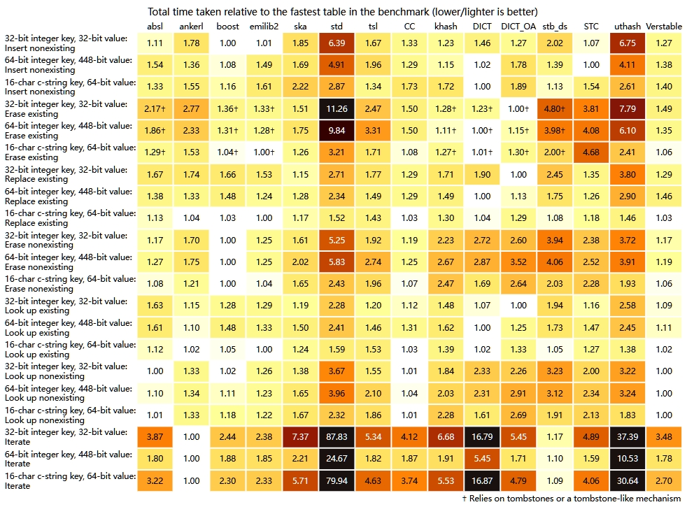

# 关于 C 和 C++ 哈希表的广泛基准测试

## 原文

原标题：[An Extensive Benchmark of C and C++ Hash Tables](https://jacksonallan.github.io/c_cpp_hash_tables_benchmark/)

链接：[https://jacksonallan.github.io/c_cpp_hash_tables_benchmark/](https://jacksonallan.github.io/c_cpp_hash_tables_benchmark/)

## 引言：为什么还要进行另一个哈希表基准测试？

尽管近年来其他人已经发布了全面的哈希表基准测试，但由于几个原因，我决定贡献另一个基准测试套件。首先，现有的基准测试主要集中在 C++ 哈希表上，而对 C 哈希表的覆盖相对较少。因此，C 程序员往往被引导使用较旧的、众所周知的库，尽管可能存在性能更优越的新库。其次，现有基准测试报告的结果大多是累积的，因此它们不能清楚地显示在特定条件下的表现，如表在特定的负载因子下，被测试表的性能。此外，一些现有的基准测试只测试一个键类型或存储桶大小，这使得很难对给定表的性能得出一般性的结论。最后的动机是个人兴趣：我最近发布了一个新颖的 C 语言通用哈希表（通过 Verstable 和 CC），我想展示它与领先的 C++ 哈希表以及其他 C 语言领域中可用的表相比如何。

## 基准测试设置

基准测试包括三种哈希表配置，旨在在不同条件下测量表的性能：

- **32位整数键，32位值**：该基准测试检查当键哈希比比较函数代价更低，遍历桶代价低（即不会引起许多缓存未命中），并且移动键值对代价低的时候，哈希表的性能如何。这些基准测试不利于在单独数组中存储元数据的哈希表，因为这样做必然会导致每次查找至少多一次缓存未命中。

- **64位整数键，448位值**：该基准测试检查当键哈希比比较函数代价更低，遍历桶代价高（在 64 字节缓存行的架构上，每个桶一个缓存未命中），并且移动键值对代价高的时候，表的性能如何。这些基准测试不利于不将元数据存储在单独数组中的哈希表（或者这样做，但每次探针无论如何都要访问桶数组以检查键）以及经常移动键值对的哈希表（例如，Robin Hood 哈希表）。

- **16字符C字符串键，64位值**：该基准测试检查当键哈希比比较函数代价更高时，表的性能如何。哈希表存储的键是指向连续分配的字符串数组中的指针。这些基准测试不利于缺乏限制键比较的元数据机制或经常重新哈希键的哈希表。

所有基准测试的哈希表都配置为使用相同的哈希函数，即整数键的 MurmurHash3finalizer 和字符串键的 FNV-1a 。

所有表的最大负载因子设置为 0.875。因此，由于所有表（GCC 下的 std::unordered_map 除外）一旦达到最大负载因子就通过加倍桶数来增长，结果显示了每个表在大约 0.44（图表中的低谷）到 0.875（图表的高峰）的负载因子范围内的性能。我选择这个限制是因为它相对较高，几个有硬编码的、不可定制的最大负载因子的表（即 absl::flat_hash_map 和 boost::unordered_flat_map ）使用它。

整数键数据集由随机打乱的连续整数组成，字符串密钥数据集由随机混洗的以 NULL 结尾的连续字符串组成。

代码是使用 GCC 13.2.0 通过 MinGW-w64 编译的，使用 `-O3` 和 `-DNDEBUG` 。基准测试锁定在 90% 频率的 AMD Ryzen 7 5800H 上运行。

至于基准测试本身，它们包括以下内容：

- **向表中插入N个不存在的键所需的总时间**：在这个基准测试中，N 个唯一键被插入到表中。在此过程中的偶数间隔，记录从基准测试开始以来经过的总时间。因此，这个基准测试的结果与其他所有基准测试不同，是累积的。

- **在表中有N个键时，删除1,000个现有键所需的时间**：在这个基准测试中，N 个唯一键被插入到表中。在此过程中的偶数间隔，删除 1,000 个键，并记录完成此操作所需的时间。这些键包括在已插入的键序列中随机选择的 1,000 个键序列。键被删除后，它们被重新插入到表中，然后继续插入唯一键的过程。

- **在表中有N个键时，替换1,000个现有键所需的时间**：在这个基准测试中，N 个唯一键被插入到表中。在此过程中的偶数间隔，重新插入 1,000 键，并记录完成此操作所需的时间。这些键包括在已插入的键序列中随机选择的 1,000 个键序列。

- **在表中有N个键时，删除1,000个不存在的键所需的时间**：在这个基准测试中，N 个唯一键被插入到表中。在此过程中的偶数间隔，调用删除函数删除 1,000 个未插入的键，并记录完成此操作所需的时间。这些键包括在从未插入的键的单独序列中随机选择的 1,000 个键序列。

- **在表中有N个键时，查找1,000个现有键所需的时间**：在这个基准测试中，N 个唯一键被插入到表中。在此过程中的偶数间隔，查找1,000个键，并记录完成此操作所需的时间。这些键包括在已插入的键序列中随机选择的 1,000 个键序列。

- **在表中有N个键时，查找1,000个不存在的键所需的时间**：在这个基准测试中，N 个唯一键被插入到表中。在此过程中的偶数间隔，调用查找函数查找1,000个未插入的键，并记录完成此操作所需的时间。这些键包括在从未插入的键的单独序列中随机选择的 1,000 个键序列。

- **在表中有N个键时，遍历5,000个键所需的时间**：在这个基准测试中，N 个唯一键被插入到表中。在此过程中的偶数间隔，遍历表中的 5,000 个键，并记录完成此操作所需的时间。遍历开始的位置是通过查找已插入键序列中的随机键找到的。

上述基准测试中，《在表中有 N 个键时，替换 1,000 个现有键所需的时间》、《在表中有 N 个键时，删除 1,000 个不存在的键所需的时间》、《在表中有 N 个键时，查找 1,000 个现有键所需的时间》、《在表中有 N 个键时，查找 1,000 个不存在的键所需的时间》和《在表中有 N 个键时，遍历 5,000 个键所需的时间》是作为插入 N 个唯一键的同一过程的一部分并行执行的。

这个基准测试设置有一些局限性。首先，测试的负载因子范围如前所述大约是 0.44 到 0.875 。因此，结果不显示在较低负载因子下的性能。由于一些表的默认最大负载因子低至 0.5，它们主要在超出其作者预期的负载因子范围内进行测量。其次，基准测试不测量内存使用情况。然而，至少每个开放寻址表的内存使用情况可以根据它能够合理容忍的最大负载因子和每个桶的内存开销来估计。第三，尽管选择 MurmurHash3finalizer 作为整数哈希函数确保了所有表在平等的基础上竞争，没有一个因弱哈希函数而受损，但它可能不利于能够容忍快速但弱哈希函数的表（例如，默认的整数哈希函数 std::unordered_map 通常是恒等函数，而 ankerl::unordered_dense、absl::flat_hash_map、boost::unordered_flat_map、CC 的 cc_map 和 Verstable 都需要或受益于提供哈希码所有位上的熵的哈希函数）。最后，基准测试很少显示墓碑对依赖它们的表的性能的累积影响，当擦除频繁时。

基准测试的完整代码可在 [此处](https://github.com/JacksonAllan/c_cpp_hash_tables_benchmark) 获得。

## 基准测试的哈希表

### C++ 哈希表

- [absl::flat_hash_map](https://github.com/abseil/abseil-cpp) v20240116.2：

由 Google 开发，这个表在 Abseil 网站上以及通过两次演讲得到了充分的记录。它是一个开放寻址表，存储每个键的哈希码的 7 位片段在单独的数组中，并使用 SIMD 指令一次扫描 16 个桶的潜在键匹配。它依赖墓碑进行擦除。

这个表的近似内存开销是每个桶一个字节，加上键值对填充，除了空桶的键值对大小。

- [ankerl::unordered_dense](https://github.com/martinus/unordered_dense) v4.1.2：

这个表采用 Robin Hood 排序——这是一种开放寻址变体，它移动键值对以保持它们从哈希到的桶的位移尽可能恒定——结合线性探测。然而，它对 Robin Hood 设计做了两个补充。首先，它不是在表的桶内存储键值对，而是在单独的数组中连续存储。表桶存储此数组的索引。其次，它存储每个键的哈希码的8位片段，以限制直接比较键的需要。这个表是同一作者早期表的后继者，我之所以没有在本文中包括早期的表，是因为它已被弃用，并且在我早期的测试中被证明较差。

默认情况下，这个表只能容纳 2^32（42.9亿）键值对。支持更高数量可以在额外内存使用和较少缓存友好性的代价下启用。对于这些基准测试，我使用了默认限制。

在 x86-64 上，这个表的近似内存开销是每个桶八个字节（或者对于可以容纳超过 2^32 键值对的表是 12 个字节），加上键值对填充，除了空桶的键值对大小。

- [boost::unordered_flat_map](https://www.boost.org/doc/libs/1_85_0/libs/unordered/doc/html/unordered.html) v1.85.0：

这个表也是一个开放寻址表，存储哈希码片段在单独的数组中，并使用SIMD指令一次扫描多个桶的潜在键匹配。然而，它与 absl::flat_hash_map 有几个重要的不同。首先，键不是哈希到单个桶，而是哈希到 15 个桶组，这些组从一个端到另一个端连续填充：

其次，哈希码片段由 7.99 位而不是 7 位组成。第三，表不使用墓碑，而是使用其作者称之为“overflow byte”的组级布隆过滤器，这也加速了查找不存在的键（下面，我将这种机制视为“tombstone-like (类墓碑的)”，因为擦除仍然会对表的性能留下残留影响，并导致更频繁的全表重新哈希）。上述细节等更多内容通过演讲记录。

这个表的近似内存开销是每个桶 1.07 个字节，加上键值对填充，除了空桶的键值对大小。

为了方便与这个基准测试项目一起分发，我选择了使用第三方提供的这个表的 [合并单头版本 (amalgamated single-header version)](https://github.com/MikePopoloski/boost_unordered)。然而，Boost.Unordered，包含这个表的 Boost 模块，也可以从官方源直接单独获得和安装。

- [emilib2::HashMap](https://github.com/ktprime/emhash/tree/master/thirdparty/emilib)：

这个表是另一个使用 SIMD 指令一次扫描多个哈希码片段以寻找潜在键匹配的开放寻址表。该库仍在开发中，关于其实现的细节稀少且可能变化。其近似内存开销是每个桶 1.25 个字节，加上键值对填充，除了空桶的键值对大小。

基准测试的版本是emilib2o.hpp 434a205，我修改了它以将最大负载因子设置为 0.875。

- [ska::bytell_hash_map](https://github.com/skarupke/flat_hash_map/blob/master/bytell_hash_map.hpp)：

这个表是其作者对各种哈希表设计的实验成果，包括 Robin Hood 和 SIMD 加速表。它通过他交付的演讲得到了最充分的记录。该表是开放寻址和分离链表的混合体。从一个桶溢出的键值对存储在同一数组的其他空桶中，并使用 7 位“跳转距离”（索引到硬编码的可能距离数组，以桶为单位，到链中的下一个键值对）链式连接。这种元数据组——即 7 位跳转距离与1位标志——与桶组交错存储（每 16 个字节的元数据后面跟着 16 个相应的桶）。这种设计与称为合并哈希的旧技术相似，只是链不合并。

这个表的近似内存开销是每个桶一个字节，加上键值对填充，除了空桶的键值对大小。

不幸的是，该库似乎无人维护。

- [std::unordered_map](https://en.cppreference.com/w/cpp/container/unordered_map) from GCC 13.2.0：

这是许多开发者的首选哈希表，因为它是C++标准库的一部分。虽然实现可能在细节上有所不同，但C++标准施加的约束实际上规定了这个表使用基于节点的分离链表，而不是开放寻址。

在 x86-64 上，这个表的近似内存开销是每个桶八个字节，以及每个键值对八个字节，加上指针键值对填充和 malloc 头和填充。然而，由于许多小分配引起的可用内存碎片化，其实际内存影响可能更大。

- [tsl::robin_map](https://github.com/Tessil/robin-map) v1.3.0：

这是另一个流行的 Robin Hood 表。与 ankerl::unordered_dense 不同，它在桶数组内存储键值对、它们从理想桶的位移，以及（在某些条件下）哈希码。因此，它是一个更传统的 Robin Hood 设计的实现。

在 x86-64 上，这个表的近似内存开销是每个桶三个字节，加上 uint16_t-bool-键值对 填充，除了空桶的键值对大小。

### C 哈希表

- cc_map from [CC](https://github.com/JacksonAllan/CC) v1.1.1：

这个表在 CC 的 API 约束内实现 Verstable。详见下文。

- khash from [klib](https://github.com/attractivechaos/klib) v0.2.8：

这是一个非常流行的开放寻址表，默认使用二次探测。它将键和值存储在两个单独的数组中（除了第三个元数据数组），而不是交错在一个桶数组中。这种选择通过消除填充字节节省了内存，但这意味着查找现有键必然涉及额外的缓存未命中。该表依赖墓碑进行擦除。

这个表的近似内存开销是每个桶 0.25 个字节，除了空桶的键和值的大小。

请注意，klib 还包括一个较新的哈希表，称为 khashl，使用线性探测而没有墓碑。这个表没有包括在这些基准测试中。

- DICT from [M*LIB](https://github.com/P-p-H-d/mlib) v0.7.3：

这是另一个默认使用二次探测的开放寻址表。像 ankerl::unordered_dense 和 stb_ds 的 hm 和 sh（下面描述）一样，它在数组中单独存储键值对，而不是在桶数组中。桶数组存储索引到键值对数组，以及哈希码。与其他两个表不同，擦除时它不将数组中的最后一个键值对向后移动以填补创建的空白（这个过程需要另一个查找以更新存储在桶数组中的移动对的索引）。擦除依赖墓碑。

这个表也只能容纳 2^32 键值对，默认情况下，启用支持更高数量会影响内存使用和缓存效率。对于这些基准测试，我使用了默认限制。

这个表的近似内存开销是每个桶八个字节（或者对于可以容纳超过 2^32 键值对的表是 16 个字节），加上键值对填充，除了空桶的键值对大小。

- DICT_OA from [M*LIB](https://github.com/P-p-H-d/mlib) v0.7.3：

像 DICT 一样，DICT_OA 是一个默认使用二次探测的开放寻址表。然而，它更传统，因为它在表桶内存储键和值。它的突出特点是，它不存储每个桶的元数据，而是要求用户预留两个键以标记空桶和墓碑。因此，该表通常可以更密集地存储数据，因此更缓存友好。对于涉及整数键的基准测试，我选择预留两个整数值作为这些哨兵（而不是手动将每个键与额外的标志配对），以便该表可以利用这个特性。然而，当这样配置时，这个表在技术上不能容纳其他表可以容纳的完整键范围。

这个表的近似内存开销只是每个桶的键值对填充和每个空桶的键值对大小。

请注意，_OA 后缀作为区分这个表和 M*LIB 的类似命名 DICT 的表的手段，是一个出于与早期版本库的 API 向后兼容性而存在的误称，其中 DICT 使用分离链表。现在，DICT 和 DICT_OA 都是开放寻址表。

- hm 和 sh from [stb_ds](https://github.com/nothings/stb/blob/master/stb_ds.h) v0.67：

和 ankerl::unordered_dense 一样，它不直接在哈希表桶中存储键值对，而是连续存储在一个单独的数组中。这个表也在字符串键和所有其他数据类型键的实现之间进行了分割。它依赖墓碑进行擦除。

不幸的是，这个表提供很少的灵活性：要自定义哈希函数、比较函数和最大负载因子，我不得不修改库头文件。尽管如此，我决定将这个库包括在基准测试中，因为它非常受欢迎。

在 x86-64 上，这个表的近似内存开销是每个桶 16 个字节，加上键值对填充，除了空桶的键值对大小。

- hmap from [STC](https://github.com/stclib/STC) v5.0 beta 4：

这个表是一个使用线性探测的开放寻址表。然而，它存储每个键的哈希码的 7 位片段在单独的数组中，以限制直接键比较。这个表的一个不寻常特点是，它不依赖墓碑，而是在给定桶擦除时将随后的键值对，其探测序列包括该桶，向后移动以填补空白。这种技术通常由 Robin Hood 表使用，而不是传统的线性探测表。

这个表的近似内存开销是每个桶一个字节，加上键值对填充，除了空桶的键值对大小。

- [uthash](https://troydhanson.github.io/uthash) v2.3.0：

这是基准测试中包括的最古老和可能最受欢迎的 C 哈希表。像 std::unordered_map 一样，它是基于节点的分离链表表。与其他表相比，它提供的功能是基础的，用户必须自己编写大部分脚手架。它也是这些基准测试中唯一的侵入性表。

在 x86-64 上，这个表的近似内存开销是每个桶 16 个字节和 56 个字节，加上 malloc 头和填充（假设用户单独分配键值对）和键值对填充，每个键值对。

uthash 要求与每个键值对嵌入的 56 字节结构（代码注释省略）：

```c
typedef struct UT_hash_handle {
 struct UT_hash_table *tbl;
 void *prev;
 void *next;
 struct UT_hash_handle *hh_prev;
 struct UT_hash_handle *hh_next;
 const void *key;
 unsigned keylen;
 unsigned hashv;
} UT_hash_handle;
```

- [Verstable](https://github.com/JacksonAllan/Verstable) v2.1.0：

像 ska::bytell_hash_map 一样，这个表是开放寻址和分离链表的混合体，存储从一个桶溢出的键值对在桶数组的其他空桶中。然而，它不是使用 7 位索引到“跳转距离”数组来链式连接键值对，而是使用表示二次位移的 11 位整数。它还存储每个键的哈希码的4位片段以限制键比较。因此，它使用每个桶两字节的元数据，而不是 ska::bytell_hash_map 使用的一个字节。元数据存储在单独的数组中，而不是与桶组交错。

这个表的近似内存开销是每个桶两字节，加上键值对填充，除了空桶的键值对大小。

当然，接下来是文章的继续翻译：

## 结果

由于结果图中的水平尺度是线性的，不是对数的，我针对三个不同的总键值计数运行了基准测试。一般来说，键值计数越低，表在缓存中越热。以下是结果：

- [0 到 200,000 个键](https://jacksonallan.github.io/c_cpp_hash_tables_benchmark/result_2024-05-28T04_06_21.html)
- [0 到 2,000,000 个键](https://jacksonallan.github.io/c_cpp_hash_tables_benchmark/result_2024-05-28T03_27_39.html)
- [0 到 20,000,000 个键](https://jacksonallan.github.io/c_cpp_hash_tables_benchmark/result_2024-05-28T01_53_46.html)

由于我每个键值计数运行了 14 次基准测试，图中显示的每个数据点代表了 10 次记录的平均值（我排除了 两个最高 和 两个最低 的记录，以限制异常值和任何背景处理的影响）。

图表是交互式的。将鼠标悬停在表的标签上以突出显示相关的图表，单击它以切换图表的可见性。图表自动缩放到可见的图表。

下面显示的是 0 到 20,000,000 个键的图表。点击此处跳转到总结这些图表中显示的数据的热图。

- 32位整数键，32位值：插入N个不存在的键所需的总时间

- 64位整数键，448位值：插入N个不存在的键所需的总时间

- 16字符C字符串键，64位值：插入N个不存在的键所需的总时间

- 32位整数键，32位值：在表中有N个键时，删除1,000个现有键所需的时间

- 64位整数键，448位值：在表中有N个键时，删除1,000个现有键所需的时间

- 16字符C字符串键，64位值：在表中有N个键时，删除1,000个现有键所需的时间

- 32位整数键，32位值：在表中有N个键时，替换1,000个现有键所需的时间

- 64位整数键，448位值：在表中有N个键时，替换1,000个现有键所需的时间

- 16字符C字符串键，64位值：在表中有N个键时，替换1,000个现有键所需的时间

- 32位整数键，32位值：在表中有N个键时，删除1,000个不存在的键所需的时间

- 64位整数键，448位值：在表中有N个键时，删除1,000个不存在的键所需的时间

- 16字符C字符串键，64位值：在表中有N个键时，删除1,000个不存在的键所需的时间

- 32位整数键，32位值：在表中有N个键时，查找1,000个现有键所需的时间

- 64位整数键，448位值：在表中有N个键时，查找1,000个现有键所需的时间

- 16字符C字符串键，64位值：在表中有N个键时，查找1,000个现有键所需的时间

- 32位整数键，32位值：在表中有N个键时，查找1,000个不存在的键所需的时间

- 64位整数键，448位值：在表中有N个键时，查找1,000个不存在的键所需的时间

- 16字符C字符串键，64位值：在表中有N个键时，查找1,000个不存在的键所需的时间

- 32位整数键，32位值：在表中有N个键时，遍历5,000个键所需的时间

- 64位整数键，448位值：在表中有N个键时，遍历5,000个键所需的时间

- 16字符C字符串键，64位值：在表中有N个键时，遍历5,000个键所需的时间

## 测试结果一览表

相对于基准中最快的表所花费的总时间（越低/越轻越好）



## 分析

以下是我对上述结果的分析，特别是显示的 0 到 20,000,000 键的图表。当然，这个（和下一个）部分有点主观。因此，我鼓励寻找哈希表库的读者也检查图表和热图本身，记住他们特定的需求。

- **absl::flat_hash_map**：这个表的插入非常快，除非桶很大。它删除现有键的速度很快，但并不是最快的竞争者，特别是当我们考虑到它依赖墓碑。它查找和删除不存在的键非常快。然而，它查找和替换现有键的速度对于大桶和字符串键只是中等快，对于小桶和整数键相对较慢（尽管在 0 到 200,000 键的基准测试中它们更有竞争力）。它的遍历速度很快，尽管不如其他 SIMD 表、Verstable 或存储键值对连续的表快。

- **ankerl::unordered_dense**：这个表的查找速度很快，特别是当其负载因子低于默认限制 0.8 时。然而，它的插入对于大桶和字符串键只是中等快，对于小桶和整数键慢。对于查找和删除不存在的键，它比其他 Robin Hood 表（tsl::robin_map）和传统的线性和二次探测开放寻址表快。它在大多数基准测试中的性能依赖于负载因子，但不如其他表那么依赖。可预测的是，它的遍历速度非常快：因为键值对连续存储，遍历相当于遍历一个数组。

- **boost::unordered_flat_map**：这个表的插入和删除现有键非常快（尽管如前所述，删除留下了通过“溢出字节”机制的残留性能影响）。对于查找和删除不存在的键，它是测试中最快的表之一。它对于查找现有整数键相当快（但不是最快的竞争者，特别是对于大桶）。它对于查找字符串键也非常快。它的遍历速度也非常好，得益于在每个桶组内聚集键值对，只有存储键值对连续的表明显更快。这个表在低键计数（0 到 200,000 键）基准测试中的性能优势更大，这表明它比其他表更受益于缓存。

- **emilib2::HashMap**：这个表的性能非常接近 boost::unordered_flat_map 的性能。最主要的区别是查找和删除不存在的键要慢得多。像 boost::unordered_flat_map 一样，这个表的整体速度相对于其他表最快是在低键计数基准测试中。

- **ska::bytell_hash_map**：这个表对于整数键的查找相对较快（但对字符串键的竞争力不强，可能是由于缺乏基于哈希码片段限制键比较的机制）。它删除现有键也很快（虽然不如最快的竞争者快）。然而，它的插入很慢。它的遍历也很慢，尽管它使用单独的元数据数组。其他使用类似机制的测试表——包括 Verstable，必须遍历两倍的元数据——在这方面明显更快。这种差异是因为在遍历过程中，ska::bytell_hash_map 没有利用编译器内联函数一次扫描多个桶以寻找下一个占用的桶。此外，这个表依赖于常量“跳转距离”数组对实际性能的影响，当足够多的其他工作在哈希表操作之间进行以将其从缓存中冲洗出来时，仍然是一个开放的问题。

- **std::unordered_map**：这个表在大多数基准测试中比大多数开放寻址表慢得多，除了查找现有键的情况，其中它的性能与最慢的开放寻址表相当。这种糟糕的性能是由于指针追逐和需要单独为节点分配和释放内存。特别是遍历性能，至少比其他开放寻址表慢一个数量级。

- **tsl::robin_map**：这个表对于插入字符串键很快。然而，它在大多数其他基准测试中的性能从平均到慢不等，并且非常依赖于负载因子。当然，如果将其最大负载因子保持在非常低的默认值 0.5，这个表会更有竞争力。

- **cc_map from CC**：《免责声明：我是这个表的作者》。由于CC实现了与Verstable相同的哈希表设计，它的结果与Verstable的结果相似，并且适用相同的评论。然而，它的遍历——虽然快——比Verstable的遍历慢一些。这是因为CC中的遍历器是桶的原始指针，而不是包含指向桶和相应元数据的指针的结构。因此，cc_map必须执行额外的计算以定位当前桶的元数据。

- **khash from klib**：这个表的插入速度相当好，特别是对于整数键。它删除现有键也很快（但依赖于墓碑）。然而，它查找现有键相对较慢，查找和删除不存在的键也是如此。它的遍历也相当慢，对于一个开放寻址表来说。

- **DICT from M*LIB**：这个表的插入速度很快（特别是对于大桶的字符串键）。它查找现有键也非常快。它删除现有键也很快（尽管依赖于墓碑）。然而，它查找或删除不存在的键相当慢。它的遍历也比其他开放寻址表慢 2-3 倍，尽管存储键值对在单独的数组中。这是因为键值对数组中潜在的空白阻止了直接遍历它而不需要参考存储8个或16个字节每个桶的桶数组，因此不是特别缓存友好。

- **DICT_OA from M*LIB**：这个表查找整数键的速度非常快——在 0 到 20,000,000 键基准测试中是所有表中最快的，当桶小时。在这方面，这个表可能受益于选择让用户预留哨兵值而不是存储元数据，从而获得更好的缓存性能。然而，它查找或删除不存在的键相对较慢，插入和遍历速度平均。它删除整数键的速度非常快，但依赖于墓碑。

- **hm and sh from stb_ds**：hm 很慢——在开放寻址表中最慢——在大多数基准测试中。特别是，它查找现有和不存在的键以及删除不存在的键的性能与基于节点的表相似。sh 表现得更好一些，插入、替换和查找现有键的速度很快，但在删除和查找不存在的键方面表现一般。像 ankerl::unordered_dense 一样，这些表提供了接近完美的遍历速度，因为它们存储键值对连续。

- **hmap from STC**：这个表插入整数键的速度非常快，无论桶的大小如何。它查找现有键也相当快，遍历性能在平均以上。然而，它在查找和删除不存在的键方面相对较慢。它删除现有键也相当慢，对于整数键来说，对于字符串键来说非常慢。这是由于向后移动删除机制。虽然这种机制消除了对墓碑的需求，但它需要移动许多键值对，并重新哈希每个可能需要移动的键以确定它哈希到的桶（这个问题对于必须存储位移、理想桶索引或哈希码的 Robin Hood 表不存在）。因此，当删除频繁且哈希函数昂贵时，我建议用户手动计算并存储每个键的哈希码作为结构的一部分，并提供一个简单的返回预计算哈希码的哈希函数给表。

- **uthash**：我对 std::unordered_map 的糟糕性能的评论也适用于 uthash。然而，uthash 的遍历速度是 std::unordered_map 的两倍（尽管仍然非常慢）。它的作者似乎意识到它的性能不再具有竞争力，因为它的文档包括以下注释：

> 当 uthash 被编写时，用于 C 中通用哈希表的选项比今天存在的要少。今天有更快的哈希表，更内存高效的哈希表，具有非常不同的 API。但是，像开小型货车一样，uthash 是方便的，并且适用于许多目的。

- **Verstable**：《免责声明：我是这个表的作者》。这个表查找现有和不存在的键都很快（实际上，它在桶大时拥有一些最快的查找整数键的速度）。它删除现有键的速度几乎和大多数依赖墓碑或类似墓碑机制的表一样快，尽管它提供真正的删除。它查找和删除不存在的键非常快。它的遍历性能也很好，仅次于 boost::unordered_flat_map、emilib2::HashMap 和存储键值对连续的表。然而，它的插入速度只是平均水平。

我想以一些关于哈希表设计的一般观察来结束。首先，这些基准测试再次表明，基于节点的分离链表表是慢的。其次，传统的使用线性或二次探测的开放寻址表非常容易受到负载因子的影响。Robin Hood 表也是如此，尽管经常声称这类表的合理默认最大负载因子是 0.9。第三，SIMD 和混合开放寻址/分离链表表大多不受高负载因子的影响。这两种设计以非常不同的方式实现了这种对负载因子的抵抗力：前者最大化了一次探测的桶数，而后者将探测的桶限制在包含哈希到查找键的理想桶的键的几个桶内。最后，SIMD、混合和 Robin Hood 表都限制了完成操作所需时间的方差。这反映在它们的图表的稳定性与其它表的图表相比。

## 结论：选择哪个哈希表？

在 C++ 中，boost::unordered_flat_map 似乎是全方位表现最好的，特别是在缓存热的时候。因此，它是一个很好的默认选择。然而，ankerl::unordered_dense 提供了最佳的遍历速度，在其他基准测试中表现合理，并且是一个独立的头文件。因此，如果遍历速度是您最重要的因素，或者您更喜欢单一头文件解决方案，它是一个很好的选择。它还提供了更快的查找，特别是当桶大且保持低负载因子时。emilib2 显示出很大的潜力，一旦准备好供公众使用，可能是 boost::unordered_flat_map 的一个好替代品。

在 C 中，结果表明 Verstable 和 CC 的 cc_map 是全方位表现优秀的，前者在遍历上更快。然而，它们并不是每个场景中表现最好的。如果您的用例偏向于特定操作或数据对，那么考虑其他选项是值得的，特别是如果您愿意使用低最大负载因子。特别是，STC 的 hmap 在插入整数键方面更快，M*LIB 的 DICT 拥有最快的查找现有整数键速度，stb_ds 的 hm 和 sh 具有最快的遍历速度。尽管在基准测试中没有显示，klib 的 khash 通常具有测试表中最低的内存开销，因此当内存有限时，它或消耗更少内存的 khashl 可能是最佳选择。

STC 的 hmap、klib 的 khash 和 M*LIB 的 DICT 和 DICT_OA 都是大型综合库的一部分。这些库的其他特性对您的有用性也是选择它们的一个重要原因。

另一方面，uthash 应该被避免，因为它的全面性能较差，除非你需要侵入性或基于节点的表的特定品质。

最后，我必须警告，一些 C 哈希表引发了可移植性问题。uthash 和 stb_ds 的 hm 默认逐字节哈希和比较键。这不仅对包含填充字节的结构体构成问题，而且至少在理论上对基本整数类型也构成问题，它们可能包含填充位（[6.2.6.2](https://www.open-std.org/jtc1/sc22/wg14/www/docs/n3096.pdf)）。stb_ds 的问题尤其明显，因为它不提供让用户自定义哈希和比较函数的方式（除了修改库）。

## 附录：Verstable与CC的cc_map

上述结论可能会让读者对 Verstable 和 CC 的 cc_map 之间的区别感到好奇，这两种都使用相同的混合设计，在性能之外的上下文中。简而言之，Verstable 是一个独立的哈希表库。它需要 C99 或更高版本，并且要求用户为每种键和值数据类型的组合实例化一个伪模板（这在高性能 C 容器库中很常见）。它还提供对自定义内存分配器的全面支持。另一方 C11 或更高版本和编译器支持 `typeof`（这是 C23 的标准），并且它对自定义内存分配器的支持更有限。

## 致谢

我要感谢 [Joaquín M López Muñoz](https://github.com/joaquintides)、[Martin Leitner-Ankerl](https://github.com/martinus)、[Patrick Pelissier](https://github.com/P-p-H-d) 和 [Attractive Chaos](https://github.com/attractivechaos) 在本文起草过程中提供的宝贵反馈。

## 讨论

本文的评论在 [此处](https://github.com/JacksonAllan/c_cpp_hash_tables_benchmark/discussions/1)。

本文还在 Reddit 的 [r/C_Programming](https://www.reddit.com/r/C_Programming/comments/1d3i962/an_extensive_benchmark_of_c_and_c_hash_tables/) 和 [r/cpp](https://old.reddit.com/r/cpp/comments/1d418aw/an_extensive_benchmark_of_c_and_c_hash_tables/) 上进行了讨论。
