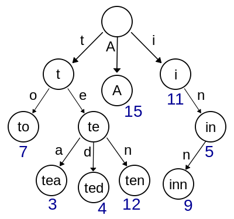

=
# String Matching (字符串匹配算法)

* `EXACT STRING MATCHING ALGORITHMS (Animation in Java)`

    [http://www-igm.univ-mlv.fr/~lecroq/string/]()

    经典的字符串算法介绍。

* `字符串匹配算法的分析`

    [https://www.cnblogs.com/adinosaur/p/6002978.html]()

    1. 朴素算法(Brute Force算法)
    2. Rabin-Karp算法
    3. 有限状态自动机
    4. KMP算法

* `几种常见的字符串匹配算法`

    [https://blog.csdn.net/qingkongyeyue/article/details/53464437]()

    1. 朴素算法(Brute Force算法)
    2. Rabin-Karp算法
    3. KMP算法
    4. Boyer-Moore算法
    5. Sunday算法

* `字符串匹配算法KMP详细解释——深入理解`

    [https://blog.csdn.net/FX677588/article/details/53406327]()

* `AC 自动机的实现`

    [http://nark.cc/p/?p=1453]()

    我们已使用 terark.com 进行商业化运营, 产品包括: 数据库, 存储引擎, 多模匹配 多正则匹配, 输入纠错等。

* `AC 自动机算法详解`

    [https://www.cnblogs.com/UnGeek/p/5734844.html]()

    AC自动机：Aho-Corasick automation，该算法在1975年产生于贝尔实验室，是著名的多模匹配算法之一。

* `深入理解 Aho-Corasick 自动机算法`

    [https://blog.csdn.net/lemon_tree12138/article/details/49335051]()

    还不错的 AC 自动机算法介绍的文章。

* `多模式串匹配 之 AC自动机算法（Aho-Corasick算法）简介`

    [http://lzw.me/a/1274.html]()

    AC 自动机算法全称 Aho-Corasick 算法，是一种字符串多模式匹配算法。该算法在1975年产生于贝尔实验室，是著名的多模匹配算法之一。

* `字典树（Trie tree）`

    [https://www.cnblogs.com/rollenholt/archive/2012/04/24/2468932.html]()

    Trie，又称单词查找树或键树，是一种树形结构，是一种哈希树的变种。典型应用是用于统计和排序大量的字符串（但不仅限于字符串），所以经常被搜索引擎系统用于文本词频统计。它的优点是：最大限度地减少无谓的字符串比较，查询效率比哈希表高。

    

* `如何更好的理解和掌握 KMP 算法?`

    [https://www.zhihu.com/question/21923021]()

    回答者：陈硕

    为什么要执着于 KMP 呢？

    glibc 2.9 之后的 strstr() 在一定情况下会用高效的 [Two Way algorithm](https://www-igm.univ-mlv.fr/%7Elecroq/string/node26.html)，之前的版本是普通的二重循环查找，因此用不着自己写。

    而且 glibc 的作者一度也写错过： 
    https://sourceware.org/bugzilla/show_bug.cgi?id=12092 。

    ps: strstr() 还不止一次出过 bug： 
    https://sourceware.org/bugzilla/show_bug.cgi?id=12100 
    https://sourceware.org/bugzilla/show_bug.cgi?id=14602 
    等等。

    其他：[c - What is the fastest substring search algorithm?](https://stackoverflow.com/questions/3183582/what-is-the-fastest-substring-search-algorithm)

* `SSE 4.2 带来的优化`

    [https://www.zzsec.org/2013/08/using-sse_4.2/]()

    PCMPESTRI，PCMPESTRM，PCMPISTRI 和 PCMPISTRM 指令。

    * [http://www.strchr.com/strcmp_and_strlen_using_sse_4.2]()
    * [http://www.intel.com/content/dam/www/public/us/en/documents/manuals/64-ia-32-architectures-software-developer-vol-2b-manual.pdf]()

* `Implementing strcmp, strlen, and strstr using SSE 4.2 instructions`

    [https://www.strchr.com/strcmp_and_strlen_using_sse_4.2]()

    strcmp_sse42(), strlen_sse42(), strstr_sse42() 。

* `PCMPxSTRx 命令の使い方`

    [http://www.nminoru.jp/~nminoru/programming/pcmpxstrx.html]()

    一篇介绍 PCMPxSTRx 指令详细用法的日文文章，还不错，我已经翻译成中文了。

* `strstr() 与 Intel SSE 指令集优化`

    [https://www.jianshu.com/p/d718c1ea5f22]()

    还不错，做个各个版本的性能比较。

* `字符串匹配的KMP算法`

    [http://www.ruanyifeng.com/blog/2013/05/Knuth%E2%80%93Morris%E2%80%93Pratt_algorithm.html]()

    Knuth-Morris-Pratt 算法（简称KMP）是最常用的之一。它以三个发明者命名，起头的那个 K 就是著名科学家 Donald Knuth。

* `字符串匹配的Boyer-Moore算法`

    [http://www.ruanyifeng.com/blog/2013/05/boyer-moore_string_search_algorithm.html]()

    Boyer-Moore 算法不仅效率高，而且构思巧妙，容易理解。1977年，德克萨斯大学的 Robert S. Boyer 教授和 J Strother Moore 教授发明了这种算法。

* `从头到尾彻底理解KMP（2014年8月22日版）`

    [https://blog.csdn.net/v_JULY_v/article/details/7041827#t17]()

    介绍了 KMP 算法、BM 算法和 Sunday 算法，图片貌似取自阮一峰的文章，但对 KMP 的算法介绍比阮一峰更为详细。。

* `字符串匹配——Sunday算法`

    [https://blog.csdn.net/q547550831/article/details/51860017]()

    Sunday 算法由 Daniel M.Sunday 在 1990 年提出，它的思想跟 BM 算法很相似。只不过 Sunday 算法是从前往后匹配，在匹配失败时关注的是主串中参加匹配的最末位字符的下一位字符。

    本文还提供了 Sunday 算法的 C++ 实现。

* `Boyer–Moore–Horspool文本匹配算法(BM 算法的简化版)`

    [https://blog.csdn.net/ljsspace/article/details/6554555]

    本文介绍 Boyer-Moore 算法的一个简化版本，叫做 Boyer–Moore–Horspool 算法或直接叫做 Horspool 算法。

    英语里有句习语叫 "find a needle in a haystack"，译成中文叫 "大海捞针"（原意是在一堆干草中寻找一根针）。计算机中的文本匹配 (string matching) 就是要解决怎样在一段很长的文本中找到符合要求的一个子串，该子串通常叫模式串 (pattern)，也就是对应我们要找的 “针”。常用的文本精确匹配 (exact string matching) 算法有蛮力法 (brute-force)，Boyer-Moore 算法和 KMP 算法。

    BM 算法和本文中介绍的它的简化版本 Horspool 算法，在最佳情况下的时间复杂度是 O(n/m)，因此对模式串比较长的情况（比如长度大于 5）应用该算法比较有效。

* `字符串模式匹配算法——BM、Horspool、Sunday、KMP、KR、AC算法一网打尽`

    [http://dsqiu.iteye.com/blog/1700312]()

    介绍了多种字符串匹配算法，虽然可能不够经典，但相对来说一个比较全面的文章。

* `x86/x64 SIMD命令一览表（日文）`

    [http://www.officedaytime.com/tips/simd.html]()

    还不错的SIMD指令一览表，可惜是日文的，不过日语里不少汉字，所以基本也能看懂个大概，如果看不懂的话可以用Google翻译。

* `PC平台主要SIMD扩展发展简史`

    [http://www.cnblogs.com/TaigaCon/p/7835340.html]()

    Single Instruction Multiple Data，简称 SIMD 。SIMD 描述的是微处理器中单条指令能完成对数据的并行处理。SIMD 所使用的是特殊的寄存器，一个寄存器上存储有多个数据，在进行 SIMD 运算时，这些数据会被分别进行处理，以此实现了数据的并行处理。

    * MMX
    * SSE
    * SSE2
    * SSE3
    * SSSE3
    * SSE4
    * AVX
    * AVX2
    * AVX-512
    * AESNI & SHA Extensions
