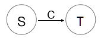

# AC 自动机

## 1. AC 自动机

> 是由 `贝尔实验室` 的两位研究人员 `Alfred V. Aho` 和 `Margaret J.Corasick` 于 `1975` 年发明的。

`AC 自动机`（Aho–Corasick Automation）是一种字符串匹配算法，可以同时将目标串与所有模式串进行匹配，算法均摊情况下具有近似于线性的时间复杂度。`AC 自动机` 的匹配原理有两个核心概念：`Trie` 字典树、`Fail 指针` 。

`AC 自动机` 是使用 `前缀树` 来存放所有 `模式串` 的 `前缀`，然后通过 `失配指针` 来处理失配的情况。它大概分为三个步骤：构建前缀树（将模式串集合逐一字符添加到 `Ac Trie` 中，生成 goto 表），生成失配指针（生成 fail 指针），模式匹配（构造 output 表）。

`AC 自动机` 包括 `goto 表`、`output 表` 和 `fail 表`。

## 2. goto 表

`goto表` 其实就是一棵 `前缀树`，用来将每个模式串索引到 `前缀树` 上。

我们假设，模式串 (`pattern`) 集合为 { `he`, `she`, `his`, `hers` } 。

把模式串集合往 `Ac Trie` 上填，得到下图：


`goto表` 与 `字典树` 的区别是，`goto表` 的根节点不光可以按 `h` 和 `s` 转移，还接受任意其他字符，转移目标都是根节点 (`root`) 自己。这样就形成了一个圈，使得一棵树变为一幅 `有向有环图` 。

> ### 有向有环图：“图论” 相关知识，有回路的有向图。

C++ 代码：

```cpp
#include <cstdint>
#include <cstddef>
#include <cstdbool>
#include <string>
#include <map>

class AcTrie {
    struct State {
        State *         fail;
        std::uint32_t   pattern_id : 31;
        std::uint32_t   is_final   : 1;
        std::map<std::uint32_t, State *>
                        children;
    };

private:
    State * root_;

public:
    AcTrie() : root_(nullptr) {
        root_ = new State;
        root_->fail = nullptr;
        root_->pattern_id = 0;
        root_->is_final = 0;
    }

    // 实际的代码中，还要考虑 pattern 重复插入的问题
    void insert(const char * pattern, std::size_t length, std::uint32_t id) {
        State * cur = this->root();
        for (std::size_t i = 0; i < length; i++) {
            // 当前的字符 label
            std::uint32_t label = (uint8_t)*pattern++;

            auto iter = cur->children.find(label);
            if (iter != cur->children.end()) {
                // 子节点已存在，转移到后续的状态
                cur = iter->second;
            } else {
                // 子节点不存在，则创建新节点
                State * child = new State;
                child->fail = nullptr;
                child->pattern_id = 0;
                child->is_final = 0;

                // 插入到 children 中
                cur->children.insert(std::make_pair(label, child));
                cur = child;
            }
        }

        // 设置叶子节点的 is_final 状态
        State * leaf = cur;
        leaf->pattern_id = id;
        leaf->is_final = 1;

        // 进阶思考：如果叶子节点的 is_final 已经为 1，则表示重复添加了
        // 重复添加虽然是无害的，但是为了程序的健壮性，可以判断一下。
    }
};

void append_all_patterns(AcTrie & trie, const std::vector<std::string> & patterns)
{
    trie.clear();
    std::uint32_t index = 0;
    for (auto iter = patterns.begin(); iter != patterns.end(); ++iter) {
        const std::string & pattern = *iter;
        trie.insert(pattern.c_str(), pattern.size(), index);
        index++;
    }
}
```

笔者注：

这里为了兼顾代码的可读性，`next_link` 和 `fail_link` 使用的是指针。实际实用中，在 64 位环境下，可以把所有 State 保存在一个数组里，`next_link` 和 `fail_link` 使用一个整型 uint32_t 作为索引指向这个数组，一方面可以节省内存，另一方面所有 State 节点在物理上连续的。

## 3. output 表

给定一个状态(节点)，我们需要知道该状态是否对应某个或某些模式串，以决定是否输出模式串(是否存在于词典中)以及对应的值，这时我们用到的关联结构就是 `output表` 。

在上面的案例中，`output表` 就是上图中的所有深蓝色的节点，对应的 `output表` 如下：

{ 2 → he，5 → he、she，7 → his，9 → hers }

如下图所示：


## 4. fail 表

`fail表` 保存的状态是转移失败后，应当回退到的最佳状态。最佳状态指的是已匹配过的字符串里，从最后匹配的位置开始算起，存在于 `goto表` 中的最长后缀的那个状态。

例如："`shi`" 匹配到 `状态 4`，发现 '`i`' 与 '`e`' 不匹配，此时，已经匹配成功的 "`sh`" 字符串里，从 '`h`' 往前推，能匹配的只有 '`h`' 字符，即 `fail` 指针指向 `状态 1`，转移到 `状态 1` 然后继续判断 '`i`' 是否能匹配。

加上完整的 `fail 表` 后，自动机 `Ac Trie` 如下图所示：


### 4.1 fail 表的构建流程

定义 `S` 为当前状态；`S.goto(C)` 为转移表，返回 `S` 按字符 `c` 转移的状态，`null` 表示转移失败；`S.fail` 为 `fail指针`，代表转移失败的时候从状态 `S` 回退的状态节点。

1. 初始状态的 `goto表` 是满的，永远不会失败，因此没有 `fail指针`。与初始状态直接相连的所有状态，其 `fail指针` 都指向初始状态 (`root`) 。

2. 从初始状态开始进行广度优先遍历 `(BFS)`，若当前状态 `S` 接受字符 `c` 直达的状态为 `T`（即状态 `S` 的 `children` 里有 `c`），则一直沿着 `S` 的 `fail指针` 回溯，直到找到某个状态 `F`，`F` 的 `children` 里也有 `c`，即 `F.goto(c) != null` 。将 `T` 的 `fail指针` 设为 `F.goto(c)` ，如果 `S.Fail` 的 `children` 里没有 `c`，则继续往后搜索 `S.Fail` 状态的 `Fail指针` ，以此类推，直到回溯搜索到根节点 `root` 为止。简单来说，就是寻找跟状态 `S` 一样 `children` 也包含 `c`，存在于 `goto表` 中的最长后缀的状态 `F`。

    

3. (更新 `output表`) 由于 `F` 路径是 `T` 路径的后缀，因而 `T` 的 `output` 也应包含 `F` 的 `output`，因此将 `F` 的 `output` 添加到 `T` 的 `output` 中。

C++ 代码：

```cpp
#include <vector>

void AcTrie::create_fail() {
    // 这里也可以使用数组，效率比队列更好，但是使用队列更省内存，两者代码稍有不同
    std::vector<State *> queue;

    State * root = this->root();
    queue.push_back(root);

    std::size_t head = 0;
    while (head < queue.size()) {
        // 广度优先遍历 (BFS)
        State * cur = queue[head++];
        assert(cur != nullptr);

        // 将其 children 逐个加入到列队 (数组) 中
        for (auto iter = cur->children.begin();
                 iter != cur->children.end(); ++iter) {
            std::uint32_t label = iter->first;
            State * child = iter->second;
            if (cur == root) {
                child->fail = root;         // 第 1 层的子节点的 fail 总是指向 root
            } else {
                State * node = cur->fail;   // 第 2 层之后的节点,
                                            // 其 fail 是通过回溯 cur.fail 来找到的
                while (node != nullptr) {
                    // 遍历它的 children，看有没与 cur 节点相同字符 label 的节点
                    auto node_iter = node->children.find(label);
                    if (node_iter != node->children.end()) {
                        child->fail = node_iter->second;
                        break;
                    }
                    // 如果没找到，继续回溯，直到回溯到 root 节点
                    node = node->fail;
                }
                // 没有任何匹配的后缀，则 fail 指针指向 root
                if (node == nullptr) {
                    child->fail = root;
                }
            }
            queue.push(child);
        }
    }
}
```


## 5. 模式匹配

我们从 `根节点` 开始查找，如果它的 `children` 能命中目标串的第 1 个字符，那么我们就从这个 `children` 的 `children` 中再尝试命中目标串的第 2 个字符，以此类推。否则，我们就顺着它的 `失配指针`，跳到已匹配部分的最长后缀，找其他可能匹配的节点。

如果都没有命中，就从 `根节点` 重头再来。

当我们已经命中的节点，或这些节点的 `fail 节点`，其中任意一个有叶子节点的标识时（如 is_final = 1 ），我们就可以确定当前匹配的字符串已经命中某一个模式串，并将它放到返回结果集中。如果这时搜索的字符串还没有结束，我们就继续搜索和匹配，直到结束。

C++ 代码：

```cpp
#include <vector>
#include <type_traits>  // For std::make_unsigned<T>

struct MatchInfo {
    std::uint32_t last_pos;
    std::uint32_t pattern_id;
};

template <typename T>
bool AcTrie::match(const T * first, const T * last, std::vector<MatchInfo> & matchInfos) {
    // 这里直接使用 C++11 的 std::make_unsigned<T>,
    // 当 T 不是 Integral 类型时，则会报编译错误。
    // 但所有已知的字符编码类型绝大部分都是 Integral 类型。
    // 如果有需要，也可以自己写一个 traits 从 T 类型获得无符号的 char_type。
    typedef typename std::make_unsigned<T>::type uchar_type;

    matchInfos.clear();

    uchar_type * text_first = (uchar_type *)first;
    uchar_type * text_last = (uchar_type *)last;
    uchar_type * text = text_first;

    bool matched = false;

    State * root = this->root();
    State * cur = root;

    while (text < text_last) {
        std::uint32_t lable = (uchar_type)*text;
        if (cur == root) {  // 第一层要特殊处理, 因为第一层匹配失败,
                            // 直接可以匹配下一个字符, 因为自己本身就是 root 节点
            auto iter = cur->children.find(label);
            if (iter != cur->children.end()) {
                // 匹配成功, 转移到下一个状态
                cur = iter->second;
            } else {
                // 匹配失败, 直接继续下一个字符
                text++;
                continue;
            }
        } else {            // 第二层之后, 如果匹配失败, 我们先回跳到 fail 指针,
                            // 再继续匹配, 失配指针发挥作用
            do {
                auto iter = cur->children.find(label);
                if (iter == cur->children.end()) {
                    // 匹配失败, 逐层回跳到 fail 指针
                    cur = cur->fail;
                    // 如果 fail 指针指向 root, 直接匹配下一个字符
                    if (cur == root) {
                        text++;
                        continue;
                    }
                } else {
                    // 匹配成功, 转移到下一个状态
                    cur = iter->second;
                    break;
                }
            } while (1);
        }

        // 判断已经匹配的前缀中, 是否有叶子节点(is_final = 1), 即 output
        State * node = cur;
        while (node != root) {
            if (node->is_final != 0) {
                // 如果有叶子节点, 则继续到 MatchInfo 数组中,
                // 如果只想匹配第一个结果, 则可以提前返回.
                MatchInfo matchInfo;
                matchInfo.last_pos   = (std::uint32_t)(text + 1 - text_first);
                matchInfo.pattern_id = node->pattern_id;
                matchInfos.push_back(matchInfo);

                matched = true;
            }
            node = node->fail;
        }

        // 继续匹配下一个字符
        text++;
    }

    return matched;
}
```

笔者注：

这里我们的 MatchInfo 中使用的是 last_pos（最后匹配的位置），这样的好处是不需要知道 pattern 的长度，只需要知道 pattern_id 即可，在 match() 函数返回后，我们根据 pattern_id 就能得到 pattern 的长度，再根据 last_pos - pattern.size()，就能知道匹配字符串的起始位置。这样可以在 State 结构体中不保存 pattern 的长度信息，减小内存占用。但是如果你的场景不需要用到 pattern_id ，也可以在 State 结构体中只保存 pattern 的长度而不是 pattern_id 。

## 6. 参考文章

* [ac自动机 匹配最长前缀_学习NLP的第5天——AC自动机](https://blog.csdn.net/weixin_29359001/article/details/112266386) from [blog.csdn.net]

* [AC自动机](https://zhuanlan.zhihu.com/p/80325757) by [`知乎`] 司徒正美
