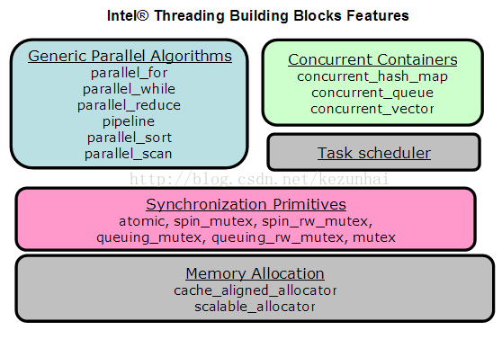

# Intel Thread Building Blocks (TBB) 的介绍

## 1. 什么是 TBB

`TBB` (`Thread Building Blocks`) 是英特尔发布的一个库，全称为 `Threading Building Blocks`。`TBB` 获得过 17 届 `Jolt Productivity Awards`，是一套 `C++` 模板库，和直接利用 `OS API` 写程序的 `raw thread` 比，在并行编程方面提供了适当的抽象，当然还包括更多其他内容，比如 `task` 概念，常用算法的成熟实现，自动负载均衡特性还有不绑定 `CPU` 数量的灵活的可扩展性等等。

STL 之父，`Alexander Stepanov` 对此评价不错，他说：

> Threading Building Blocks… could become a basis for the concurrency dimension of the C++ standard library。

其他 `TBB` 的早期用户，包括 Autodesk，Sun，Red Hat, Turbo Linux 等亦然。现在 `O’Reilly` 已经出版了一本 `Intel Threading Building Blocks: Outfitting C++ for Multi-core Processor Parallelism`。

## 2. 为什么要 TBB

在多核的平台上开发并行化的程序，必须合理地利用系统的资源 - 如与内核数目相匹配的线程，内存的合理访问次序，最大化重用缓存。有时候用户使用(系统)低级的应用接口创建、管理线程，很难保证是否程序处于最佳状态。

Intel Thread Building Blocks (TBB) 很好地解决了上述问题：

* TBB 提供 C++ 模版库，用户不必关注线程，而专注任务本身。
* 抽象层仅需很少的接口代码，性能上毫不逊色。
* 灵活地适合不同的多核平台。
* 线程库的接口适合于跨平台的移植(Linux, Windows, Mac)
* 支持的 C++ 编译器 – Microsoft, GNU and Intel

## 3. TBB 库包含的内容

`TBB` 包含了 `Algorithms`、`Containers`、`Memory Allocation`、`Synchronization`、`Timing`、`Task Scheduling` 这六个模块。

`TBB` 的结构：



1) 通用的并行算法

    * 循环的并行

        `parallel_for`, `parallel_reduce` – 相对独立的循环层

        `parallel_scan` – 依赖于上一层的结果

    * 流的并行算法

        `parallel_while` – 用于非结构化的流或堆

        `pipeline` - 对流水线的每一阶段并行，有效使用缓存

    * 并行排序

        `parallel_sort` – 并行快速排序，调用了 `parallel_for`

2) 任务调度者

    * 管理线程池，及隐藏本地线程复杂度
    * 并行算法的实现由任务调度者的接口完成
    * 任务调度者的设计考虑到本地线程的并行所引起的性能问题

3) 并行容器

    * `concurrent_hash_map`
    * `concurrent_vector`
    * `concurrent_queue`

4) 同步原语

    * `atomic`
    * `mutex`
    * `spin_mutex` – 适合于较小的敏感区域
    * `queuing_mutex` – 线程按次序等待(获得)一个锁
    * `spin_rw_mutex`
    * `queuing_rw_mutex`

    说明：使用 `read-writer mutex` 允许对多线程开放”读”操作

5) 高性能的内存申请

    * 使用 TBB 的 allocator 代替 C 语言的 malloc/realloc/free 调用
    * 使用 TBB 的 allocator 代替 C++ 语言的 new/delete 操作

## 4. 实例

### 4.1 例子 - parallel_for 模版

`parallel_for(range, body, partitioner)` 提供了并行迭代的泛型形式。

它表示在区域的每个值，并行执行 `body`。

* `range` 类型必须符合 `Range` 概念模型。
* `body` 必须符合下表的要求：

    |原型|语义|
    |:----|:----|
    |Body::Body(const Body & src)|拷贝构造|
    |~Body::Body()|析构|
    |void Body::operator(Range & range) const|对 range 对象应用 body 对象|

* `partitioner` 选项指定了分割策略。


`parallel_for` 模版用法的示例：

```cpp
#include <iostream>
#include <vector>
#include <tbb/tbb.h>
#include <tbb/task_scheduler_init.h>
#include <tbb/task.h>
#include <tbb/blocked_range.h>
#include <tbb/parallel_for.h>
 
typedef std::vector<int>::iterator IntVecIt;
 
struct body
{
    void operator () (const tbb::blocked_range<IntVecIt> & r) const
    {
        for(auto i = r.begin(); i != r.end(); i++)
            std::vcout << *i << ' ';
    }
};
 
int main()
{
    std::vector<int> vec;
    for (int i = 0; i < 10; i++) {
        vec.push_back(i);
    }
 
    tbb::parallel_for(tbb::blocked_range<IntVecIt>(vec.begin(), vec.end()), body());
    return 0;
}
```

### 4.2 例子 - task 用法

使用 `TBB::task` 的例子：

```cpp
#include <iostream>
#include <vector>
#include <tbb/tbb.h>
#include <tbb/task_scheduler_init.h>
#include <tbb/task.h>

class ThisIsATask : public tbb::task
{
public:
    tbb::task * execute()
    {
        WORK();
        return NULL;
    }
};

class MyRootTask : public tbb::task
{
public:
    tbb::task * execute()
    {
        for (int i = 0; i < N; i++) {
            task & my_task =
                * new (tbb::task::allocate_additional_child_of(*this)) ThisIsATask();
            spawn(my_task);
        }
        wait_for_all();
        return NULL;
    }
};

int main()
{
    tbb::task_scheduler_init my_tbb; // 创建线程池
    tbb::task & my_root = * new (tbb::task::allocate_root()) MyRootTask();
    my_root.set_ref_count(1);
    tbb::task::spawn_root_and_wait(my_root); // 开始 Root Task 任务
    return 0;
}
```

## 5. 参考文章

1. [Intel Thread Building Blocks (TBB) 入门篇](http://t.zoukankan.com/ybqjymy-p-13679446.html)

    [http://t.zoukankan.com/ybqjymy-p-13679446.html](http://t.zoukankan.com/ybqjymy-p-13679446.html)

2. [Intel Thread Building Blocks (TBB) 的介绍](https://bbs.csdn.net/topics/210061396)

    [https://bbs.csdn.net/topics/210061396](https://bbs.csdn.net/topics/210061396)
