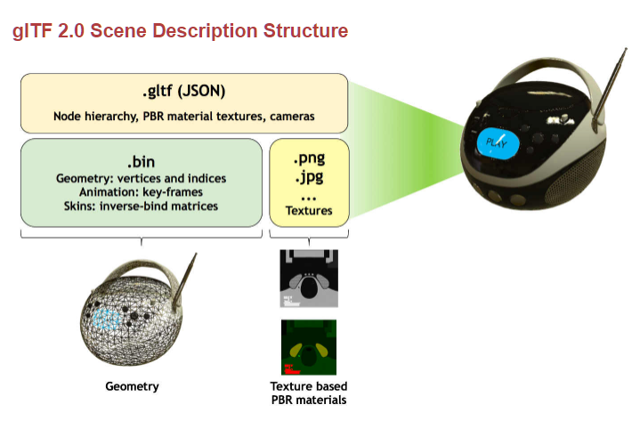

glTF 格式详解
=================

# 1. 简介 #

`glTF`（`GL传输格式`）是 `khronos组织`（即 `OpenGL` 的发起组织）定义的一个文件格式，用于通过应用有效传输和加载 `3D` 场景和模型。主要的应用场景是互联网或移动设备上，用于展现 `3D` 内容，充分支持 `OpenGL`，`WebGL`，`OpenGLES` 等图形加速标准。`glTF` 最大限度地减少了 `3D` 资源的大小以及解包和使用这些资源所需的运行时间。`glTF` 为 `3D` 编辑工具和服务定义了一种可扩展的通用发布格式，可简化创作的工作流程，并实现业界对 `3D` 资源文件使用的互操作性。

官网的地址：[https://www.khronos.org/gltf]() 。

目前 `glTF` 格式分为 `1.0` 和 `2.0` 两种版本。下面是 `2.0` 版本的场景描述结构图：



使用 `glTF` 格式的应用库或引擎包括：`A-FRAME`，`three.js`，`cesium`，`xeoEngine`，`babylin.js`，`Sketchfab` 等。

业界包括 `Adobe`，`Autodesk`，`Google`，`Microsoft`，`Blender`，`Unity`，`nVidia`，`oculus` 在内的大厂商均支持 `glTF` 格式。

# 2. 格式定义 #

`glTF` 格式目前分为 `1.0`，`2.0`，同时还可以在其基础上扩展。

`glTF` 规范和 `JSON` 模式：

1. [glTF 1.0](https://github.com/KhronosGroup/glTF/blob/master/specification/1.0)

2. [glTF 2.0](https://github.com/KhronosGroup/glTF/blob/master/specification/2.0)

3. [glTF Extension](https://github.com/KhronosGroup/glTF/blob/master/extensions) （包括 `1.0` 和 `2.0` 的扩展）

以上所有的内容可以在 [这里](https://github.com/KhronosGroup/glTF/blob/master/specification/README.md) 找到。

`glTF` 格式是由 `COLLADA` 格式（`.dae`）转换而来，支持两种方式，第一种是可以把所有资源打包在一个 “`.gltf`” 文件里；另外一种方式则可以把资源文件放在不同的文件里，把 `glTF` 场景描述文件放在 “`.json`” 文件里，把三维几何数据（顶点），动画，皮肤放在 “`.bin`” 文件里，把 `OpenGL` 的顶点着色语言 `glsl` 脚本放在 “`.glsl`” 文件里，而纹理或材质则可直接使用其原始的图像文件格式，比如 `png`、`jpg`、`tga`、`webp` 等格式，但一般这些文件都需要放置在同一个目录下面。

除了 “`.gltf`” 格式以外，还支持二进制的 `glTF` 文件 (`Binary glTF`)，文件格式为 “`.glb`” 。

以上内容可以在 [这里](https://github.com/KhronosGroup/glTF-Sample-Models) 找到。

# 3. glTF 工具 #

## 3.1 转换工具 ##

* `Assimp` → `glTF`

    * [Assimp](http://www.assimp.org/) - 具有 `glTF` 导入器/导出器管道的通用转换管道。请参阅 [支持的导入格式列表](https://github.com/assimp/assimp#supported-file-formats) 。

* `COLLADA` → `glTF`

    * [COLLADA2GLTF](https://github.com/KhronosGroup/COLLADA2GLTF/) - 从 `COLLADA` 转换成 `glTF` 格式的命令行工具
    * [Docker collada2gltf](https://hub.docker.com/r/winsent/collada2gltf/) - 在 `Docker` 容器中使用的能从 `COLLADA` 转换成 `glTF` 格式的 `Python` Web 服务
    * [collada2gltf-web-service](https://github.com/AnalyticalGraphicsInc/collada2gltf-web-service) - 基于命令行工具 `COLLADA2GLTF` 的简单 `Node.js` web 服务
    * [Node.js collada2gltf](https://www.npmjs.com/package/collada2gltf) - 使用 `Node.js` 包装的命令行工具 `COLLADA2GLTF`
    * [colladaToBglTFConverter](https://github.com/virtualcitySYSTEMS/colladaToBglTFConverter) - 从 `COLLADA` 格式转换到 `Binary glTF` (`0.8` / * `CESIUM_binary_glTF`) 格式的 `Groovy`/`JavaScript` 工具

* `FBX` → `glTF`

    * [FBX-glTF](https://github.com/cyrillef/FBX-glTF) - 从 `FBX` 到 `glTF` 格式的导入/导出插件和转换工具

* `OBJ` (`Wavefront`) → `glTF`

    * [obj2gltf](https://github.com/AnalyticalGraphicsInc/OBJ2GLTF) - 从 `OBJ` 转换成 `glTF` 格式的命令行工具
    * [jgltf-obj](https://github.com/javagl/JglTF/tree/master/jgltf-obj) - 从 `OBJ` 转换成 `glTF` 格式的 `Java` 库和应用程序

* `OSM` (`OpenStreetMap`) → `glTF`

    * [osm2cesium](https://github.com/stirringhalo/osm2cesium) - 在 `OpenStreetMap` 中提取建筑物并将其转换为 `glTF` 格式

* `Multiple formats`

    * [COLLADA | OBJ to glTF](http://cesiumjs.org/convertmodel.html) - 把 `COLLADA` 或 `OBJ` 格式转换成 `glTF` 格式的在线版（即拖即用）

## 3.2 其他 ##

### 导出器

    * [Blender glTF 2.0 Exporter](https://github.com/KhronosGroup/glTF-Blender-Exporter) - work in progress

### 优化器

    * [glTF Pipeline](https://github.com/AnalyticalGraphicsInc/gltf-pipeline) - Node.js command-line tool and module for optimizing glTF assets
    * [gltf2glb](https://github.com/Geopipe/gltf2glb) - Python tool to convert glTF to Binary glTF
    * [binary-gltf-utils](https://github.com/Qantas94Heavy/binary-gltf-utils) - Node.js tool to convert glTF to Binary glTF

### 验证器

    * [glTF Validator](https://github.com/KhronosGroup/glTF-Validator) - open-source command-line and drag-and-top tool to validate glTF assets against the spec

### 编辑器

    * [gltf-vscode](https://marketplace.visualstudio.com/items?itemName=cesium.gltf-vscode) extension for [VSCode](https://code.visualstudio.com/) - Open source, cross-platform JSON schema validation and previews for glTF 2.0 and 1.0

### 加载器和浏览工具

    #### WebGL 引擎

        * [glTF loader](https://github.com/mrdoob/three.js/blob/master/examples/js/loaders/GLTFLoader.js) in [Three.js](https://threejs.org/)
            * [Drag and drop glTF viewer](https://gltf-viewer.donmccurdy.com/)
            * [model-tag](https://github.com/mrdoob/model-tag) - custom HTML Elements for displaying 3D models
        * [glTF loader](https://github.com/BabylonJS/Babylon.js/tree/master/loaders/src/glTF) in [BabylonJS](http://babylonjs.com/)
            * [Sandbox](https://www.babylonjs.com/sandbox/) - drag and drop glTF assets
        * [glTF loader](https://github.com/AnalyticalGraphicsInc/cesium/blob/master/Source/Scene/Model.js) in [Cesium](http://cesiumjs.org/)
            * The [COLLADA to glTF](http://cesiumjs.org/convertmodel.html) converter also supports drag-and-drop viewing of glTF assets
            * [3D Models](https://cesiumjs.org/tutorials/3D-Models-Tutorial/) tutorial
            * [Drag and drop glTF Viewer](https://www.virtualgis.io/gltfviewer/) ([source](https://github.com/virtualgis/gltfviewer))
        * Initial [glTF loader](https://github.com/pex-gl/pex-gltf) in [PEX](http://vorg.github.io/pex/) (geometry and materials)
        * Initial [glTF loader](https://github.com/xeolabs/xeogl/tree/master/src/importing/gltf) in [xeogl](http://xeogl.org/) (geometry and materials)
            * [Importing glTF](https://github.com/xeolabs/xeogl/wiki/Importing-glTF) tutorial
        * [glTF loader](https://aframe.io/docs/0.5.0/components/gltf-model.html) in [A-Frame](https://aframe.io/)
        * [glTF loader](https://github.com/emadurandal/GLBoost/blob/master/src/js/middle_level/loader/GLTFLoader.js) in [GLBoost](https://github.com/emadurandal/GLBoost) ([examples](https://gitcdn.xyz/repo/emadurandal/GLBoost/master/examples/index.html))
        * [glTF plug-in](https://github.com/xml3d/xml3d-gltf-plugin) for [xml3d.js](http://xml3d.org)  (geometry and materials)
        * [glTF reader/writer](https://github.com/cedricpinson/osgjs/blob/master/sources/osgPlugins/ReaderWriterGLTF.js) in [OSG.JS](http://osgjs.org/)
        * [glTF loader](https://github.com/x3dom/x3dom/blob/master/src/util/glTF/glTFLoader.js) in [X3DOM](http://x3dom.org/)
        * [grimoirejs-gltf](https://github.com/GrimoireGL/grimoirejs-gltf) in [Grimoire.js](https://github.com/GrimoireGL/GrimoireJS)

    #### WebGL 引擎比较

        * [Compare WebGL-based glTF loaders](https://github.com/cx20/gltf-test) from various engines

    #### WebGL 例子

        * [WebGL-PBR](https://github.com/moneimne/WebGL-PBR) - barebones reference implementation for PBR in glTF 2.0 (in progress)

    #### WebGL 应用程序

        * [Sketchfab](https://blog.sketchfab.com/sketchfab-now-supports-gltf/)
        * [Archilogic](https://spaces.archilogic.com/blog/gltf-import-export)
        * [glTF plugin](https://wordpress.org/plugins/gltf-media-type/) for WordPress

    #### JavaScript / Node.js

        * [gltf-walker](https://github.com/ksons/gltf-walker) - convenience library for processing glTF
        * [gltf-viewer](https://github.com/avgp/gltf-viewer) - web component to display glTF models on a website
        * [rest3d](https://github.com/amd/rest3d) - serves glTF and other 3D assets via a REST API (glTF 0.8)
        * [gltf-viewer-element](https://www.npmjs.com/package/gltf-viewer-element) - Node.js package for loading and rendering glTF (0.8)
        * [Amobee 3D](http://amobee3d.s3.amazonaws.com/ads/Amobee3D_AdList.html) (0.8)
        * [RedCube.js](https://github.com/Reon90/redcube) - glTF viewer without dependencies

    #### C++

        * [nvpro-pipeline](https://github.com/nvpro-pipeline/pipeline) - research rendering pipeline by NVIDIA for minimizing CPU cost
        * [Tiny glTF loader](https://github.com/syoyo/tinygltfloader) - Header only C++ glTF parsing library
           * [alembic_to_gltf](https://github.com/syoyo/tinygltfloader/tree/master/examples/alembic_to_gltf) - Simple Alembic to glTF converter
           * [cyhair_to_gltf](https://github.com/syoyo/tinygltfloader/tree/master/examples/cyhair_to_gltf) - Simple CyHair (hair curves) to glTF converter
        * [Cinder](http://discourse.libcinder.org/t/gltf-initial-release-wip/212) - Work-in-progress glTF importer
        * [yocto-gltf](https://github.com/xelatihy/yocto-gl) - Single file, header only, C++ glTF loading/writing automatically generated from the spec.
        * [LibreOffice](http://zolnaitamas.blogspot.com/2014/08/3d-models-in-impress-libreoffice-43.html) (glTF 0.8)

    #### C++ and Vulkan

        * [Laugh Engine](https://github.com/jian-ru/laugh_engine#laugh-engine) - Vulkan PBR and IBL renderer
        * [VulKan ToolS](https://github.com/McNopper/Vulkan) - Vulkan helper library supporting glTF 2.0 assets with PBR materials

    #### C# #

        * [C# glTF loader](https://github.com/KhronosGroup/glTF-CSharp-Loader) - C# reference loader for glTF
        * [Aspose.3D for .NET](http://www.aspose.com/products/3d/net) - Import, export, and convert glTF

    #### Go

        * [gltf](https://github.com/sturfeeinc/glTF) - A go library for marshaling and unmarshaling glTF

    #### Rust

        * [gltf](https://github.com/Alteous/gltf) - Rust library for loading glTF

    #### Haxe

        * [haxe-gltf](https://github.com/FuzzyWuzzie/haxe-gltf) - A Haxe library for reading glTF

    #### Java

        * [JglTF](https://github.com/javagl/JglTF) - Java libraries for glTF
            * [jgltf-impl](https://github.com/javagl/JglTF/tree/master/jgltf-impl) - Classes representing a glTF model, auto-generated from the schema
            * [jgltf-model](https://github.com/javagl/JglTF/tree/master/jgltf-model) - Classes for reading, processing, converting and writing glTF
            * [jgltf-obj](https://github.com/javagl/JglTF/tree/master/jgltf-obj) - A library for converting OBJ to glTF
            * [jgltf-viewer](https://github.com/javagl/JglTF/tree/master/jgltf-viewer) - A viewer for glTF, with different implementations:
                * [jgltf-viewer-jogl](https://github.com/javagl/JglTF/tree/master/jgltf-viewer-jogl) - A glTF viewer based on [JOGL](http://jogamp.org/jogl/www/)
                * [jgltf-viewer-lwjgl](https://github.com/javagl/JglTF/tree/master/jgltf-viewer-lwjgl) - A glTF viewer based on [LWJGL version 2](http://legacy.lwjgl.org/)
            * [jgltf-browser](https://github.com/javagl/JglTF/tree/master/jgltf-browser) - An application combining the above libraries

    ### 工具集

        * [gltf-utilities](https://github.com/AnalyticalGraphicsInc/gltf-utilities) - JavaScript utility library to help load glTF

    ## Stack Overflow

        * [glTF tagged](http://stackoverflow.com/questions/tagged/gltf) questions

# 4. 范例 #

以下是一个 `glTF` 格式用于 `cesium` 的 `javascript` 例子：

```javascript
var ellipsoid = viewer.scene.globe.ellipsoid;
var cart3 = ellipsoid.cartographicToCartesian(Cesium.Cartographic.fromDegrees(lng, lat, height));
var modelMatrix = Cesium.Transforms.eastNorthUpToFixedFrame(cart3);
var quat = Cesium.Quaternion.fromAxisAngle(Cesium.Cartesian3.UNIT_Z, Cesium.Math.toRadians(rotate - 90));
var mat3 = Cesium.Matrix3.fromQuaternion(quat);
var mat4 = Cesium.Matrix4.fromRotationTranslation(mat3, Cesium.Cartesian3.ZERO);
var m = Cesium.Matrix4.multiplyTransformation(modelMatrix, mat4); // 获得最终变换矩阵，参考笔者前面写的《坐标变换》篇
var model = viewer.scene.primitives.add(Cesium.Model.fromGltf({
        url : 'http://localhost:8080/gltf/tower.json',  // 转换后 4 个文件中的 json 文件
        modelMatrix : m, // 添加模型的变换矩阵，才能显示在正确位置，否则打死也找不到，被放到地球的某个角落里
        scale:1.0 // 缩放倍数
}));

// 模型加载后，如果有动画就播放
model.readyToRender.addEventListener(function(model) {
    // Play and loop all animations at half-spead
    model.activeAnimations.addAll({
            speedup : 0.5,
            loop : Cesium.ModelAnimationLoop.REPEAT
    });

});
```

# 5. 参考 #

1. [glTF官网介绍（khronos.org）](https://www.khronos.org/gltf)

2. [cesiumjs 开发实践(七) 3D模型](https://my.oschina.net/u/1585572/blog/290604)

3. [glTF GitHub 首页](https://github.com/KhronosGroup/glTF)

4. [
glTF Extension for Visual Studio Code](https://marketplace.visualstudio.com/items?itemName=cesium.gltf-vscode)

<.End.>
