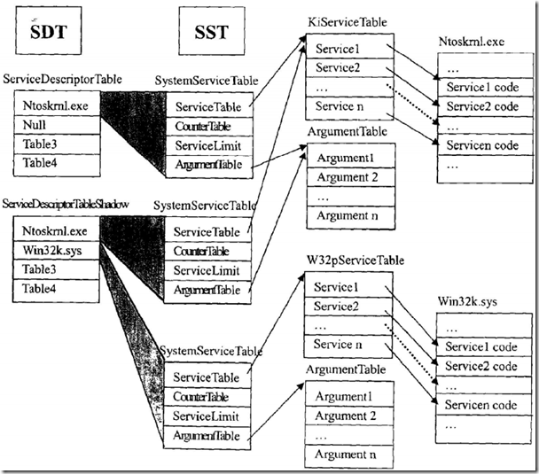
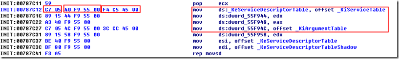
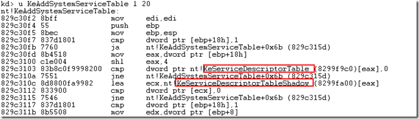

Shadow SSDT 详解
====================

## 1. SDT、SST、KiServiceTbale 的关系 ##

我们先来弄清系统服务描述表（SDT，Service Descriptor Table）、系统服务表（SST，System Service Table）、系统服务地址表（KiServiceTable）之间的关系。

在 WindowsNT 系列操作系统中，有两种类型的系统服务，一种实现在内核文件中，是常用的系统服务；另一种实现在 `win32k.sys` 中，是一些与图形显示及用户界面相关的系统服务。这些系统服务在系统执行期间常驻于系统内存区中，并且他们的入口地址保存在两个系统服务地址表 KiServiceTable 和 Win32pServiceTable 中。而每个系统服务的入口参数所用的总字节数则分别保存在另外两个系统服务参数表（ArgumentTable）中。

系统服务地址表和系统参数表是一一对应的，每个系统服务表（一下简称 SST ）都指向一个地址表和一个参数表。在 Windows 2000/XP/7 系统中，只有两个 SST 。一个 SST 指向了 KiServiceTable，而另一个 SST 则指向了 Win32pServiceTable 。

所有的 SST 都保存在系统服务描述表（SDT）中。系统中一共有两个 SDT，一个是 ServiceDescriptorTable，另一个是 ServiceDescriptorTableShadow 。ServiceDescriptor 中只有指向 KiServiceTable 的 SST，而 ServiceDescriptorTableShadow 则包含了所有的两个 SST 。SSDT 是可以访问的，而 SSDTShadow 是不公开的。

Windows 内核文件导出了一个公开的变量 KeServiceDecriptorTable，它指向了 SSDT 。在内核程序中可以直接使用这个变量，通过数据结构之间的关系，找到 KiServiceTable，然后从 KiServiceTable 中查找任何一个系统服务的入口地址。

下面是关于这些数据结构的示意图：

我想大家在看完上面这段解释之后，应该有了比较清晰的认识！！

## 2. 怎么获取 KiServerTable ##

我们虽然得到了 KeServiceDescriptorTable 的地址，但在文件中这个服务函数的入口地址是由 KiServiceTable 来保存的。

那么我们应该如何获取 KiServiceTable 的地址呢？

我们在 Windows 内核的源码中可以看到 KiInitSystem 这样的一个函数，这个函数初始化了一些比较重要也比较常见的内核数据结构，包括 SSDT 的初始化。所以我们可以从这里入手！！先来看看  KiInitSystem() 函数的源码：

    VOID KiInitSystem(VOID)
    {
      ULONG Index;

      // 初始化调度队列链表头，每一个优先级都有一个独立的进程链表
      for (Index = 0; Index < MAXIMUM_PRIORITY; Index += 1) {
        InitializeListHead(&KiDispatcherReadyListHead[Index]);
      }

      // 初始化 BugCheck 回调函数链表，及其旋转锁
      InitializeListHead(&KeBugCheckCallbackListHead);
      KeInitializeSpinLock(&KeBugCheckCallbackLock);

      // 初始化定时器过期的 DPC 对象
      KeInitializeDpc(&KiTimerExpireDpc,
        (PKDEFERRED_ROUTINE)KiTimerExpiration, NIL);

      // 初始化 profile 链表，及其旋转锁
      KeInitializeSpinLock(&KiProfileLock);
      InitializeListHead(&KiProfileListHead);

      // 初始化当前活动的 profile 链表
      InitializeListHead(&KiProfileSourceListHead);

      // 初始化定时器链表
      for (Index = 0; Index < TIMER_TABLE_SIZE; Index += 1) {
        InitializeListHead(&KiTimerTableListHead[Index]);
      }

      // 初始化 swap 通知事件
      KeInitializeEvent(&KiSwapEvent,SynchronizationEvent,FALSE);

      InitializeListHead(&KiProcessInSwapListHead);
      InitializeListHead(&KiProcessOutSwapListHead);
      InitializeListHead(&KiStackInSwapListHead);
      InitializeListHead(&KiWaitInListHead);
      InitializeListHead(&KiWaitOutListHead);

      // 初始化 SSDT
      KeServiceDescriptorTable[0].Base = &KiServiceTable[0];
      KeServiceDescriptorTable[0].Count = NULL;
      KeServiceDescriptorTable[0].Limit = KiServiceLimit;
    #if defined(_IA64_)
      KeServiceDescriptorTable[0].TableBaseGpOffset =
        (LONG)(*(KiServiceTable-1) - (ULONG_PTR)KiServiceTable);
    #endif
      KeServiceDescriptorTable[0].Number = &KiArgumentTable[0];
      for (Index = 1; Index < NUMBER_SERVICE_TABLES; Index += 1) {
        KeServiceDescriptorTable[Index].Limit = 0;
      }

      // 拷贝 SSDT 到 Shadow 服务表
      RtlCopyMemory(KeServiceDescriptorTableShadow,
        KeServiceDescriptorTable,
        sizeof(KeServiceDescriptorTable));

      // ……
      return;
    }

上面我们注意到

**KeServiceDescriptorTable[0].Base = &KiServiceTable[0];**

这句。因此，我们可以根据重定位信息和特征码来找到这句的地址，同时获取 KiServiceTable 的地址！！

    DWORD FindKiServiceTable(HMODULE hModule, DWORD dwKSDT)
    {
        PIMAGE_FILE_HEADER      pfh;
        PIMAGE_OPTIONAL_HEADER  poh;
        PIMAGE_SECTION_HEADER   psh;
        PIMAGE_BASE_RELOCATION  pbr;
        PIMAGE_FIXUP_ENTRY      pfe;

        DWORD dwFixups = 0, i, dwPointerRva, dwPointsToRva, dwKiServiceTable;
        BOOL  bFirstChunk;

        GetHeader((PCHAR)hModule, &pfh, &poh, &psh);
        TRACE("hModule: %X", hModule);
        // 存在重定位信息
        if ((poh->DataDirectory[IMAGE_DIRECTORY_ENTRY_BASERELOC].VirtualAddress) &&
            (!((pfh->Characteristics)&IMAGE_FILE_RELOCS_STRIPPED))) {

            pbr = (PIMAGE_BASE_RELOCATION)RVATOVA(
                    poh->DataDirectory[IMAGE_DIRECTORY_ENTRY_BASERELOC].VirtualAddress, hModule);

            bFirstChunk = TRUE;

            while (bFirstChunk || pbr->VirtualAddress) {
                bFirstChunk = FALSE;
                pfe = (PIMAGE_FIXUP_ENTRY)((DWORD)pbr + sizeof(IMAGE_BASE_RELOCATION));

                // 遍历重定位项
                for (i = 0; i < ((pbr->SizeOfBlock - sizeof(IMAGE_BASE_RELOCATION)) >> 1); i++, pfe++) {
                    // 重定位地址指向的双字的 32 位都需要被修正
                    if (pfe->type == IMAGE_REL_BASED_HIGHLOW) {
                        dwFixups++;
                        // 指向需要重定位地址的相对虚拟地址指针
                        dwPointerRva = pbr->VirtualAddress + pfe->offset;

                        // 需要修正的重定位项（RVA）
                        dwPointsToRva = *(PDWORD)((DWORD)hModule + dwPointerRva) - (DWORD)poh->ImageBase;

                        // KeServiceDescriptorTable 的重定位信息
                        if (dwPointsToRva == dwKSDT) {
                            if (*(PWORD)((DWORD)hModule + dwPointerRva - 2) == 0x05c7) {
                                dwKiServiceTable = *(PDWORD)((DWORD)hModule + dwPointerRva + 4)
                                                    - poh->ImageBase;
                                return dwKiServiceTable;
                            }
                        }
                    }
                }
                *(PDWORD)&pbr += pbr->SizeOfBlock;
            }
        }

        return 0;
    }

等一下。。。上面的特征码 `0x05c7` 是怎么来的？？？

我们可以使用 IDA 对内核文件 ntoskrnl.exe 进行反反汇编，看看 KiInitSystem 这个函数的反汇编代码。

首先我们找到这个函数所在的地方：

然后我们继续往下看。。。

nice，，，这里我们看到了对 SSDT 表进行初始化的反汇编代码，同时也看到了 `0x05c7`，KeServiceDescriptorTable 的地址和 KiServiceTable 的地址。

为了验证一下 KiServiceTable 里面是不是保存的服务函数的入口地址，我们跟进看一下。

果不其然，和我们预期的一样。。。

到这里，我相信大家对 SSDT 的认识又更加深刻了一些。

下面是在 Win7 32 位下面获取 SSDT 当前地址和原始地址的效果图：

## 3. 在 Ring3 中获取 SSDT 的原始地址 ##

在内核下 SSDT 地址，可能被 SSDT hook 或者是 inline hook，如果我们的 SSDT 被别人 hook 了，怎么改会原来的 SSDT 地址呢？我们知道在内核文件中是保留了一份原始的 SSDT 表的，所以我们只要通过解析内核文件获取到原始的 SSDT 地址即可。

首先我们得确认我们当前系统使用的内核文件是 ntoskrnl.exe、ntkrnlmp.exe 还是 ntkrnlpa.exe？这个问题好解决，调用 ZwQuerySystemInformation 传入 SystemModuleInformation（值为11）得到系统模块列表，第一个模块就是系统当前使用的内核模块了。

    NtQuerySystemInformation = (long(__stdcall *)(DWORD,PVOID,DWORD,DWORD))GetProcAddress(GetModuleHandle("ntdll.dll"), "NtQuerySystemInformation");

    // 通过 NtQuerySystemInformation 取得系统内核文件，判断是 ntoskrnl.exe, ntkrnlmp.exe or ntkrnlpa.exe ?
    Status = NtQuerySystemInformation(SystemModuleInformation, pModules, 4, (ULONG)&dwNeededSize);

    // 如果内存不够
    if (Status == STATUS_INFO_LENGTH_MISMATCH) {
        // 重新分配内存
        pModules = (PMODULES)GlobalAlloc(GPTR, dwNeededSize);
        // 系统内核文件是总是在第一个，枚举 1 次
        Status = NtQuerySystemInformation(SystemModuleInformation, pModules, dwNeededSize, NULL);
    }

    if (!NT_SUCCESS(Status)) {
        // NtQuerySystemInformation 执行失败，检查当前进程权限
        std::cout << "NtQuerySystemInformation() Failed !" << std::endl;
        return 0;
    }

    // Image base
    dwKernelBase = (DWORD)pModules->smi.Base;
    pKernelName = pModules->smi.ModuleNameOffset + pModules->smi.ImageName;

这样我们就获得了系统当前使用的内核文件的名字，然后我们手动加载这个内核文件，找到 KeServiceDescriptorTable 的地址，然后通过重定位信息找到 KiServiceTable 的地址，而 KiServiceTable 保存的就是我们所要找的 SSDT 数组。

    // 加载 NTOSKREL 的基址
    hKernel = LoadLibraryExA(pKernelName, 0, DONT_RESOLVE_DLL_REFERENCES);
    if (!hKernel)
        return;

    // 在内核文件中查找 KeServiceDescriptorTable 地址，这里得到的是相对虚拟地址
    if(!(dwKSDT = (DWORD)GetProcAddress(hKernel, "KeServiceDescriptorTable")))
        return;

    dwKSDT -= (DWORD)hKernel;

    // 获取 KiServiceTable 地址 RVA
    if (!(dwKiServiceTable = FindKiServiceTable(hKernel, dwKSDT)))
        return;

    GetHeader((PCHAR)hKernel, &pfh, &poh, &psh);
    dwServices = 0;

    for (pService = (PDWORD)((DWORD)hKernel + dwKiServiceTable);
         *pService - poh->ImageBase < poh->SizeOfImage;
         pService++, dwServices++) {
        ((pSSDTSaveTable)((ULONG)pSSDTST + dwServices * sizeof(SSDTSaveTable)))->ulOriginalFunctionAddress =
            *pService - poh->ImageBase + dwKernelBase;
    }

    FreeLibrary(hKernel);

## 4. 如何获取 Shadow SSDT ##

从前面几个小节，我们知道，所有的 SST 都保存在系统服务描述表（SDT）中。系统中一共有两个 SDT，一个是 ServiceDescriptorTable ，另一个是 ServiceDescriptorTableShadow 。ServiceDescriptor 中只有指向 KiServiceTable 的 SST ，而 ServiceDescriptorTableShadow 则包含了所有的两个 SST 。SSDT 是可以访问的，而 SSDTShadow 是不公开的。

所以结论是：ServiceDescriptorTable 是导出的，而 ServiceDescriptorTableShadow 是未导出的。那我们是不是就获取不了 ServiceDescriptorTableShadow 的地址呢？未导出未必就不能获取，其实在 KeAddSystemServiceTable 这个导出函数里面是有 ServiceDescriptorTableShadow 的地址的，我们来反汇编看一下。

我们看到在这个函数里面 ServiceDescriptorTable 的地址和 ServiceDescriptorTableShadow 都是可以得到的。

从前面数据结构的示意图我们知道，其实 KeServiceDescriptorTableShadow 包含 4 个子结构，其中第一个就是 ntoskrnl.exe ( native api )，与 KeServiceDescriptorTable 的指向一样，我们真正需要获得的是第二个 win32k.sys (gdi / user support)，第三个和第四个一般不使用。

关于如何使用 windbg 查看 KeServiceDescriptorTable 的内容，可以使用如下命令：

    kd> dd KeServiceDescriptorTable

    8055c6e0  80504940 00000000 0000011c 80504db4
    8055c6f0  00000000 00000000 00000000 00000000
    8055c700  00000000 00000000 00000000 00000000
    8055c710  00000000 00000000 00000000 00000000

那么，如何定位 ServiceDescriptorTableShadow 呢？

首先，我们需要定义一个全局变量：

    extern PSERVICE_Descriptor_TABLE    KeServiceDescriptorTable;

这样就能够引用 KeServiceDescriptorTable 了，也就能够访问 ntoskrnel.exe 下面所导出的所有函数。但是因为还有一些函数是通过 win32k.sys 表导出的，这些函数都是 win32k.sys 的服务函数，所以要访问类似这些函数就得从 KeServiceDescriptorTableShadow 结构中读取 win32k.sys 表的 EntryPoint 。

其中 KeServiceDescriptorTable 表的结构体定义如下：

    #include <ntddk.h>

    //
    // KeServiceDescriptorTable 表定义
    //

    typedef struct _SERVICE_Descriptor_TABLE
    {
      PVOID   ServiceTableBase;
      PULONG  ServiceCounterTableBase;
      ULONG   NumberOfService;
      ULONG   ParamTableBase;
    } SERVICE_Descriptor_TABLE, * PSERVICE_Descriptor_TABLE;

因为 KeServiceDescriptorTableShadow 并不公开，所以需要从其他途径获取该结构表。常用的方法有两种，第一种是硬编码（偏移）法，第二种是搜索比较法。下面分别介绍这两种方法。

### 4.1 硬编码（偏移） ###

直接根据 KeServiceDescriptorTable 的地址做偏移，具体的偏移值需要使用 windbg 调试后获得：

    // For WinXP
    if (gKernelVersion == WINXP)
        KeServiceDescriptorTableShadow = KeServiceDescriptorTable - 0×40;

    // For Win2K
    if (gKernelVersion == WIN2K)
        KeServiceDescriptorTableShadow = KeServiceDescriptorTable + 0xE0;

    // For Win7 (32bit)
    if (gKernelVersion == WIN7_X86)
        KeServiceDescriptorTableShadow = KeServiceDescriptorTable + 0×40;

### 4.2 搜索比较法 ###

从前面的图可以看到，在 KeAddSystemServiceTable() 函数内有 KeServiceDescriptorTable 和 KeServiceDescriptorTableShadow 的值（指针），KeAddSystemServiceTable 的函数声明如下：

    //
    // KeAddSystemService() 的函数声明
    //

    NTSYSAPI BOOLEAN NTAPI KeAddSystemServiceTable (
              PVOID * ServiceTable,
              ULONG Reserved,
              ULONG Limit,
              BYTE * Arguments,
              ULONG NumOfDesc);

我们通过获取 KeAddSystemServiceTable() 函数入口，从该函数的起始地址开始遍历（一个字节一个字节的尝试），检查指针指向的内存是否为有效内存地址（使用MmIsAddressValid()函数），如果是，则比较其内容是否跟 KeServiceDescriptorTable 表的前 16 个字节内容一样。因为 KeServiceDescriptorTableShadow 是涵盖了 KeServiceDescriptorTable 表结构的，在查找的过程中，就是采用与 KeServiceDescriptorTable 表内存中的数据（4个指针，共16字节）进行比较的方式，如果前 16 个字节完全一致，并且两个表的起始地址不相同（否则为同一张表），那么该指针所指向的地址就是我们要找的 KeServiceDescriptorTableShadow 表。

具体的实现代码如下：

    ULONG GetAddressOfShadowTable()
    {
        ULONG i;
        UCHAR * p;
        ULONG pShadowTable = NULL;
        UNICODE_STRING usKeAddSystemServiceTable;

        RtlInitUnicodeString(&usKeAddSystemServiceTable, L"KeAddSystemServiceTable");
        p = (UCHAR *)MmGetSystemRoutineAddress(&usKeAddSystemServiceTable);

        for (i = 0; i < 4096; i++, p++) {
            __try {
                pShadowTable = *(ULONG *)p;
            }
            __except(EXCEPTION_EXECUTE_HANDLER) {
                return NULL;
            }

            if (MmIsAddressValid((PVOID)pShadowTable)) {
                // 比较的是地址指向的内容 （前 16 个字节）
                if (memcmp((PVOID)pShadowTable, KeServiceDescriptorTable, 16) == 0) {
                    if ((PVOID)pShadowTable == KeServiceDescriptorTable) {
                        continue;
                    }
                    return pShadowTable;
                }
            }
        }
        return NULL;
    }

另一个版本：

    PULONG GetAddressOfShadowTable2()
    {
        PUCHAR pSSTable;
        PUCHAR p;
        UNICODE_STRING usKeAddSystemServiceTable;
        PULONG pShadowTable = NULL;

        RtlInitUnicodeString(&usKeAddSystemServiceTable, L"KeAddSystemServiceTable");
        pSSTable = (PUCHAR)MmGetSystemRoutineAddress(&usKeAddSystemServiceTable);
        for (p = pSSTable; p < pSSTable + PAGE_SIZE; p++)
        {
            if (MmIsAddressValid((PVOID)p))
            {
                if ((*(PUSHORT)p == 0x888D) && (*(p + 6) == 0x83))
                {
                    pShadowTable = (PULONG)(p + 2);
                    break;
                }
            }
        }
        return pShadowTable;
    }

**重要：此处省略了一部分内容，只写结论（这个结论还算比较重要的）**

最终结论：也就是说，除了 System 进程和 Smss 进程，在其它任何一个属于某个 Session 进程内都可以访问 win32k.sys，并非只有 GUI 进程才能访问，一般会使用 “csrss.exe” 进程 (Session Leader) 。

## 5. 如何 Hook Shadow SSDT 的函数 ？ ###

似乎这个问题并不大，ShadowSSDT 和 SSDT 本质上都是 1 个地址表，最为简单的方法是把你的函数替换地址表的对应项，具体 Hook 代码甚至可以完全照抄 SSDT 的，这里只说下几个遇到的小问题。

**5.1** Win32k.sys 不是常在内存的，如果不是 GUI 线程，Shadow SSDT 地址无效。

解决办法：

1) 在 DriverDispatch 中 hook DriverDispatch 是位于执行 DriverIoControl 的线程上下文的，我们使用 1 个 GUI 线程去 DriverIoControl；

2) AttachToProcess 这里我们使用 explorer.exe 进程。

    VOID KeAttachExporeer()
    {
        NTSTATUS status;
        PEPROCESS explorerEproc;
        PKAPC_STATE ApcState;
        ULONG i;

        DbgPrint("GetExplorerIdByEnumProcess ==> %d", GetExplorerIdByEnumProcess());

        DbgPrint("KeServiceDescriptorTableShadow = %x \r\n", KeServiceDescriptorTableShadow);
        DbgPrint("Count = x \r\n", KeServiceDescriptorTableShadow->win32k.NumberOfService);
        DbgPrint("ServiceTableBase = %x \r\n", KeServiceDescriptorTableShadow->win32k.ServiceTableBase);

        status = PsLookupProcessByProcessId((HANDLE)GetExplorerIdByEnumProcess(), &explorerEproc);

        if (!NT_SUCCESS(status))
        {
            DbgPrint("PsLookupProcessByProcessId() error\n");
            return;
        }

        ApcState = (PKAPC_STATE)ExAllocatePool(NonPagedPool, sizeof(KAPC_STATE));
        KeStackAttachProcess(explorerEproc, ApcState);

        for (i = 0; i < KeServiceDescriptorTableShadow->win32k.NumberOfService; i++)
        {
            DbgPrint("索引：%d, 地址：%x, 原始地址：%8x \r\n",
                     i, KeServiceDescriptorTableShadow->win32k.ServiceTableBase[i],
                     GetShadowSSDTFunctionOrigAddr(i));
        }

        KeUnstackDetachProcess(ApcState);
        ExFreePool(ApcState);
    }

其中 GetExplorerIdByEnumProcess() 这个方法的实现，只需要简单的遍历进程活动链表即可。

## 6. 引用  ##

1. [R3获取SSDT的原始地址及SDT、SST、KiServiceTbale的关系](http://www.blogfshare.com/get-original-ssdt.html)
2. [Shadow SSDT详解、WinDbg查看Shadow SSDT](http://www.blogfshare.com/shadowssdt-explain-in-detail.html)
3. [ KeServiceDescriptorTableShadow的获取](http://lwglucky.blog.51cto.com/1228348/342367/)

.