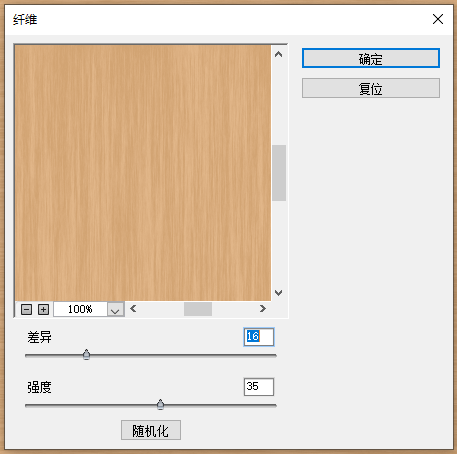
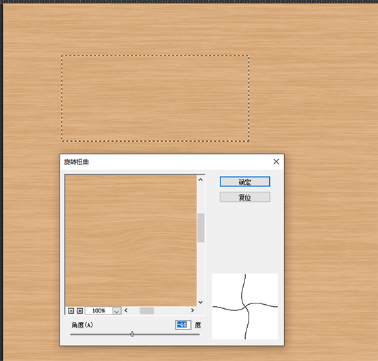
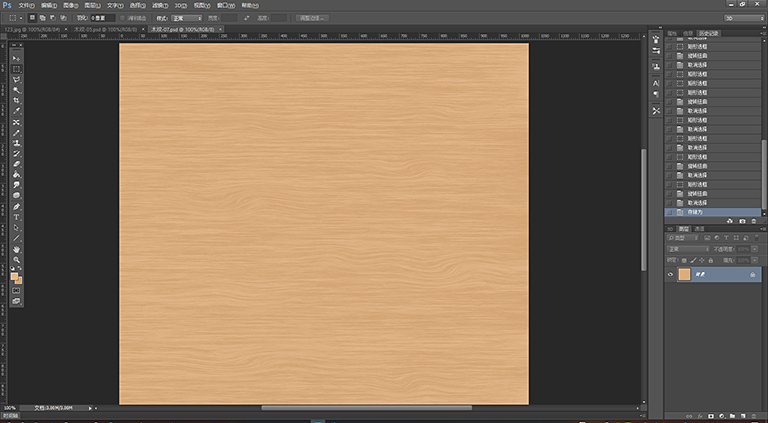
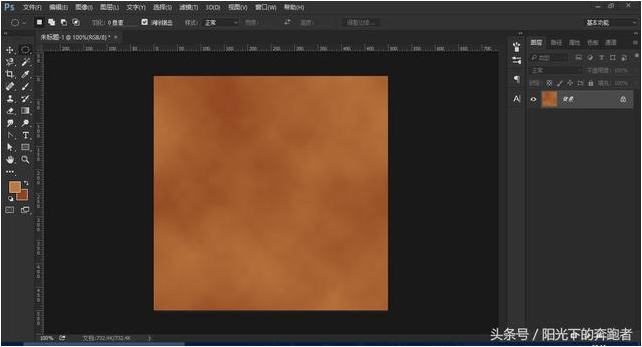
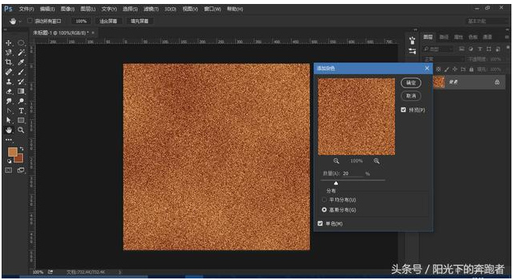
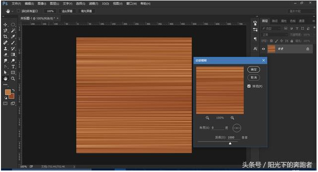
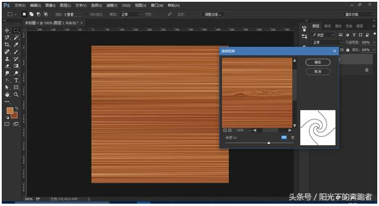
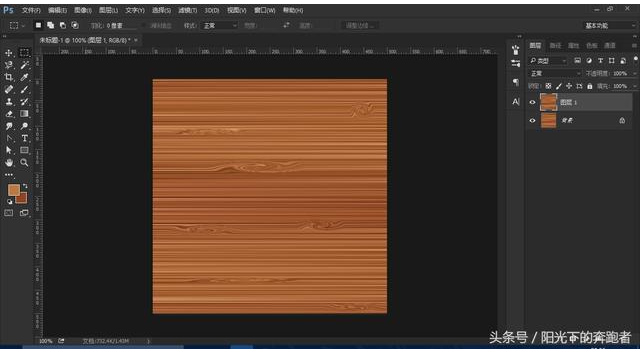
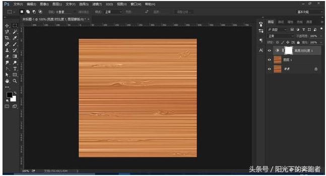

# 用 PS 制作木纹效果 -- 两例

## 1. 木纹效果一

特点：操作简单，效果逼真。

摘自：[【360doc】PS 制作木纹效果](http://www.360doc.com/content/17/1007/15/19615772_692853852.shtml)

[http://www.360doc.com/content/17/1007/15/19615772_692853852.shtml]()

### 1.1 步骤

1. 新建 `1024 x 1024` 大小的画布，设置前景色：`#e2b687`，背景色：`#d3a470` （或者前景色： `#ea9127`，背景色：`#a66327`），选择菜单：`滤镜 -> 渲染 -> 纤维...`，参数可以自己调：

2. 图像旋转 `90` 度，菜单：`图像 -> 图像旋转 -> 顺时针旋转 90 度`；

3. 这样的木纹太规律不逼真，用矩形旋转工具选择出一个长条的区域，执行菜单：`滤镜 -> 扭曲 -> 旋转扭曲`，做一点类似于节疤的效果，或者一些波动，设置不同的旋转角度，做成自己想要的效果：

4. 添加多处波动或扭曲之后，最终的效果如下：

## 2. 木纹效果二

特点：

摘自：[【360doc】简单几步，教你用 PS 制作逼真的木纹效果](http://www.360doc.com/content/17/0813/23/34110323_678995973.shtml)

[http://www.360doc.com/content/17/0813/23/34110323_678995973.shtml]()

### 2.1 步骤

1. 新建 `1024 x 1024` 大小的画布，设置前景色：`#bd9740`，背景色：`#8f4520` （或者前景色： `#e2b687`，背景色：`#d3a470`），选择菜单：`滤镜 -> 渲染 -> 云彩...`，如下：

2. 接下来，执行菜单：`滤镜-> 杂色 -> 添加杂色`，数量设置为 10 - 20 左右，选择“高斯分布”，并勾选“单色”，得到如下的效果：

3. 下面，执行菜单：`滤镜 -> 模糊 -> 动感模糊`，设置角度为 `0`，距离设置为：`1000-1500` 左右，调到效果看起来更逼真，效果如下图：

4. 这样的木纹太规律不逼真，用矩形旋转工具选择出一个长条的区域，执行菜单：`滤镜 -> 扭曲 -> 旋转扭曲`，做一点类似于节疤的效果，或者一些波动，设置不同的旋转角度，做成自己想要的效果：

5. 用矩形选择工具选出不同的部位，执行多次“旋转扭曲”，设置不同的旋转角度，这样就更逼真的，效果如下：

6. 最后，我们可以调节一下图片整体的亮度和对比度，色阶，这样，整个木纹效果就制作完成了。

