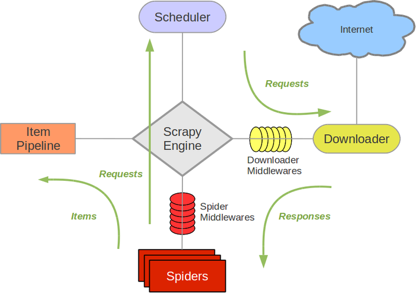

# Python 爬虫 Scrapy 的安装和使用手册

## 1. 简介

`Scrapy` 是一个为了爬取网站数据，提取结构性数据而编写的应用框架。可以应用在包括数据挖掘，信息处理或存储历史数据等一系列的程序中。`Scrapy` 最初是为了页面抓取（更确切来说, 网络抓取）所设计的，也可以应用在获取 `API` 所返回的数据（例如 `Amazon Associates Web Services` ）或者通用的网络爬虫。

在先后了解学习了 `urllib`、`urllib2`、`requests` 之后，而推荐学习最多就是 `Scrapy` 框架了，开始我们的 `Scrapy` 框架学习之路。

## 2. 安装

先更新你的 `pip` 版本：

```
python -m pip install --upgrade pip
```

然后，直接使用下面命令安装：

```
pip install scrapy
```

注：笔者是在 `Anaconda3` 环境下使用 `python 2.7.x` 版本，操作系统是 `Windows 10`，测试通过，安装过程很顺畅，没有出现问题。

查看一下 `scrapy` 的版本号，并且测试一下 `scrapy` 命令时候生效：

```
scrapy version
```

结果如下：

```
Scrapy 1.5.1
```

## 3. `Scrapy` 架构和组件介绍

使用 `Scrapy` 抓取一个网站，一共需要四个步骤：

1. 创建一个 `Scrapy` 项目；
2. 定义 `Item` 容器；
3. 编写爬虫；
4. 存储内容。

学习怎么使用 `Scrapy` 之前，我们需要先来了解一下 `Scrapy` 的架构以及组件之间的交互。

下图是 `Scrapy` 的架构示意图，包括组件及在系统中发生的数据流（图中绿色箭头）。



下面对每个组件都做下简单介绍：

* `Scrapy Engine`

    `Scrapy` 引擎是爬虫工作的核心，负责控制数据流在系统中所有组件中流动，并在相应动作发生时触发事件。

* 调度器（`Scheduler`）

    调度器从引擎接受 `request` 并将他们入队，以便之后引擎请求他们时提供给引擎。

* 下载器（`Downloader`）

    下载器负责获取页面数据并提供给引擎，而后提供给 `Spider`。

* `Spiders`

    `Spider` 是 `Scrapy` 用户编写用于分析由下载器返回的 `response`，并提取出 `item` 和额外跟进的 `URL` 的类。 `Item Pipeline Item Pipeline` 负责处理被 `Spider` 提取出来的 `item`。典型的处理有清理、验证及持久化（例如存储到数据库中）。

    接下来是两个中间件，它们用于提供一个简便的机制，通过插入自定义代码来扩展 `Scrapy` 的功能。

* 下载器中间件（`Downloader Middlewares`）

    下载器中间件是在引擎及下载器之间的特定钩子（`specific hook`），处理 `Downloader` 传递给引擎的 `response`。

* `Spider` 中间件（`Spider Middlewares`）

    `Spider` 中间件是在引擎及 `Spider` 之间的特定钩子（`specific hook`），处理 `Spider` 的输入（就是接收来自下载器的 `response`）和输出（就是发送 `items` 给 `item pipeline` 以及发送 `requests` 给调度器）。

## 4. `Scrapy` 爬虫框架入门实例

`Scrapy` 框架抓取网页的基本流程是这样的：


### 4.1 新建一个 `Scrapy` 项目

新建一个项目叫 `HuyaUDBLogin`：

```
scrapy startproject HuyaUDBLogin
```

### 4.2 创建一个 `Spider` 爬虫：

创建一个 `Spider`：

```
scrapy genspider UDBLogin www.huya.com
```
### 4.3 运行我们的爬虫：

运行爬虫：

```
scrapy crawl UDBLogin
```
