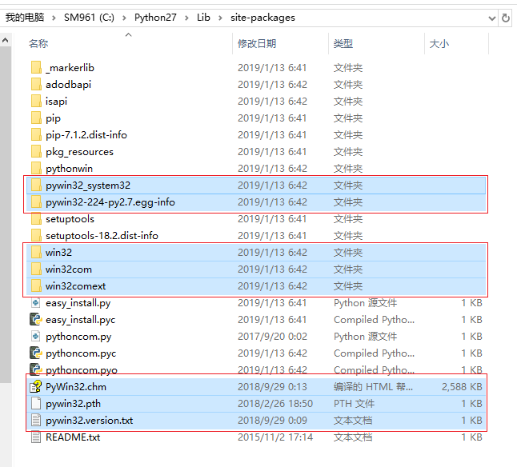
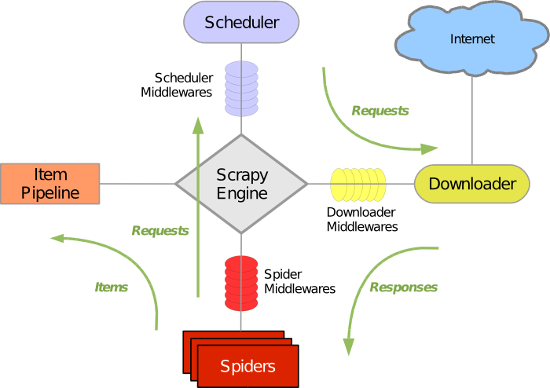

# Python 爬虫 Scrapy 的安装和使用手册

## 1. 简介

`Scrapy` 是一个为了爬取网站数据，提取结构性数据而编写的应用框架。可以应用在包括数据挖掘，信息处理或存储历史数据等一系列的程序中。`Scrapy` 最初是为了页面抓取（更确切来说, 网络抓取）所设计的，也可以应用在获取 `API` 所返回的数据（例如 `Amazon Associates Web Services` ）或者通用的网络爬虫。

在先后了解学习了 `urllib`、`urllib2`、`requests` 之后，而推荐学习最多就是 `Scrapy` 框架了，开始我们的 `Scrapy` 框架学习之路。

## 2. 安装

先更新你的 `pip` 版本，不然可能无法完成 `scrapy` 安装：

```
python -m pip install --upgrade pip
```

然后，直接使用下面命令安装：

```
pip install scrapy
```

注：笔者是在 `Anaconda3` 环境下使用 `python 2.7.x` 版本，操作系统是 `Windows 10`，测试通过，安装过程很顺畅，没有出现问题。

查看一下 `scrapy` 的版本号，并且测试一下 `scrapy` 命令时候生效：

```
scrapy version
```

结果如下：

```
Scrapy 1.5.1
```

### 2.1 遇到的问题

虽然在 `Anaconda` 里的 `python 2.x` 版本里安装 `scrapy` 的时候没有遇到问题，但是在使用的时候出现了问题。

（注：`Anaconda` 里的 `python 3.x` 版本下安装 `scrapy` 没有出现下列的问题，`pywin32` 能正常安装，可以正常使用）。

在执行 `scrapy crawl UDBLogin` 命令的时候，出现如下出错信息：

```
2019-01-13 23:09:14 [twisted] CRITICAL:

  ( 前面的报错信息省略 ...... )

    from twisted.internet.stdio import StandardIO, PipeAddress
  File "c:\anaconda3\envs\python27\lib\site-packages\twisted\internet\stdio.py", line 30, in <module>
    from twisted.internet import _win32stdio
  File "c:\anaconda3\envs\python27\lib\site-packages\twisted\internet\_win32stdio.py", line 9, in <module>
    import win32api
ImportError: No module named win32api
```

这是由于 `Anaconda` 的 `python27` 环境下面没有成功安装 `pywin32` 的原因，而单独下载的 `pywin32` 又不能直接安装在 `Anaconda` 里的 `python` 环境里。

解决的办法是，先下载安装一个独立的 `python 2.7.x` 环境（不使用 `Anaconda`），例如，安装在 `C:\Python27` 目录下。然后再去官网下载一个 `pywin32`，其官网的地址是：[https://sourceforge.net/projects/pywin32/](https://sourceforge.net/projects/pywin32/)，安装好 `pywin32` 以后，把 `C:\Python27\Lib\site-packages` 目录下面的 `pywin32` 相关的文件夹拷贝到 `Anaconda` 的 `python27` 环境下面。

需要拷贝的文件夹，如下图红框所示：



把以上文件夹复制到目标路径：`C:\Anaconda3\envs\python27\Lib\site-packages` 下面，即可。

## 3. `Scrapy` 架构和组件介绍

在学习怎么使用 `Scrapy` 之前，我们先来了解一下 `Scrapy` 的架构以及组件之间的交互。

`Scrapy` 使用了 `Twisted` 异步网络库来处理网络通讯。

下图是 `Scrapy` 的架构示意图，包括组件及在系统中发生的数据流（图中绿色箭头）。



每个组件的简单介绍：

* 爬虫引擎（`Scrapy Engine`）

    `Scrapy` 引擎是爬虫工作的核心，负责控制数据流在系统中所有组件中流动，并在相应动作发生时触发事件。

* 调度器（`Scheduler`）

    调度器从引擎接受 `request` 并将他们入队，以便之后引擎请求他们时提供给引擎。

* 下载器（`Downloader`）

    下载器负责获取页面数据并提供给引擎，而后提供给 `Spider`。

* 爬虫（`Spiders`）

    `Spider` 是 `Scrapy` 用户编写用于分析由下载器返回的 `response`，并提取出 `item` 和额外跟进的 `URL` 的类。 `Item Pipeline Item Pipeline` 负责处理被 `Spider` 提取出来的 `item`。典型的处理有清理、验证及持久化（例如存储到数据库中）。

    接下来是两个中间件，它们用于提供一个简便的机制，通过插入自定义代码来扩展 `Scrapy` 的功能。

* 项目管道（`Pipeline`）

    负责处理爬虫从网页中抽取的实体，主要的功能是持久化实体、验证实体的有效性、清除不需要的信息。当页面被爬虫解析后，将被发送到项目管道，并经过几个特定的次序处理数据。

* 下载器中间件（`Downloader Middlewares`）

    下载器中间件是在引擎及下载器之间的特定钩子（`specific hook`），处理 `Downloader` 传递给引擎的 `response`。

* 爬虫中间件（`Spider Middlewares`）

    `Spider` 中间件是在引擎及 `Spider` 之间的特定钩子（`specific hook`），处理 `Spider` 的输入（就是接收来自下载器的 `response`）和输出（就是发送 `items` 给 `item pipeline` 以及发送 `requests` 给调度器）。

* 调度中间件（`Scheduler Middewares`）
  
    介于 `Scrapy` 引擎和调度之间的中间件，从 `Scrapy` 引擎发送到调度的请求和响应。

## 4. `Scrapy` 爬虫框架入门实例

使用 `Scrapy` 抓取一个网站，一共需要四个步骤：

1. 创建一个 `Scrapy` 项目；
2. 定义 `Item` 容器；
3. 编写爬虫；
4. 存储内容。

`Scrapy` 框架抓取网页的基本流程是这样的：


### 4.1 新建一个 `Scrapy` 项目

新建一个项目叫 `HuyaUDBLogin`：

```
scrapy startproject HuyaUDBLogin
```

### 4.2 创建一个 `Spider` 爬虫：

创建一个 `Spider`：

```
scrapy genspider UDBLogin www.huya.com
```
### 4.3 运行我们的爬虫：

运行爬虫：

```
scrapy crawl UDBLogin
```

## X. 参考文章

1. [`python3 下使用 scrapy 实现模拟用户登录与 cookie 存储 -- 基础篇（马蜂窝）`](https://blog.csdn.net/zwq912318834/article/details/79614372)

    [https://blog.csdn.net/zwq912318834/article/details/79614372](https://blog.csdn.net/zwq912318834/article/details/79614372)

2. [`Python Scrapy 爬虫框架实例（一）`](https://www.cnblogs.com/BlueSkyyj/p/9951440.html)

    [https://www.cnblogs.com/BlueSkyyj/p/9951440.html](https://www.cnblogs.com/BlueSkyyj/p/9951440.html)

3. [`Scrapy 框架 -- 模拟登录之 JWT 验证及 post 特殊格式数据（json）`](https://www.jianshu.com/p/7f4dd5a9d8b7)

    [https://www.jianshu.com/p/7f4dd5a9d8b7](https://www.jianshu.com/p/7f4dd5a9d8b7)

4. [`Python爬虫(六) -- Scrapy 框架学习`](https://www.jianshu.com/p/078ad2067419)

    [https://www.jianshu.com/p/078ad2067419](https://www.jianshu.com/p/078ad2067419)

5. [`Python 爬虫(七) -- Scrapy 模拟登录`](https://www.jianshu.com/p/b7f41df6202d)

    [https://www.jianshu.com/p/b7f41df6202d](https://www.jianshu.com/p/b7f41df6202d)

    简介：关于 `知乎` 网站的模拟登陆。

    关于如何获取 `_xsrf` 提交字段的值：

    ```python
    # 下面这句话用于抓取请求网页后返回网页中的 _xsrf 字段的文字, 用于成功提交表单
    xsrf = Selector(response).xpath('//input[@name="_xsrf"]/@value').extract()[0]
    ```

    `Scrapy` 官方的文档中给出了如何使用 `CookiesMiddleware` 的代码范例：

    ```python
    for i, url in enumerate(urls):
        yield scrapy.Request("http://www.example.com", meta={'cookiejar': i},
            callback=self.parse_page)

    def parse_page(self, response):
        # do some processing
        return scrapy.Request("http://www.example.com/otherpage",
            meta={'cookiejar': response.meta['cookiejar']},
            callback=self.parse_other_page)
    ```

    关于如何获得 `items` 的值：

    ```python
    def parse_page(self, response):
        problem = Selector(response)
        item = ZhihuItem()
        item['url'] = response.url
        item['name'] = problem.xpath('//span[@class="name"]/text()').extract()
        print item['name']
        item['title'] = problem.xpath('//h2[@class="zm-item-title zm-editable-content"]/text()').extract()
        item['description'] = problem.xpath('//div[@class="zm-editable-content"]/text()').extract()
        item['answer']= problem.xpath('//div[@class=" zm-editable-content clearfix"]/text()').extract()
        return item
    

