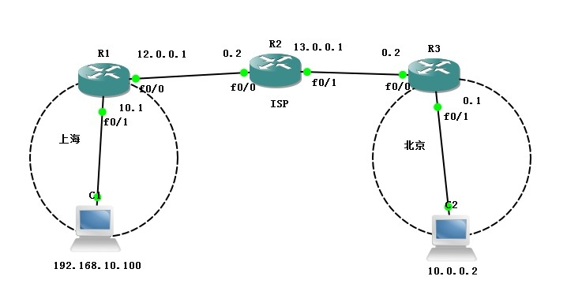

在路由器上做 IPsec VPN
========================

# 1. 拓扑图



# 2. 实验步骤

## 2.1 路由器基本设置

1. router1：

```
# int f0/1
# ip add 192.168.10.1 255.255.255.0
# no shut
# int f0/0
# ip add 12.0.0.1 255.255.255.252
# no shut
# exit
# ip route 0.0.0.0 0.0.0.0 12.0.0.2
```

2. router2：

```
# int f0/0
# ip add 12.0.0.2 255.255.255.252
# int f0/1
# ip add 13.0.0.1 255.255.255.252
# no shut
```

3. router3：

```
# int f0/0
# ip add 13.0.0.2 255.255.255.252
# no shut
# int f0/1
# ip add 10.0.0.1 255.255.255.0
# no shut
# exit
# ip route 0.0.0.0 0.0.0.0 13.0.0.1
```

## 2.2 路由器上配置IPSec

配置 IPSec VPN：

1. router1：

```
# crypto isakmp policy 1        // 配置安全策略级别
# encryption des                // 采用 DES 加密算法
# hash sha                      // 指定 SHA 验证功能
# authentication pre-share      // 设备方式的验证
# group 2                       // 指定 DH 密钥组
# lifetime 60                   // 配置为60秒没有流量将自动断开连接
# crypto isakmp key 6 abc123 address 13.0.0.2
                                // 设定共享密钥的内容和对端设备的IP地址
# exit
# access-list 101 permit ip host 192.168.10.100 host 10.0.0.2
                                // 配置 ACL 指定需要保护的流量
# crypto ipsec transform-set benet esp-sha-hmac esp-des
                                // 指定传输集名称和选项
# crypto map ipsecmap 1 ipsec-isakmp
                                // 构建 IPsecVPN 会话
# match address 101             // 调用 ACL
# set peer 13.0.0.2             // 指定对端 IP 地址
# set transform-set benet       // 调用传输集
# exit
# int f0/0
# crypto map ipsecmap           // 应用在接口
```

2. router3 与 router1 绝大部分配置相同，将对端地址互指即可。

```
# crypto isakmp policy 1
# encryption des
# hash sha
# authentication pre-share
# group 2
# lifetime 60
# crypto isakmp key 6 abc123 address 12.0.0.1
# exit
# access-list 101 permit ip host 10.0.0.2 host 192.168.10.100
# crypto ipsec transform-set benet esp-sha-hmac esp-des
# exit
# crypto map ipsecmap 1 ipsec-isakmp
# match address 101
# set peer 12.0.0.1
# set transform-set benet
# exit
# int f0/0
# crypto map ipsecmap
```

# 3. 参考文章

1. [路由器上做IPsecVPN](http://9067358.blog.51cto.com/9057358/1629247)

2. [TP路由器的L2tp与IPsec VPN的配置](http://blog.csdn.net/sxlwzl/article/details/41683897)

3. [企业路由器应用——IPSEC VPN配置实例](http://service.tp-link.com.cn/detail_article_166.html)

4. [Cisco路由器实现IPSEC VPN配置（站点到站点）](http://blog.163.com/hlz_2599/blog/static/1423784742013622104314138/)

.
