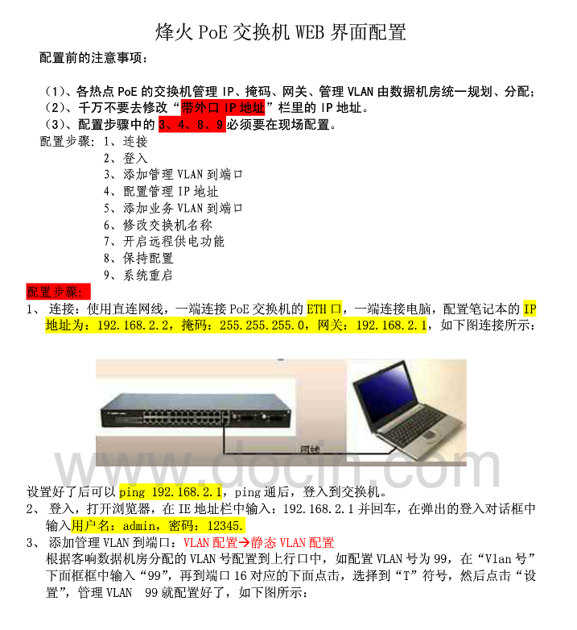

Fengine S5800-52T-S 交换机管理命令
======================================

# 1. 默认用户名和密码

`admin`，12345 或 `guest`，12345 。

串口模式和 `SSH` 方式登录的默认用户名和密码都是一样的。

# 2. 设置管理 IP

```
con                       # 进入 configure 视图
interface vlan 1          # 进入 vlan 1 视图
ip add 10.0.0.3/24        # 设置管理 ip
gateway 10.0.0.1          # 设置网关
```

或

```
management vlan 1
ip address 10.0.0.3/24
gateway 10.0.0.1
```

# 3. 保存设置

```
quit                      # 假设当前处于 configure/vlan-1 视图下,
quit                      # 两次 quit 命令退出所有视图, 回到最顶层
write file                # 保存当前的配置信息
```

# 4. 其他命令

## 4.1. 以太网接口基本属性配置

### 4.1.1. 进入以太网端口视图

```
con
interface [interface-type] [interface-number]
```

`[interface-type]`：包含两种端口类型 gigaethernet 和 xgigaethernet 。

`[interface-number]`：表示指定的以太网接口，取值范围是：<1-1>/<0-2>/<1-48>，例如：1/0/1，表示以太网 1 端口。

例如，进入 以太网 20 端口：

```
con
interface gigaethernet 1/0/20
```

注：以下命令除了特别注明的以外，均是在以太网端口视图下面执行的。

### 4.1.2. 设置以太网端口的最大传输单元

设置 MTU 值：

```
mtu 1492
```

恢复默认的 MTU 值：

```
mtu default
```

### 4.1.3. 描述以太网端口

设置以太网端口的别名：

```
alias [description]
```

取消以太网端口的别名：

```
no alias
```

### 4.1.4. 显示以太网的端口状态

显示以太网端口的状态：

```
# 先进入普通视图、特权用户视图、全局配置视图或者接口配置视图，例如：con 命令
show interface { gigaethernet | xgigaethernet } [interface-number] config
```

显示当前设备所有以太网接口及 `trunk` 接口（若已配置 `trunk`）的基本信息：

```
# 先进入普通视图、特权用户视图、全局配置视图或者接口配置视图，例如：con 命令
show interface verbose
```

注：如果需要清除以太网端口的统计信息，可以在以太网端口视图下，执行 `reset count` 命令。

### 4.1.5. 切换不同以太网接口配置视图

```
switch { gigaethernet | xgigaethernet } [interface-number]
```

## 4.2. VLAN设置

### 4.2.1. 创建/进入 VLANIF 接口视图

```
con
interface vlan [vlan-id]
```

### 4.2.2. 删除指定的 VLANIF 接口

```
con
no interface vlan [vlan-id]
```

### 4.2.3. 创建/进入 VLAN 视图

```
con
vlan [vlan-id]
```

### 4.2.4. 删除一个或多个 VLAN

```
con
no vlan [vlan-id1] [vlan-id2]
```

### 4.2.5. 切换 VLAN 配置视图

```
con
vlan [vlan-id1] [vlan-id2]
switch vlan [vlan-id]
```

注：`vlan-id` 的取值范围是 0 ~ 4094 。

## 4.3. 配置基于接口的 VLAN

进入相应的接口的命令：

```
con
interface { gigaethernet | xgigaethernet } [interface-number]
或
interface eth-trunk [trunk-number]
```

注：以下命令都是基于以上两台命令，先进入相应的接口。

### 4.3.1. 配置接口的链路类型

```
port link-type { access | trunk | hybrid | default }
```

### 4.3.2. 配置接口的默认 VLAN 并同时进入该 VLAN

```
port default vlan [vlan-id]
```

### 4.3.3. 配置 trunk 类型接口的默认 VLAN

```
port trunk pvid { vlan-id | default }
```

注：指定为 `default` 的时候，`VLAN` 默认值是 1 。

### 4.3.4. 配置 trunk 类型接口所属 VLAN

```
port trunk allow-pass vlan [vlanid-list]
```

注：`vlanid-list` 如果有多个 `vlanid`，`vlanid` 之间使用 “`,`“ 间隔，例如：`1,3,7,10` 。

### 4.3.5. 配置 hybrid 类型接口的默认 VLAN

```
port hybrid pvid { vlan-id | default }
```

注：指定为 `default` 的时候，`VLAN` 默认值是 1 。

### 4.3.6. 配置 hybrid 类型接口所属 VLAN

```
port hybrid vlan [vlanid-list] { tagged | untagged }
```

注：`vlanid-list` 如果有多个 `vlanid`，`vlanid` 之间使用 “`,`“ 间隔，例如：`1,3,7,10` 。

例如：

```
port hybrid vlan 1,2,3,4,5,100,101,102,200 tagged

port hybrid pvid 101
port hybrid vlan 101 tagged

port trunk allow-pass vlan 1,2,3,4,5,100,101,102,200
```

# 5. 一些常用命令

```shell
ls 显示文件系统

show running-config 显示当前系统配置

show startup-config 显示当前配置文件信息

show version 显示当前设备q 的版本信息

show system 显示系统配置

show interface [<1-64>] 显示端口信息

show vlan [<1-4094>] 显示vlan信息

show dynamic-mac AA:BB:CC:DD:EE:FF 已知某一mac地址，查找交换机连接端口号

show logging history 显示历史记录

show history 显示之前的输入命令

write file 保存配置文件，需退出到最顶层，无任何视图

show cpu statistic 显示CPU统计信息。

erase startup-config 清空交换机的启动配置文件
```

# 6. Web 管理配置方法

IP配置命令主要包括：

```shell
management vlan 配置管理vlan

gateway 配置王冠

ip address 配置ip地址

out-band ip change

out-band ip address 配置交换机带外网管接口的IP地址
```

例如：

```
management vlan 1

ip address 10.18.33.112/24

gateway 0.0.0.0

out-band ip address 192.168.2.1/24
```



# 7. 参考文章

1. [烽火 2008mfb 配置教程](https://wenku.baidu.com/view/f21903115f0e7cd18425360b.html)

2. [烽火PoE交换机WEB界面配置](http://www.docin.com/p-574222186.html)
